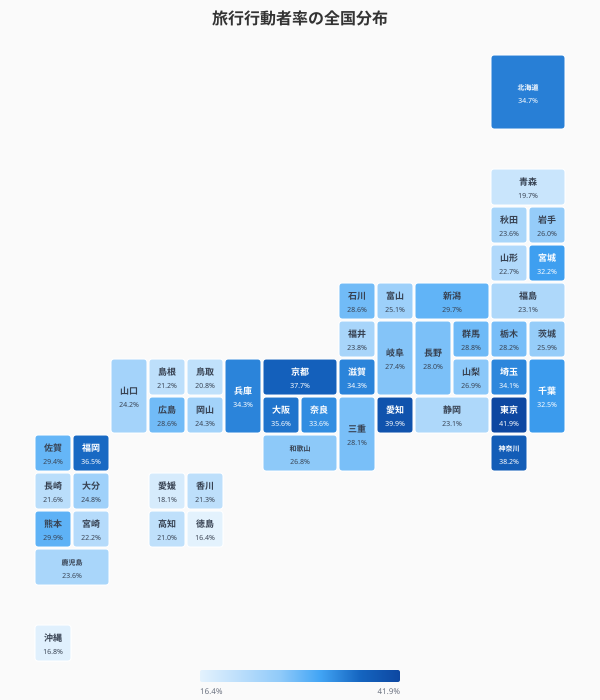
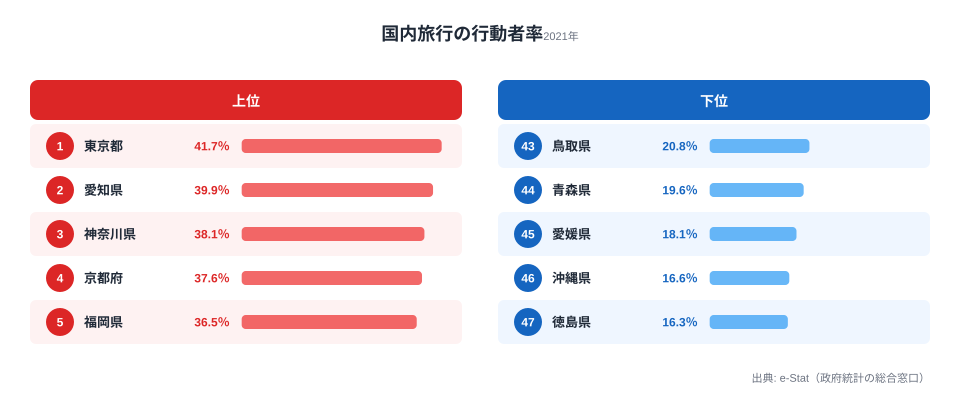
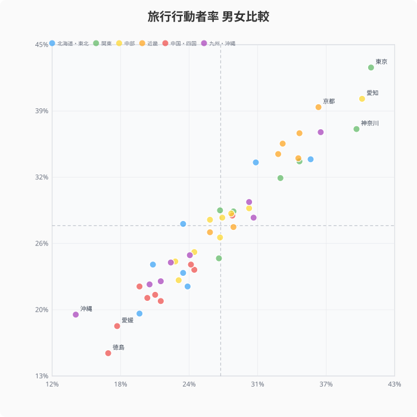
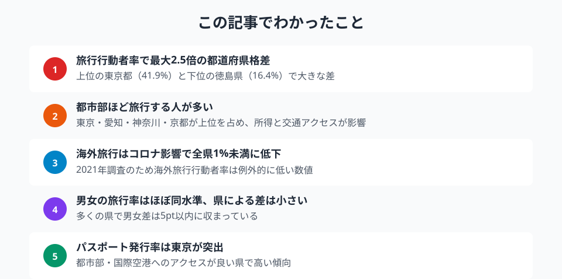

同じ日本に住んでいても、旅行する人の割合は県によって大きく異なる。東京都の旅行行動者率は41.9%、徳島県は16.4%。約2.5倍の差がある。社会生活基本調査の行動者率データで、都道府県別の「おでかけ格差」を明らかにする。

## 旅行行動者率ランキング -- 都市部が上位、旅行しない県はどこか

旅行行動者率（10歳以上）の上位は[東京都](/areas/13000)（41.9%）、愛知県（39.9%）、神奈川県（38.2%）、京都府（37.7%）、福岡県（36.5%）と都市部が占める。所得水準が高く、交通インフラが充実した地域で旅行する人の割合が高い。

下位は[徳島県](/areas/36000)（16.4%）、沖縄県（16.8%）、愛媛県（18.1%）、青森県（19.7%）、鳥取県（20.8%）。上位と下位で2.5倍の開きがある。

> [!NOTE]
> 2021年の社会生活基本調査はコロナ禍の影響を受けており、特に海外旅行の行動者率は例外的に低い数値となっている。国内旅行も通常年より抑制されている可能性がある。

<source-link href="/ranking/travel-activity-rate-10plus">47都道府県の旅行行動者率ランキングをもっと見る</source-link>

## 旅行行動者率の全国分布

タイルグリッドマップで全国を俯瞰すると、太平洋ベルト（東京〜大阪〜福岡）のラインに沿って旅行行動者率が高い傾向が見える。東北・四国は全般的に低い。

この分布パターンは所得水準や新幹線・空港へのアクセスと概ね一致する。旅行にはまとまった費用と移動手段が必要であり、経済力と交通インフラが行動者率を左右する構造的要因といえる。

<ad-slot></ad-slot>

## 国内旅行の順位 -- 海外旅行はコロナで全県1%未満に

国内旅行行動者率は旅行行動者率とほぼ同じ順位で、東京都（41.7%）、愛知県（39.9%）、神奈川県（38.1%）が上位。2021年調査ではほぼすべての旅行が国内旅行だったことを反映している。

海外旅行行動者率は京都府の0.7%が最高で、すべての県が1%未満。コロナによる渡航制限の影響が極めて大きい。通常年の海外旅行行動者率はこれとは大幅に異なる値になるため、この調査年のデータだけで「海外旅行に積極的な県」を判断することは難しい。

<source-link href="/ranking/domestic-travel-activity-rate-10plus">47都道府県の国内旅行行動者率ランキングをもっと見る</source-link>

## 男女の旅行パターン -- 意外と小さい男女差

旅行行動者率の男女比較を散布図で見ると、多くの県が対角線（男女同率）の近くに分布しており、男女差は比較的小さい。

注目すべきは、東京都（男40.7%・女43.0%）や京都府（男36.0%・女39.2%）で女性の旅行率が男性を上回る点だ。都市部では女性の方が旅行に積極的な傾向がある。一方、神奈川県（男39.4%・女37.1%）のように男性が上回る県もあり、地域によってパターンが異なる。

全体として男女差は5ポイント以内に収まる県がほとんどで、旅行行動における性別格差は他の活動（スポーツなど）と比べて小さいといえる。なぜ旅行では男女差が小さいのか。旅行は同行者（家族・友人グループ）と一緒に行動することが多く、性別単独の意思決定というよりも世帯・グループ単位の意思決定になりやすい点が影響していると考えられる。また、スポーツや趣味活動と異なり、旅行は「費用と時間さえあれば誰でも参加できる」普遍的な活動であるため、性別よりも所得・休暇取得のしやすさが主な規定要因になりやすい。

<ad-slot></ad-slot>

## パスポート発行率 -- 東京が突出、東北は低い

海外旅行への潜在的な関心を示す指標として、人口10万人あたりの一般旅券発行件数を見ると、東京都（5,090件）が突出している。2位の神奈川県（3,929件）、3位の大阪府（3,730件）と続く。

下位は秋田県（1,033件）、[青森県](/areas/02000)（1,061件）、岩手県（1,134件）と東北が並ぶ。上位と下位で約5倍の差がある。国際空港へのアクセスや海外出張の頻度が影響していると考えられるが、旅行行動者率の高低とも概ね連動している。

> [!NOTE]
> パスポート発行件数は2024年データ。旅行行動者率は2021年の社会生活基本調査データで年次が異なるため、直接の因果関係の解釈には注意が必要。

<source-link href="/ranking/passport-issuance-count">47都道府県の一般旅券発行件数ランキングをもっと見る</source-link>

## まとめ

旅行行動者率のデータから見えてくるポイントを整理する。

「旅行格差」の背景には所得・交通アクセス・年齢構成など複合的な要因がある。旅行しない層が多い県は、裏を返せば「観光の送客ポテンシャル」が眠っているともいえる。マイクロツーリズム（近場の旅行）の促進や、交通アクセスの改善が旅行行動者率の底上げにつながる可能性がある。コロナ後の最新データが公表されれば、行動変容の実態がより鮮明になるだろう。

**データ出典:**
- [社会生活基本調査・社会生活統計指標（e-Stat）](https://www.e-stat.go.jp/dbview?sid=0000010107)（旅行行動者率：2021年、パスポート発行件数：2024年）

## データ出典

本記事のデータはe-Stat（政府統計の総合窓口）を基に作成しています。

本記事の対象データ: [関連カテゴリ](/category/tourism)
