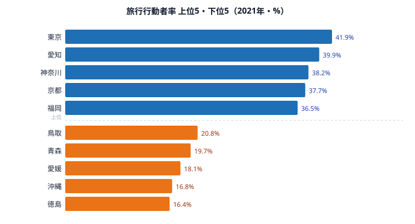
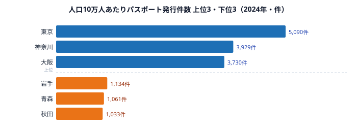

同じ日本に住んでいても、旅行する人の割合は県によって大きく異なります。東京都の旅行行動者率は41.9%、徳島県は16.4%で、約2.5倍の差があります。なぜ住む場所でこれほど「おでかけ」の頻度が変わるのでしょうか。社会生活基本調査の行動者率データから、都道府県別の「おでかけ格差」の構造を読み解きます。

旅行行動者率とは、過去1年間に旅行（宿泊を伴う観光・帰省など）をした10歳以上の人の割合を指します。レジャーの活発さだけでなく、所得・休暇の取りやすさ・移動手段の充実度といった生活基盤の差が、ひとつの数字に凝縮して現れます。

## 旅行する県・しない県──都市部が上位を占める理由

旅行行動者率（10歳以上）の上位は[東京都](/areas/13000)（41.9%）、愛知県（39.9%）、神奈川県（38.2%）、京都府（37.7%）、福岡県（36.5%）と、大都市圏が顔をそろえます。下位は徳島県（16.4%）、沖縄県（16.8%）、愛媛県（18.1%）、青森県（19.7%）、鳥取県（20.8%）で、上位と下位では2.5倍の開きがあります。

上位を都市部が占めるのには、はっきりした理由があります。旅行にはまとまった費用とまとまった時間、そして移動手段が必要です。所得水準が高く、新幹線・空港へのアクセスが良い大都市圏ほど、この三つの条件がそろいやすいのです。東京・名古屋・大阪・福岡といった結節点に住む人は、休暇のたびに「どこかへ行く」選択肢が現実的に手の届く範囲にあります。

逆に下位に並ぶのは、四国（徳島・愛媛）と東北（青森）、そして本土から離れた沖縄です。徳島や沖縄は移動コストが高く、まとまった旅行へのハードルが相対的に大きい地域だといえます。沖縄が観光地として有名であるにもかかわらず「県民の旅行行動者率」が低いのは、観光客として来る人と、そこに住んで旅行に出る人とは別の話だからです。住民にとっては本土への移動が空路中心となり、費用と時間の負担が大きくなります。

> [!NOTE]
> 旅行行動者率は「旅行に行った人の割合」であって「旅行の回数」ではありません。年に1回でも旅行すれば行動者にカウントされるため、頻度の差はこの指標には現れない点に注意が必要です。

<source-link href="/ranking/travel-activity-rate-10plus">47都道府県の旅行行動者率ランキングをもっと見る</source-link>

## 国内旅行と海外旅行──コロナ禍が刻んだ歪み

2021年調査では、旅行行動者率の中身はほぼすべてが国内旅行でした。国内旅行行動者率は旅行行動者率とほぼ同じ順位で、東京都（41.7%）、愛知県（39.9%）、神奈川県（38.1%）が上位を占めます。旅行行動者率と国内旅行行動者率がほぼ重なるという事実そのものが、この年の旅行が国内に閉じていたことを物語っています。

一方、海外旅行行動者率は京都府の0.7%が最高で、すべての県が1%未満にとどまりました。これはコロナによる渡航制限の影響が極めて大きかったためです。通常年の海外旅行行動者率はこれとは大きく異なる値になるので、この調査年のデータだけで「海外旅行に積極的な県」を判断するのは難しいといえます。順位を読むときは、まずこの年が「海外に出られなかった年」であることを前提に置く必要があります。

> [!WARNING]
> 2021年の社会生活基本調査はコロナ禍の影響を強く受けています。海外旅行の行動者率は例外的に低く、国内旅行も通常年より抑制されている可能性があります。この年の数値を平常時の旅行傾向として一般化しないよう注意してください。

<ad-slot></ad-slot>

## 旅行に男女差は小さい──意思決定がグループ単位だから

スポーツや趣味の活動では男女差がはっきり出ることが多いのですが、旅行は様子が異なります。旅行行動者率を男女で比べると、多くの県が男女同率の近くに分布しており、性別による差は比較的小さいのです。

注目したいのは、東京都（男40.7%・女43.0%）や京都府（男36.0%・女39.2%）で、女性の旅行率が男性を上回る点です。都市部では女性のほうが旅行に積極的な傾向がうかがえます。一方で神奈川県（男39.4%・女37.1%）のように男性が上回る県もあり、地域によってパターンは一様ではありません。それでも全体としては、男女差が5ポイント以内に収まる県がほとんどです。

なぜ旅行では男女差が小さいのでしょうか。旅行は同行者（家族や友人グループ）と一緒に行動することが多く、性別単独の意思決定というより、世帯やグループ単位の意思決定になりやすいからだと考えられます。スポーツや趣味活動と違って、旅行は「費用と時間さえあれば誰でも参加できる」普遍的な活動です。そのため性別よりも、所得や休暇の取りやすさのほうが主な規定要因になりやすいのです。「おでかけ格差」の正体が地域差であって性差ではない、という点は、この指標の重要な読みどころです。

<ad-slot></ad-slot>

## パスポート発行率──東京が突出し、東北が低い

海外旅行への潜在的な関心を示す指標として、人口10万人あたりの一般旅券（パスポート）発行件数を見てみます。東京都（5,090件）が突出しており、神奈川県（3,929件）、大阪府（3,730件）と続きます。下位は秋田県（1,033件）、[青森県](/areas/02000)（1,061件）、岩手県（1,134件）と東北が並び、上位と下位で約5倍の差があります。

東京が突出するのは、国際空港へのアクセスの良さに加え、海外出張や国際的な仕事に就く人が多いことが影響していると考えられます。パスポートは観光だけでなく、ビジネス渡航のためにも取得されるからです。下位に東北3県が並ぶのは、海外への玄関口（国際空港）が遠く、海外渡航の機会そのものが相対的に少ないことの反映だといえます。

興味深いのは、このパスポート発行率の高低が、旅行行動者率の高低とおおむね連動している点です。東京が両方で上位、東北・地方が両方で下位という構図は、「おでかけ格差」が国内・海外を問わず、移動インフラと所得という同じ土台の上に成り立っていることを示しています。

> [!TIP]
> パスポート発行件数は2024年、旅行行動者率は2021年とデータの年次が異なります。両者の順位が似ていることは構造的な相関を示唆しますが、年次が違うため直接の因果関係として読むのは避け、「同じ土台（移動インフラ・所得）の表れ」として捉えるのが安全です。

<source-link href="/ranking/passport-issuance-count">47都道府県の一般旅券発行件数ランキングをもっと見る</source-link>

## まとめ──「おでかけ格差」は移動インフラと所得の格差

旅行行動者率のデータから見えてきたポイントを整理します。

- 旅行行動者率は東京都41.9%が最も高く、徳島県16.4%が最も低く、約2.5倍の開きがあります。
- 上位は東京・愛知・神奈川・京都・福岡と大都市圏が占め、下位は徳島・沖縄・愛媛・青森・鳥取と四国・東北・離島が並びます。
- 2021年調査は海外旅行が全県1%未満で、コロナ禍の影響で旅行のほぼすべてが国内旅行でした。
- 旅行の男女差は5ポイント以内の県がほとんどで、性差より地域差のほうがはるかに大きいです。
- 人口10万人あたりのパスポート発行件数は東京都5,090件が突出し、東北が下位で、旅行行動者率と連動しています。

「旅行格差」の背景には、所得・交通アクセス・年齢構成などの複合的な要因があります。裏を返せば、旅行しない層が多い県には「観光の送客ポテンシャル」が眠っているとも読めます。マイクロツーリズム（近場の旅行）の促進や交通アクセスの改善が、旅行行動者率の底上げにつながる可能性があります。コロナ後の最新データが公表されれば、行動変容の実態がより鮮明になるでしょう。旅行に関連する地域の特徴は[観光カテゴリのランキング](/category/tourism)からも掘り下げられます。

## データ出典

本記事のデータはe-Stat（政府統計の総合窓口）を基に作成しています。

- 社会生活基本調査・社会生活統計指標（e-Stat、旅行行動者率：2021年）
- 一般旅券発行件数（パスポート発行件数：2024年）
