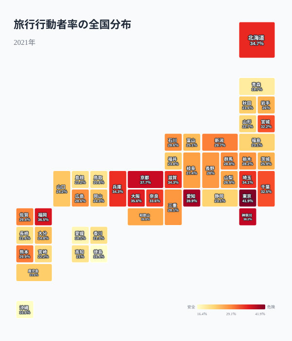
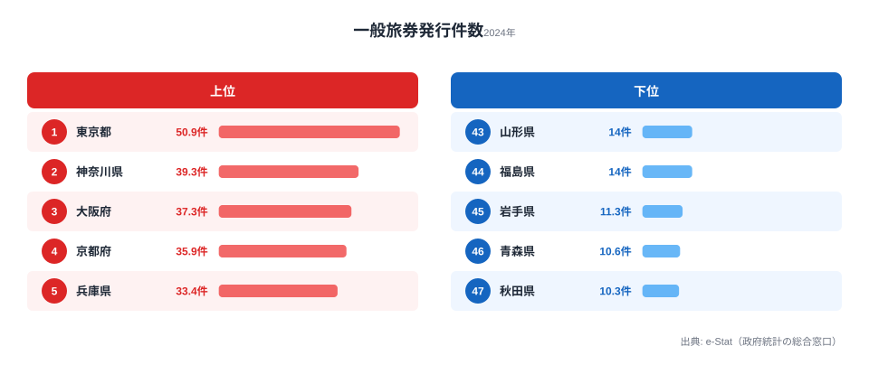

同じ日本に住んでいても、旅行する人の割合は県によって大きく異なります。1泊2日以上の旅行をした人の割合（旅行行動者率）は、東京都で41.9%、徳島県で16.4%。約2.5倍もの差があります。なぜ住む県でこれだけ「おでかけ」の頻度が変わるのでしょうか。社会生活基本調査（2021年）の行動者率データで、都道府県別の「おでかけ格差」とその構造的な要因を読み解いていきます。

## 旅行行動者率ランキング -- 都市部が上位、旅行しない県はどこか

旅行行動者率（10歳以上）の上位は[東京都](/areas/13000)（41.9%）、愛知県（39.9%）、神奈川県（38.2%）、京都府（37.7%）、福岡県（36.5%）と、三大都市圏と地方中枢都市が占めます。下位は[徳島県](/areas/36000)（16.4%）、沖縄県（16.8%）、愛媛県（18.1%）、青森県（19.7%）、鳥取県（20.8%）で、上位と下位で約2.5倍の開きがあります。

上位を占める県には共通点があります。所得水準が高く、新幹線や空港といった広域交通インフラが充実している点です。旅行にはまとまった費用と移動時間が必要なため、可処分所得が大きく、出発地としての交通結節点を抱える地域ほど行動者率が押し上げられます。とりわけ東京・愛知・神奈川は通勤圏に大規模な交通網が張り巡らされており、週末に近隣県へ足を延ばすハードルが低いことが効いていると考えられます。一方で下位の徳島・愛媛・沖縄・青森・鳥取は、いずれも本州主要部から見て移動コスト（時間・運賃）が高い半島・島嶼・遠隔地に位置します。「行こうと思えば行ける距離か」という地理的制約が、行動者率の底を規定しているのです。沖縄は観光地として有名ですが、それは「来てもらう」側であり、県民が県外へ出かける際は航空機がほぼ唯一の手段になるため、行動者率としては下位にとどまります。

> [!NOTE]
> 旅行行動者率は「過去1年間に1泊2日以上の旅行をした人の割合」を指します。日帰りの行楽や帰省は含みません。観光客の受け入れ数（観光入込客数）とは別物で、あくまで「その県に住む人がどれだけ出かけたか」を表す指標です。

<source-link href="/ranking/travel-participation-rate-overnight">47都道府県の旅行行動者率ランキングをもっと見る</source-link>

## 旅行行動者率の全国分布

タイルグリッドマップで全国を俯瞰すると、太平洋ベルト（東京〜名古屋〜大阪〜福岡）のラインに沿って旅行行動者率が高い帯が浮かび上がります。逆に、東北（青森19.7%・山形22.7%・福島23.1%）と四国（徳島16.4%・愛媛18.1%・香川21.3%・高知21.0%）は全般的に低くまとまっています。

この分布が示すのは、旅行行動が「所得 × 交通アクセス」の合成関数だということです。高行動者率の県は例外なく新幹線駅や主要空港を擁し、近畿・中部・関東の都市圏に短時間で接続できます。逆に低行動者率の四国・東北は、新幹線網の整備が相対的に遅れ、隣県への移動にも時間がかかる地域です。注目すべきは、同じ地方でも結節点の有無で差が出る点です。東北でも宮城（32.2%）だけは突出して高く、これは仙台が東北新幹線の拠点であり、東京へも仙台空港経由で各地へも出やすいことを反映していると読めます。つまり「地方だから低い」のではなく、「広域交通の結節点から遠いほど低い」という構造が見て取れます。北海道（34.7%）が地方ながら中位に踏みとどまっているのも、新千歳空港という強力な結節点を持つためと考えられます。

> [!TIP]
> 同じ「行きにくさ」でも、東北は陸路の遠さ、四国・沖縄は海を越える必要が要因と分かれます。地図を地域ごとに分けて眺めると、行動者率の低さが「距離」由来か「海」由来かを区別して読めます。

<ad-slot></ad-slot>

## 国内旅行の順位 -- 海外旅行はコロナで全県1%未満に

国内旅行行動者率は、先ほどの旅行行動者率とほぼ同じ順位で並びます。上位は東京都（41.7%）、愛知県（39.9%）、神奈川県（38.1%）です。総合の旅行行動者率（東京41.9%）とほとんど差がないのは、2021年調査ではほぼすべての旅行が国内旅行だったことを反映しています。

2つのランキングがほぼ重なるという事実そのものに意味があります。通常年であれば、上位県には「海外旅行に出る層」が一定数いるため、国内に限定すると順位が入れ替わる可能性があります。しかし2021年は海外渡航が事実上封じられていたため、旅行需要のすべてが国内に向かい、国内旅行ランキングが総合ランキングをそのままなぞる形になりました。海外旅行行動者率は京都府の0.7%が最高で、すべての県が1%未満にとどまります。コロナによる渡航制限の影響が極めて大きく、この調査年のデータだけで「海外旅行に積極的な県」を判断することはできません。海外旅行への潜在的な関心を測るには、次に見るパスポート発行率のような別指標を併用する必要があります。

> [!WARNING]
> 2021年の海外旅行行動者率は渡航制限による異常値で、平時の傾向を表していません。「全県1%未満」は県ごとの海外志向の弱さではなく、その年に渡航できなかったという制度的要因の結果である点に注意してください。

<source-link href="/ranking/travel-participation-rate-domestic">47都道府県の国内旅行行動者率ランキングをもっと見る</source-link>

## 男女の旅行パターン -- 意外と小さい男女差

旅行行動者率の男女比較を散布図で見ると、多くの県が対角線（男女同率）の近くに分布しており、男女差は比較的小さいことが分かります。スポーツや一部の趣味活動が大きな男女差を見せるのとは対照的です。

注目したいのは、東京都（男性41%・女性43%）や京都府（男性36%・女性39%）で女性の旅行率が男性を上回る点です。都市部では女性のほうが旅行に積極的な傾向がうかがえます。一方、神奈川県（男性39%・女性37%）のように男性が上回る県もあり、地域によってパターンが入れ替わります。全体として男女差が5ポイント以内に収まる県がほとんどで、旅行行動における性別格差は他の活動と比べて小さいといえます。

ではなぜ旅行では男女差が小さいのでしょうか。**[仮説]** 旅行は同行者（家族・友人グループ）と一緒に行動することが多く、性別単独の意思決定というより世帯・グループ単位の意思決定になりやすいことが影響している可能性があります。スポーツや趣味活動が個人の嗜好を直接反映しやすいのに対し、旅行は「誰かと一緒に行く」前提が強く、世帯内で男女がそろって行動するため差が縮まると解釈できます。検証するには、社会生活基本調査の「同行者」区分や世帯類型別の行動者率を突き合わせる必要があります。加えて、旅行は「費用と時間さえあれば誰でも参加できる」普遍的な活動であるため、性別よりも所得・休暇の取りやすさが主な規定要因になりやすい、という構造も男女差を小さくする方向に働いていると読めます。

<ad-slot></ad-slot>

## パスポート発行率 -- 東京が突出、東北は低い

海外旅行への潜在的な関心を測る指標として、人口1,000人あたりの一般旅券発行件数（2024年）を見ると、東京都（50.9件）が突出しています。2位の神奈川県（39.3件）、3位の大阪府（37.3件）、4位の京都府（35.9件）、5位の兵庫県（33.4件）と続きます。

下位は秋田県（10.3件）、[青森県](/areas/02000)（10.6件）、岩手県（11.3件）と東北が並びます。上位と下位で約4.9倍の差があり、旅行行動者率（2.5倍）よりも格差が大きく開きます。海外渡航は国内旅行よりさらにコストと手続きの負担が重いため、所得や国際空港へのアクセスといった要因がより鮮明に効いてくるからだと読めます。東京・神奈川・大阪はいずれも国際線が発着する空港圏に位置し、ビジネスでの海外渡航需要も大きい地域です。逆に東北は最寄りの国際空港が遠く、海外を身近に感じる機会が相対的に少ないことが発行率の低さにつながっていると考えられます。

ここで国内の旅行行動者率と見比べると、両者の上位・下位の顔ぶれは概ね連動していることが分かります。東京・神奈川は両方で上位、青森・秋田は両方で下位です。「国内をよく旅する県は、海外への扉も開きやすい」という、おでかけ格差が国内外を貫いている構図が浮かび上がります。

> [!NOTE]
> パスポート発行件数は2024年データ、旅行行動者率は2021年の社会生活基本調査データで年次が異なります。両者の連動は傾向の一致を示すものであり、直接の因果関係を断定するものではない点に注意してください。

<source-link href="/ranking/passport-issuance-count-per-thousand">47都道府県の一般旅券発行件数ランキングをもっと見る</source-link>

## まとめ

旅行行動者率のデータから見えてくるポイントを整理します。

「旅行格差」の背景には、所得・交通アクセス・年齢構成といった複合的な要因が重なっています。重要なのは、これが固定された序列ではないという点です。旅行しない層が多い県は、裏を返せば「観光の送客ポテンシャル」が眠っているとも言えます。新幹線の延伸や空港アクセスの改善、近場で完結するマイクロツーリズムの促進は、行動者率の底上げにつながる可能性があります。コロナ後の最新データが公表されれば、こうした行動変容の実態がより鮮明になっていくでしょう。同じ社会生活基本調査をもとにした[スポーツの年間行動者率](/ranking/sports-annual-participation-rate-10plus)や[趣味・娯楽の行動](/category/tourism)と合わせて見ると、県民の「おでかけ」の全体像がより立体的に見えてきます。

## データ出典

本記事のデータはe-Stat（政府統計の総合窓口）を基に作成しています。

- [社会生活基本調査・社会生活統計指標（e-Stat）](https://www.e-stat.go.jp/dbview?sid=0000010107)（旅行行動者率：2021年、パスポート発行件数：2024年）
