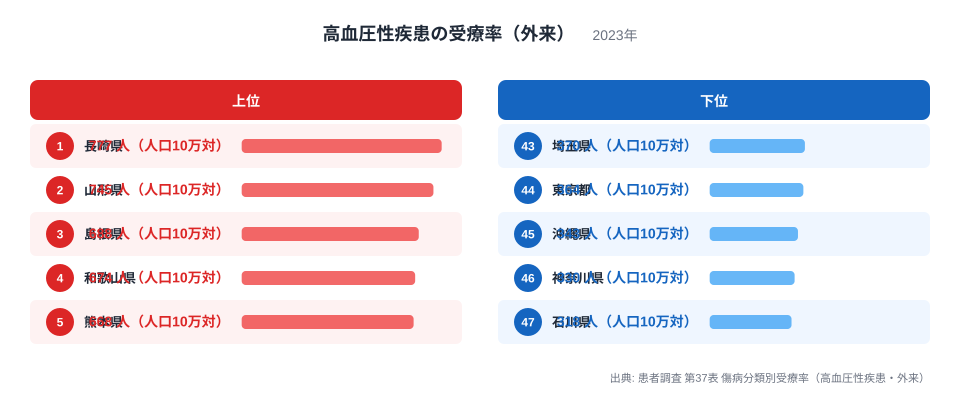
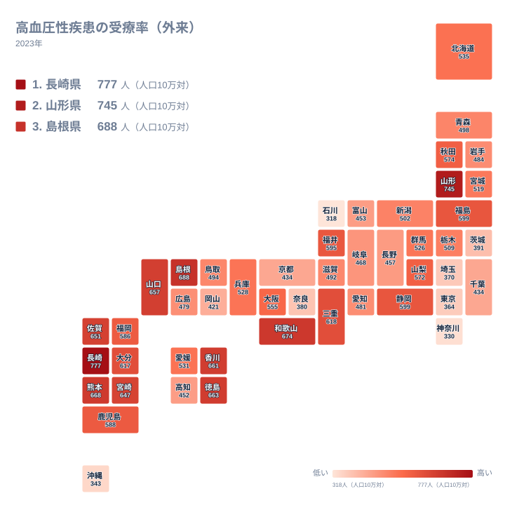

高血圧性疾患で外来通院している人の割合を示す受療率は、単純な有病率とは異なる指標です。人口10万人あたり何人が実際に医療機関へ通院しているかを示す数字であり、病気そのものの多さだけでなく、医療機関へのかかりやすさや検診の受診率、通院を続ける習慣の有無も反映されます。この記事では、2023年の患者調査による高血圧性疾患の受療率のデータをもとに、県ごとの差がどこから来るのかを探ります。

患者調査によると、高血圧性疾患の受療率が最も高いのは長崎県で人口10万人あたり777人、次いで山形県が745人、島根県が688人となっています。最も低いのは石川県の318人で、神奈川県が330人、沖縄県が343人と続きます。長崎県と石川県の間には2倍以上の開きがあり、同じ日本国内でも通院の状況が大きく異なることが分かります。

## 高血圧性疾患の受療率が高い県、低い県

<source-link href="/ranking/treatment-rate-hypertension-outpatient">高血圧性疾患の受療率（外来）ランキングをもっと見る</source-link>

上位には長崎県が777人で首位、山形県が745人で2位、島根県が688人で3位、和歌山県が674人で4位、熊本県が668人で5位と続き、九州や東北、山陰地方の県が並んでいます。これらの地域は高齢化率が高いという共通点があり、加齢とともに発症しやすい高血圧性疾患の患者数が増えやすいことに加え、地域の診療所や医師とのつながりが密で、定期的な通院が生活習慣として根づいている土地柄も受療率を押し上げていると考えられます。

一方で、石川県が318人で最も低く、神奈川県が330人、沖縄県が343人、東京都が364人、埼玉県が370人と続きます。神奈川県や東京都、埼玉県のような大都市圏が下位に集まっているのは、有病者数そのものが少ないというより、若い世代の人口比率が高く高齢化率が相対的に低いこと、また多忙な生活の中で定期通院よりも自己管理や市販薬での対応を選ぶ人が一定数いることが影響している可能性があります。

> [!NOTE]
> 受療率は「調査日に実際に医療機関にかかっていた人」の人口10万人あたりの割合であり、その病気を持っている人全体の割合を示す有病率とは異なります。通院していない潜在的な患者は数字に反映されません。

## 地理分布から見える傾向

タイルマップで全国を見渡すと、九州西部や山陰、東北の日本海側といった地域で受療率が高く、首都圏や北陸の一部で低い傾向がはっきりと表れています。これは高齢化率の地理的な分布とよく似ており、高齢者の割合が高い地域ほど受療率も高くなる傾向が見て取れます。ただし、石川県のように北陸に位置しながら受療率が全国最下位という例もあり、高齢化率だけでは説明できない地域差が存在することも分かります。

石川県が低い背景には、健康診断の受診率の高さや、生活習慣病の予防に力を入れる地域医療の取り組みが進んでいる可能性が考えられますが、これはあくまで一つの仮説であり、この統計だけから断定することはできません。受療率の低さが「健康な県」を意味するのか、「通院していない未受診の患者が多い県」を意味するのかは、この数字だけでは判別できない点に注意が必要です。

> [!WARNING]
> 受療率の低さを単純に「健康」や「優れた医療体制」と結びつけるのは早計です。通院していない未受診の患者が多いために数字が低く出ている可能性もあり、有病率や検診受診率など他の指標とあわせて確認する必要があります。

加齢に伴い血圧が上がりやすくなることは医学的によく知られており、高齢化率が高い地域ほど高血圧性疾患を抱える人の絶対数が多くなるのは自然な結果です。ただし、同じように高齢化が進んでいる地域でも受療率には差があり、島根県や熊本県のように高齢化率が高くかつ受療率も高い県がある一方で、必ずしもすべての高齢化先進県が上位に来ているわけではありません。この点からも、受療率が高齢化率だけでなく地域医療の体制にも左右される複合的な指標であることがうかがえます。

## 長崎県と山形県、それぞれの受療率の背景

[長崎県のデータ](/areas/42000)と[山形県のデータ](/areas/06000)を見比べると、どちらも高血圧性疾患の受療率で上位に入っていますが、地理的な条件は対照的です。長崎県は離島や半島が多く医療機関へのアクセスが地域によって大きく異なる一方、地域の診療所が住民の健康管理を担う体制が根づいています。山形県は内陸の豪雪地帯で、冬場の外出が制限される中でも定期通院を続ける習慣が定着していることが、受療率の高さに結びついていると考えられます。

こうした地域ごとの医療との関わり方の違いは、[同じカテゴリの統計一覧](/category/socialsecurity)にある他の社会保障関連の指標と見比べることでより立体的に理解できます。高齢化率や介護に関する指標とあわせて見ると、地域医療の実態がより多面的に見えてきます。

> [!TIP]
> 高血圧性疾患の受療率を読むときは、その県の高齢化率とあわせて確認すると、数字がどこまで人口構成の違いによるものかを見分けやすくなります。

## 通院のしやすさという視点

高血圧性疾患のように自覚症状が乏しい病気では、医療機関を受診するきっかけが検診であることが多く、地域の検診受診率が受療率に直結しやすい傾向があります。また、かかりつけ医制度が地域にどれだけ根づいているかも重要な要素です。長年同じ診療所に通う習慣がある地域では、血圧が高めと分かった時点で自然に通院につながりやすく、こうした医療とのつながりの深さが受療率の高さに反映されている可能性があります。

## まとめ

高血圧性疾患の受療率は、単純な病気の多さではなく、高齢化率や地域医療への関わり方の違いを映し出す指標です。長崎県や山形県のような高齢化率の高い地域で受療率が高く、神奈川県や東京都のような若い世代の多い都市圏で低いという傾向がありますが、石川県のように高齢化率だけでは説明できない例外も存在します。受療率の高低をそのまま健康状態の良し悪しと結びつけず、有病率や検診受診率などの他の指標とあわせて総合的に見ることが、この数字を正しく読み解く上で欠かせません。

## データ出典

- 患者調査(2023年)
