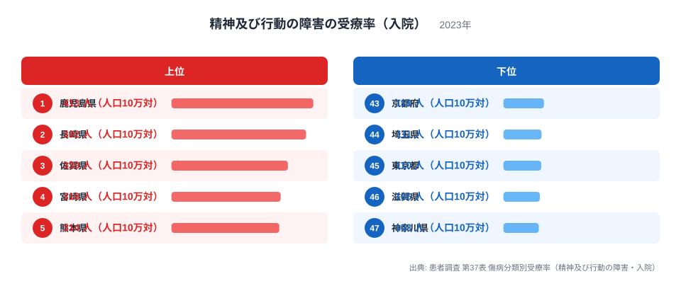
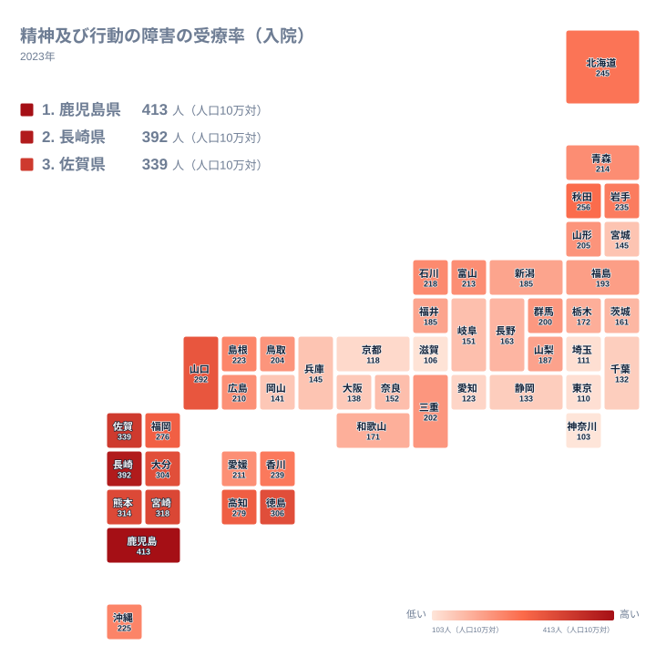

## 精神及び行動の障害の受療率とは

精神及び行動の障害で入院している患者の受療率は、ある特定の調査日に入院治療を受けている患者の数を、人口10万人あたりに換算した指標です。厚生労働省の患者調査から得られるこの数字を都道府県別に並べると、同じ日本国内でありながら大きな地域差が浮かび上がります。この記事では、2023年の最新データをもとに、どの県が高く、どの県が低いのか、そしてその差がなぜ生まれるのかを見ていきます。

全国でもっとも高い県ともっとも低い県を比べると、受療率にはおよそ4倍の開きがあります。単純な数字の羅列に見えても、その裏には各地域の医療提供体制の歴史や病床の配置という構造的な背景が隠れています。まずは上位と下位の実際の数字から確認していきましょう。

> [!NOTE]
> この受療率は「発症した人の割合」ではなく、調査日の時点で入院治療を受けている患者の数を示す指標です。継続して入院している患者も1人として数えられるため、平均在院日数が長い地域ほど数字が積み上がりやすい性質があります。単純に「その地域で新たに発症する人が多い」とは読み取れない点に注意が必要です。

## 上位5県と下位5県の差

<source-link href="/ranking/treatment-rate-mental-disorder-inpatient">精神及び行動の障害の受療率（入院）ランキングをもっと見る</source-link>

1位は鹿児島県で、人口10万人あたり413人となっています。2位は長崎県の392人、3位は佐賀県の339人、4位は宮崎県の318人、5位は熊本県の314人と続きます。上位5県はすべて九州地方に位置しており、九州の県が全国の中で突出して高い水準にあることがわかります。[鹿児島県のデータ](/areas/46000)と[長崎県のデータ](/areas/42000)を見ると、いずれも300人を超える水準で全国平均を大きく上回っていることが確認できます。

一方、下位を見ると、47位は神奈川県で103人、46位は滋賀県で106人、45位は東京都で110人、44位は埼玉県で111人、43位は京都府で118人となっています。下位5県はいずれも三大都市圏に含まれる県であり、大阪府や愛知県もそれぞれ138人、123人と全国平均を下回る水準です。人口が集中する大都市圏ほど受療率が低く、地方、とりわけ九州で高くなるという明確な対比が見えてきます。

鹿児島県と神奈川県を比べると、受療率にはおよそ4倍の差があります。同じ制度のもとで調査されている数字でありながら、これほどの開きが生じる背景には、単純な患者数の違いだけでは説明できない要因があると考えられます。次の章では、この差を地理的な広がりとして確認していきます。

## 地理的にみる分布

タイルマップで全国の分布を見ると、九州から四国・中国地方の西日本にかけて濃い色の県が連なっている一方、関東や近畿の主要都市圏は薄い色にとどまっていることがわかります。徳島県は306人、大分県は304人、山口県は292人、高知県は279人と、九州以外の西日本の県でも比較的高い水準が目立ちます。これらの県に共通するのは、都市部に比べて人口が少なく、医療機関ごとの受け持つ患者数の割合が相対的に大きくなりやすいという点です。

反対に、愛知県や大阪府、東京都、埼玉県、神奈川県といった三大都市圏の中心県は、いずれも人口10万人あたり150人を下回る水準にとどまっています。人口が多い都市部では、精神科の医療資源も相対的に分散して整備されている場合があり、入院という形での治療よりも、外来通院や地域での支援体制が選ばれやすい可能性があります。ただし、この点はあくまで地理的な分布から読み取れる傾向であり、次の章で背景をより詳しく考えていきます。

## なぜ地域差が生まれるのか

[仮説] 精神科の入院受療率が地域によって大きく異なる背景には、各地域における精神科病床の配置の歴史的な違いが関係している可能性があります。日本では戦後から高度経済成長期にかけて、地域ごとに精神科病院の整備が進められてきた経緯があり、病床数が多く整備された地域では、その後も入院治療が選択されやすい構造が続いてきたと考えられています。これはあくまで一般的に指摘される見方であり、本データだけからその因果関係を証明することはできません。

もう一つ考えられるのは、入院治療の必要性そのものではなく、病床がどれだけ利用可能かという供給側の事情が受療率に反映されているという見方です。病床数が多い地域では入院という選択肢が取られやすくなり、逆に病床数が限られている都市部では、外来診療や在宅での支援に治療の重心が移りやすいという構造が考えられます。[仮説] つまり、この数字の差は患者本人の症状の重さの差だけでなく、地域の医療提供体制の違いを映し出している可能性が高いということです。

> [!WARNING]
> 受療率の高さは、必ずしもその地域で精神疾患を抱える人が多いことを意味しません。精神科病床の整備状況や、入院治療と外来治療のどちらを選びやすい地域かという医療提供体制の違いが、数字に大きく影響します。県ごとの数字だけを見て「その地域の人は病気になりやすい」と読み違えないよう注意してください。

こうした構造的な背景を踏まえると、都道府県別の受療率は、住民の健康状態そのものというより、地域医療がどのような形で精神疾患に対応してきたかを映す鏡として読むほうが実態に近いと言えるでしょう。[同じカテゴリの統計一覧](/category/socialsecurity)では、医療や福祉に関する他の指標も確認できるので、あわせて見ることで地域ごとの医療提供体制をより立体的に把握できます。

> [!TIP]
> この受療率だけを見て地域の医療の良し悪しを判断せず、精神科病床数や平均在院日数など、供給側の指標とあわせて確認すると、数字の背景がより正確に見えてきます。患者調査は数年おきに実施されるため、経年の変化を追う際は調査年をそろえて比較することも大切です。

## まとめ

- 1位は鹿児島県で人口10万人あたり413人、47位は神奈川県で103人と、全国でおよそ4倍の開きがあります。
- 上位5県は鹿児島県、長崎県、佐賀県、宮崎県、熊本県で、いずれも九州地方に集中しています。
- 下位5県は神奈川県、滋賀県、東京都、埼玉県、京都府で、いずれも三大都市圏に含まれる県です。
- 地理的には西日本、とりわけ九州で高く、関東・近畿の都市圏で低いという明確な地域パターンが見られます。
- 受療率の差は患者本人の症状というより、精神科病床の配置など医療提供体制の違いを反映している可能性があります。

## データ出典

患者調査 第37表 傷病分類別受療率（精神及び行動の障害・入院）、2023年
