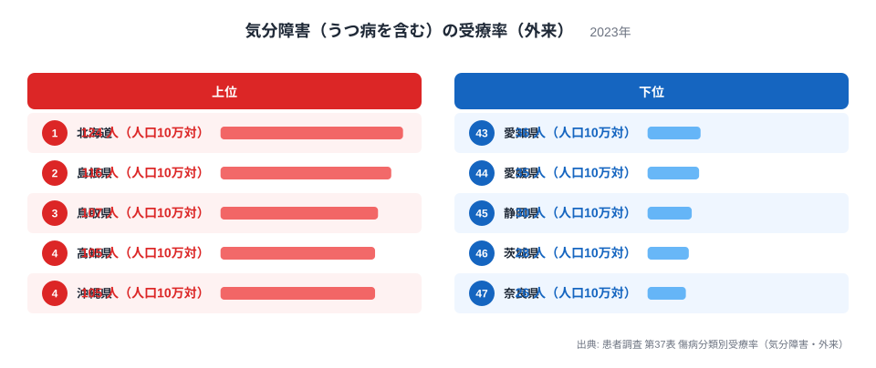
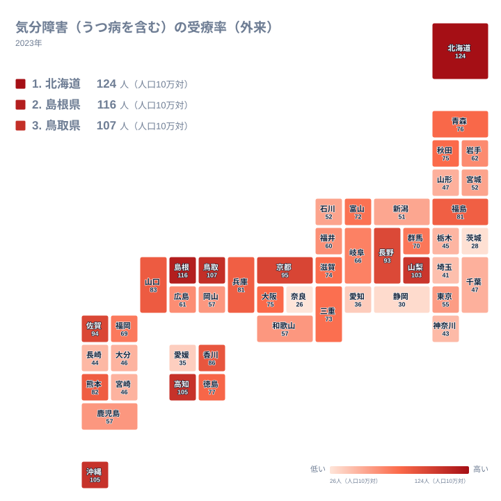

気分障害（うつ病を含む）で外来通院をしている人の割合を示す受療率は、実は住んでいる都道府県によって大きく異なります。厚生労働省の患者調査は、ある特定の調査日に医療機関を受診した患者数をもとに、人口10万人あたりの推計患者数を算出したものです。つまりこの数値は、気分障害にかかっている人の全体像そのものではなく、「その日に通院していた人」の多さを表す指標だと理解しておく必要があります。

2023年の調査では、もっとも受療率が高い北海道ともっとも低い奈良県のあいだに、大きな開きが見られます。この記事では、47都道府県のデータをもとに、どの地域で受療率が高く、どの地域で低いのか、そしてその違いがどこから生まれるのかを見ていきます。結論から言うと、受療率の高さは気分障害にかかっている人の多さだけでなく、通院のしやすさや医療機関へのアクセスのしやすさとも関係している可能性があります。

> [!NOTE]
> 受療率は「調査日にその医療機関で治療を受けていた人」を人口10万人あたりの推計値として示したものです。気分障害にかかっている人全体の割合を示す有病率とは異なる指標なので、両者を混同しないよう注意してください。

## 気分障害の受療率が高い県・低い県

<source-link href="/ranking/treatment-rate-mood-disorder-outpatient">気分障害（うつ病を含む）の受療率（外来）ランキングをもっと見る</source-link>

上位を見ると、北海道が124人で1位となっています。2位は島根県で116人、3位は鳥取県で107人、4位は高知県で105人、5位は沖縄県で同じく105人です。北海道は2位の島根県との差も大きく、他の都道府県と比べて突出した数値になっていることがわかります。北海道のより詳しいデータは、[北海道のデータ](/areas/01000)からご覧いただけます。

上位5県の顔ぶれを見ると、北海道と沖縄県という日本列島の南北の端に位置する2県と、山陰地方の鳥取県・島根県、そして四国の高知県が並んでいます。共通する地理的な特徴を一言でまとめるのは難しく、単純に「寒い地域だから」「離島が多いから」といった説明では上位5県すべてを説明できません。[仮説]として考えられるのは、これらの地域では他の都道府県に比べて精神科や心療内科への受診のハードルが低い、あるいは早期に外来治療につながりやすい体制が整っている可能性です。ただしこれは受療率のデータだけからは検証できず、医療機関数や通院にかかる距離といった別の統計と合わせて確認する必要があります。島根県の詳しいデータは[島根県のデータ](/areas/32000)にまとめています。

一方、下位を見ると奈良県が26人で47位、茨城県が28人で46位、静岡県が30人で45位、愛媛県が35人で44位、愛知県が36人で43位となっています。北海道の124人と奈良県の26人を比べると、4倍以上の開きがあることになります。下位の顔ぶれには、東海地方の愛知県・静岡県や、近畿地方の奈良県が含まれており、いずれも人口の多い都市圏を抱える県です。人口が多い地域だから受療率が低いと単純に言い切ることはできませんが、都市部では医療機関の選択肢が多い分、患者が特定の統計調査日に受診するタイミングが分散しやすい可能性も考えられます。

> [!WARNING]
> 患者調査は数年に一度、特定の1日だけを対象に行われる抽出調査です。調査日の曜日や地域の医療機関の稼働状況によって数値が上下しうるため、この受療率だけを見て地域の気分障害の実態そのものを断定することはできません。

## 地理的にはどう広がっているか

地図で見ると、受療率の高い県と低い県は日本全国に散らばっており、特定のブロックにまとまって固まっているわけではないことがわかります。北海道のように単独で突出している県もあれば、山陰地方の鳥取県・島根県のように隣り合う県が両方とも上位に入っているケースもあります。中間的な水準の県は近畿地方や中部地方に多く見られ、京都府の95人や滋賀県の74人のように、同じ近畿地方の中でも順位には幅があります。

この分布から読み取れるのは、気分障害の受療率が単純な東西の差や都市と地方の差だけでは説明できないという点です。むしろ都道府県ごとの医療提供体制や、精神科・心療内科の外来を受診しやすい環境が整っているかどうかが、地図上の濃淡に影響している可能性があります。ただしこれもデータから直接確認できたわけではなく、あくまで[仮説]の域を出ません。

## 受療率の差から見えること

受療率は、その地域に気分障害を抱える人がどれだけいるかを直接示す数値ではなく、「調査日に外来を受診していた人」の多さを反映した数値です。そのため、受療率が高い地域は必ずしも気分障害にかかっている人が多い地域とは限りません。むしろ、精神科や心療内科を受診しやすい環境が整っている地域ほど、数値が高く出やすいという側面があります。

逆に受療率が低い地域では、実際にはうつ病などの症状を抱えていても、近くに専門の医療機関が少ない、あるいは受診までのハードルが高いために、統計上は数値が低く出ている可能性も[仮説]として考えられます。愛知県や静岡県のように人口の多い都市圏を抱える県で受療率が中位から下位にとどまっている背景には、こうした受診環境の違いが関係しているのかもしれません。

> [!TIP]
> 受療率の高さだけでなく、人口10万人あたりの精神科・心療内科の医療機関数と合わせて確認すると、その地域で「かかりやすさ」が高いのか、「実際にかかっている人が多い」のかを見分けやすくなります。

医療・社会保障に関する他の指標を合わせて確認したい場合は、[同じカテゴリの統計一覧](/category/socialsecurity)から関連するランキングをご覧いただけます。

## まとめ

- 気分障害（うつ病を含む）の受療率（外来）が最も高いのは北海道で124人です
- 最も低いのは奈良県で26人です
- 北海道と奈良県のあいだには4倍以上の開きがあります
- 上位5県は北海道・島根県・鳥取県・高知県・沖縄県で、日本列島の南北の端や山陰地方に分かれています
- 下位5県には愛知県や静岡県といった人口の多い都市圏の県が含まれています

## データ出典

出典: 患者調査 第37表 傷病分類別受療率（気分障害・外来）（2023年）
