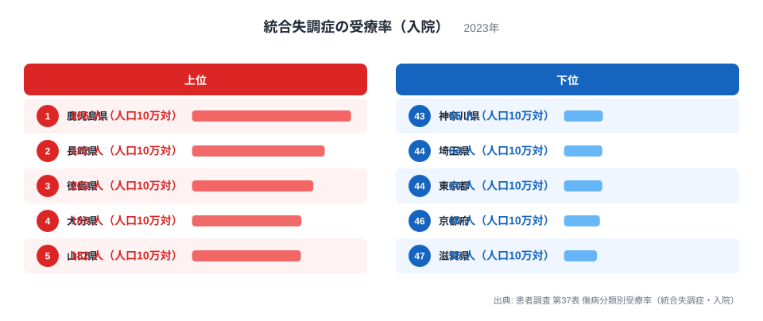
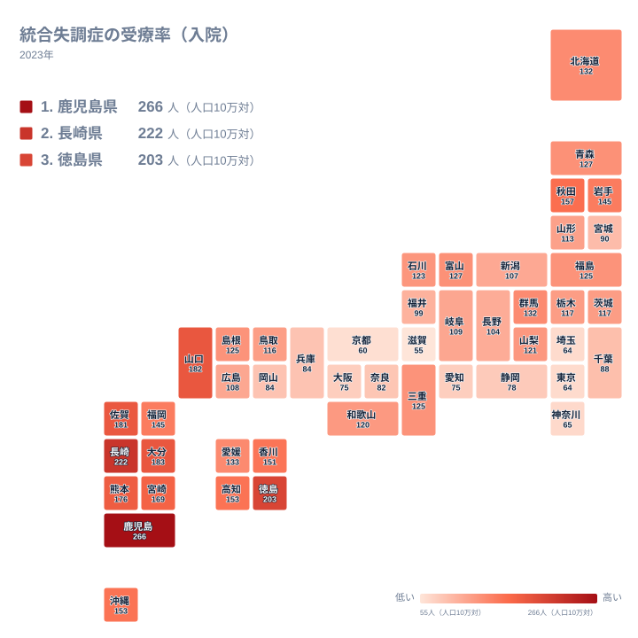

統合失調症の入院受療率とは、患者調査の調査日に医療施設へ入院して統合失調症の治療を受けていた患者数を、人口10万人あたりに換算した指標です。2023年の調査では、この数値が都道府県によって大きく異なっていることがわかりました。

もっとも高いのは鹿児島県で、人口10万人あたり266人が入院して治療を受けています。一方でもっとも低いのは滋賀県の55人です。同じ病気に対する治療の受け方が、住む場所によってこれほど違うのはなぜでしょうか。実はこの差は、病気にかかる人の割合そのものよりも、それぞれの地域が持つ医療提供の体制を映し出している可能性があります。

> [!NOTE]
> 患者調査は3年に一度、10月のある1日を対象に全国の医療施設へ聞き取りを行い、その日に受療していた患者数から都道府県別の数値を推計する統計です。入院受療率は「調査日に入院していた患者の数」を基にしているため、退院までの期間が長い患者が多い地域ほど、新たに発症する患者の数が同じでも数値が高く出ます。

## 入院受療率の上位と下位

<source-link href="/ranking/treatment-rate-schizophrenia-inpatient">統合失調症の受療率（入院）ランキングをもっと見る</source-link>

上位を見ると、鹿児島県に続いて長崎県が222人、徳島県が203人、大分県が183人、山口県が182人、佐賀県が181人と並びます。九州と中国・四国の県が上位を占めていることがわかります。福岡県も145人で全国の中では高い水準にあり、[同じカテゴリの統計一覧](/category/socialsecurity)を見ると、この地域では他の社会保障関連の指標でも独自の傾向を示すことが多くあります。

反対に下位を見ると、滋賀県の55人に続いて京都府が60人、東京都と埼玉県がともに64人、神奈川県が65人となっています。近畿から関東にかけての都市部が並んでいることが特徴です。愛知県と大阪府はどちらも75人で、大都市圏がまとまって低い水準にあることが読み取れます。

この上位と下位の並びは、単純に統合失調症にかかる人の割合が地域によって異なることを示しているとは限りません。入院受療率は、その地域にどれだけの精神科の病床が整備されているか、そして入院した患者がどれくらいの期間そこで治療を続けているかに強く左右される指標だからです。数値の高さだけを見て、その地域で病気にかかりやすい人が多いと結びつけてしまうのは早計です。

## なぜ西日本に集中するのか

タイルマップで全国を見渡すと、九州全域と中国・四国の一部で色が濃くなっており、東北や関東、近畿の多くの県では色が薄いことが一目でわかります。とくに[鹿児島県のデータ](/areas/46000)と[長崎県のデータ](/areas/42000)を比べると、どちらも九州の西側に位置し、全国で1位と2位を占めている点が共通しています。

[仮説] この偏りの背景には、地域ごとの精神科病床の整備の歴史が関係している可能性があります。日本では戦後、精神科の病床の多くが民間の医療機関によって整備されてきた経緯があり、地域によって病床の数に差が生まれてきました。病床が多く整備された地域では、長期にわたって入院を続ける患者を受け入れる余地が大きく、結果として入院受療率が高く出やすくなります。これは統合失調症そのものにかかりやすい人が西日本に多いという意味ではなく、医療をどのように提供してきたかという体制の違いを表していると考えるのが自然です。この点はまだ病床数の統計と突き合わせて検証できていないため、ひとつの仮説として受け止めてください。

秋田県の157人や岩手県の145人のように、東北の一部の県も比較的高い水準にあります。九州や中国・四国だけでなく、地方部で全体として受療率が高くなりやすい傾向があるとも読み取れます。人口の少ない地方部では、地域の中核となる精神科病院に周辺地域からも患者が集まりやすいことが、こうした傾向の一因になっている可能性があります。

## 受療率が低い都市部で起きていること

東京都や神奈川県、埼玉県といった都市部で受療率が低いのは、統合失調症の患者が少ないからだとは言い切れません。都市部では入院よりも通院を中心とした治療や、地域で暮らしながら支援を受ける体制が比較的整っている場合があり、入院という形で数えられる患者の数が少なくなっている可能性があります。

> [!WARNING]
> 患者調査の受療率は、患者が入院している医療施設の所在地を基準に集計されています。そのため、近隣の県から患者を受け入れる規模の大きな精神科病院がある地域では、その県に住んでいない患者の分まで数値に含まれることになります。反対に、そうした病院が少ない都市部に住む患者が、病床の整備が進んだ別の県の病院へ入院しているとすれば、都市部の受療率はさらに低く見えることになります。都道府県別の数値は「その県に住む人の受療率」ではなく「その県で入院している人の割合」として読む必要があります。

> [!TIP]
> この指標だけを見て「精神疾患が多い県」「少ない県」と決めつけないことが大切です。受療率が低い地域でも、通院や地域生活支援を通じて治療を続けている患者は数多くいます。人口10万人あたりの精神科病床数のような供給側のデータとあわせて読むと、なぜこの地域差が生まれているのかがより見えやすくなります。

## この数字から何がわかるか

- 統合失調症の入院受療率は、鹿児島県の266人から滋賀県の55人まで、都道府県によって大きな開きがあります
- 上位は鹿児島県、長崎県、徳島県、大分県、山口県など九州・中国四国の県に集中しています
- 下位は滋賀県、京都府、東京都、埼玉県、神奈川県など近畿から関東の都市部に集中しています
- この差は病気にかかる人の割合そのものよりも、精神科病床の整備状況や入院期間の長さといった医療提供体制の違いを反映していると考えられます
- 受療率だけを見て地域の病気のかかりやすさを判断するのではなく、医療体制の背景とあわせて読むことが大切です

## データ出典

厚生労働省「患者調査」第37表 傷病分類別受療率（統合失調症・入院）、2023年調査に基づきます。
