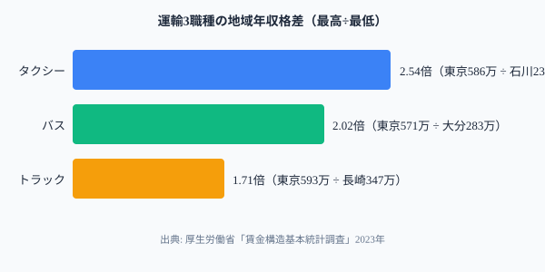

「同じ運転者なのに、職種によって地域格差の大きさがこれほど違う」──タクシー運転者の地域格差は東京 vs 石川で**2.5倍**、バス運転者は東京 vs 大分で**2倍**、そしてトラック運転者は東京 vs 長崎で**1.7倍**。

なぜトラックだけ格差が小さいのか。その構造を解くと、2024年問題が物流の地方を直撃する理由が見えてきます。

> [!NOTE]
> 本記事の年収は厚生労働省「賃金構造基本統計調査」（2023年）の「きまって支給する現金給与額×12＋年間賞与」で算出した推計値です。トラックは「営業用大型貨物自動車運転者」（緑ナンバー大型）、バスは「バス運転者」、タクシーは「ハイヤー・タクシー運転者」が対象です。

## 運輸3職種の地域格差──なぜ差の大きさが違うのか

<!-- 運輸3職種の地域格差比較バーチャート -->

タクシーの格差が最も大きい理由は「需要の地域依存度」です。東京のタクシーは初乗り運賃の高さと乗客数の多さが年収を押し上げる一方、地方では需要そのものが限られます。乗客がいなければ稼ぎようがない構造上、大都市と地方の差は避けられません。

バスも同様に路線バスの収益が地域の人口密度と利用者数に直結します。過疎地域ほど利用者が減り、ドライバーの年収も下がる構造です。

**トラックだけ格差が小さい（1.7倍）のは、地域をまたぐ長距離輸送という特性**があるためです。地方発であっても大都市圏への輸送需要は一定程度存在するため、タクシーやバスほどの格差にはなりにくいのです。

<source-link href="/ranking/taxi-driver-annual-income">タクシー運転者の年収ランキング</source-link>

<source-link href="/ranking/bus-driver-annual-income">バス運転者の年収ランキング</source-link>

<data-source label="厚生労働省「賃金構造基本統計調査」" year="2023年"></data-source>

## トラック運転者の年収ランキング──熊本が5位に浮上した真因

**1位は[東京都](/areas/13000)（593.3万円）**。2位の神奈川（570.1万円）、3位の三重（562.9万円）と続きます。

5位には**熊本県（554.1万円）**が入っています。TSMC菊陽工場は2024年に稼働を開始しましたが、着工は2021年。本データは2023年時点であるため、**建設期間中（2021〜2023年）の資材輸送需要が既に反映されていた**と解釈できます。大型建設現場への資材輸送は通常の物流より単価が高く、着工から稼働前の段階で熊本のドライバー年収を押し上げた要因の一つと考えられます。

<data-source label="厚生労働省「賃金構造基本統計調査」" year="2023年"></data-source>

**最下位は[長崎県](/areas/42000)（347.4万円）**。沖縄（375.8万円）、青森（375.9万円）と続きます。全国平均は約468万円で、これらの県は平均を120万円以上下回ります。

> [!TIP]
> 三重県（562.9万円・3位）と兵庫県（562.5万円・4位）の高さは四日市港・神戸港を擁する物流拠点効果です。港湾関連の長距離輸送は輸送単価が高く、平均年収を押し上げます。「荷主企業の種類が年収を決める」という物流の構造が如実に表れています。

## 地域構造分析──「太平洋ベルト × 港湾」が決める年収地図

年収の高い地域には明確なパターンがあります。

**年収500万円超（14県）の共通点：**
- 太平洋ベルト沿い（東京・神奈川・愛知・大阪・兵庫）
- 主要港湾・工業拠点（三重の四日市港、兵庫の神戸港）
- 大規模工場の新設（熊本のTSMC）

**年収450万円未満（14県）の共通点：**
- 荷主企業が少なく長距離輸送の起点から遠い
- 東北北部（青森375万、岩手406万）・九州南部（長崎347万、鹿児島390万）
- 運賃競争が激しく、運転者の年収に下方圧力がかかりやすい

<source-link href="/ranking/truck-driver-annual-income">トラック運転者の年収ランキング（全47都道府県）</source-link>

<source-link href="/ranking/minimum-wage-by-region">地域別最低賃金ランキング（賃金の底を比較する）</source-link>

<source-link href="/ranking/scheduled-salary-male">所定内給与額（男性）ランキング</source-link>

## 2024年問題の逆説──年収が下がるドライバーが出る理由

2024年4月から適用された時間外労働の上限規制（年960時間）は、トラック運転者の年収に二つの方向から影響します。

**残業代が減るドライバー（年収低下リスク）：**
長時間労働で年収を確保していたドライバーは、規制で残業時間が削られると手取りが減ります。特に地方の運送会社では基本給が低く、残業代で年収を底上げしていたケースが多い。規制は「健全化」を目的にしていますが、短期的には年収低下の副作用を生みます。

**地方でこれが深刻な理由：** 長崎347万円という年収はすでに全産業平均を大きく下回っています。ここからさらに残業代が減れば、他産業への転職が加速し、物流の担い手不足が悪化する恐れがあります。

> [!WARNING]
> 本データは2023年（規制適用前）の数値です。2024年問題の影響が年収に反映されるのは、2024年分の賃金構造基本統計調査（2025年公表予定）以降です。現時点では「規制後の年収変化」はまだデータで検証できません。

国土交通省「物流革新に向けた政策パッケージ」では、2030年に約34%の輸送力不足が試算されています。年収格差の放置は「ドライバーが確保できない地方」を生み出し、最終的には「届かない物流」として消費者にも影響します。

## まとめ──格差の構造と2024年問題の交点

タクシー2.5倍・バス2倍・トラック1.7倍という地域格差の大きさの違いは、「輸送需要の地域依存度」で説明できます。トラックは地域をまたぐことで格差が緩和されますが、それでも長崎347万 vs 東京593万の245万円差は厳然として存在します。

2024年問題は残業規制による手取り減と人手不足のダブル効果をもたらし、特に元から年収が低い地方のドライバー確保を困難にします。物流は国民生活の基盤であり、地域格差の解消と運賃の適正化、基本給の引き上げが同時に必要です。

<source-link href="/category/laborwage">労働・賃金カテゴリの全ランキング</source-link>

## データ出典

- 厚生労働省「賃金構造基本統計調査」2023年（e-Stat statsDataId: 0000010106）
- 国土交通省「物流革新に向けた政策パッケージ」2023年

<site-link category="laborwage"></site-link>

本記事の対象データ: [関連カテゴリ](/category/laborwage)
