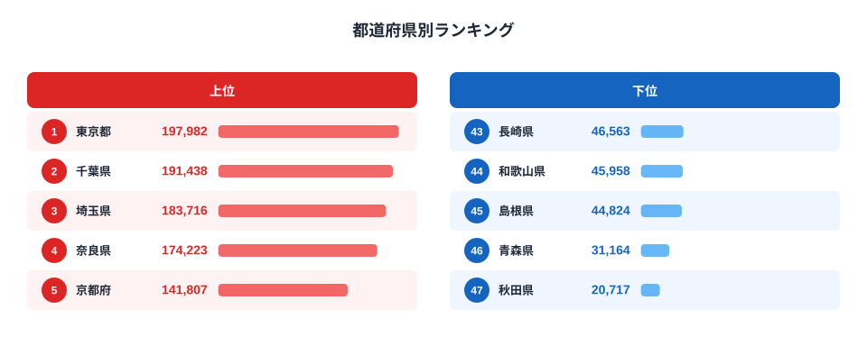
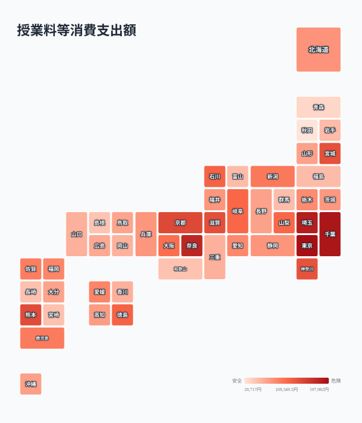

子育てにかかる費用のなかで、教育費は「もっとも家庭ごとのバラツキが大きい項目」だと言われます。食費や住居費は住む地域の物価水準にある程度連動しますが、教育費は「どんな教育を選ぶか」という各家庭の判断が直接反映されるため、同じ収入水準の世帯でも支出額が大きく開くのです。

総務省の家計調査から都道府県庁所在市の「授業料等消費支出額」（幼稚園から大学までの授業料）を比べると、その差は最大で9.6倍にのぼります。1位の東京都は年間197,982円、最下位の秋田県は20,717円。同じ日本に暮らしていても、子どもの教育に投じる金額はここまで違います。

この記事では、授業料ランキングの全体像を見たうえで、なぜ東京と秋田でこれほどの差が生まれるのかを、補習教育（塾・予備校）のデータもあわせて掘り下げます。結論を先に言うと、東京は「授業料も塾代も高い」総合型の教育費高負担地域であるのに対し、秋田は「授業料も塾代も低い」まま学力面では全国上位を維持する、対照的な構造が見えてきます。

> [!NOTE]
> 「授業料等消費支出額」は総務省家計調査の品目のひとつで、幼稚園・小学校・中学校・高校・大学などの**授業料そのもの**を指します（塾や予備校の費用は別品目の「補習教育」に分類されます）。集計対象は二人以上の世帯で、都道府県庁所在市（政令指定都市含む）の平均値です。私立学校の授業料や国公立との併用など、世帯構成・選択の違いがそのまま数値に表れます。

## 授業料ランキング｜上位と下位

2024年の全国平均は88,798円でした。上位を占めるのは東京都（197,982円）、千葉県（191,438円）、埼玉県（183,716円）、奈良県（174,223円）、京都府（141,807円）と、いずれも大都市圏またはその通勤圏の県です。特に東京都・千葉県・埼玉県は東京への通学・通勤が容易な位置関係にあり、私立中高一貫校や有名私立大学への進学を意識した教育選択が支出に反映されていると考えられます。

<source-link href="/ranking/tuition-consumption-expenditure">授業料等消費支出額ランキングをもっと見る</source-link>

下位に目を移すと、長崎県（46,563円）、和歌山県（45,958円）、島根県（44,824円）、青森県（31,164円）、そして最下位の秋田県（20,717円）が並びます。地方圏、特に東北・山陰の県が下位に集中しています。これらの地域では公立学校への進学が主流で、私立中学・高校を選択する世帯の割合が首都圏に比べて低いことが、授業料支出の低さにつながっていると見られます。

> [!TIP]
> 上位5県のうち4県（東京・千葉・埼玉・奈良）は、いずれも「都心へのアクセスが良い」という共通点があります。これは通学圏内に私立の選択肢が豊富にあることを意味し、公立中心の地方圏との違いを生む一因と考えられます。

## 全国分布で見る｜首都圏・近畿圏と地方圏の対比

地図で見ると、支出額が高い地域は関東南部（東京・千葉・埼玉）と近畿（奈良・京都・大阪）に集中しており、東北・山陰・九州の一部は低い水準にとどまっています。この分布は単純な「都市と地方」の二分法というより、私立中高一貫校や難関大学への進学を志向する世帯がどれだけ集積しているかという教育選択の地理的な偏りを映し出しています。近畿圏で京都・奈良が上位に入る一方、大阪府は14位（105,625円）と中位にとどまるなど、同じ都市圏内でも差があることも読み取れます。

<source-link href="/ranking/tuition-consumption-expenditure">授業料等消費支出額ランキングの全47都道府県を見る</source-link>

## なぜ秋田は最下位なのか｜「秋田モデル」という補助線

秋田県の授業料支出は全国平均の4分の1以下という際立った低さですが、これは単に「教育に力を入れていない」ことを意味しません。秋田県は全国学力・学習状況調査で継続的に上位に入る県として知られています。つまり秋田は「家計の教育費負担が低いにもかかわらず、学力面では上位」という構造を持っているのです。

これを補習教育（学習塾・予備校）のデータで確認すると、その一貫性がより鮮明になります。幼児・小学校補習教育で秋田県は46位（1,341円）、中学校補習教育で45位（4,152円）、高校補習教育・予備校で43位（1,437円）と、いずれの段階でも全国最下位クラスです。つまり秋田県は「授業料」だけでなく「塾代」も含めた教育費全体が低い水準にありながら、公教育を軸にした学力形成が機能していると考えられます。

対照的に東京都は、授業料が1位（197,982円）であることに加え、高校補習教育・予備校でも3位（24,214円）と高水準です。私立進学と塾・予備校を組み合わせた「教育費を積み増して学歴を獲得する」型の支出構造が浮かび上がります。

> [!WARNING]
> 「秋田は学力が高いのに教育費が低い」という関係は、あくまで公表統計から読み取れる**相関**であり、両者の間に直接の因果関係があると断定はできません。学力調査の結果には、地域の学習習慣・家庭環境・教員配置など多くの要因が関わっています。ここでは「[仮説] 公教育中心の学習環境が、低い家計負担でも一定の学力水準を支えている可能性がある」という論点として提示します。

## 補習教育費の地域差｜首都圏だけでなく徳島も上位

補習教育のランキングを見ると、東京・埼玉・千葉といった首都圏に加えて、徳島県が幼小補習4位（17,414円）、中学補習5位（22,111円）、高校補習・予備校4位（22,266円）と、すべての段階で上位に入っている点が目を引きます。徳島県は授業料等消費支出額では中位程度ですが、塾・予備校への支出は突出して高く、公立高校からの大学進学を塾でサポートする教育文化があると推測されます。

このように、「授業料」と「補習教育」は必ずしも同じ順位パターンを描きません。東京のように両方が高い「総合型」もあれば、徳島のように授業料は中位でも補習教育に重点を置く「塾依存型」も存在します。地域ごとの教育費の使い方には、私立進学の有無だけでなく、公立主体でも塾で補う戦略の違いが表れていると言えるでしょう。[高校補習教育・予備校ランキング](/ranking/high-school-tutoring-consumption-expenditure)や[幼児・小学校補習教育ランキング](/ranking/elementary-tutoring-consumption-expenditure)もあわせて見ると、教育段階ごとの地域差がより立体的に見えてきます。

<source-link href="/ranking/junior-high-tutoring-consumption-expenditure">中学校補習教育消費支出額ランキングを見る</source-link>

## 教育費格差が意味するもの

授業料と補習教育の両方を合わせて考えると、教育費の地域差は単純な「都市 vs 地方」の物価差では説明しきれません。同じ地方圏でも、公教育中心で教育費を抑える県（秋田・青森など）と、塾・予備校に重点投資する県（徳島など）があり、教育戦略そのものが地域によって異なっています。

一方で、教育費を多く払える家庭ほど選択肢が広がりやすいという構造がある以上、世帯所得の地域差がそのまま子どもの教育機会の差につながるリスクも指摘されています。公教育の質を維持しながら家計負担を抑える「秋田モデル」的なアプローチは、教育費の高騰が課題になっている他地域にとっても、ひとつの参照点になるかもしれません。実際、[東京都](/areas/13000)は世帯収入も高い一方で教育費支出も突出しており、[秋田県](/areas/05000)は収入面でも支出面でも堅実な水準に収まっています。教育費の地域差は、各地域の産業構造や世帯収入の違いとも関係しています。

## まとめ

- 授業料等消費支出額の1位は東京都（197,982円）、最下位は秋田県（20,717円）で9.6倍の差
- 上位5県（東京・千葉・埼玉・奈良・京都）は首都圏・近畿圏の私立進学が盛んな地域に集中
- 下位県（秋田・青森・島根・和歌山・長崎）は公立中心の教育選択が主流とみられる
- 秋田県は授業料・補習教育のいずれも全国最下位クラスながら、学力調査では上位という対照的な構造を持つ
- 徳島県は授業料は中位ながら補習教育（塾・予備校）への支出は全段階で上位という「塾依存型」の特徴を持つ

## データ出典

総務省「家計調査」（都道府県庁所在市及び政令指定都市、二人以上の世帯）2024年分をもとに、e-Stat 経由で整備したデータです。
