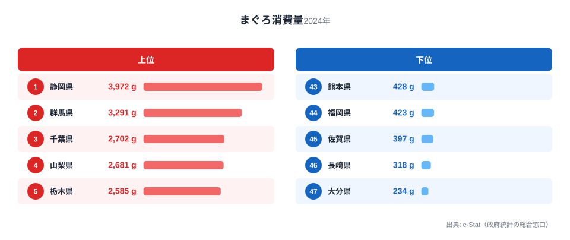
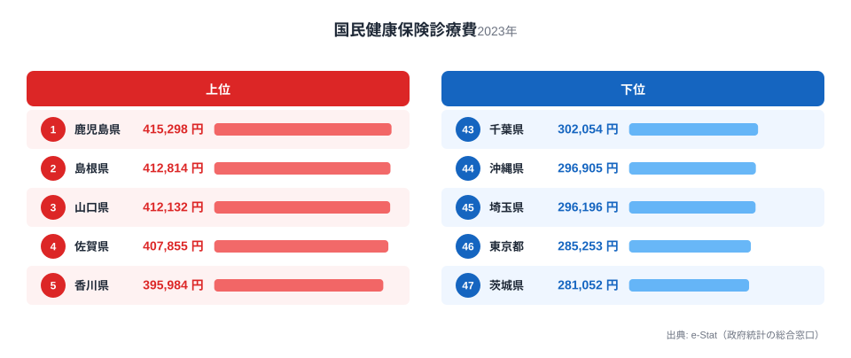
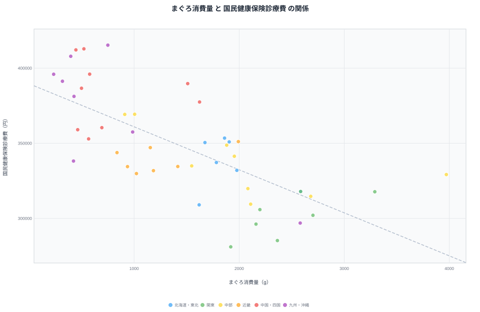

「魚をよく食べる地域は健康的」——そんなイメージを持つ人は多いのではないでしょうか。実際に都道府県別のデータを重ねてみると、まぐろの消費量が多い県ほど国民健康保険の1人あたり診療費が低いという、はっきりした逆の関係が見えてきます。

2024年の家計調査（家計調査、まぐろ消費量）と2023年度の国民健康保険診療費（社会・人口統計体系）を47都道府県で突き合わせると、相関係数は**r=-0.71**でした。これは統計的にかなり強い逆相関です。まぐろ消費量が多い県ほど医療費が低く、少ない県ほど医療費が高い——という傾向が、偶然とは言い切れない強さで表れています。

ただし、この記事の目的は「まぐろを食べれば医療費が下がる」と主張することではありません。相関はあくまで相関であり、そこに何が隠れているのかを一緒に読み解いていきます。人口規模の影響を取り除いた偏相関でも-0.69とほとんど弱まらないため、単なる「都市 vs 地方」の見せかけの相関でもなさそうです。それでも、まぐろの摂取そのものが医療費を左右していると断定するには材料が足りません。データの見方を一つずつ確認していきましょう。

## まぐろ消費量ランキング

<source-link href="/ranking/tuna-consumption-quantity">まぐろ消費量ランキングをもっと見る</source-link>

まぐろ消費量の1位は静岡県で3,972g。2位群馬県3,291g、3位千葉県2,702g、4位山梨県2,681g、5位栃木県2,585gと続きます。上位5県のうち群馬・山梨・栃木は海に面していない内陸県で、静岡は駿河湾の水揚げに加えて焼津という国内屈指のまぐろ加工・卸の集積地を抱えています。関東近郊の内陸県が上位に食い込むのは、まぐろが「産地で獲れて産地で食べる」魚ではなく、加工・流通網に乗って全国のスーパーに並ぶ食材だからだと考えられます。

最下位は大分県234gで、46位長崎県318g、45位佐賀県397g、44位福岡県423g、43位熊本県428gと、九州北部・中部の県が軒並み下位に並びます。静岡と大分を比べると17.0倍という大きな開きです。九州は海に近い県が多いものの、まぐろよりもアジ・サバ・ブリなど他の魚種の消費が中心という食文化の違いが背景にあるとみられます。

> [!NOTE]
> このデータは「家計調査」の二人以上世帯・県庁所在市ベースの購入量です。外食や給食で食べたまぐろ、回転寿司での消費は含まれません。あくまで家庭内での消費傾向を示す指標だと理解してください。

## 国民健康保険診療費ランキング

<source-link href="/ranking/national-health-insurance-medical-expense-per-person">国民健康保険診療費ランキングをもっと見る</source-link>

国民健康保険の1人あたり診療費が最も高いのは鹿児島県415,298円で、2位島根県412,814円、3位山口県412,132円、4位佐賀県407,855円、5位香川県395,984円と、中国・四国・九州の県が上位を占めています。最下位は茨城県281,052円、46位東京都285,253円、45位埼玉県296,196円と、首都圏の県が軒並み低い側に並びます。1位と最下位の差は1.5倍で、まぐろ消費量の17.0倍という格差に比べるとずっと小さい格差ですが、それでも地域差は明確です。

ここで注目したいのは、医療費上位5県（鹿児島・島根・山口・佐賀・香川）のまぐろ消費量順位です。鹿児島は47県中35位、島根は39位、山口は42位、佐賀は45位、香川は37位と、いずれもまぐろ消費量では下位から中位に沈んでいます。逆に、まぐろ消費量上位5県（静岡・群馬・千葉・山梨・栃木）の医療費順位を見ると、静岡34位、群馬38位、千葉43位、山梨39位、栃木37位と、こちらも医療費では下位（＝医療費が低い側）に集まっています。上位と下位がきれいに入れ替わる、対照的な分布です。

> [!WARNING]
> 国民健康保険の診療費は「国保加入者」の医療費であり、被用者保険（会社の健康保険組合など）に加入する現役世代の医療費は含まれません。高齢化率が高い県ほど国保加入者に占める高齢者の割合が増え、診療費が押し上げられやすい構造があります。医療費の地域差を語るときはこの制度上の偏りを踏まえる必要があります。

## 散布図で見る相関

<source-link href="/ranking/national-health-insurance-medical-expense-per-person">国民健康保険診療費ランキングを見る</source-link>

散布図にすると、右下がりの傾向がひと目で分かります。まぐろ消費量が多い県（グラフ右側）は医療費が低い位置（グラフ下側）に集まり、まぐろ消費量が少ない県（グラフ左側）は医療費が高い位置（グラフ上側）に集まっています。相関係数はr=-0.71で、統計学的には「強い相関」に分類される水準です。

ここで一つ検証しておきたいのが「見かけの相関」の可能性です。まぐろ消費量が多い県は東京近郊など人口の多い都市部に偏りやすく、医療費は都市部で低くなる傾向があります。つまり「人口が多いから、まぐろ消費も多く、医療費も低い」という共通の第三要因（人口規模）が両方を動かしているだけかもしれません。そこで人口を統制した偏相関を計算すると、partialR=-0.69となり、単純な相関(-0.71)からほとんど値が変わりませんでした。これは「都市か地方か」という人口要因だけでは説明しきれない、まぐろ消費量と医療費の間に独立した関連があることを示しています。

> [!TIP]
> 偏相関(partial correlation)は「第三の変数の影響を取り除いた後に残る相関」を表す指標です。単純な相関と偏相関の差が小さいほど、見かけ上の相関ではなく元の2変数の関係が本質的だと判断できます。

## 見かけの相関か、真因か

では、まぐろ消費量が医療費を直接下げているのでしょうか。ここは慎重に考える必要があります。まぐろそのものに含まれるDHA・EPAなどの不飽和脂肪酸が生活習慣病予防に働くという栄養学的な知見は存在しますが、この記事のデータだけでは「まぐろを食べれば医療費が下がる」という**因果関係を証明することはできません**。考えられる交絡要因（第三の変数）はいくつもあります。

- **高齢化率**: 国保加入者は高齢者の割合が高く、高齢化が進んだ県ほど診療費が高くなりやすい構造があります。まぐろ消費量が低い九州の県の一部は高齢化率も高く、この要因が医療費を押し上げている可能性があります。
- **所得水準**: 家計調査ベースの消費量は世帯の可処分所得にも左右されます。単価の高いまぐろを買う余裕がある県ほど、他の生活習慣（運動・受診行動など）も異なるかもしれません。
- **受療行動の地域差**: 同じ症状でも医療機関へのかかりやすさ（病院の多さ、通院のしやすさ）が県によって異なり、これが診療費の総額に影響している可能性があります。
- **魚食全体の文化差**: まぐろだけでなく魚介類全体の消費パターンが健康指標と関係している可能性もあり、まぐろ単独を切り出すこと自体に限界があります。

[仮説] まぐろ消費量そのものよりも、まぐろを含む魚食文化・所得水準・高齢化率が複合的に医療費の地域差を生んでいる可能性があります。この仮説を検証するには、高齢化率や1人あたり所得を統制変数に加えた多変量解析が必要で、本記事のデータだけでは検証しきれていません。

> [!WARNING]
> 相関係数がどれだけ強くても、それだけでは「AがBの原因である」とは言えません。この記事で示したr=-0.71・偏相関-0.69は「まぐろ消費量と医療費が同じ方向に連動して変化していない」という統計的な事実であり、まぐろを食べる量を増やせば医療費が下がるという主張ではない点にご注意ください。

## まとめ

- まぐろ消費量1位は静岡県3,972g、最下位は大分県234gで17.0倍の格差
- 国民健康保険診療費1位は鹿児島県415,298円、最下位は茨城県281,052円で1.5倍の格差
- 両指標の相関係数はr=-0.71と強い逆相関で、人口を統制した偏相関でも-0.69とほぼ変わらない
- まぐろ消費量上位県（静岡・群馬・千葉・山梨・栃木）は医療費が低い側に、医療費上位県（鹿児島・島根・山口・佐賀・香川）はまぐろ消費量が低い側に集まる、きれいな対照分布
- ただし高齢化率・所得水準・受療行動など複数の交絡要因が考えられ、まぐろ消費と医療費の間に直接の因果関係があるとは断定できない

医療費の地域差の背景をさらに掘り下げたい方は、高齢化率と医療費の関係を扱った[高齢化と入院率の関係](/blog/inpatient-rate-aging-burden)や、健康寿命の男女差を扱った[健康寿命の男女差ランキング](/blog/healthy-life-expectancy-male-female-gap)も参考になります。まぐろ消費量1位の[静岡県](/areas/22000)、医療費1位の[鹿児島県](/areas/46000)の地域プロフィールもあわせてご覧ください。

## データ出典

まぐろ消費量: 総務省統計局「家計調査」（都道府県庁所在市の二人以上世帯、2024年）
国民健康保険診療費: 総務省統計局「社会・人口統計体系」（2023年度）
いずれもe-Stat（政府統計の総合窓口）経由で整備したデータを使用しています。
