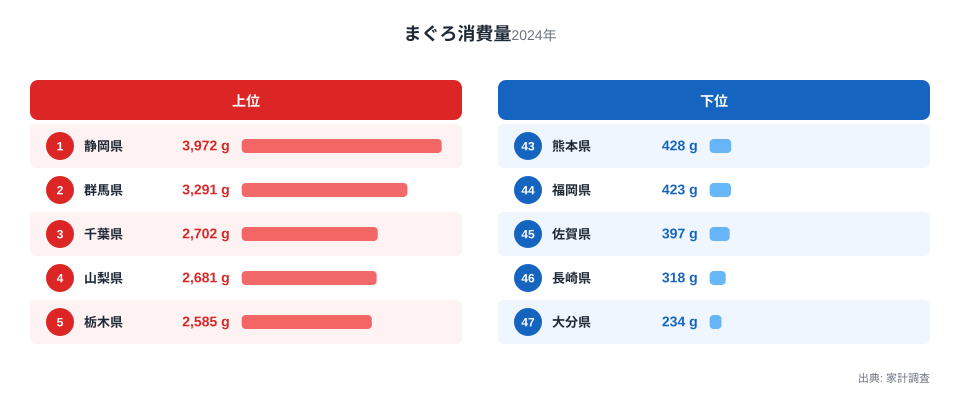
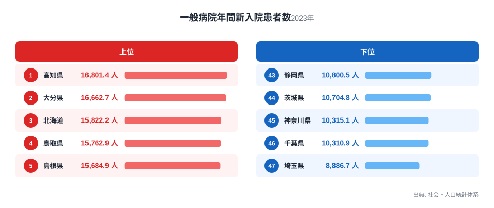

静岡県はまぐろの消費量で全国1位です。それなのに、一般病院の年間新入院患者数では下から5番目に少ない県のひとつになっています。まぐろをよく食べる県ほど入院が少ない、そんな見かけの関係が家計調査と社会・人口統計体系のデータから浮かび上がります。

この記事では、まぐろ消費量と一般病院年間新入院患者数という一見無関係な2つの指標を並べ、両者がなぜ逆方向に動いて見えるのかを掘り下げます。結論を先に言うと、この相関は健康効果を示すものではありません。まぐろの消費量と新入院患者数は、それぞれ別々の理由で県ごとに大きく異なっているだけなのです。統計を並べるだけでは見えてこない、それぞれの指標の背後にある事情を順番に確認していきます。

## まぐろ消費量ランキング

<source-link href="/ranking/tuna-consumption-quantity">まぐろ消費量ランキングをもっと見る</source-link>

家計調査によると、2024年の1世帯当たりまぐろ消費量は静岡県が3,972gで全国1位です。2位は群馬県で3,291g、3位は千葉県で2,702g、4位は山梨県で2,681g、5位は栃木県で2,585gと続きます。6位は福島県で2,583g、7位は沖縄県で2,581gです。上位に入る県には静岡県のような太平洋沿岸の県だけでなく、群馬県や山梨県、栃木県のように海に面していない内陸県も多く含まれています。

[仮説] この背景には流通面の要因がある可能性があります。静岡県は焼津港という国内有数のまぐろ水揚げ拠点を抱え、加工・卸売の集積地になっています。一方、群馬県や山梨県、栃木県、埼玉県のような関東内陸県は東京の卸売市場に近く、地元で獲れる川魚や地魚の選択肢が少ない分、流通で安定供給されるまぐろが食卓の中心を担ってきたと考えられます。この点は今回のデータだけでは確認できず、流通経路に関する追加の調査が必要です。

中位に位置する県を見ると、東京都は8位で2,364g、神奈川県は9位で2,197g、埼玉県は10位で2,160gと、いずれも東京圏の3都県が上位10県に食い込んでいます。愛知県も11位で2,109gと続き、都市部に近い県で消費量が高めに出る傾向がうかがえます。

反対に、消費量が少ない県を見ると、大分県が234gで最下位、長崎県が318gで46位、佐賀県が397gで45位、福岡県が423gで44位、熊本県が428gで43位です。いずれも九州の県で、まぐろよりもあじやさば、ぶりといった近海魚を好む食文化が根付いている地域だと考えられます。まぐろの消費量が少ないことは、魚を食べていないことを意味するわけではなく、地元で獲れる別の魚種を選んでいる結果とも読み取れます。

## 一般病院年間新入院患者数ランキング

社会・人口統計体系の2023年データによる[一般病院年間新入院患者数ランキング](/ranking/annual-new-inpatients-general-hospital-per-100k)の1位は高知県で16,801.4人、2位は大分県で16,662.7人、3位は北海道で15,822.2人です。4位は鳥取県で15,762.9人、5位は島根県で15,684.9人と、四国、九州、北海道の各県が上位に並びます。

一方、最も少ないのは埼玉県で8,886.7人、次いで千葉県が10,310.9人、神奈川県が10,315.1人、茨城県が10,704.8人、静岡県が10,800.5人と続きます。埼玉県、千葉県、神奈川県、茨城県、静岡県はいずれも東京圏かその近郊にある県です。

中位を見ると、東京都は39位で11,355人、愛知県は40位で11,133.1人、栃木県は41位で11,114.3人と、大都市圏に近い県ほど新入院患者数が少ない側に集まっています。

[仮説] この地域差は、各県の病床整備の歴史を映している可能性があります。高知県や大分県、鳥取県、島根県のような西日本や北海道の県は、全国でも人口当たりの病床数が多いとされてきた地域です。病床が多いほど患者を受け入れやすくなり、新入院患者数も増えやすくなると考えられます。反対に、埼玉県や千葉県、神奈川県のような東京圏近郊の県は、人口当たりの病床数が全国でも少ない部類に入ることで知られており、これが新入院患者数の少なさにつながっている可能性があります。実際にどちらの要因が強く効いているかは、病床数や医療計画に関する統計を別途参照しなければ確定できません。

## 散布図で見る相関、そして相関が因果ではない理由

ここまで見てきた2つのランキングを重ね合わせると、興味深いパターンが浮かび上がります。まぐろ消費量と一般病院年間新入院患者数を1つの散布図に重ねると、右下がりの傾向、つまりまぐろ消費量が多い県ほど新入院患者数が少ないという負の相関が見て取れます。静岡県、栃木県、神奈川県、千葉県、埼玉県のようにまぐろ消費量の上位に入る県は、いずれも新入院患者数では下位に集中しています。逆に大分県、長崎県、熊本県のようにまぐろ消費量が少ない県は、新入院患者数の上位に入っています。

しかし、ここまで見てきたとおり、この相関に健康上の因果関係を見出すのは早計です。まぐろ消費量を左右しているのは焼津港や卸売市場からの流通の近さである可能性があり、新入院患者数を左右しているのは各県の病床整備の歴史だと考えられます。いずれも本記事のデータだけでは確定できない[仮説]の域を出ませんが、たまたま関東近郊の県は流通面でまぐろを多く消費しやすく、同時に病床数が少なく入院しにくいという2つの独立した事情が重なり、見かけ上の負の相関が生まれていると考えられます。西日本や四国、九州の県では、その逆の組み合わせが起きているだけです。まぐろを食べれば入院しにくくなる、という読み方はできません。他の統計と組み合わせて読むことで、まぐろ消費量と新入院患者数それぞれの本当の背景が見えてきます。

## この2つの指標からわかること

- まぐろ消費量は静岡県が3,972gで全国1位、大分県が234gで最下位です
- 消費量の上位には静岡県のほか、群馬県や山梨県、栃木県のような内陸県が並んでいます
- 一般病院年間新入院患者数は高知県が16,801.4人で最も多く、埼玉県が8,886.7人で最も少ない結果です
- 新入院患者数が多い県は四国、九州、北海道に集中し、少ない県は東京圏近郊に集中しています
- 2つの指標は見かけ上の負の相関を示しますが、背景にある要因は別々であり、因果関係を示すものではありません

もっと詳しく知りたい方は、[同じカテゴリの統計一覧](/category/economy)もあわせてご覧ください。まぐろ消費量の上位に入る[静岡県のデータ](/areas/22000)や[群馬県のデータ](/areas/10000)では、それぞれの県の詳しい統計をまとめて確認できます。

> [!NOTE]
> 家計調査のまぐろ消費量は、都道府県庁所在市に住む世帯の購入量をもとに集計された値です。県内の他の地域を含めた消費実態とは異なる場合があり、県庁所在市が持つ卸売市場や小売店の立地条件が数値に強く反映されます。

> [!WARNING]
> 一般病院年間新入院患者数は、その地域の住民がどれだけ病気になりやすいかではなく、病床数や医療機関の受け入れ体制によっても大きく変動します。まぐろ消費量との負の相関を、魚を食べると入院しにくくなるという健康効果として読むのは誤りです。

> [!TIP]
> 2つの指標を見比べるときは、まぐろ消費量は流通や食文化の切り口で、新入院患者数は病床数や医療提供体制の切り口で、それぞれ別の統計とあわせて確認すると実態がつかみやすくなります。

## データ出典

まぐろ消費量は総務省統計局「家計調査」2024年のデータです。一般病院年間新入院患者数は総務省統計局「社会・人口統計体系」2023年のデータです。いずれもe-Stat経由で整備しています。
