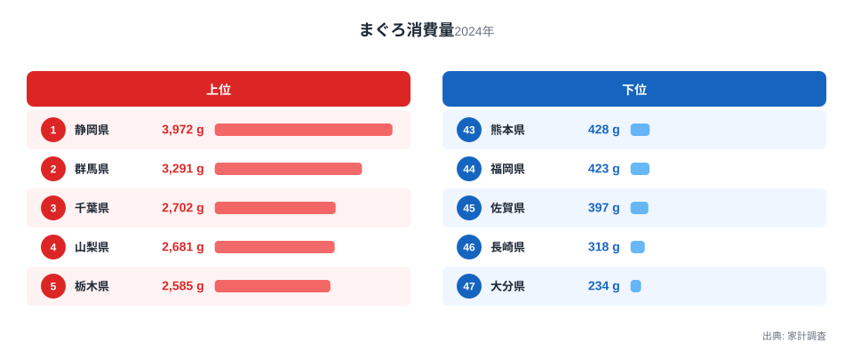
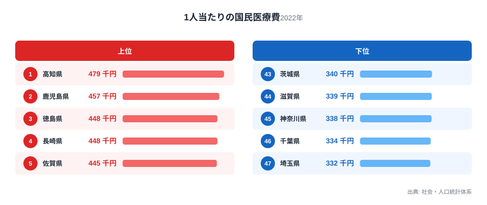

まぐろをよく食べる県は健康で医療費が少ない――そう聞くと、なんとなく納得してしまいそうです。実際に47都道府県のデータを並べてみると、まぐろ消費量が多い県ほど1人当たりの国民医療費が低い傾向がはっきり見えてきます。

ですが、この2つの数字を並べただけで「まぐろを食べれば医療費が減る」と結論づけるのは早すぎます。この記事では、まぐろ消費量が多い県・少ない県と、1人当たりの国民医療費が高い県・低い県を図で見比べたうえで、見かけの相関の裏にどんな要因が隠れているのかを考えます。

## まぐろをたくさん食べる県はどこか

<source-link href="/ranking/tuna-consumption-quantity">まぐろ消費量ランキングをもっと見る</source-link>

まぐろ消費量の全国1位は静岡県で、家計調査による1世帯あたりの購入量は3,972グラムにのぼります。2位の群馬県は3,291グラム、3位の千葉県は2,702グラムと続き、上位5県には山梨県と栃木県も入っています。静岡県は焼津や清水など遠洋まぐろ漁業の基地を抱える港町を持ち、消費地としても流通の起点になりやすい土地です。一方で群馬県や山梨県、栃木県は海に面していない内陸県でありながら上位に入っており、まぐろ消費量の多さが単純に「海に近いかどうか」だけでは説明できないことがわかります。

> [!NOTE]
> ここでいう「静岡県」「群馬県」は都道府県全体の値ではなく、家計調査が対象とする都道府県庁所在市(静岡市や前橋市など)の二人以上世帯における年間購入量(2024年)です。県内の他の市町村を含めた実際の県全体の消費傾向とは一致しない可能性がある点に注意してください。

下位に目を移すと、47位の大分県は234グラムで最も少なく、46位の長崎県が318グラム、45位の佐賀県が397グラムと続きます。長崎県や佐賀県はいずれも漁業が盛んな地域として知られていますが、まぐろの消費量では下位に沈んでいます。[仮説] 地元で獲れる魚の種類がまぐろ以外に多様であることや、家計調査が対象とする世帯の購入品目の傾向が地域ごとに異なることが影響している可能性があります。

上位と下位を見比べると、まぐろ消費量は関東甲信越から東北にかけての県で高く、九州北部から中国地方にかけての県で低い傾向がうかがえます。この地理的な偏りが、後ほど見る医療費との関係を読み解くうえでの手がかりになります。

## 1人当たりの国民医療費が高い県、低い県

1人当たりの国民医療費が最も高いのは高知県で、社会・人口統計体系によると479千円にのぼります。2位は鹿児島県の457千円、3位と4位は徳島県と長崎県がともに448千円で並び、5位は佐賀県の445千円です。上位5県は高知県・徳島県が四国、鹿児島県・長崎県・佐賀県が九州と、5県すべてが四国・九州地方に集中しており、地域的なまとまりがはっきりと見て取れます。

反対に、1人当たりの国民医療費が最も低いのは埼玉県で332千円、次いで千葉県が334千円、神奈川県が338千円、滋賀県が339千円、茨城県が340千円と続きます。下位5県のうち3県が首都圏、残る2県も大都市圏に近い県で占められており、こちらも地域的な偏りが目立ちます。

この分布だけを見ても、医療費の高低が単一の生活習慣だけで決まるものではなく、人口構成や地域経済の違いといった複数の要因が絡み合っている可能性がうかがえます。具体的にどのような要因が考えられるかは、後段で仮説として検討します。

> [!NOTE]
> まぐろ消費量は家計調査に基づく2024年の値、1人当たりの国民医療費は社会・人口統計体系に基づく2022年度の値で、調査年がそろっていません。同じ年のデータではないため、両者を厳密な同時点比較として読むことはできません。

## まぐろ消費量と医療費の関係を散布図で確認する

まぐろ消費量を横軸に、1人当たりの国民医療費を縦軸にとって47都道府県を配置すると、右下から左上にかけて緩やかに点が並ぶ様子が見えます。まぐろ消費量が多い群馬県や千葉県、山梨県、栃木県は医療費が低い側に集まり、逆にまぐろ消費量が少ない長崎県や佐賀県、大分県、熊本県、福岡県は医療費が高い側に集まっています。まぐろ消費量が少ない九州各県が、医療費の高い側にそろって並んでいる様子は、この散布図の中でもとりわけ目を引く部分です。相関係数はマイナス0.66です。

ただし、この傾向にきれいに当てはまらない県もあります。北海道はまぐろ消費量が全国21位と中位にとどまる一方で、医療費は8位と高い側に入っています。高知県のまぐろ消費量は22位で、北海道とほぼ同じ水準です。それにもかかわらず、高知県の医療費は全国で最も高くなっています。まぐろをそれなりに食べている県でも医療費が高くなる例があることは、まぐろの摂取量そのものが医療費を決めているわけではないことを示しています。

> [!WARNING]
> この散布図が示しているのはあくまで相関であり、因果関係ではありません。まぐろ消費量が多いから医療費が下がる、あるいは医療費が低いからまぐろを多く食べられる、といった一方向の関係を裏づけるデータはこの記事にはありません。両者の背景には別の共通要因が存在すると考えるほうが自然です。

## 見かけの相関の裏にある本当の理由

まぐろ消費量の多い県と医療費の低い県が重なって見える背景には、まぐろそのものよりも人口構成や地域の経済構造が関わっている可能性があります。

[仮説] 医療費が高い県には高齢者の比率が高い地域が多く含まれると考えられます。高知県や徳島県、長崎県、佐賀県、大分県は人口の減少や高齢化が進んできた地域として知られており、高齢層の割合が高いほど1人当たりの医療費も上がりやすくなります。この仮説を確かめるには、都道府県別の高齢化率のデータとあわせて検証する必要があります。

[仮説] まぐろ消費量が多い群馬県や山梨県、栃木県、埼玉県といった内陸県では、首都圏への通勤・通学圏として現役世代の比率が比較的高く保たれていることが、医療費の低さにつながっている可能性があります。あわせて、これらの県は冷凍・低温物流網によってまぐろが手に入りやすい流通環境にあることも、消費量の多さを支えていると考えられます。この点も、年齢構成や物流拠点までの距離といった別のデータで裏づける必要があります。

北海道や高知県のように、まぐろ消費量と医療費の関係が全体の傾向から外れる県があることも、単純な因果関係ではなく複数の要因が絡み合っていることの表れといえます。

> [!TIP]
> このようなデータを読み解くときは、2つの指標だけで結論を出さず、年齢構成や所得水準といった別の指標もあわせて確認するのがおすすめです。1人当たりの国民医療費ランキングでは、47都道府県すべての詳しい数値と年次推移を確認できます。

1人当たりの国民医療費についてさらに詳しく知りたい場合は、[1人当たりの国民医療費ランキング](/ranking/national-medical-expense-per-person)で全国順位や過去の推移を確認できます。まぐろ消費量や医療費と同じ経済分野の統計をまとめて見たい場合は、[同じカテゴリの統計一覧](/category/economy)も参考になります。

今回まぐろ消費量が1位だった静岡県については[静岡県のデータ](/areas/22000)、2位の群馬県については[群馬県のデータ](/areas/10000)で、それぞれの地域が持つほかの統計もあわせて確認できます。

## まとめ

- まぐろ消費量の全国1位は静岡県の3,972グラム、最も少ないのは大分県の234グラムです
- 1人当たりの国民医療費が最も高いのは高知県の479千円、最も低いのは埼玉県の332千円です
- まぐろ消費量が多い群馬県や千葉県、山梨県、栃木県は医療費が低い側に集まり、消費量が少ない九州各県は医療費が高い側に集まる傾向があります
- 北海道や高知県のように傾向から外れる県もあり、まぐろの摂取量そのものが医療費を左右しているとは言えません
- 見かけの相関の背景には、年齢構成や現役世代の比率といった地域の人口構造が関わっている可能性があります

## データ出典

- まぐろ消費量: 総務省「家計調査」(2024年)
- 1人当たりの国民医療費: 「社会・人口統計体系」(2022年度)

いずれもe-Stat経由で整備した公的統計データを用いています。
