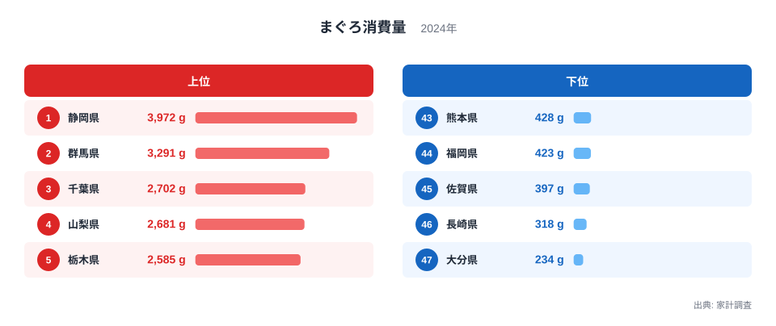
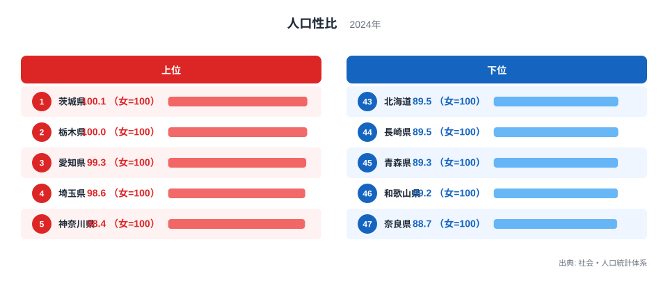
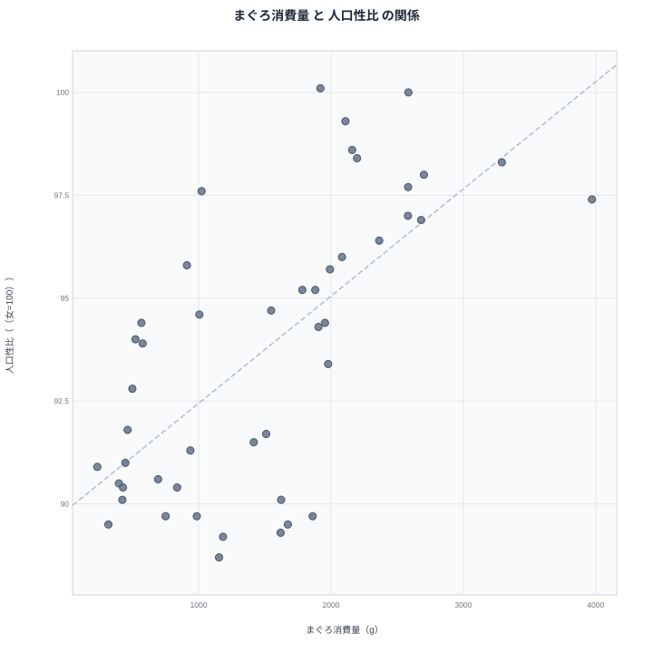

## まぐろ消費量と人口性比、47都道府県で見えた重なり

まぐろをどれだけ食べるかという食生活の指標と、人口に占める男女の割合という指標は、一見すると結びつくはずのないものです。しかし47都道府県のデータを並べてみると、まぐろ消費量が多い県ほど人口性比が高い傾向、つまり女性に対して男性の割合が高い傾向が浮かび上がります。

まぐろ消費量でもっとも多いのは静岡県で、家計調査によると年間3,972グラムを購入しています。もっとも少ないのは大分県で、234グラムにとどまります。一方の人口性比でもっとも高いのは茨城県で女性100人に対して男性100.1人、もっとも低いのは奈良県で女性100人に対して男性88.7人です。まぐろをよく食べる県と男性の割合が高い県には、どのような重なりがあるのでしょうか。

> [!NOTE]
> まぐろ消費量は家計調査による二人以上世帯の年間購入数量で、家庭での購入分を集計したものです。回転寿司や外食での消費量は含まれておらず、実際にまぐろを口にする量とは一致しない可能性があります。

## まぐろ消費量の上位と下位

<source-link href="/ranking/tuna-consumption-quantity">まぐろ消費量ランキングをもっと見る</source-link>

上位5県は次のとおりです。

- 1位 静岡県 3,972グラム
- 2位 群馬県 3,291グラム
- 3位 千葉県 2,702グラム
- 4位 山梨県 2,681グラム
- 5位 栃木県 2,585グラム

下位5県は次のとおりです。

- 43位 熊本県 428グラム
- 44位 福岡県 423グラム
- 45位 佐賀県 397グラム
- 46位 長崎県 318グラム
- 47位 大分県 234グラム

上位には静岡県、千葉県のように、まぐろの水揚げや加工が盛んな漁港を抱える県が並びます。群馬県や山梨県、栃木県が上位に入っているのは意外に見えますが、これらの県は東京の消流通市場に近く、鮮魚の入手しやすさが購入量を押し上げている可能性があります。上位5県と下位5県の差は明らかで、静岡県の3,972グラムに対して大分県は234グラムにとどまります。

下位には九州の県が集中しています。熊本県、福岡県、佐賀県、長崎県、大分県はいずれも豊富な魚種に恵まれた地域ですが、まぐろよりも別の魚介が食卓の中心になりやすく、消費量の差として表れています。

まぐろ消費量の上位5県と下位5県を見比べると、静岡県の3,972グラムから大分県の234グラムまで、地域によって購入量に大きな開きがあることが分かります。同じ2人以上世帯であっても、住んでいる県によってまぐろの購入頻度や量はこれほど異なるということです。

## 人口性比の上位と下位

上位5県は次のとおりです。

- 1位 茨城県 100.1（女=100）
- 2位 栃木県 100（女=100）
- 3位 愛知県 99.3（女=100）
- 4位 埼玉県 98.6（女=100）
- 5位 神奈川県 98.4（女=100）

下位5県は次のとおりです。

- 43位 北海道 89.5（女=100）
- 44位 長崎県 89.5（女=100）
- 45位 青森県 89.3（女=100）
- 46位 和歌山県 89.2（女=100）
- 47位 奈良県 88.7（女=100）

> [!WARNING]
> 人口性比は男女の人口構成を示すだけで、働く場や産業の性質、進学や就職による転出入など多くの要因が重なった結果です。数値が高いから何かに優れている、低いから劣っているという意味を持つものではありません。

人口性比の上位には茨城県、栃木県のように製造業の集積が進む北関東の県が並びます。工場を中心とした働き手の需要が、男性人口の割合を押し上げている可能性があります。愛知県や神奈川県が上位に入っているのも、製造業や自動車関連産業の集積と重なります。

下位には北海道、長崎県、青森県、和歌山県、奈良県が並びます。奈良県は88.7ともっとも低く、47位です。奈良県のように都市部への通勤圏に位置する県では、女性を含めた住民全体が暮らしやすい住宅地として選ばれやすく、性比が低くなる一因になっていると考えられます。

人口性比の上位5県と下位5県を比べると、茨城県の100.1に対して奈良県は88.7と、大きな開きがあります。同じ都道府県単位の集計であっても、産業構造や地理的な条件によって男女の人口構成はこれほど違うということです。

## 散布図で見る、消費量と人口性比の重なり

散布図を見ると、まぐろ消費量が多い県ほど人口性比が高い側に集まる傾向が確認できます。栃木県はまぐろ消費量で5位、人口性比でも2位と、どちらのランキングでも上位に位置しています。反対に長崎県はまぐろ消費量で46位、人口性比でも44位と、どちらのランキングでも下位に位置しています。

ただし、すべての県がこの傾向どおりに並ぶわけではありません。秋田県はまぐろ消費量が19位と全国の中では上位寄りですが、人口性比は40位と低い側に位置しており、まぐろ消費量が多くても人口性比が高くなるとは限らない例です。

> [!TIP]
> 散布図で全体の傾きに沿う県と、傾きから外れる県の両方を確認すると、単純な「AだからB」という説明では捉えきれない地域差が見えてきます。外れ値がどの県かを押さえることが、相関を読み解くうえで役立ちます。

まぐろ消費量と人口性比が重なって見える背景には、産業構造という共通の要因が考えられます。製造業や工業が集積する県では働き手として男性の転入が多くなりやすく、同時に東京の消流通市場への近さや鮮魚の入手しやすさから、まぐろの購入量も伸びやすいと推測できます。まぐろを食べることが人口性比を変えるわけではなく、男性が多いからまぐろをよく食べるようになるわけでもありません。相関が見えたとしても、それを因果関係と決めつけないことが大切です。

群馬県も両方の指標で目を引く県です。まぐろ消費量では2位と上位に入る一方、人口性比も6位と高い側に位置しています。北関東の製造業の集積と、東京に近い立地の両方が同時に効いている可能性がある県といえます。

## この2つの指標から見えてきたこと

- まぐろ消費量は静岡県が1位で3,972グラム、最下位は大分県で234グラムです。
- 人口性比は茨城県が1位で100.1、最下位は奈良県で88.7です。
- 栃木県はまぐろ消費量、人口性比のどちらでも上位に位置しています。
- 長崎県はまぐろ消費量、人口性比のどちらでも下位に位置しています。
- 秋田県のように、まぐろ消費量が多くても人口性比が低い県もあり、単純な図式では説明しきれません。

今回取り上げた2つの指標は、どちらも都道府県単位で見ると全国の中で大きな差がある統計です。散布図全体の傾向を確認したうえで、個別の県がその傾向にどれだけ沿っているか、あるいは外れているかを見比べることで、統計の重なりが持つ意味と限界の両方を押さえることができます。

まぐろ消費量については[同じカテゴリの統計一覧](/category/economy)からも他の食品との比較ができ、上位県の傾向を[静岡県のデータ](/areas/22000)や[群馬県のデータ](/areas/10000)で詳しく確認できます。人口性比のより詳細な内訳は、[人口性比ランキング](/ranking/sex-ratio-total)で確認できます。

## データ出典

- まぐろ消費量: 家計調査(2024年)
- 人口性比: 社会・人口統計体系(2024年)
