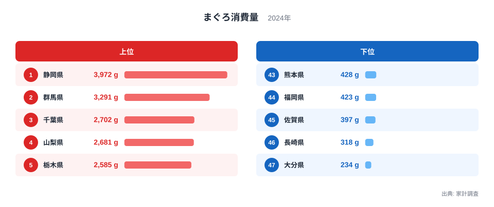
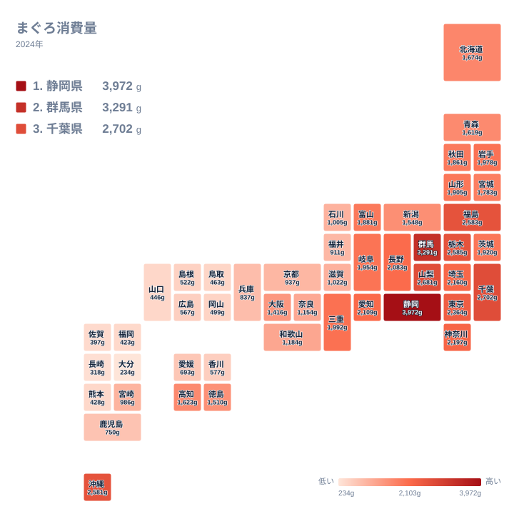
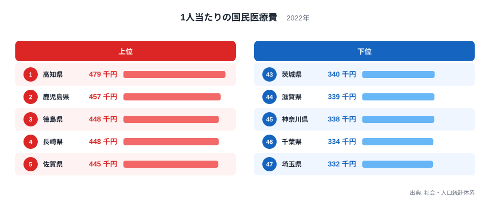
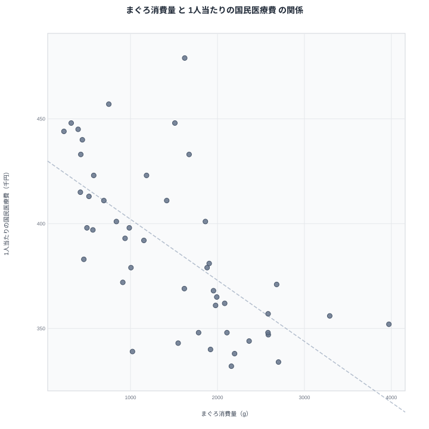

まぐろの消費量が多い県ほど、1人当たりの医療費が低い──47都道府県のデータを突き合わせると、相関係数−0.66というはっきりした負の相関が現れます。まぐろに含まれるDHAやEPAが健康に良いから、と結論づけたくなるかもしれません。

しかし先に答えを言うと、まぐろは医療費を下げていません。この相関は、統計を読むときに最も注意すべき「見かけの相関」の教科書のような例です。まぐろ消費は東日本に偏り、医療費の高さは西日本に偏ります。2つの地理的な偏りがたまたま逆向きに重なっただけなのです。

なぜそう言い切れるのか。ランキング・地図・散布図の順に、データを分解して確かめていきます。

## まぐろ消費量ランキング──上位は関東とその周辺です

1位は静岡県で3,972gです。冷凍まぐろの水揚げで知られる清水港を抱え、2位以下を700g近く引き離します。2位は群馬県で3,291g、3位は千葉県で2,702g、4位は山梨県で2,681g、5位は栃木県で2,585gと続きます。海のない群馬・山梨・栃木が上位に入るのが面白いところで、まぐろが「産地の魚」ではなく「関東の食文化」であることを物語ります。

一方の下位は九州勢が独占します。47位は大分県で234g、46位は長崎県で318g、45位は佐賀県で397g、44位は福岡県で423g、43位は熊本県で428gです。1位の静岡県と47位の大分県の差は約17倍。都道府県の食文化格差としてもかなり大きい部類です。

九州は魚を食べない地域ではありません。むしろ長崎や大分は近海の白身魚や青魚が豊富な土地です。新鮮なアジ・サバ・ブリ・タイが手に入る地域では、わざわざまぐろを買う必然性が薄いといえます。まぐろの消費格差は、魚食文化の東西の違いを映しています。あわせて見る: [静岡県の県データ](/areas/22000)

> [!NOTE]
> まぐろ消費量は家計調査に基づく二人以上世帯の年間購入量です（2024年）。家計調査の地域区分は都道府県全体ではなく県庁所在市（および政令指定都市）なので、正確には「静岡市の世帯」「大分市の世帯」の値を県の代表値として使っています。県内の他地域では傾向が異なる可能性があります。

<source-link href="/ranking/tuna-consumption-quantity">まぐろ消費量ランキングをもっと見る</source-link>

## 地図で見ると「東高西低」がひと目で分かります

地図に落とすと、まぐろ文化圏の輪郭がはっきりします。濃い色は静岡を頂点に関東・甲信・南東北へ広がり、西へ行くほど薄くなります。近畿でやや持ち直すものの、中国・四国・九州は全体に淡い色です。

例外的に目を引くのが沖縄県で、7位の2,581gと西日本では突出しています。沖縄は近海でまぐろ類が獲れる産地であり、刺身文化も本土の西日本とは系統が異なります。東西の分断の中で、産地だけが飛び地として浮かぶ構図です。

この「東のまぐろ・西の近海魚」という分布を頭に入れたうえで、次の医療費の地図を見ると、話が急に面白くなります。

## 1人当たりの国民医療費──今度は西高東低です

1人当たりの国民医療費の1位は高知県で47万9,000円です。2位は鹿児島県で45万7,000円、3位は徳島県、4位は長崎県でいずれも44万8,000円、5位は佐賀県で44万5,000円と続きます。上位は四国と九州、つまり西日本に集中しています。

下位を見ると、47位は埼玉県で33万2,000円、46位は千葉県で33万4,000円、45位は神奈川県で33万8,000円です。首都圏の3県が並び、1位の高知県との差は約1.4倍になります。

ここで気づくはずです。まぐろランキングで下位だった長崎・佐賀・大分は、医療費ランキングでは4位・5位・6位の上位県です。逆にまぐろ3位の千葉県は医療費46位。2つのランキングは、ほぼ鏡写しのように反転しています。あわせて見る: [高知県の県データ](/areas/39000)

<source-link href="/ranking/national-medical-expense-per-person">1人当たりの国民医療費ランキングをもっと見る</source-link>

## 散布図が示す負の相関──r=−0.66

2つの指標を散布図にすると、右下がりの傾向がはっきり見えます。相関係数は−0.66。右下の「まぐろを食べて医療費が低い」領域には静岡県や千葉県が、左上の「まぐろを食べず医療費が高い」領域には高知県・鹿児島県・長崎県・大分県が位置します。

ただし帯からの外れも小さくありません。高知県はまぐろ消費22位の1,623gと中位ながら医療費は1位です。沖縄県はまぐろ7位の2,581gと多いのに、医療費は39位の34万8,000円と低くなっています。相関係数−0.66は「傾向はあるが例外も多い」水準で、後で見る真因を考えるヒントがこの例外にあります。

> [!WARNING]
> 相関は因果関係を意味しません。まぐろ消費量は2024年の家計調査（県庁所在市ベース）、国民医療費は2022年度の値で、調査年も対象範囲も異なります。この2つの数字の関係から「まぐろを食べれば医療費が下がる」と読むことはできません。

## 真因を考える──まぐろは無実です

人口規模の影響を統計的に取り除いても、偏相関係数は−0.62とほとんど変わりません。「都会は人が多いから」という説明では、この相関は消えないのです。では何が効いているのでしょうか。

答えは、両方の指標がそれぞれ別の理由で「東西の軸」に沿って動いていることです。

まず医療費側。1人当たり医療費を押し上げる最大の要因は年齢構成です。高齢化が進んだ県ほど1人当たりの医療費は高くなり、高知・鹿児島・徳島・長崎はいずれも高齢化率が全国上位の県です。加えて、西日本は人口当たりの病床数が多い地域として知られ、医療供給が手厚い地域ほど受診・入院が増えて医療費が高くなる構造も指摘されています。一方の首都圏は現役世代の流入が続く「若い」地域で、1人当たり医療費は構造的に低く出ます。

次にまぐろ側。すでに見たとおり、まぐろ消費は関東を中心とする食文化であり、健康行動の指標ではありません。海なし県の群馬県が2位の3,291gに入る一方、魚食の盛んな長崎県が46位の318gに沈むのは、食べる魚の種類が違うだけです。

つまり「若い首都圏はまぐろをよく食べ、高齢化した西日本はまぐろをあまり食べない」という2つの無関係な事実が、負の相関という見かけを作っていました。散布図で外れていた沖縄県が良い証拠です。まぐろをよく食べる沖縄の医療費が低いのは、DHAのおかげではなく、全国で最も高齢化率が低い県だからと考える方が筋が通ります。

> [!TIP]
> 「AとBに相関がある」というニュースを見たら、AとBの両方に効く第三の変数（この記事では年齢構成と東西の食文化）を探すのが統計リテラシーの第一歩です。医療費の地域差をさらに掘るなら、健康寿命や病床数と合わせて見るのがおすすめです。都道府県の医療・健康データは[医療・健康のテーマページ](/themes/healthcare)にまとまっています。

まぐろと医療費の逆相関の正体は、東日本の食文化と西日本の高齢化・医療構造が偶然逆向きに重なった見かけの相関でした。強い相関係数ほど、疑ってかかる価値があります。

## データ出典

- まぐろ消費量: 総務省統計局「家計調査」（二人以上世帯・県庁所在市および政令指定都市、2024年）
- 1人当たりの国民医療費: 総務省統計局「社会・人口統計体系」（2022年度値）
- 相関係数・偏相関係数は上記2指標の47都道府県値から算出
