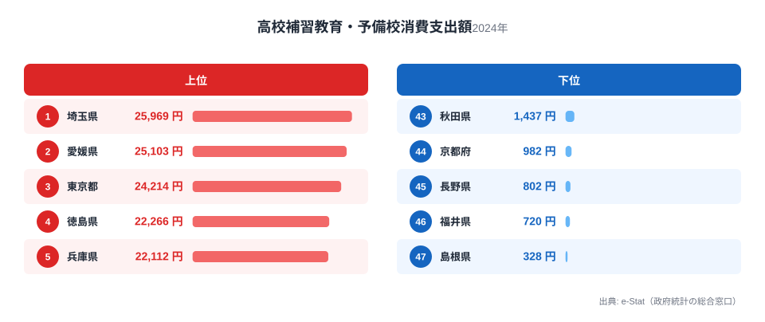
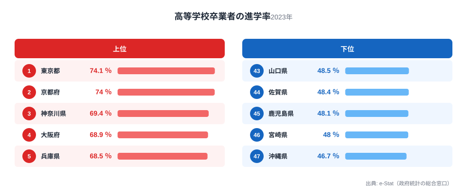
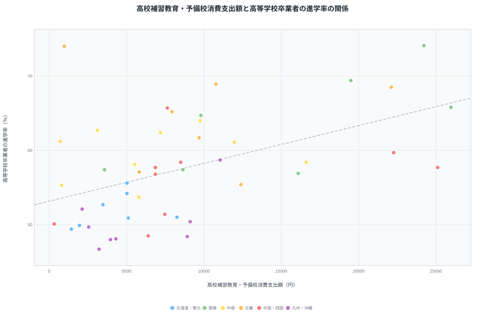

「塾にお金をかける県ほど、大学に進学できるのか」。子どもの教育費を考えるとき、多くの家庭が一度は気になる問いです。高校生の塾代（補習教育・予備校費）には1位埼玉2万5,969円から最下位島根328円まで79倍もの地域差があり、大学等への進学率にも1位東京74.1％から最下位沖縄46.7％まで1.6倍の差があります。

塾代が高い県ほど進学率も高いのか、実際にデータを重ねてみると、全体としては緩やかな正の相関が見られます。ところが、支出額で下から4番目（44位）の京都府は進学率2位という好成績を残す一方、支出額2位の愛媛県は進学率21位にとどまっています。同じ「お金をかける／かけない」でも、結果は県によってまったく違うのです。この記事では、高校生・小学生の塾代と進学率、そして「学び続ける文化」を測る指標を重ね合わせ、塾代と進学率の関係の実態と、そこから外れる県の共通点を探ります。

## 高校生の塾代ランキング — 埼玉・愛媛・東京が突出

<source-link href="/ranking/high-school-tutoring-consumption-expenditure">高校補習教育・予備校消費支出額ランキングをもっと見る</source-link>

高校生の塾代（補習教育・予備校消費支出額）は、1位埼玉県2万5,969円、2位愛媛県2万5,103円、3位東京都2万4,214円と続きます。最下位は島根県328円、下から2番目は福井県720円で、1位と最下位では79.2倍もの差になります。

> [!NOTE]
> この指標は総務省「家計調査」の県庁所在市（都道府県庁所在市）に住む二人以上世帯を対象にした平均支出額です。県内全世帯の平均ではなく、県庁所在市というひとつの都市の家計を代表値としている点に注意してください。地方の中でも都市部と郡部で塾の利用状況が大きく異なる県では、実態と数字にずれが出やすくなります。

上位に埼玉・東京という首都圏勢が並ぶのは想像しやすいところですが、2位に愛媛県が入るのは意外です。愛媛県は松山市を中心に中高一貫校や進学校への関心が高く、公立高校入試に加えて大学受験を見据えた予備校需要が県庁所在市に集中している可能性があります。一方、下位に並ぶ島根・福井・長野は、公立高校の進学実績が地域内で安定しており、私立進学校との競争環境が都市部ほど激しくないことが、塾への依存を下げている一因と考えられます。福井県は全国学力調査の常連上位県として知られますが、その評判とは裏腹に、この指標では下から2番目という結果です。

## 大学等への進学率ランキング — 東京・京都が抜きん出る

<source-link href="/ranking/high-school-advancement-rate">高等学校卒業者の進学率ランキングをもっと見る</source-link>

進学率のランキングでは、1位東京都74.1％、2位京都府74.0％、3位神奈川県69.4％と、大都市圏が上位を占めます。最下位は沖縄県46.7％、下から2番目は宮崎県48.0％で、1位と最下位の差は1.6倍です。

> [!NOTE]
> この「進学率」は正確には「高等学校卒業者の進学率」で、大学・短期大学・専門学校などへ進む割合を指します。中学から高校への進学率（全国でほぼ100％に近い水準）とは別の指標なので、混同しないよう注意してください。

上位の東京・京都・神奈川に共通するのは、県内に大学が多く、通学圏内で進学先を選べる環境が整っていることです。京都府は人口に対する大学数が全国有数で、地元進学の選択肢が豊富にあります。反対に、下位の沖縄・宮崎・鹿児島は、大学進学のために島外・県外への転出を伴うケースが多く、経済的・地理的なハードルが進学率を押し下げていると考えられます。つまり進学率の地域差は、家庭の教育投資額そのものよりも、大学へのアクセスのしやすさに強く規定されている可能性があります。すでに[「進学率トップは東京・京都｜なぜ都市部ほど高いのか」](/blog/high-school-advancement-rate)でもこの都市集中構造を詳しく扱っているので、あわせて読むと理解が深まります。

## 塾代と進学率の相関を見る — 一致する県、しない県

47都道府県のデータを塾代（x軸）と進学率（y軸）で散布図にすると、相関係数はr＝0.489でした。ゼロではなく、緩やかな正の関係があることは確かです。塾代が高い県ほど進学率も高くなる傾向が、統計的にも読み取れます。

しかし、この散布図には明確な例外が2つあります。ひとつは京都府です。高校生の塾代はわずか982円で47都道府県中44位、下から4番目という低支出でありながら、進学率は74.0％で全国2位という高成績を収めています。もうひとつは愛媛県です。塾代は2万5,103円で全国2位という高支出にもかかわらず、進学率は57.7％で21位と中位にとどまっています。塾代の高さと低さがそのまま結果に反映されるわけではないことが、この2県の対比からよくわかります。

> [!WARNING]
> 相関係数r＝0.489は「関係がある」ことを示しますが、「塾代を増やせば進学率が上がる」という因果関係を証明するものではありません。世帯所得の水準、県内の大学数・通学のしやすさ、公立高校の進学実績など、塾代と進学率の両方に影響しうる要因（交絡因子）が背後にある可能性があります。京都府の場合は大学が県内に集積していることが、愛媛県の場合は逆に大学進学に県外移動が必要なことが、塾代だけでは説明できない結果を生んでいる[仮説]と考えられますが、これを確かめるには県民所得や大学収容力のデータとの突き合わせが必要です。

塾代と進学率がどこまで連動するかを詳しく知りたい場合は、[「県民所得と教育費は無相関だった」](/blog/cc-estat-06-income-scatter)の分析もあわせて参考にしてください。所得と教育費の関係を検証した記事で、今回の京都・愛媛のような「支出と結果が一致しない」パターンを理解するヒントになります。

## 3つの教育費モデル — 東京・奈良・秋田を比べる

塾代のかけ方には、県によっていくつかのパターンがあります。ここでは、高校生の塾代・小学生（幼児・小学校）の塾代・進学率・「学び続ける文化」を示す指標を並べて、[東京都](/areas/13000)・[奈良県](/areas/29000)・[秋田県](/areas/05000)の3県を比較します。

あわせて見る: [幼児・小学校補習教育消費支出額ランキング](/ranking/elementary-tutoring-consumption-expenditure)

東京都は、高校生の塾代が2万4,214円で全国3位、幼児・小学校の塾代も1万3,538円で11位と、子どもの成長段階を通じて一貫して高水準の投資をしています。進学率は74.1％で1位、後述する「学び続ける文化」の指標でも1位です。投資額と成果がそろって高い、もっとも分かりやすいモデルといえます。

奈良県は少し違うパターンを示します。高校生の塾代は7,937円で21位と中位ですが、幼児・小学校の塾代は1万6,644円で全国5位と、就学前から小学生の時期にかなり手厚い投資をしています。その結果として、進学率は65.2％で8位という高い水準を維持しています。高校生になってから塾代を増やすのではなく、早い段階で教育に投資し、その後は抑えめにするという「早期集中型」の戦略が奈良県のデータから読み取れます。

秋田県は、高校生の塾代が1,437円で43位、幼児・小学校の塾代は1,341円で46位と、子どもの成長段階を通じて低支出が続きます。進学率も49.4％で42位と低い水準です。京都府が「低支出でも高進学率」だったのに対し、秋田県は「低支出で進学率も低め」という、同じ低投資でもまったく違う結果になっています。県によって低投資の意味が変わってくることが、この対比から見えてきます。

あわせて見る: [人文・社会・自然科学の行動者率ランキング](/ranking/study-participation-rate-academic)

「学び続ける文化」の目安として、社会生活基本調査の「人文・社会・自然科学の行動者率」（大人が学習や自己啓発として人文・社会・自然科学に関する活動をした人の割合）も見てみます。東京都は14.6％で1位、奈良県は9.4％で11位、秋田県は6.6％で45位でした。子ども時代の塾代の傾向と、大人になってからの学び続ける文化の高さは、東京・秋田の両県では同じ方向を向いていますが、これも相関であって因果ではありません。

> [!TIP]
> 幼児・小学校の塾代と高校生の塾代を比べると、家庭の教育戦略の違いが見えてきます。奈良県のように「幼少期に厚く、高校期は抑える」家庭が多い県もあれば、東京都のように「成長段階を通じて一貫して高水準」という県もあります。単年の塾代だけでなく、子どもの成長段階ごとの支出パターンを追うと、地域ごとの教育戦略の違いがより立体的に見えてきます。教育費全体の格差については[「教育費だけ格差が桁違いなのはなぜ?」](/blog/income-quintile-education)も参考になります。

## まとめ

- 高校生の塾代は1位埼玉2万5,969円・最下位島根328円で79.2倍の地域差があります
- 進学率（高等学校卒業者の進学率）は1位東京74.1％・最下位沖縄46.7％で1.6倍の差があります
- 塾代と進学率の相関係数はr＝0.489で、緩やかな正の関係はあるものの完全には一致しません
- 京都府は塾代44位（982円）でも進学率2位（74.0％）、愛媛県は塾代2位（2万5,103円）でも進学率21位（57.7％）という逆転が起きています
- 東京都は投資と成果が一貫して高水準、奈良県は幼少期に投資を集中する早期集中型、秋田県は塾代・進学率とも低水準というように、3県それぞれ異なる教育費モデルを示しています

## データ出典

- 高校補習教育・予備校消費支出額、幼児・小学校補習教育消費支出額：総務省「家計調査」（都道府県庁所在市、二人以上世帯、2024年）
- 高等学校卒業者の進学率：総務省統計局「社会・人口統計体系」（2023年度）
- 人文・社会・自然科学の行動者率：総務省統計局「社会生活基本調査」（2021年）

いずれもe-Stat（政府統計の総合窓口）経由で取得した公的統計を、都道府県別ランキングとして整備しています。散布図の相関係数は、上記2指標の都道府県コードを突き合わせて算出した参考値です。
