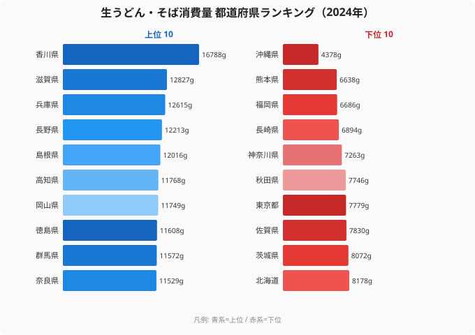

「うどん県」を名乗る香川がトップなのは、誰もが予想できる。では、博多うどんで全国に知られ、「うどん発祥の地」とも言われる福岡は何番目だろうか——。総務省「家計調査」2024年の生うどん・そば消費量（1世帯あたり年間購入量）を47都道府県で並べると、ここに大きな意外が潜んでいる。

香川県は16,788gで断然のトップ。一方で福岡県は45番目の6,686gと、47都道府県の中でほぼ最下層に位置する。うどんの名所として全国にイメージが定着している土地が、実際の家庭での購入量では下位に沈む。この逆転はなぜ起きるのか。そして上位に並ぶのは、香川以外にどんな顔ぶれなのか。

本記事では、生うどん・そば消費量の都道府県地図を読み解きながら、「西高東低」の麺食文化、内陸のそば文化圏、そして家計調査という指標そのものが抱える死角まで掘り下げていく。[生うどん・そば消費量ランキング](/ranking/fresh-udon-soba-consumption-quantity)の最新データが出発点だ。

> [!NOTE]
> 本記事の数値はすべて総務省「家計調査」における都道府県庁所在市の二人以上世帯の年間購入量（g）。生めん・乾めんを含む家庭での「購入量」であり、外食や業務用での消費は含まれない。この点が後半の「逆説」を読み解く鍵になる。

## 香川がトップ、沖縄が最も少ない——全体像

最初に全体の輪郭を押さえる。トップの香川県は16,788g、最も少ない沖縄県は4,378g。その差は約3.8倍にあたる。47都道府県の平均を実際に計算すると約9,918gで、香川はその約1.7倍を購入している計算になる。

地域別に上位を見ると、四国・近畿・甲信越・山陰・山陽・北関東と、西日本から中部にかけてが分厚い。逆に下位には九州勢が多く並び、南関東や北海道、沖縄が続く。麺食文化は、ざっくり言えば「西高東低」の傾向を示している。

ただし、これは単純な東西の二分では説明しきれない。そばの文化圏や、外食が盛んな地域の存在が、地図を複雑にしている。順位を一つずつ見ていこう。

## 上位グループ——香川を追う近畿・四国・内陸そば文化圏

トップ10は次の通り。香川を頭に、近畿（滋賀・兵庫・奈良）、四国（高知・徳島）、そして内陸の長野・島根・岡山・群馬が顔をそろえる。

<source-link href="/ranking/fresh-udon-soba-consumption-quantity">生うどん・そば消費量の全47都道府県ランキングを見る</source-link>

香川の16,788gは、2位の滋賀（12,827g）に約4,000gの差をつけており、ほかの追随を許さない突出ぶりだ。讃岐うどんが日常食として根を張り、家庭での生めん購入も多いことがうかがえる。

注目したいのは4位の長野県（12,213g）だ。「信州そば」のイメージ通り、香川とは別系統のそば文化を背景に、内陸県でありながら上位に食い込んでいる。5位の島根（12,016g）も出雲そばで知られる地域で、うどんとそば双方の文化が消費量を押し上げている。9位の群馬（11,572g）は水沢うどんなどの粉もの文化が厚い北関東の代表格だ。

> [!TIP]
> この指標は「うどん」と「そば」を合算している。そのため香川のようなうどん圏だけでなく、長野・島根のそば文化圏も上位に入りやすい。地図を見るときは「粉もの・麺食の総合力」として読むと、上位の顔ぶれが腑に落ちる。

## 「うどん本場」福岡が下位に沈む逆説

ここで本記事の核心、下位グループを見てみよう。先ほどの図の右側（下位10）が示すとおり、最も少ないのは沖縄県（4,378g）。次いで熊本県（6,638g）、福岡県（6,686g）、長崎県（6,894g）、神奈川県（7,263g）と続く。沖縄は独自のソーキそば（中華麺系）文化を持つが、家計調査の「生うどん・そば」の購入量としては突出して少ない。

ここで多くの人が引っかかるのが福岡県（45位・6,686g）だろう。博多うどんは全国区の知名度を持ち、福岡は「うどん発祥の地」を称する土地でもある。それなのに、家庭での生うどん・そば購入量では下から3番目に沈んでいる。

下位には福岡だけでなく、長崎・熊本・大分・宮崎・佐賀・鹿児島と九州勢がずらりと並ぶ。「うどん文化が薄い」のではなく、別の説明が必要そうだ。

> [!WARNING]
> 「博多うどんは有名なのに福岡が下位」という逆転は、データの定義に深く関係している。家計調査が計測するのは**家庭内での購入量のみ**で、外食・店舗での消費は一切含まれない。うどんを「外で食べる」文化が根付いた地域ほど、この指標では実際の食習慣より過小に評価される。九州が軒並み下位なのは、麺を食べないのではなく「外食で食べている」可能性が高い。

つまり福岡の下位は「うどんを食べない」ことの証明ではなく、「うどんを家庭で買わず外で食べる」という外食文化の強さの裏返しと読むのが自然だ。指標の死角を理解しないと、データは正反対の結論を導いてしまう。

## 西高東低と内陸そば——地図が示す構造

改めて全体の構造を整理する。生うどん・そば消費量の地図には、少なくとも3つの層が重なっている。

第一に、**西日本の粉もの文化圏**。香川を筆頭に近畿（滋賀・兵庫・奈良・京都・和歌山）、山陽（岡山）、四国（高知・徳島）が上位に並ぶ。うどんを日常食として家庭で煮る習慣が、購入量に直結している。

第二に、**内陸のそば文化圏**。長野・島根・群馬・山形（11位・11,453g）など、そばの名産地が上位〜中位を占める。海から遠い内陸でも、そばという別系統の麺文化が消費量を支えている。

第三に、**外食文化が強い地域での過小評価**。福岡をはじめとする九州勢、そして東京（41位・7,779g）・神奈川（43位・7,263g）といった大都市圏が下位に集まる。都市部は外食機会が多く、家庭での生めん購入が相対的に少なくなる。沖縄は独自の麺文化を持つため、この指標とはそもそも軸がずれている。

> [!NOTE]
> 「西高東低」という言葉だけで片付けると見誤る。東日本でも長野・群馬・山形のように上位に入る県があり、西日本でも福岡・熊本のように下位に沈む県がある。決め手は「東西」よりも「家庭で麺を煮るか、外で食べるか」という調理・外食習慣の差だと考えると、地図の凹凸がうまく説明できる。

粉もの文化をより広く捉えたい場合は、原料である[小麦粉消費量ランキング](/ranking/wheat-flour-consumption-quantity)も合わせて見ると、麺・粉もの文化圏の重なりが見えてくる。背景の食文化の差については[小麦粉消費量と食文化の地域差](/blog/wheat-flour-consumption-food-culture-gap)でも掘り下げている。

## データ出典

- 総務省「家計調査」（都道府県庁所在市・二人以上世帯）2024年（e-Stat 経由）

生うどん・そばの消費量は調査年や対象世帯によって変動する。本記事の数値は最新年（2024年）の家庭内購入量であり、外食・業務用を含まないため、実際の「食べる量」とは差がある点に留意してほしい。県別の詳細は[生うどん・そば消費量ランキング](/ranking/fresh-udon-soba-consumption-quantity)で確認できる。

## まとめ

- トップは香川県（16,788g）で、2位滋賀（12,827g）に約4,000gの差をつけて突出。最少は沖縄県（4,378g）で、その差は約3.8倍
- 平均（約9,918g）の約1.7倍を購入する香川を、近畿・四国の粉もの文化圏と、長野・島根など内陸のそば文化圏が追う
- 「うどん本場」福岡は45位（6,686g）と下位に沈むが、これは外食文化の強さの裏返し。家計調査は家庭内購入量しか測らないため、外食圏は過小評価される
- 地図の本質は「西高東低」ではなく「家庭で麺を煮るか、外で食べるか」の差。食文化の全体像は[小麦粉消費量ランキング](/ranking/wheat-flour-consumption-quantity)や[経済・暮らしのデータ一覧](/category/economy)、突出ぶりが気になる[香川県のプロフィール](/areas/37000)、最少の[沖縄県のプロフィール](/areas/47000)と合わせて読むと立体的に見えてくる
