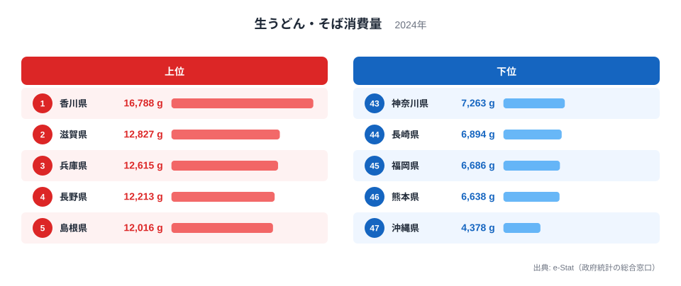
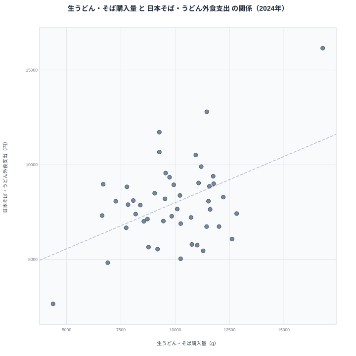

「うどん県」を名乗る香川がトップなのは、誰もが予想できます。では、博多うどんで全国に知られ、「うどん発祥の地」とも言われる福岡は何番目でしょうか——。総務省「家計調査」2024年の生うどん・そば消費量（1世帯あたり年間購入量）を47都道府県で並べると、ここに大きな意外が潜んでいます。

香川県は16,788gで断然のトップです。一方で福岡県は45番目の6,686gと、47都道府県の中でほぼ最下層に位置しています。うどんの名所として全国にイメージが定着している土地が、実際の家庭での購入量では下位に沈んでいるのです。この逆転はなぜ起きるのでしょうか。そして上位に並ぶのは、香川以外にどんな顔ぶれなのでしょうか。

本記事では、生うどん・そば消費量の都道府県地図を読み解きながら、「西高東低」の麺食文化、内陸のそば文化圏、そして家計調査という指標そのものが抱える死角まで掘り下げていきます。出発点は[生うどん・そば消費量ランキング](/ranking/fresh-udon-soba-consumption-quantity)の最新データです。

> [!NOTE]
> 本記事の数値はすべて総務省「家計調査」における都道府県庁所在市の二人以上世帯の年間購入量（g）。家庭で買う生うどん・そば（冷凍・半生を含む。乾めんは別品目）の「購入量」であり、外食や業務用での消費は含まれない。この点が後半の「逆説」を読み解く鍵になる。

## 香川がトップ、沖縄が最も少ない——全体像

最初に全体の輪郭を押さえます。トップの香川県は16,788g、最も少ない沖縄県は4,378gで、その差は約3.8倍です。47都道府県の単純平均（世帯数で重みづけしない平均）は約9,918gで、香川県はその約1.7倍を購入している計算になります。

この指標は、家計調査の品目「生うどん・そば」（冷凍・半生の麺を含む）の購入量です。乾うどん・そばは別の品目で、外食の日本そば・うどんも別に集計されます。

地域別に見ると、上位10県のうち8県は近畿・中国・四国で、残る2県は長野県と群馬県です。下位5県のうち4県は九州・沖縄（沖縄・熊本・福岡・長崎）で、残る1県が神奈川県です。ただし九州全体が少ないわけではなく、宮崎県は28位と中位です。

この図式は、東西の単純な二分では説明しきれません。本記事は、その中でもっとも説明がつきにくい福岡県の位置に絞って、家庭の購入量と外食の支出という2つの指標を並べて読みます。

## 上位グループ——香川を追う近畿・山陰・信州

トップ5は香川を頭に、近畿の滋賀・兵庫、そして長野・島根が顔をそろえます。図の左側（消費量が多い県）がこの上位グループです。

<source-link href="/ranking/fresh-udon-soba-consumption-quantity">生うどん・そば消費量の全47都道府県ランキングを見る</source-link>

香川の16,788gは、2位の滋賀の12,827gに約4,000gの差をつけており、突出ぶりが際立ちます。讃岐うどんが日常食として根を張り、家庭での生麺購入も多いことがうかがえます。

注目したいのは、12,213gで4位の長野県です。「信州そば」のイメージ通り、香川とは別系統のそば文化を背景に、内陸県でありながら上位に食い込んでいます。5位の島根は12,016gで、出雲そばで知られる山陰の県です。うどんとそばの双方の文化が購入量を押し上げている可能性があります。図には入りませんが、群馬は11,572gで9位に入っており、内陸の北関東で上位に入る県です。この指標はうどんとそばを合算しているため、どちらの麺が順位を押し上げているかは、この指標だけでは分けられません。

## 「うどん本場」福岡が下位に沈む逆説——家庭は45位、外食は12位

ここで本記事の核心、下位グループを見てみましょう。図の右側（消費量が少ない県）が示すとおり、最も少ないのは4,378gの沖縄県です。次いで熊本県が6,638g、福岡県が6,686g、長崎県が6,894g、神奈川県が7,263gと続きます。

とくに多くの人が引っかかるのは、45位で6,686gの福岡県でしょう。博多うどんは全国区の知名度を持ち、「うどん発祥の地」を称する土地でもあります。それなのに、家庭での生うどん・そばの購入量では、下から3番目です。なお、この値は福岡市の二人以上世帯のもので、福岡県全体の平均ではありません。

家計調査が測る生うどん・そばは家庭内の購入量だけで、店で食べる分は入りません。そこで、同じ家計調査の外食の項目である日本そば・うどん消費支出額を横に並べます。福岡県は外食では12位、1世帯当たり年間8,967円で、家庭の45位とは大きく食い違います。

<source-link href="/ranking/soba-udon-dining-consumption-expenditure">日本そば・うどん外食消費支出の全47都道府県ランキングを見る</source-link>

散布図は、横軸が家庭での生うどん・そばの購入量、縦軸が外食の日本そば・うどんへの支出で、点が1つの都道府県です。右上に離れて1点あるのが香川県で、生麺は16,788g、外食は16,156円と、どちらも全国1位です。左下の端にあるのが沖縄県で、4,378gと2,647円です。全体としては右上がりで、生麺を多く買う県は外食の支出も多い傾向があります。47都道府県の2024年の値から計算した相関係数は+0.46で、香川県を除くと+0.26と弱まりますが、負にはなりません。家庭で買う県ほど外食を控える、という代替の関係は全体では見られないのです。

福岡県は、この散布図で「例外的に開いた県」として読めます。横の位置が近い熊本県は6,638gで外食は7,314円、長崎県は6,894gで外食は4,822円ですが、福岡県は6,686gで外食が8,967円と、同じ家庭購入量の県より外食が高く出ています。「外食でうどんを食べる文化が強い県は、家庭の購入量が小さく見える」という説明が当てはまるのは、福岡県と、生麺41位に対して外食15位の東京都など、一部の県にとどまります。

一般則として言い切れない理由は、ほかの県の位置を見るとわかります。下位5県のうち、外食でも下位に沈むのは長崎県の46位と沖縄県の47位で、神奈川県は外食21位、熊本県は29位と中位です。逆に、山形県は生麺11位に対して外食は2位、岡山県は生麺7位に対して外食は8位と、どちらも高い県もあります。さらに、大阪府は生麺18位に対して外食は40位、兵庫県は生麺3位に対して外食は39位で、大都市圏だから外食に流れる、という図式にもなっていません。

> [!WARNING]
> 家計調査が測るのは都道府県庁所在市の二人以上世帯の支出で、観光客の飲食は入りません。「福岡県」の値も福岡市の世帯のものです。また、家庭と外食の順位が食い違うことから「福岡の人は家で麺を食べず外で食べる」と断定するのも早計です。2つの指標の関係は、原因を示すものではなく、県ごとの位置を並べて見ただけです。

## 沖縄や長崎の少なさは「別の麺」で説明できるか

下位の県には、うどん・そば以外の麺文化が根づいているという見方もあります。家計調査の分類で確かめると、沖縄そばは「中華麺」（品目 133）に入ります。[中華麺消費量ランキング](/ranking/chinese-noodles-consumption-quantity)では沖縄県は6位（9,219g）で、沖縄の生うどん・そばの少なさは、沖縄そばが別の品目に計上されていることと整合します。なお、沖縄そばの具として知られる「ソーキ」は麺ではなくトッピングの名で、麺は小麦の中華麺系です。

一方で、同じ見方は長崎県と福岡県には当てはまりません。長崎県は中華麺が41位、外食の中華そば（ラーメン・皿うどんなど、品目 391）も45位で、福岡県は中華麺が44位、外食の中華そばも40位です。ちゃんぽんやラーメンに置き換わっているとは言えず、長崎県が生麺でも外食でも低い理由は、このデータだけでは分かりません。

## 「西高東低」だけでは読めない——上位の顔ぶれ

上位10県のうち8県が近畿・中国・四国という点では、西に厚い傾向は確かです。ただし東日本にも長野県と群馬県が入り、11位の山形県は日本海側のそば産地です。内陸県は長野県と群馬県で、島根県と山形県は日本海に面しています。「内陸だから」という地理条件では、そば文化圏の上位は説明しきれません。

上位の各県がうどん圏かそば圏かを、この指標だけで割り当てることはできません。上位から下位までを通した一般的な読み方は、[生うどん・そば消費量ランキングの解説記事](/blog/fresh-udon-soba-consumption-prefecture-gap)にまとめています。

粉もの文化をより広く捉えたい場合は、原料である[小麦粉消費量ランキング](/ranking/wheat-flour-consumption-quantity)も合わせて見ると、麺・粉もの文化圏の重なりが見えてきます。背景の食文化の差については[小麦粉消費量と食文化の地域差](/blog/wheat-flour-consumption-food-culture-gap)でも掘り下げています。

## まとめ

- トップは香川県で16,788g、2位の滋賀は12,827gで約4,000gの差をつけて突出しています。最少は沖縄県で4,378gで、その差は約3.8倍です。
- 「うどん本場」福岡は家庭の生麺が6,686gで45位ですが、外食の日本そば・うどんでは12位です。家庭と外食の順位が逆転する、例外的に開いた県です。
- 47都道府県全体では、生麺の購入量と外食支出は代替ではなく、同じ県で高くなる傾向（相関係数+0.46）があります。「外食に流れるから家庭で買わない」という説明は、福岡県や東京都など一部にしか当てはまりません。
- 沖縄の少なさは沖縄そばが中華麺に分類されることと整合しますが、長崎の少なさは別の麺では説明できず、理由は不明です。
- 食文化の全体像は[小麦粉消費量ランキング](/ranking/wheat-flour-consumption-quantity)や[経済・暮らしのデータ一覧](/category/economy)、突出ぶりが気になる[香川県のプロフィール](/areas/37000)、最少の[沖縄県のプロフィール](/areas/47000)と合わせて読むと立体的に見えてきます。
