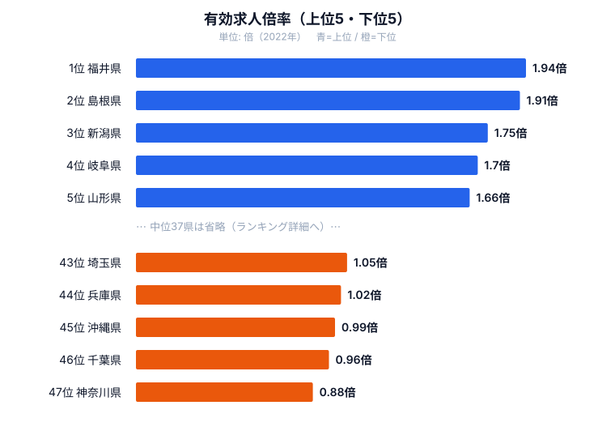
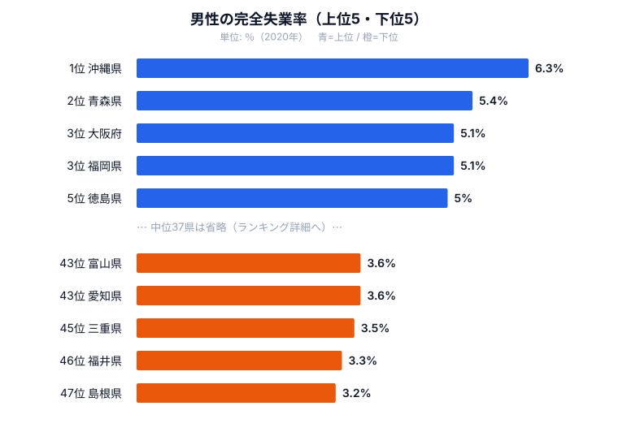

「求人が多い県は失業者が少ない」──当然に思えるこの関係は、実はすべての都道府県で成り立っているわけではありません。けれども北陸3県は、完全失業率と有効求人倍率の両方で全国トップクラスの「雇用最強」を実現しています。

なぜ福井県は有効求人倍率1.94倍（2022年・全国トップ）でありながら、完全失業率も2.9%（2020年・全国でも最も低い水準）を達成できるのでしょうか。一方でなぜ沖縄県は有効求人倍率0.99倍と完全失業率5.5%という「最弱」に陥るのでしょうか。この記事では、求人と失業の関係が産業構造で決まる仕組みを、3つの指標から読み解いていきます。

> [!NOTE]
> 完全失業率＝「仕事を探しているが就いていない人（完全失業者）÷ 労働力人口 × 100」。仕事を探していない人（非労働力人口）は含まない。2020年はコロナ禍で全国的に悪化した年であり、観光・サービス業の比率が高い地域ほど打撃が大きく出ている点に注意。

## 完全失業率は沖縄が最も高く、北陸・山陰が低い

最も高いのは沖縄県の5.5%です。観光業・サービス業への依存度が高く、コロナ禍で大きな打撃を受けました。次いで青森県・福岡県が4.6%、大阪府が4.5%、宮城県が4.3%と続きます。上位には観光や対面サービスの比重が大きい都市圏・地方圏が混在しているのが特徴です。

逆に最も低いのは島根県の2.7%でした。福井県の2.9%、富山県・三重県の3.1%、愛知県の3.3%と、北陸・山陰・東海の製造業県が下位に並びます。これらの地域は地場の製造業が安定した雇用を吸収しており、求職者が職にあぶれにくい構造を持っています。失業率の地域差は「景気」だけでなく、その土地の産業がどれだけ厚い雇用を生んでいるかに強く左右されているのです（[完全失業率ランキング](/ranking/unemployment-rate)で全国の順位を確認できます）。

製造業基盤が厚い地域ほど失業率が低いという傾向は、後で見る有効求人倍率の順位とも見事に重なります。失業率の高低は気質や努力の問題ではなく、産業構造という構造的な土台が決めていると言えます。

<source-link href="/ranking/unemployment-rate">47都道府県の完全失業率ランキングをもっと見る</source-link>

<ad-slot></ad-slot>

## 有効求人倍率は北陸・山陰が高く、首都圏が低い

有効求人倍率は「求職者1人に対して何件の求人があるか」を示す指標です。最も高いのは福井県の1.94倍で、求職者1人に約2件の求人がある状態を意味します。島根県の1.91倍、新潟県の1.75倍、岐阜県の1.7倍、山形県・長野県の1.66倍と、地方の製造業県が上位を占めます。失業率が低かった福井・島根・富山がここでも上位に並ぶのは偶然ではありません。

逆に最も低いのは神奈川県の0.88倍です。千葉県の0.96倍、沖縄県の0.99倍、兵庫県の1.02倍、埼玉県の1.05倍と、首都圏の一角と沖縄が下位に沈みます。人口が多く求職者も集中する首都圏では、1人あたりの求人が相対的に少なくなる構造的な要因があります（[有効求人倍率ランキング](/ranking/active-job-opening-ratio)で全国の順位を確認できます）。

ここで見えてくるのが「求人が厚い県＝失業者が少ない県」という関係です。福井・島根・富山は求人倍率の上位かつ失業率の下位、沖縄は求人倍率の下位かつ失業率の上位に位置しており、2つの指標が同じ方向を指しています。地場の製造業（繊維・眼鏡・機械部品など）が安定した雇用を生み続けている北陸が、雇用の両指標で「最強」になれた背景がここにあります。

一方で、神奈川・千葉のように求人倍率が低くても失業率はそこまで高くない県も存在します。これらは東京で働く人が多いベッドタウンで、地元の求人構造だけでは雇用の実態を捉えきれない例です。求人倍率は地域内の需給を映す指標であって、住民の暮らし全体を映すわけではない点には注意が必要です。

> [!TIP]
> 「求人倍率が高い＝手放しで雇用が良い」とは限らない。高い求人倍率は同時に深刻な労働力不足を示しており、北陸では「求人はあるのに応じる人がいない」状態も進んでいる。求人の厚さは経済の強さの裏返しであると同時に、人口減少と後継者問題という別の課題と表裏一体である点を読み落とさないこと。

<source-link href="/ranking/active-job-opening-ratio">有効求人倍率ランキングをもっと見る</source-link>

## 失業率には男女差がある──地方ほど開く理由

完全失業率は男女で水準が異なります。ほぼすべての都道府県で男性の失業率が女性を上回っており、全国平均では男性4.2%に対し女性3.2%と、およそ1ポイントの差があります。男性の失業率だけを見ても、最も高いのは沖縄県の6.3%、次いで青森県5.4%、大阪府・福岡県5.1%、徳島県5.0%と、失業率全体の順位とよく似た顔ぶれが並びます。男性の失業率が最も低いのは島根県の3.2%で、福井県3.3%、三重県3.5%と、ここでも製造業県が下位に来ます。

男女差に注目すると、地方ほど差が大きくなる傾向が見えます。差が最も大きいのは秋田県で、男性4.9%・女性3.0%と1.9ポイントの開きがあります。沖縄県（男性6.3%・女性4.5%で1.8ポイント）、青森県・徳島県（ともに1.7ポイント）と地方県で差が開きます。製造業や建設業など男性比率の高い産業が景気変動の影響を受けやすいことが、男性側の失業率を押し上げていると考えられます。

一方、東京都（差0.6ポイント）や愛知県（差0.6ポイント）など大都市圏では男女差が小さくなります。サービス業の多様な雇用機会が女性の就業を下支えし、産業構成が多角化していることで、男女どちらかに偏った打撃が出にくいためです。男女差の大小もまた、その地域の産業構造を映す鏡になっているのです。

> [!WARNING]
> 完全失業率は「仕事を探している人」だけをカウントする。専業主婦・育児休業者・就職をあきらめた人は「非労働力人口」として除外されるため、特に女性の雇用困難はこの指標では過小評価されやすい。女性の失業率が男性より低く見えても、それは「働きやすい」ことを必ずしも意味しない点に注意したい。

<source-link href="/ranking/unemployment-rate">完全失業率（男女別）の詳細ランキングをもっと見る</source-link>

<ad-slot></ad-slot>

## まとめ──雇用の強さは産業構造で決まる

完全失業率・有効求人倍率・男女差の3指標から、47都道府県の雇用構造を整理すると、次の点が浮かび上がります。

- 完全失業率が最も低いのは島根県（2.7%）、最も高いのは沖縄県（5.5%）でした。
- 有効求人倍率が最も高いのは福井県（1.94倍）、最も低いのは神奈川県（0.88倍）でした。
- 福井・島根・富山は「求人倍率が高く失業率も低い」雇用最強グループを形成しています。
- 男性の失業率は女性を上回り、その差は秋田県（1.9ポイント）など地方ほど大きく開きます。

北陸が「雇用最強」を実現できるのは、歴史的に積み上げられた製造業の産業基盤が安定した雇用を生み出し続けているからです。一方で観光業に依存する地域は外部ショックに弱く、2020年のコロナ禍はその脆弱性を数字として浮き彫りにしました。

失業率の地域差は「若者の意識」や「その年の景気」だけでは説明できません。産業構造・人口動態・都市構造が複雑に絡み合った構造的な問題であることが、3つの指標を重ねることで見えてきます。地域経済の土台をなす[経済カテゴリの各種ランキング](/category/economy)も合わせて見ると、雇用と産業の結びつきがより立体的に見えてくるはずです。

## データ出典

- e-Stat 社会・人口統計体系（完全失業率・有効求人倍率）
- 厚生労働省 職業安定業務統計（有効求人倍率）
- 完全失業率は2020年、有効求人倍率は2022年の都道府県別データ
