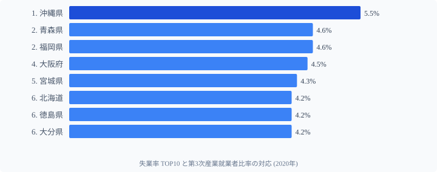

「サービス業が多い県ほど失業率が高い」──2020年データを見ると、確かにこのパターンが存在します。沖縄（第3次産業比率2位・失業率1位）、福岡（5位・2位）、北海道（6位・6位）と、リストは整合的に並びます。

しかし[東京都](/areas/13000)は**第3次産業比率が全国1位（81.1%）でありながら、完全失業率は30位（3.6%）**。法則の例外です。

なぜ東京はサービス業だらけでも失業率が低いのか。答えは「サービス業の中身」にあります。**観光・飲食・宿泊依存型**か、**IT・金融・専門サービス型**か──その違いが、コロナ禍で失業率の明暗を分けました。

## 失業率 TOP10 と第3次産業比率の対応

2020年の完全失業率 TOP10 に、同年の第3次産業就業者比率（全国順位）を並べると、下の図のような対応が見えます。1位 沖縄県（失業率5.5%・3次産業2位）を筆頭に、福岡県（4.6%・5位）・大阪府（4.5%・7位）・宮城県（4.3%・12位）・北海道（4.2%・6位）・大分県（4.2%・16位）がサービス業上位かつ高失業率。一方、青森県（4.6%）と徳島県（4.2%）は3次産業26位の中位です。

<source-link href="/ranking/unemployment-rate">完全失業率ランキング（47都道府県・2020年）</source-link>

失業率 TOP10 のうち**6県（沖縄・福岡・大阪・宮城・北海道・大分）**が第3次産業比率でも上位16位以内。特に**沖縄（3次産業2位）・福岡（5位）・北海道（6位）・大阪（7位）**はサービス業比率も全国 TOP10 に入る「サービス業依存型県」です。

例外は**青森・徳島**で、第3次産業比率は中位（26位）にもかかわらず失業率は高い。これらは別の構造要因（季節労働・人口流出）が効いていると考えられます。

> [!NOTE]
> 2020年は新型コロナウイルス感染症の拡大初年度です。このデータは「コロナ前の産業構造が、コロナ禍の失業率にどう影響したか」を示す特殊な年のスナップショットです。平常時と異なる構造が露呈した年として解釈することが重要です。

## 失業率 最下位グループと第2次産業比率の関係

逆に失業率が低い県を見ると、**製造業（第2次産業）が分厚い県**が並びます。

失業率が低い順（完全失業率・第2次産業比率の全国順位）:

- 島根県: 失業率2.7%（47位）・2次産業22.9%（26位）
- 福井県: 失業率2.9%（46位）・2次産業30.9%（6位）
- 富山県: 失業率3.1%（44位）・2次産業32.5%（1位）
- 三重県: 失業率3.1%（44位）・2次産業30.7%（7位）
- 愛知県: 失業率3.3%（41位）・2次産業31.5%（5位）
- 岐阜県: 失業率3.3%（41位）・2次産業31.9%（3位）

失業率最下位グループのうち、**島根を除く8県すべてが第2次産業比率で全国 TOP11 以内**。特に**富山（2次産業1位）・愛知（5位）・福井（6位）・三重（7位）**は製造業の雇用吸収力で支えられています。

第2次産業（製造業・建設業）は**長期雇用・正社員比率が高く**、サービス業に比べて景気変動の影響を受けにくい構造です。コロナ禍でも工場稼働は続き、雇用が維持されたことが失業率の低さに直結しました。

> [!TIP]
> **島根県だけは例外**で、第2次産業比率22.9%（26位）・第3次産業比率68.0%（21位）と両方中位ながら失業率は全国最下位。**人口流出による分母の縮小**と高齢化が背景にあると考えられます。「失業率が低い＝雇用が豊富」とは限らない点に注意が必要です。

<source-link href="/ranking/employed-people-ratio-secondary">第2次産業就業者比率ランキング</source-link>

<source-link href="/ranking/employed-people-ratio-tertiary">第3次産業就業者比率ランキング</source-link>

## 東京の逆説──サービス業1位でも失業率が低い理由

東京都の第3次産業比率は**81.1%で全国1位**。しかし完全失業率は**3.6%で30位**。なぜ法則の例外になるのか。

答えは「サービス業の中身」です。

**コロナ脆弱型サービス業（打撃を受けた業種）**:
- 観光・宿泊・飲食（沖縄・北海道に集中）
- 小売・対面サービス（営業時間制限の直撃）

**コロナ耐性型サービス業（影響が小さかった業種）**:
- IT・情報通信（リモートワークで需要増）
- 金融・保険（業務継続）
- 専門サービス（法律・会計・コンサル）

東京都のサービス業はIT・金融・専門サービスの比率が高く、沖縄・北海道の観光依存型とは業種構成が根本的に異なります。「サービス業比率」という単一の数字では捉えられない違いが、失業率の明暗を分けました。

> [!WARNING]
> 本記事は2020年（コロナ禍）データを基にしています。産業構造と失業率の関係はコロナ以外の局面では異なる可能性があります。また、失業率は求職をあきらめた「就業意欲喪失者」を含まないため、実質的な雇用の厳しさを過小評価する可能性があります。

<source-link href="/ranking/active-job-opening-ratio">有効求人倍率ランキング（雇用の地域差を別角度で見る）</source-link>

<ad-slot></ad-slot>

## まとめ

2020年の産業構造と失業率の関係から浮かび上がった構造を整理します。

- **失業率 TOP10 の6県**が第3次産業比率でも上位16位以内（沖縄・福岡・大阪・宮城・北海道・大分）
- **失業率最下位グループの8県**が第2次産業比率で全国 TOP11 以内（富山・愛知・福井・三重・岐阜・滋賀ほか）
- **東京がサービス業1位でも失業率中位**なのは、業種構成（IT・金融）の差
- 2020年データはコロナ禍で「観光依存型サービス業 = 失業脆弱性」の構造を露呈した
- 地方創生は「産業多様化」と「コロナ耐性のある業種の誘致」が鍵

産業構造は失業率の「設計図」です。どの業種に雇用が集まっているかを知ることで、その地域の雇用の安定性が見えてきます。

なお、ここで示した関係は**2020年コロナ禍という特殊年の構造が露呈したスナップショット**だ。平常時にも観光依存型と製造業型の失業率差が同程度に現れるかは別途検証が必要であり、恒常的な法則として断定することはできない。

## データ出典

- 総務省統計局「労働力調査」(2020年・都道府県別完全失業率)
- 総務省統計局「国勢調査」(2020年・第2次/第3次産業就業者比率)
- e-Stat 経由で整備

本記事の対象データ: [関連カテゴリ](/category/laborwage)・[福井県](/areas/18000)
