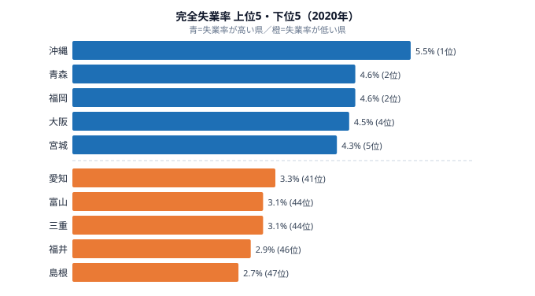
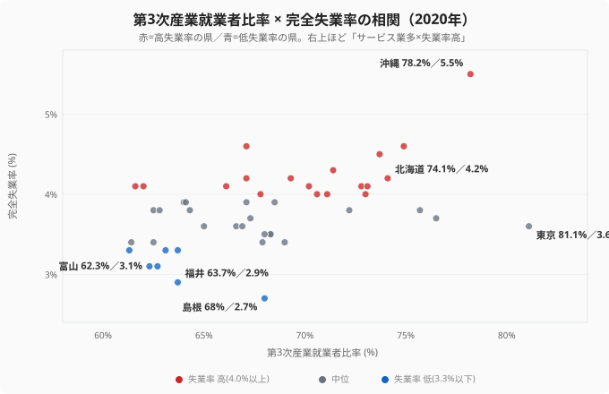

「サービス業が多い県ほど失業率が高い」──2020年のデータを見ると、確かにこのパターンが存在します。沖縄（第3次産業比率が上位・失業率も上位）、福岡、北海道と、リストは整合的に並びます。

しかし[東京都](/areas/13000)は、第3次産業比率が全国トップでありながら、完全失業率は3.6%にとどまり全国の中位です。これは法則の明確な例外といえます。

なぜ東京はサービス業だらけでも失業率が低いのでしょうか。答えは「サービス業の中身」にあります。**観光・飲食・宿泊依存型**なのか、**IT・金融・専門サービス型**なのか──その違いが、コロナ禍で失業率の明暗を分けたのです。本記事では、失業率の上位・下位の顔ぶれと産業構造を突き合わせ、「サービス業比率」という単一の数字では見えない真因を検証します。

## 失業率が高い県と、第3次産業比率の対応

まず全体像を確認します。2020年の完全失業率は、最も高い沖縄県の5.5%から、最も低い島根県の2.7%まで、約2.0倍の開きがあります。下の図は、失業率の上位5県と下位5県を1枚に並べたものです。

<source-link href="/ranking/unemployment-rate">完全失業率ランキング（47都道府県・2020年）をもっと見る</source-link>

上位グループの顔ぶれを見てください。[沖縄県](/areas/47000)（5.5%）を筆頭に、福岡県（4.6%）、大阪府（4.5%）、宮城県（4.3%）、北海道（4.2%）、大分県（4.2%）が並びます。このうち沖縄（第3次産業就業者比率78.2%）、北海道（74.1%）、福岡（74.9%）、大阪（73.7%）は、サービス業の就業者比率でも全国トップクラスに入る「サービス業依存型」の県です。いずれも第3次産業比率では上位10県に入ります。観光・宿泊・飲食・小売といった対面サービスが地域経済を支えている地域では、コロナ禍の営業時間制限や移動自粛が雇用を直撃しました。失業率が高くなったのは、サービス業に雇用が集中していたためだと読み取れます。

一方で、同じ上位グループでも青森県（4.6%・第3次産業比率67.1%）と徳島県（4.2%・同67.1%）は、サービス業比率としては全国でほぼ中位の県です。これらはサービス業比率では説明できず、季節労働の比重や人口流出といった別の構造要因が効いている可能性があります。つまり「失業率が高い＝サービス業が多い」とは一概にいえず、同じ高失業率でも背景は一様ではないのです。サービス業比率と失業率の関係は、相関としては見えても、すべてを説明する因果ではない点に注意が必要です。

## サービス業比率と失業率の相関を散布図で見る

ここで、各県の第3次産業就業者比率（横軸）と完全失業率（縦軸）を1枚の散布図に並べてみます。点が右上がりに分布していれば「サービス業が多い県ほど失業率が高い」という見かけの相関が成り立ちます。

確かに全体としては、ゆるやかな右上がりの傾向が読み取れます。サービス業比率が全国上位の沖縄（78.2%）は失業率も最も高く（5.5%）、図の右上にぽつんと浮かびます。逆に第2次産業が分厚い富山は、第3次産業比率が62.3%と全国でも低い水準で、失業率も3.1%と低いため、図の左下に位置します。この2県だけを見れば、相関は明快です。

しかし図の右下に、傾向から大きく外れた1点があります。[東京都](/areas/13000)です。第3次産業就業者比率は81.1%で**47都道府県で最も高く**、つまり横軸では最も右に位置するにもかかわらず、失業率は3.6%と図の下方、全国の中位（30位）にとどまります。沖縄と同じ「サービス業だらけ」の右端にいながら、失業率の高さがまったく違うのです。この東京の外れ値こそ、本記事の核心です。

<source-link href="/ranking/employed-people-ratio-tertiary">第3次産業就業者比率ランキング（47都道府県）をもっと見る</source-link>

> [!WARNING]
> 散布図に右上がりの傾向が見えても、それは「相関」であって「因果」ではありません。第3次産業比率が失業率を直接押し上げているのか、それとも両者の背後に別の要因（観光依存・人口動態など）があるのかは、図だけでは判別できません。実際、後述するように東京のような明確な外れ値が存在する以上、「サービス業比率が高いと失業率が上がる」という単純な因果則は成立しないのです。

> [!NOTE]
> 完全失業率は「働く意思があり求職しているのに仕事に就けていない人」の割合です。求職そのものをあきらめた「就業意欲喪失者」は分母にも分子にも入りません。そのため、雇用環境が厳しく求職を断念する人が多い地域では、失業率が実態より低く見える場合があります。数字が低い＝雇用が豊か、とは限らないのです。

## 失業率が低い県と、第2次産業比率の関係

次に失業率が低い下位グループを見ると、別の産業構造が浮かび上がります。図の橙色のバー、島根県（2.7%）・福井県（2.9%）・富山県（3.1%）・三重県（3.1%）・愛知県（3.3%）です。これらは**製造業を中心とする第2次産業が分厚い県**が多くを占めます。

製造業や建設業といった第2次産業は、サービス業に比べて長期雇用・正社員比率が高く、景気変動の影響を受けにくい構造を持っています。コロナ禍でも工場の稼働は続き、サプライチェーンを支える雇用が維持されました。富山（第2次産業就業者比率32.5%で47都道府県のトップ）、愛知（31.5%）、福井（30.9%）、三重（30.7%）は第2次産業比率が全国でもとりわけ高い県で、いずれも上位10県に入ります。これらの県は、製造業の雇用吸収力がそのまま失業率の低さに直結したと考えられます。観光客が減っても、ものづくりの現場の仕事は止まらなかったのです。

ただし、下位グループのすべてが製造業で説明できるわけではありません。とくに島根県は、第2次産業も第3次産業も全国の中位にとどまりながら、失業率は全国で最も低い県です。製造業の厚さでは説明がつかないため、別の要因を疑う必要があります。

> [!TIP]
> 失業率の地域差を読むときは、有効求人倍率と合わせて見ると解像度が上がります。失業率は「仕事に就けていない人の割合」を、有効求人倍率は「求職者1人あたりの求人数」を測る指標で、視点が逆向きです。両方を並べると、その地域の雇用が「求人が少なくて厳しい」のか「求人はあるが人手が足りない」のかを区別できます。

<source-link href="/ranking/active-job-opening-ratio">有効求人倍率ランキングをもっと見る</source-link>

## なぜ島根の失業率は最も低いのか

[島根県](/areas/32000)の失業率が全国で最も低い背景には、産業構造だけでは説明できない事情があります。人口流出と高齢化です。

若年層が県外へ流出し続けると、求職活動をする労働力人口そのものが縮小します。失業率は「労働力人口に占める失業者の割合」なので、分母である労働力人口が小さくなると、見かけ上の失業率は下がります。つまり島根の低い失業率は、「雇用が豊富で誰もが働けている」ことを必ずしも意味しません。働き盛りの世代が都市部へ移ってしまった結果として、残った人々の中で求職中の人が相対的に少なくなっている側面があるのです。

このように、失業率は産業構造（どの業種に雇用が集まっているか）と人口動態（労働力人口がどう変化しているか）の両方によって決まります。サービス業型・製造業型という産業の軸だけでなく、人口が増えているのか減っているのかという軸も合わせて見ないと、数字を読み違えます。

> [!WARNING]
> 本記事の数値は2020年、新型コロナウイルス感染症の拡大初年度のものです。この年は「コロナ前の産業構造が、コロナ禍の雇用にどう影響したか」が露呈した特殊なスナップショットであり、平常時とは異なる構造が表面化しています。観光依存型と製造業型の失業率差が、コロナ以外の局面でも同程度に現れるとは限らない点に注意してください。

## 東京の逆説──サービス業トップでも失業率が低い理由

ここで冒頭の問いに戻ります。東京都の第3次産業比率は全国トップですが、完全失業率は3.6%で全国の中位です。サービス業依存型の沖縄や福岡が高失業率になったのに、なぜ東京は同じ轍を踏まなかったのでしょうか。

鍵は、繰り返しになりますが「サービス業の中身」です。ひとくちにサービス業といっても、コロナ禍での明暗は業種によって大きく分かれました。

**コロナ脆弱型のサービス業**は、観光・宿泊・飲食、そして対面の小売です。営業時間の制限と移動自粛の直撃を受け、雇用が大きく揺らぎました。これらの比重が高い沖縄・北海道で失業率が上がったのは、この打撃が直接の原因です。

**コロナ耐性型のサービス業**は、IT・情報通信、金融・保険、法律・会計・コンサルといった専門サービスです。リモートワークへの移行でむしろ需要が増えた業種もあり、業務は継続しました。東京都のサービス業はこの耐性型の比率が高く、観光依存型の地域とは業種構成が根本的に異なります。だからこそ、サービス業比率という一つの数字が同じ「上位」でも、失業率の結果が正反対になったのです。

この事実は、「サービス業比率」という見かけの相関の裏に、「どんなサービス業か」という真因が隠れていることを示しています。産業を第2次・第3次という大きな区分でしか見ていないと、東京の例外は永遠に説明できません。

<ad-slot></ad-slot>

## まとめ

2020年の産業構造と失業率の関係から見えてきた構造を整理します。

- 失業率の上位グループには、サービス業依存型の沖縄・福岡・北海道・大阪が並び、コロナ禍の対面サービスへの打撃を反映している
- 失業率の下位グループには、製造業の分厚い富山・愛知・福井・三重が並び、第2次産業の雇用吸収力が失業率の低さを支えている
- 全国で最も失業率が低い島根は、製造業の厚さではなく人口流出による労働力人口の縮小が背景にある
- 東京がサービス業トップでも失業率が中位なのは、IT・金融・専門サービスというコロナ耐性型の業種構成によるもので、「サービス業比率」だけでは説明できない
- 失業率は産業構造と人口動態の両方が設計する数字であり、業種の質まで踏み込まないと地域の雇用の実像は見えてこない

ここで示した関係は、2020年というコロナ禍の特殊な年に構造が露呈したスナップショットです。平常時にも観光依存型と製造業型の失業率差が同程度に現れるかは別途検証が必要であり、恒常的な法則として断定はできません。それでも、産業構造が失業率の「設計図」であり、どの業種に雇用が集まっているかでその地域の雇用の安定性が変わる、という見方は、地域経済を読むうえで有効な視点です。賃金や雇用に関わる他の指標は[労働・賃金カテゴリ](/category/laborwage)からたどれます。

## データ出典

- 総務省統計局「労働力調査」(2020年・都道府県別完全失業率)
- 総務省統計局「国勢調査」(2020年・第2次/第3次産業就業者比率)
- 業種別の雇用変動（宿泊・飲食サービス業の雇用が大きく減少し、情報通信業は維持された等）は総務省統計局「労働力調査（2020年・産業別就業者数）」の動向にもとづく
- e-Stat 経由で整備
