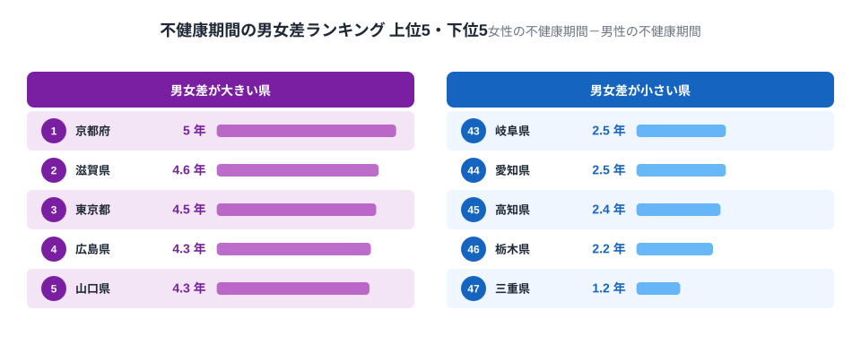
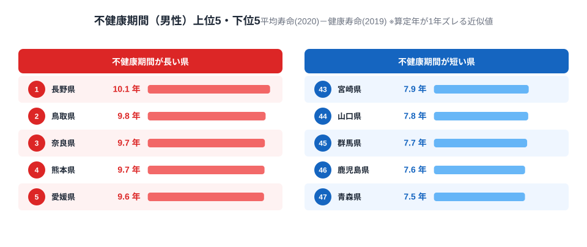
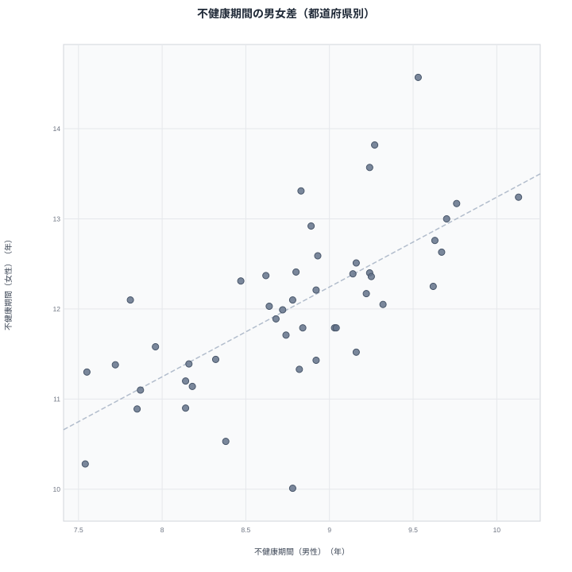

「健康寿命は男女で異なる顔」という記事では、健康寿命そのものの都道府県差が**女性は男性の約1.7倍**だと分かりました。では、そこに平均寿命を重ね合わせた「不健康期間」（平均寿命－健康寿命）で見ると、男女の差は都道府県ごとにどう変わるのでしょうか。

47都道府県で不健康期間の男女差（女性の不健康期間－男性の不健康期間）を算出すると、**最大は京都府の5.04年、最小は三重県の1.23年で、実に4.1倍の開き**があります。しかも上位には近畿・関東の都市圏が集中し、下位には東海4県（静岡・岐阜・愛知・三重）が固まるという、健康寿命単体のランキングだけでは見えなかった地域パターンが浮かび上がります。

さらに、長野県は平均寿命・健康寿命がともに全国上位でありながら不健康期間そのものは男性で全国最長、逆に平均寿命が最下位の青森県は不健康期間が男性で全国最短という逆説も見つかりました。「長生きする県ほど不健康期間も長い」という単純な図式は成り立ちません。

> [!NOTE]
> 健康寿命そのものの男女差ランキング（男性1位大分県・女性1位三重県、女性の地域差は男性の約1.7倍）は「[健康寿命は男女で異なる顔](/blog/healthy-life-expectancy-male-female-gap)」で扱いました。本記事はそこに[平均寿命](/ranking/life-expectancy-0-male)を掛け合わせた「不健康期間」という算出指標を使い、**都道府県ごとの男女差の大きさそのもの**をランキング化して地域パターンを掘り下げる続編です。「不健康期間」は平均寿命（0歳時点の平均余命、2020年度・完全生命表）から[健康寿命](/ranking/healthy-life-expectancy-male)（2019年度・国民生活基礎調査を基に算定）を引いた近似値で、算定年が1年ズレる点に注意してください。

## 不健康期間の男女差ランキング──1位京都府5.04年、47位三重県1.23年

<source-link href="/ranking/healthy-life-expectancy-female">健康寿命（女性）ランキングをもっと見る</source-link>

あわせて見る: [健康寿命（男性）ランキング](/ranking/healthy-life-expectancy-male)

不健康期間の男女差（女性の不健康期間－男性の不健康期間）が最も大きいのは**1位[京都府](/areas/26000)の5.04年**で、2位滋賀県4.55年、3位東京都4.48年、4位広島県4.33年、5位山口県4.29年と続きます。全国平均は3.24年なので、京都府はほぼ1.6年分上振れしていることになります。京都府は健康寿命そのものでは女性が47位（最下位）である一方、平均寿命は88.25年（女性3位）と高水準にあるため、両者の差である不健康期間の男女差が全国最大に膨らんでいます。

逆に**最も差が小さいのは47位[三重県](/areas/24000)の1.23年**で、46位栃木県2.15年、45位高知県2.36年、44位愛知県・岐阜県2.51年と続きます。三重県は健康寿命が女性全国1位（77.58年）で、男性も27位と中位以上を保っているため、平均寿命を重ねても男女の差が小さいまま収まっています。健康寿命の男女差ランキング（既存記事）だけを見ていては分からない、「平均寿命まで含めた不健康期間ベースでは差が縮む県」がある、という発見です。

<source-link href="/ranking/life-expectancy-0-female">平均寿命（女性）ランキングをもっと見る</source-link>

## 男女差が大きい県・小さい県の地域パターン──近畿・関東 vs 東海4県

男女差が大きい上位10県の内訳を地方別に見ると、**近畿3県（京都・滋賀・大阪）、九州3県（佐賀・沖縄・鹿児島）、関東2県（東京・神奈川）、中国2県（広島・山口）**に集中しています。近畿・関東という大都市圏が上位に多く入っているのが特徴で、都市部では男性より女性の方が「長生きするが不健康な期間も相対的に長くなる」傾向が強いことがうかがえます。

一方、男女差が小さい下位10県では**東海地方の4県（静岡・岐阜・愛知・三重）**がまとまって入っており、地域としての偏りが最も明瞭です。東海地方は健康寿命そのもののランキングでは男女とも突出した順位ではありませんが、平均寿命と健康寿命の伸びが男女でほぼ同じペースで進んでいるため、不健康期間の男女差が全国的に小さく抑えられています。健康寿命単体のランキングでは見えない「男女差の縮まり方」という新しい軸が、不健康期間という算出指標によって初めて可視化されました。

> [!WARNING]
> 健康寿命は「あなたは現在、健康上の問題で日常生活に何か影響がありますか」という国民生活基礎調査の主観的な自己申告をもとに算定されています。客観的な疾病データではないため、都道府県ごとの回答傾向（健康に対する感じ方や申告の控えめさなど）の違いが順位に影響している可能性があります。男女差の大きさを、そのまま「その県の医療の質の男女格差」と直結させて読むのは早計です。近畿・関東で差が大きい傾向は相関であって因果関係ではありません。

## 発見──長野は「長寿なのに不健康期間ワースト」、青森は逆

<source-link href="/ranking/life-expectancy-0-male">平均寿命（男性）ランキングをもっと見る</source-link>

男性の不健康期間だけを見ると、**1位は[長野県](/areas/20000)の10.13年**で全国最長です。長野県は平均寿命・健康寿命ともに全国トップクラスの常連県ですが、健康寿命の伸びが平均寿命の伸びに追いついていないため、不健康期間そのものは全国最長という一見矛盾した結果になっています。

逆に**47位は[青森県](/areas/02000)の7.54年**で全国最短です。青森県は平均寿命が男性79.27年で全国最下位という記録を持つ県ですが、不健康期間は全国で最も短くなっています。短命であることと不健康期間が短いことは別軸の現象で、青森県の場合は「健康寿命が延びていない代わりに平均寿命も延びていない」ため、両者の差そのものが縮まっているという構造です。健康寿命の順位だけを見ていては、この「長寿ゆえに不健康期間も長くなる」「短命ゆえに不健康期間も短くなる」という平均寿命とのクロスの構造は見えてきません。

> [!TIP]
> 「平均寿命が長い県ほど不健康期間も長い」と単純に読むのは誤りです。長野県は平均寿命・健康寿命ともに上位ですが不健康期間は男性で全国最長、逆に青森県は平均寿命が最下位でも不健康期間は男性で全国最短でした。不健康期間の長さは「どれだけ長生きするか」ではなく「健康寿命の伸びが平均寿命の伸びに追いついているか」で決まる、という視点でランキングを読むと構造が見えてきます。

## 男女の不健康期間には中程度の相関

47都道府県で男性の不健康期間と女性の不健康期間の関係をプロットすると、**ピアソン相関係数はr=0.685**と中程度の正の相関が見られます。図の対角線に近い県ほど男女差が小さく（三重・栃木など）、対角線から大きく上に離れた県ほど男女差が大きい（京都・滋賀など）ことが視覚的に確認できます。相関があること自体は「県ごとの医療・介護アクセスや生活習慣支援が性別を問わず影響している」ことを示唆しますが、京都府・滋賀県のように女性だけ突出して不健康期間が長い県が一定数存在する点が、今回の男女差ランキングで初めて定量化できた部分です。

> [!NOTE]
> 女性の不健康期間が男性より長い背景には、骨粗しょう症や変形性関節症、認知症など、日常生活に制限をもたらす疾患の有病率が女性で高い傾向にあることが一因として考えられます。**[仮説]** ただしこの記事のデータだけでは疾患別の内訳までは検証できません。厚生労働省の患者調査など疾患別データとの突き合わせが今後の検証課題です。

## まとめ

- 不健康期間の男女差は**1位[京都府](/areas/26000)5.04年**、**47位[三重県](/areas/24000)1.23年**で4.1倍の開き
- 男女差が大きい上位10県は近畿3・九州3・関東2・中国2に集中、小さい下位10県は東海4県（静岡・岐阜・愛知・三重）がまとまる
- 男性の不健康期間は[長野県](/areas/20000)が10.13年で最長、[青森県](/areas/02000)が7.54年で最短という、平均寿命ランキングとは逆転した結果
- 男女の不健康期間には中程度の相関（r=0.685）があるが、京都・滋賀は相関から外れて女性だけ突出する
- 健康寿命そのものの男女差（既存記事）だけでなく、平均寿命を重ねた不健康期間で見ることで「都市圏で差が広がり東海で差が縮む」という地域構造が新たに見えてくる

## データ出典

不健康期間は、厚生労働省が3年ごとに算定する[健康寿命](/ranking/healthy-life-expectancy-male)（2019年度、社会・人口統計体系「日常生活に制限のない期間の平均」）と、完全生命表・都道府県別生命表に基づく[平均寿命](/ranking/life-expectancy-0-male)（2020年度）の差として、本記事が独自に算出したものです。総務省統計局「社会・人口統計体系」経由でe-Stat上に整備されたデータを利用しています。健康寿命そのものの男女差ランキングは「[健康寿命は男女で異なる顔](/blog/healthy-life-expectancy-male-female-gap)」、寿命の推移や医師数との関係は「[寿命は延びたが不健康期間も延びた](/blog/health-life-expectancy-structure)」をあわせてご覧ください。
