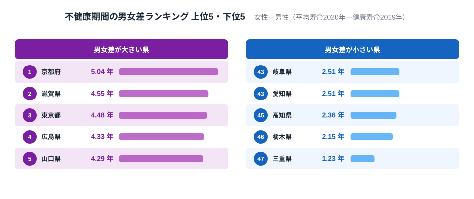
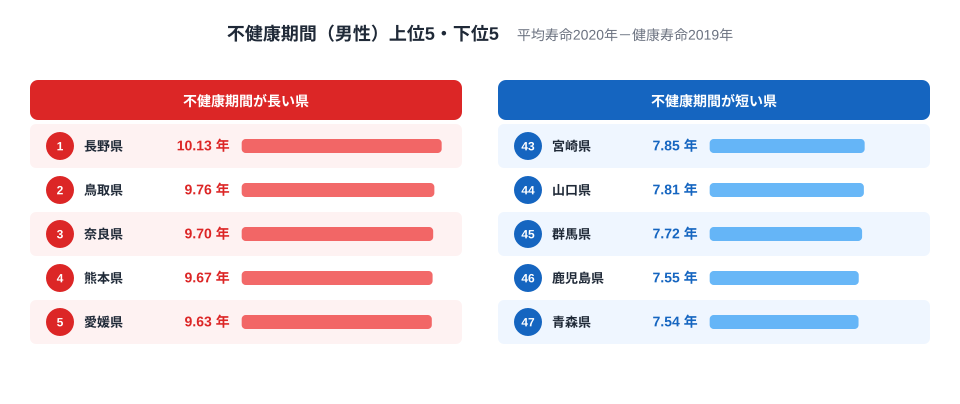
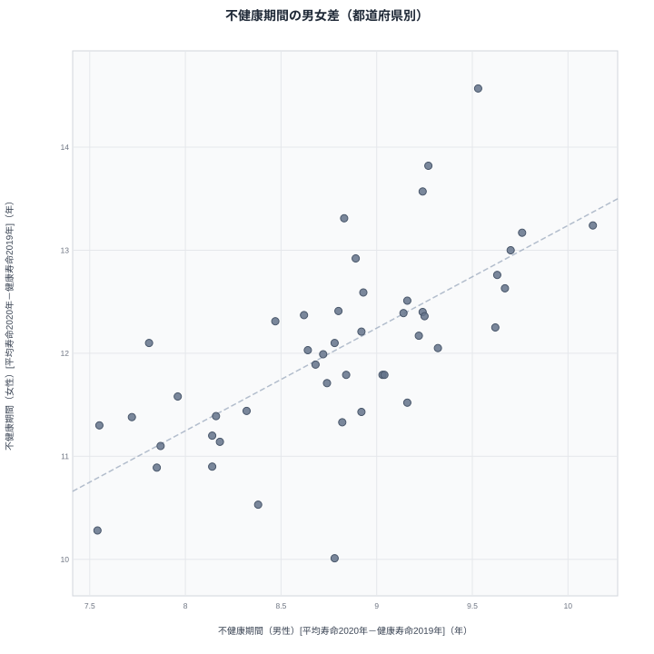

[男女別の健康寿命の記事](/blog/healthy-life-expectancy-male-female-gap)では、健康寿命そのものの都道府県差を男女で比べました。この記事で使う2019年値では、都道府県間の開きは女性が3.90年、男性が2.33年で、女性は男性の約1.7倍です。では、そこに平均寿命を重ね合わせた「不健康期間」（平均寿命－健康寿命）で見ると、男女の差は都道府県ごとにどう変わるのでしょうか。

47都道府県で不健康期間の男女差（女性の不健康期間－男性の不健康期間）を算出すると、**最大は京都府の5.04年、最小は三重県の1.23年で、実に4.1倍の開き**があります。47都道府県すべてで女性の不健康期間のほうが男性より長いものの、その差は県によって大きく違います。差の大きさと、入力に使った4つの値の中で最も強く連動していたのは、平均寿命ではなく**女性の健康寿命**でした。2019年値で女性の健康寿命が全国最下位の京都府で差が最大になり、全国1位の三重県で差が最小になります。ただし女性の健康寿命は男女差の算式にそのまま含まれる値なので、連動が強く出やすい点には注意が必要です。

男性だけを見ると、不健康期間が最も長いのは長野県の10.13年、最も短いのは青森県の7.54年です。長野県は平均寿命が全国2位なのに健康寿命が30位にとどまり、青森県は平均寿命が全国最下位で健康寿命も42位と低いため、二つの差が小さく収まっています。平均寿命の順位だけでも健康寿命の順位だけでも読み切れず、両方の順位を並べて初めて構造が見えてきます。

## 不健康期間の男女差ランキング──1位京都府5.04年、47位三重県1.23年

<source-link href="/ranking/healthy-life-expectancy-female">健康寿命（女性）ランキングをもっと見る</source-link>

あわせて見る: [健康寿命（男性）ランキング](/ranking/healthy-life-expectancy-male) / [平均寿命（女性）ランキング](/ranking/life-expectancy-0-female)

不健康期間の男女差が最も大きいのは**1位の[京都府](/areas/26000)で5.04年**で、2位滋賀県4.55年、3位東京都4.48年、4位広島県4.33年、5位山口県4.29年と続きます。47都道府県の単純平均は3.24年なので、京都府は平均を約1.8年上回ります。図の値は、健康寿命が2019年、平均寿命が2020年の組み合わせで計算しています。なお図は同じ値の県を同順位で表示しますが、本文ではランキングデータの通し順位で書くため、同じ値の県も順に数えています。

京都府は2019年の健康寿命で女性が全国47位の73.68年である一方、平均寿命（0歳時点の平均余命）は女性が88.25年で3位です。寿命は長いのに日常生活に制限なく過ごせる期間が短いため、女性の不健康期間は14.57年と47都道府県で最長になり、男性の9.53年との差が全国最大になります。滋賀県も女性の平均寿命は2位、健康寿命は46位で、同じ型の県です。

逆に**最も差が小さいのは47位の[三重県](/areas/24000)で1.23年**です。46位栃木県2.15年、45位高知県2.36年と続き、43位の岐阜県と44位の愛知県はどちらも2.51年で並び、図ではこの2県が同じ順位で表示されています。三重県は女性の健康寿命が77.58年で全国1位ですが、女性の平均寿命は24位にとどまります。平均寿命に比べて健康寿命が高いので、女性の不健康期間は10.01年と全国で最も短く、男性の8.78年との差が1.23年まで縮みます。

健康寿命だけの男女差（女性の健康寿命－男性の健康寿命）を同じ2019年値で求めると、順位は逆さになります。京都府は0.97年、滋賀県は0.98年で、47都道府県の中で最も小さい二つです。ところが平均寿命を重ねた不健康期間の男女差では、この二府県が1位と2位になります。反対に三重県は健康寿命の男女差が4.68年で、高知県の4.69年に次ぐ大きさですが、不健康期間の男女差では最小です。健康寿命の男女差だけを見ていては分からない、平均寿命まで含めると男女差の大小が入れ替わる県がある、という発見です。

> [!NOTE]
> 不健康期間は、平均寿命（2020年）から健康寿命（2019年）を引いた算出値です。このデータでは都道府県別の平均寿命が5年おき（2015年、2020年）で、2020年が最新です。健康寿命は2019年と2022年の2時点があり、2022年と組み合わせると年のずれが1年から2年に広がるため、この記事は年のずれが最も小さい2019年と2020年の組み合わせで統一しています。2019年値では健康寿命の1位は男性が大分県、女性が三重県で、都道府県間の開きは女性が3.90年、男性が2.33年です。一方、[男女別の健康寿命の記事](/blog/healthy-life-expectancy-male-female-gap)が扱う2022年値では、男女とも静岡県が1位で、開きは男性が2.82年、女性が2.40年と、男性と女性のどちらが大きいかが2019年値から入れ替わっています。「女性の健康寿命の地域差が大きい」という前提は2019年値に固有なので、この記事の結論も2019年と2020年の組み合わせで成り立つものとして読んでください。

## 男女差が大きい県・小さい県の地域パターン──京都・滋賀・東京と東海4県

男女差が大きい上位10県を地方別に見ると、近畿3府県（京都・滋賀・大阪）、九州3県（佐賀・沖縄・鹿児島）、関東2都県（東京・神奈川）、中国2県（広島・山口）の内訳です。10位は大阪府と群馬県がどちらも3.66年で並んでおり、データ上は大阪府を10位に数えています。近畿と東京・神奈川で上位10県の半数を占めますが、地方ごとにまとまって大きいとまでは言えません。男女差の単純平均は、近畿6府県が3.85年で最も大きい一方、関東7都県は3.41年で、47都道府県の3.24年を0.17年上回る程度です。これは中国5県の3.48年や九州8県の3.40年と同じ水準です。近畿は京都府と滋賀県を除くと3.38年、関東は東京都と神奈川県を除くと3.07年まで下がります。栃木県は46位、茨城県は34位、千葉県は35位、近畿の兵庫県も25位と、同じ地方でも順位は大きく散らばります。大きい側に立っているのは地方全体ではなく、京都・滋賀・東京・神奈川や広島・山口といった個々の県です。愛知県は44位、北海道は41位で、男女差は小さい側にあります。

では、何が男女差の大小を分けているのでしょうか。47都道府県で比べると、男女差は女性の健康寿命とr=−0.72の強い負の相関があり、男性の健康寿命（r=0.23）や平均寿命（男性r=0.22、女性r=0.28）とはあまり結びついていません。上位5県のうち京都・滋賀・東京・広島の4府県は、女性の健康寿命が43位から47位に並びます。このうち女性の平均寿命は、京都府が3位、滋賀県が2位、広島県が7位と上位ですが、東京都は17位で47都道府県の単純平均を0.24年上回る程度です。平均寿命が中位以上なのに女性の健康寿命が低い県で、女性の不健康期間が長くなるためです。ただし男女差は女性の健康寿命を差し引いて求める値なので、この相関は算式上そうなりやすい面もあります。

一方、男女差が小さい下位10県には、東海の4県（静岡・岐阜・愛知・三重）がそろって入っていて、4県の単純平均は2.25年と、ここまでに挙げた地方の中で最も小さい値です。ただし38位の静岡県は、37位の富山県と同じ2.76年で並んでいます。東海4県は、女性の健康寿命が三重県1位、静岡県5位、岐阜県11位、愛知県12位と上位に集まる一方、女性の平均寿命は24位から31位と中位です。その結果、女性の不健康期間は全国35位から47位の短い側に並びます。男性の不健康期間は20位から40位と中位前後に散らばり、特別に短いわけではないので、男女差が縮まります。

> [!WARNING]
> 健康寿命は厚生労働省の推計値で、原資料は95%信頼区間を示しています。順位が1つ違うだけの差や、同じ値で並ぶ県は、実際の健康状態の差とは断定できません。また健康寿命は「健康上の問題で日常生活に影響があるか」という国民生活基礎調査の自己申告にもとづくため、回答の傾向の違いが順位に影響している可能性があります。男女差の大きさを、そのまま「その県の医療の質の男女格差」と読むのは早計です。京都・滋賀・東京などが上位に並ぶ傾向も、相関であって因果関係ではありません。

## 男性の不健康期間──長野が最長、青森が最短

<source-link href="/ranking/life-expectancy-0-male">平均寿命（男性）ランキングをもっと見る</source-link>

あわせて見る: [健康寿命（男性）ランキング](/ranking/healthy-life-expectancy-male)

男性の不健康期間だけを見ると、**1位は[長野県](/areas/20000)の10.13年**で、2位鳥取県9.76年、3位奈良県9.70年、4位熊本県9.67年、5位愛媛県9.63年と続きます。長野県は男性の平均寿命（0歳時点の平均余命）が82.68年で全国2位ですが、健康寿命は72.55年で30位です。長く生きる分だけ日常生活に制限のある期間も長くなり、不健康期間が全国最長になっています。鳥取県と愛媛県は平均寿命が28位と33位の中位なのに、健康寿命が45位と46位まで下がるため、長野県に次ぐ長さです。

逆に**47位は[青森県](/areas/02000)の7.54年**で全国最短です。46位鹿児島県7.55年、45位群馬県7.72年、44位山口県7.81年、43位宮崎県7.85年が続きます。青森県は男性の平均寿命が79.27年で全国最下位、健康寿命も42位と低いため、二つの差が最も小さくなります。短命であることと不健康期間が短いことは別の軸の話で、青森県は平均寿命と健康寿命がどちらも低いことで差が縮んでいます。これに対して群馬県・鹿児島県・山口県・宮崎県は、健康寿命が6位から9位と上位で、平均寿命が31位から38位にとどまるため、不健康期間が短くなります。

> [!TIP]
> 47都道府県で見ると、男性の不健康期間は平均寿命が長い県ほど長く（r=0.54）、健康寿命が長い県ほど短い（r=−0.49）傾向があります。どちらも中程度の相関にとどまるので、片方の順位だけでは言い当てられず、長野県のように平均寿命の高さが勝つ県も、群馬県のように健康寿命の高さが勝つ県もあります。

## 男女の不健康期間には中程度の相関

47都道府県で男性の不健康期間（横軸）と女性の不健康期間（縦軸）の関係をプロットすると、**ピアソン相関係数はr=0.685**と中程度の正の相関が見られます。男性の不健康期間が長い県は、女性も長い傾向があります。図の破線は回帰直線で、傾きはほぼ1.0です。男性の不健康期間が1年長い県は、女性もおよそ1年長いという関係です。

どの県でも女性の不健康期間は男性より長く、47都道府県の単純平均は男性8.79年、女性12.03年です。破線から最も上に離れているのは京都府で、最も下に離れているのは三重県です。図には県名が入っていないので、座標で示すと、京都府は男性9.53年・女性14.57年、滋賀県は男性9.27年・女性13.82年、三重県は男性8.78年・女性10.01年です。京都府は女性の不健康期間が14.57年で全国最長、滋賀県は13.82年で2位と、男性の水準から見込まれる値よりも女性が長い県です。

女性の不健康期間が長くなるのは、平均寿命の男女差が健康寿命の男女差より大きいためです。47県すべてで女性のほうが平均寿命も健康寿命も長いものの、平均寿命の差のほうが大きいので、その分が不健康期間の差として残ります。平均寿命の男女差のほうが大きく開く背景は、疾患別のデータなどと突き合わせる必要があり、このデータだけでは確かめられません。相関があること自体は、県ごとの何らかの要因が男女に共通して働いている可能性を示しますが、その中身もこのデータだけでは確かめられません。

## まとめ

- 不健康期間の男女差は**1位[京都府](/areas/26000)5.04年**、**47位[三重県](/areas/24000)1.23年**で、4.1倍の開きがあります。健康寿命2019年と平均寿命2020年から算出した値です
- 47都道府県すべてで女性の不健康期間が男性より長く、男女差は女性の健康寿命と強く連動します（r=−0.72）。京都・滋賀・東京・広島は女性の健康寿命が43位から47位で、三重は1位です
- 男女差が大きい上位10県は近畿3・九州3・関東2・中国2に分かれ、小さい下位10県には東海4県（静岡・岐阜・愛知・三重）が入ります。ただし10位と38位は同じ値の県が並びます
- 男性の不健康期間は[長野県](/areas/20000)が10.13年で最長、[青森県](/areas/02000)が7.54年で最短です。平均寿命と健康寿命の両方の順位で決まります
- 男女の不健康期間には中程度の相関（r=0.685）があり、京都・滋賀は女性の不健康期間が突出して長くなっています

## データについて

不健康期間は、厚生労働省「健康寿命の令和4年値について」の都道府県別推計値（[健康寿命](/ranking/healthy-life-expectancy-male)、2019年）と、e-Statに掲載された都道府県別の[平均寿命](/ranking/life-expectancy-0-male)（0歳時点の平均余命、2020年）の差として、この記事が独自に算出したものです。男性・女性それぞれで平均寿命から健康寿命を引き、男女差は女性の値から男性の値を引いています。年の組み合わせとその理由は、1つ目の節の注記のとおりです。全国の値は47都道府県の単純平均で、人口による重み付けはしていません。相関係数は47都道府県の値から求めたピアソンの相関係数で、図の回帰直線は最小二乗法で引いています。地方別の平均は、近畿を滋賀・京都・大阪・兵庫・奈良・和歌山の6府県、関東を茨城・栃木・群馬・埼玉・千葉・東京・神奈川の7都県、中国を鳥取・島根・岡山・広島・山口の5県、九州を福岡・佐賀・長崎・熊本・大分・宮崎・鹿児島・沖縄の8県、東海を岐阜・静岡・愛知・三重の4県として、それぞれの男女差を単純平均したものです。2022年値で健康寿命を男女別に比べた記事は[男女別の健康寿命の記事](/blog/healthy-life-expectancy-male-female-gap)、2022年値の男性の健康寿命が3年でどう入れ替わったかと医師数との関係は[男性の健康寿命と医師数の記事](/blog/health-life-expectancy-structure)をあわせてご覧ください。
