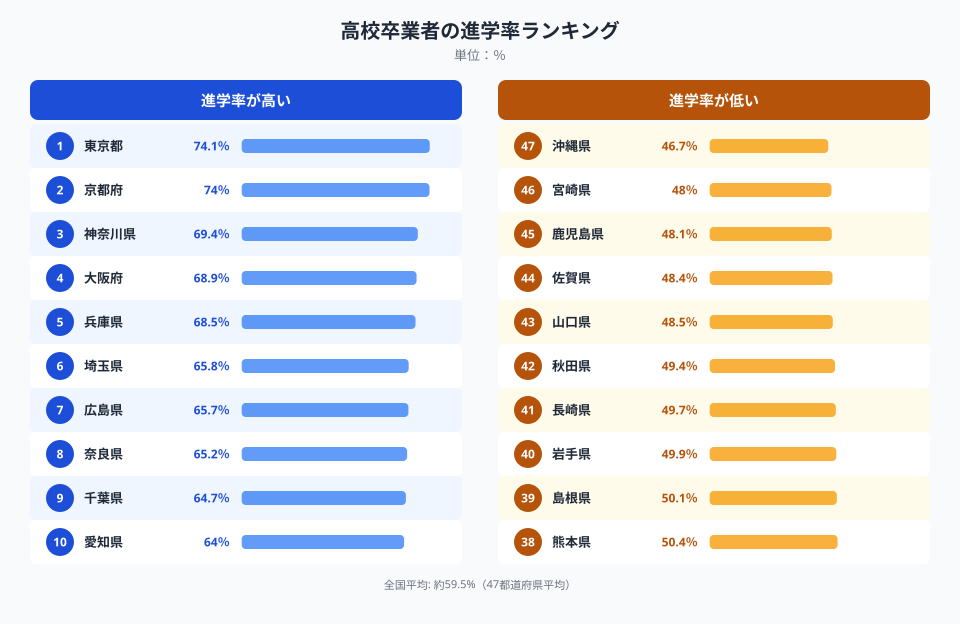
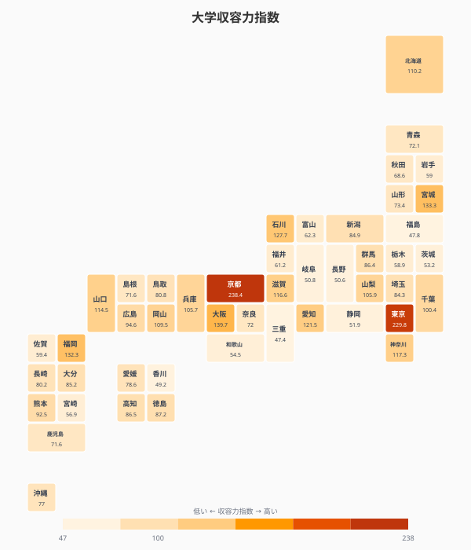
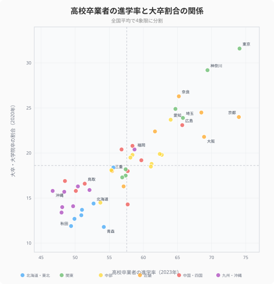
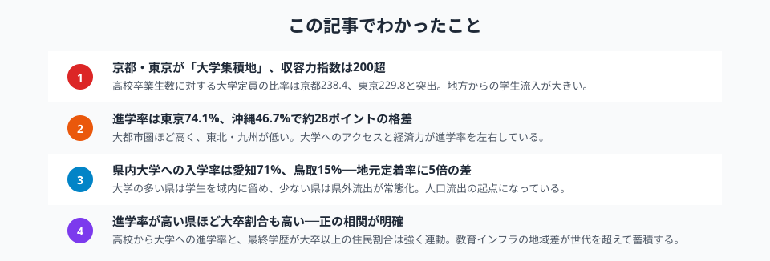

「大学が近くにあるかどうか」は、高校生の進路を大きく左右します。しかし大学の数や定員は都道府県によって驚くほど偏っています。

**大学収容力指数**──その県の高校卒業生数に対し、県内大学がどれだけの入学定員を用意しているかを示す指標──は、京都府238.4、[東京都](/areas/13000)229.8と突出する一方で、三重県47.4、福島県47.8にとどまります。**同じ日本でも大学へのアクセスには約5倍の格差**があるのです。

この記事では、大学収容力指数・高校卒業者の進学率・大卒割合・県内大学への入学率の4つのデータから、大学進学をめぐる地域格差の構造を明らかにします。

> [!NOTE]
> **大学収容力指数**とは、県内の大学入学定員を県内の高校卒業者数で割った値です。100を超えると「県外からも学生を受け入れる余力がある」ことを意味し、100未満は「県内の高校生全員を受け入れるだけの大学定員がない」ことを示します。

## 高校卒業者の進学率ランキング──東京74%、沖縄47%

<data-source url="https://www.e-stat.go.jp/dbview?sid=0000010205" label="e-Stat 社会・人口統計体系"></data-source>

高校卒業者の大学等への進学率が最も高いのは**東京都の74.1%**。2位の京都府（74.0%）とほぼ同率で、神奈川県（69.4%）、大阪府（68.9%）、兵庫県（68.5%）と続きます。上位は大都市圏に集中しています。

一方、**最も低いのは[沖縄県](/areas/47000)の46.7%**。宮崎県（48.0%）、鹿児島県（48.1%）、佐賀県（48.4%）と九州・沖縄勢が下位を占めます。1位と47位の差は**約28ポイント**。全国平均は約57.6%です。

進学率の高低を分けるのは、**通学圏内に大学があるか**と**家計の経済力**の2つです。県外の大学に進学する場合、下宿代や交通費がかかるため、経済的な負担が進学の壁になります。

## 大学収容力指数マップ──京都・東京の「磁力」

<data-source url="https://www.e-stat.go.jp/dbview?sid=0000010205" label="e-Stat 社会・人口統計体系"></data-source>

マップを見ると、**京都・東京が圧倒的に濃い色**で目立ちます。京都府238.4、東京都229.8は、県内の高校卒業生の2倍以上の大学定員を抱えていることを意味します。他県から大量の学生が流入する「大学集積地」です。

次いで大阪府（139.7）、宮城県（133.3）、福岡県（132.3）が100を大きく超えています。これらの県は地方の中核都市として、周辺県の学生を引き寄せる「ハブ」の役割を果たしています。

対照的に、**三重県（47.4）、福島県（47.8）、香川県（49.2）**は50を下回り、県内に大学がほとんどないに等しい状況です。100未満の県は47都道府県のうち**32県**にのぼり、全体の約7割の県で大学定員が不足しています。

> [!TIP]
> 収容力指数100が「ちょうど高校卒業生分の定員がある」ラインです。ただし分野や偏差値の制約があるため、実際には100を超えていても県外に進学する学生は少なくありません。

<source-link href="/ranking/university-capacity-index">47都道府県の大学収容力指数ランキングをもっと見る</source-link>

<ad-slot></ad-slot>

## 県内大学への入学率──愛知71%、鳥取15%

大学があっても、地元の高校生がそこに進学するとは限りません。**県内大学への入学者割合**を見ると、地元定着率の格差がさらに鮮明になります。

**愛知県は県内入学率71.4%でトップ**。名古屋大学をはじめ多くの大学を擁し、かつ地元志向の強い文化も相まって、学生の大半が県内にとどまります。

一方、**鳥取県は15.1%**で最下位。大学がある県でも、奈良県（15.2%）のように大阪・京都の大学圏に吸い込まれるケースもあります。

県内入学率が低い県では、18歳人口の大量流出が起きています。大学進学をきっかけに県外に出た若者は、卒業後もそのまま都市部で就職するパターンが多く、**大学の偏在が人口減少の加速装置**になっているのです。

<source-link href="/ranking/in-pref-university-entrance-ratio-by-highschool-origin">47都道府県の県内大学入学率ランキングをもっと見る</source-link>

## 進学率と大卒割合の相関──教育インフラの格差は世代を超える

<data-source url="https://www.e-stat.go.jp/dbview?sid=0000010205" label="e-Stat 社会・人口統計体系"></data-source>

横軸に高校卒業者の進学率（2023年）、縦軸に最終学歴が大卒以上の住民割合（2020年）をとった散布図です。**右上に東京・京都・神奈川・奈良・兵庫**が位置し、**左下に青森・秋田・岩手・沖縄**が集まります。

この相関は、単に「進学率が高いから大卒が多い」というだけではありません。

- **右上の県（東京・京都など）**: 県内に多くの大学があり、進学しやすい環境が整っている。大卒人材が集まり、高学歴の住民が多い
- **左下の県（青森・秋田など）**: 大学が少なく進学率が低い。大卒者は都市部に流出し、県内の大卒割合も低くなる

つまり、**大学インフラの格差が「進学率の低さ」と「大卒人材の流出」という二重の不利**を生み出し、それが世代を超えて蓄積しています。東京都の大卒割合31.6%に対し、[青森県](/areas/02000)は11.8%──約2.7倍の差です。

> [!WARNING]
> 散布図の2指標は年次が異なります（進学率2023年、大卒割合2020年国勢調査）。大卒割合はストック指標のため短期間では大きく変動しませんが、厳密な同年比較ではない点にご注意ください。

<ad-slot></ad-slot>

## 「大学がない」ことの連鎖的影響

ここまでのデータを整理すると、大学の偏在がもたらす影響は以下のように連鎖しています。

1. **大学が少ない県**（収容力指数が低い） → 高校生は県外進学を余儀なくされる
2. **県外進学** → 県内入学率が低下し、18歳人口が流出する
3. **若者の流出** → 卒業後も都市部に定着し、地元に戻らない
4. **大卒人材の不足** → 県内の産業高度化が進まず、賃金水準も上がりにくい
5. **賃金・雇用環境の格差** → さらに次世代の進学率にも影響する

この循環は「教育版の東京一極集中」とも言えます。大学というインフラの有無が、若者の流出、人的資本の蓄積、地域経済の活力にまで波及しているのです。

> [!IMPORTANT]
> 近年、地方大学の定員増や東京23区の大学定員抑制（2018年施行）など、政策的な是正も進んでいます。しかし収容力指数の地域間格差はなお大きく、抜本的な解消には至っていません。

## まとめ

大学進学をめぐる地域格差の構造を、4つの指標で確認しました。

大学の偏在は、単なる「進学のしやすさ」の問題にとどまりません。18歳での県外流出 → 大卒人材の都市部集中 → 地域の人的資本の格差という連鎖を生み出し、地方創生の根幹にかかわる構造的課題です。

「どこに生まれても同じ教育機会を得られる」という理想と現実のギャップは、データで見ると想像以上に大きいことがわかります。

<data-source url="https://www.e-stat.go.jp/dbview?sid=0000010205" label="e-Stat 社会・人口統計体系"></data-source>

<source-link href="/ranking/high-school-advancement-rate">高校卒業者の進学率ランキングをもっと見る</source-link>

<source-link href="/ranking/final-education-university-graduate-school-ratio">大卒・大学院卒割合ランキングをもっと見る</source-link>

## データ出典

本記事のデータはe-Stat（政府統計の総合窓口）を基に作成しています。
