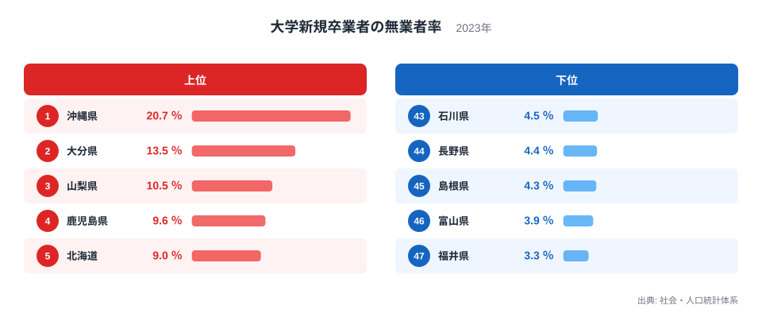
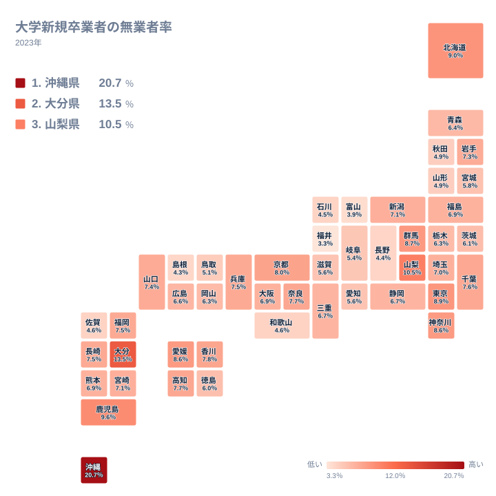

大学を卒業する春、就職先が決まっている人と決まっていない人がいます。その割合は全国一律ではありません。2023年の集計では、大学新卒者の未就職率が最も高かったのは沖縄県の20.7％、最も低かったのは福井県の3.3％でした。その差は6.27倍です。

同じ年に、同じように4年間を過ごして卒業しても、県によってこれほど違う結果になります。この記事では、都道府県別の未就職率をたどりながら、県内の求人のかたちと大学の立地という条件から、その差の背景を整理します。

> [!NOTE]
> この数字は大学の所在地でみた集計です。その大学を卒業した人がその県の出身であるとは限らず、また卒業後にその県で働くとも限りません。県外から入学し県外へ就職する人も、大学の所在県の数字に含まれます。

## 未就職率が高い県と低い県

上位と下位を確認します。

<source-link href="/ranking/university-new-graduates-unemployment-rate">大学新卒者の未就職率ランキングをもっと見る</source-link>

未就職率が高いのは沖縄県が20.7％、大分県が13.5％、山梨県が10.5％、鹿児島県が9.6％、北海道が9％です。沖縄県が2位に7ポイント以上の差をつけて突出しています。

低いのは福井県が3.3％、富山県が3.9％、島根県が4.3％、長野県が4.4％、石川県が4.5％です。北陸の3県が揃って下位に並び、そこに島根県と長野県が加わります。

ここで注意したいのは、東京都が8.9％で6位、神奈川県が8.6％で8位と、大都市圏が上位に入っている点です。求人の数が多い地域ほど未就職率が低いという単純な関係は成り立ちません。

## 北陸が低く沖縄が高い理由

分布を地図で見ると、地域のまとまりが見えます。

北陸の福井県、富山県、石川県が揃って低い水準にあるのは偶然ではありません。この地域には製造業の事業所が集積し、地元で長く事業を続ける企業が多く残っています。県内の大学の学生数に対して地元企業の採用枠が十分にあり、大学と企業の距離が近いため、就職支援が届きやすい環境が整っています。

島根県と長野県が同じ水準にあるのも、県内の事業所と大学の距離の近さという点では共通します。いずれも大学の数が限られる分、一つの大学と地元企業の結びつきが濃くなりやすい地域です。

沖縄県が20.7％と突出する背景には、複数の条件が重なっています。県内の産業は観光業とサービス業が中心で、新卒を定期的に採用する企業の数が限られるとされます。県内で就職を希望する学生が多い一方で、受け皿となる採用枠が需要に追いついていない状態です。

大分県が13.5％で2位に入るのも、県内の大学の学生数に対して地元の採用枠が限られることが関係します。県外への就職を選ぶ学生と、県内にこだわって就職活動を続ける学生の両方がいて、後者のうち卒業時点で決まらない人が数字に表れます。

> [!WARNING]
> 未就職率には、就職を希望しながら決まらなかった人だけでなく、進路が未定の人や、就職以外の道を選んだ人も含まれる場合があります。大学院進学や資格試験の準備、留学を予定している人の扱いは集計上の定義に依存します。この数字だけで「就職できなかった人の割合」と断定することはできません。

## 東京が上位に入る意味

都市部の東京都と神奈川県が上位に入ることは、求人の数の少なさでは説明がつきません。企業の本社が集中する地域で新卒の募集が乏しいとは考えにくく、未就職率の高さを求人不足に帰することはできません。

求人の量では説明がつかない以上、別の要因を考える必要があります。首都圏には全国から学生が集まり、卒業生の絶対数が大きくなります。その母集団の中には、就職以外の道を選ぶ人や、卒業時点であえて進路を確定させない人が含まれるという見方ができます。ただし、その内訳をこの数字から確かめることはできません。

もう一つ考えられるのは、選択肢の多さが活動の期間を延ばす方向に働く可能性です。これも仮説の域を出ないため、確かめるには進路の内訳を示す別の統計が要ります。

つまり、未就職率の高さは「就職先がない」ことと「就職先を選んでいる」ことの両方から生まれます。沖縄県と東京都では同じ数字が違う内容を指しています。

> [!TIP]
> 進学先を選ぶときにこの数字を見るなら、順位そのものより「その県で何が起きているか」を分けて考えるのが実際的です。地元就職を前提とするなら県内企業の採用規模を、県外就職を考えるなら大学の就職支援体制と首都圏へのアクセスを見るほうが、判断の材料になります。

## 数字から見えること

大学新卒者の未就職率が6倍以上開くのは、学生の能力や努力の差ではありません。県内にどれだけの採用枠があるか、大学と地元企業がどれだけつながっているか、そして学生が県内と県外のどちらを選ぶかという条件の重なりです。

北陸のように地元産業と大学が近い距離にある地域では低く、産業構造が観光やサービスに偏る地域では高くなります。都市部では選択肢の多さが別の形で数字を押し上げます。

若者の進路と地域経済のつながりは、県の将来の人口構成にも影響します。教育とスポーツに関わる[同じカテゴリの統計一覧](/category/educationsports)を見ると、進学と就職に関わる他の指標も確認できます。上位の[沖縄県のデータ](/areas/47000)と[大分県のデータ](/areas/44000)では、産業構造と雇用の状況を合わせて把握できます。

## データ出典

- 社会・人口統計体系（2023年）大学新卒者の未就職率
