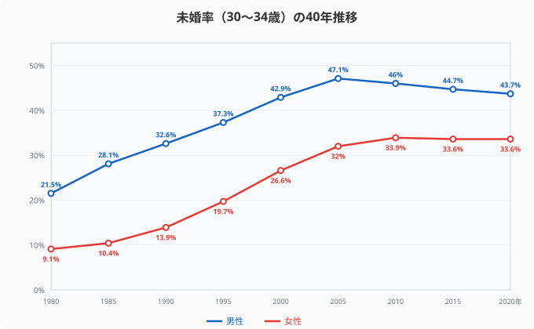
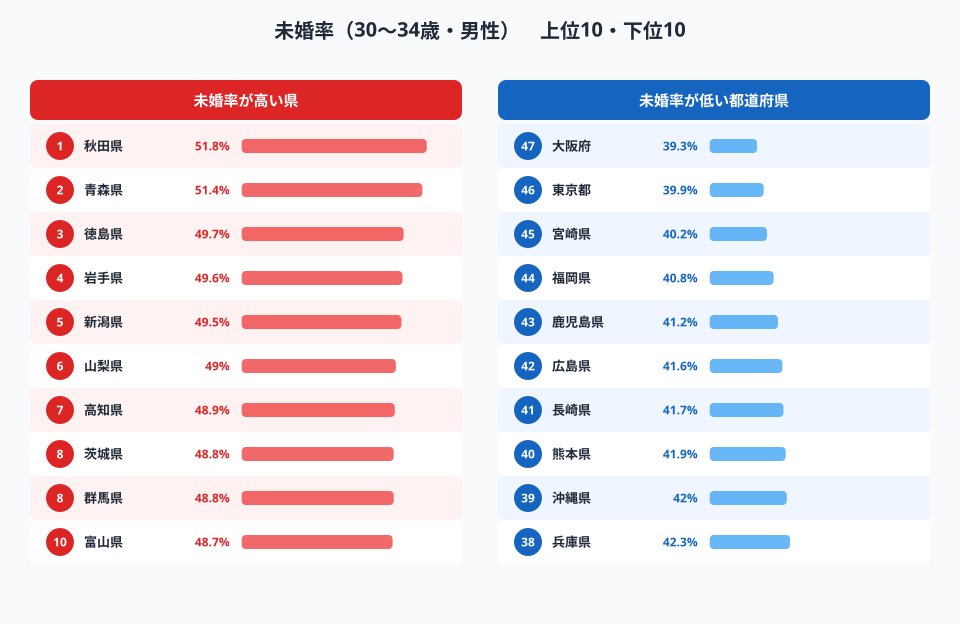
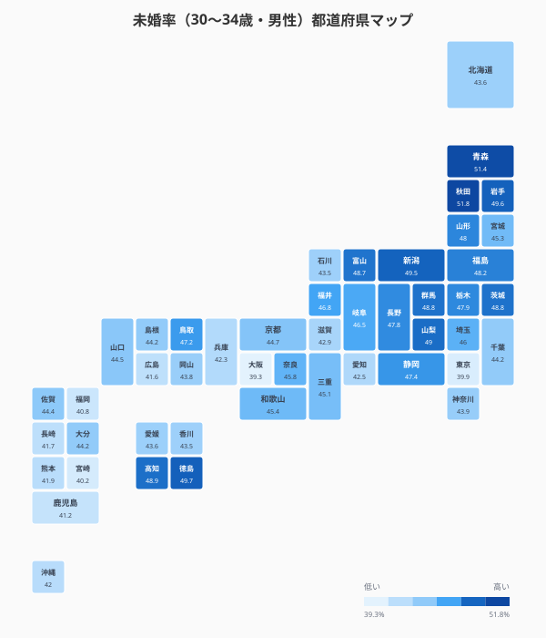
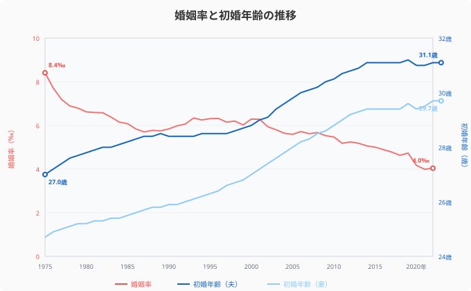
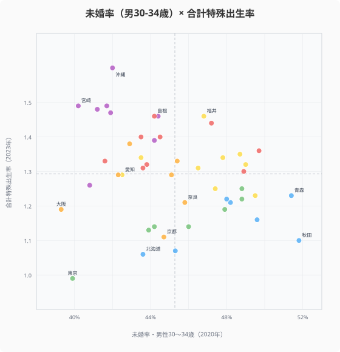
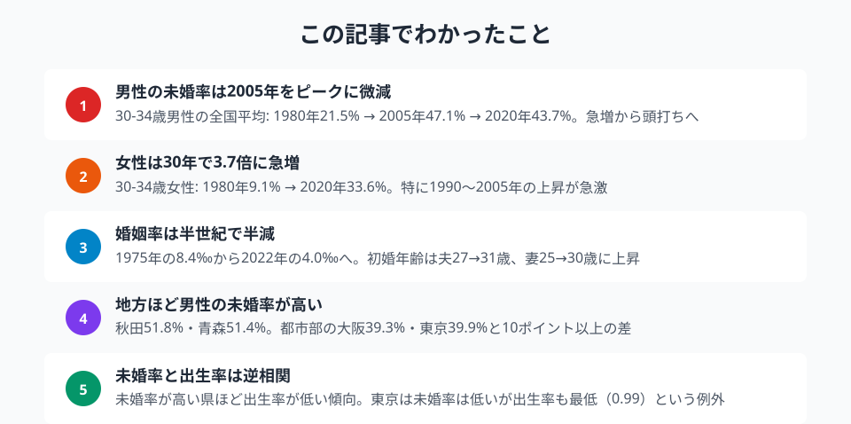

1980年、30代前半男性の未婚率は全国平均**21.5%** でした。2005年には**47.1%** に達し、2人に1人近くが未婚に。ところが、その後の15年間で上昇は止まり、2020年は**43.7%** とわずかに低下しています。

「未婚化は加速し続けている」と思われがちですが、データはもう少し複雑な構造を示しています。40年分の国勢調査データを47都道府県で追います。

> [!NOTE]
> 本記事の未婚率は国勢調査（5年ごと）の「未婚者割合」です。法律上の婚姻歴がない人の割合で、離別・死別は含みません。

## 40年間の未婚率推移──上昇は止まったのか

<data-source url="https://www.e-stat.go.jp/dbview?sid=0000010201" label="e-Stat 社会生活統計指標"></data-source>

30代前半の未婚率は、男女で異なるカーブを描いています。

**男性は「急増→頭打ち」型**。1980年の21.5%から2005年の47.1%まで25年間で26ポイント上昇。しかし2010年（46.0%）、2015年（44.7%）、2020年（43.7%）と3期連続で微減しています。

**女性は「追い上げ→横ばい」型**。1980年の9.1%から2010年の33.9%まで30年で25ポイント上昇。こちらも2015年（33.6%）、2020年（33.6%）と横ばいに転じました。

男女ともに**2005〜2010年を境に上昇が止まっている**のが最大の発見です。少子化対策の議論では「未婚化が進んでいる」と語られがちですが、全国平均で見る限り、上昇は一巡した可能性があります。

> [!TIP]
> 未婚率が「頭打ち」になった理由のひとつは、団塊ジュニア世代の通過効果です。1970年代生まれの大量のコーホートが2005年前後に30代前半を通過し、未婚率を押し上げていました。

## 未婚率ランキング──地方の男性、過半数が未婚

<data-source url="https://www.e-stat.go.jp/dbview?sid=0000010201" label="e-Stat 社会生活統計指標"></data-source>

**1位は[秋田県](/areas/05000)の51.8%**。30代前半男性の過半数が未婚です。2位は青森県（51.4%）、3位は徳島県（49.7%）と続きます。

意外なのは下位。**最も未婚率が低いのは[大阪府](/areas/27000)の39.3%**、次いで東京都（39.9%）。「都市部の方が結婚しにくい」という通念とは逆に、**大都市圏の方が未婚率が低い**のです。

この逆転現象の理由は明確です。地方から若い女性が都市部に流出し、地方では男女比の偏りが拡大。秋田や青森では「出会いの機会」そのものが構造的に不足しています。一方、大都市には人が集まるため出会いの機会が多く、結果として婚姻に結びつきやすい。

> [!WARNING]
> ただし1位の秋田（51.8%）と47位の大阪（39.3%）の差は約12ポイント。全国どこでも4割前後が未婚という「全国的な高水準」が前提にあることを見落としてはなりません。

### 全国マップ

<data-source url="https://www.e-stat.go.jp/dbview?sid=0000010201" label="e-Stat 社会生活統計指標"></data-source>

マップで俯瞰すると、**東北・北関東が濃い色（**未婚率が高い）に染まっています。秋田・青森・岩手・新潟・茨城・群馬──いずれも若年女性の流出が顕著な県です。

一方、**関西・九州はやや薄い色**。大阪・福岡・宮崎・鹿児島は40%前後にとどまります。

<source-link href="/ranking/unmarried-ratio-male-30-34">47都道府県の未婚率ランキングをもっと見る</source-link>

<ad-slot></ad-slot>

## 婚姻率と初婚年齢──結婚する人が減り、結婚が遅くなる二重の変化

<data-source url="https://www.e-stat.go.jp/dbview?sid=0000010201" label="e-Stat 社会・人口統計体系"></data-source>

未婚化の背景には**2つの構造変化**が同時進行しています。

**婚姻率は半世紀で半減**しました。1975年の**8.4‰（**千人当たり8.4組） から2022年の**4.0‰**へ。結婚する人の割合が半分になっています。特にコロナ禍の2020年（4.2‰）以降は過去最低水準に張り付いています。

**初婚年齢は着実に上昇**。夫の初婚年齢は1975年の**27.0歳**から2023年の**31.1歳**へ4歳上昇。妻は**24.7歳→29.7歳**と5歳上昇しました。

注目すべきは、初婚年齢の上昇が**2015年前後で頭打ち**になっている点です。夫は31.1歳前後、妻は29.4歳前後で横ばい。未婚率の頭打ちと時期が一致しており、「結婚を先延ばしにしていた層」が一定の年齢で結婚に踏み切る構造が見えます。

<source-link href="/ranking/marriage-rate">47都道府県の婚姻率ランキングを見る</source-link>

## 未婚率と出生率──未婚化が少子化に直結するか

<data-source url="https://www.e-stat.go.jp/dbview?sid=0000010201" label="e-Stat 社会生活統計指標"></data-source>

> [!NOTE]
> 未婚率は2020年、出生率は2023年とデータ年次が異なります。ただし未婚率は5年ごとの国勢調査値のため、最新の2020年を使用しています。

散布図で未婚率と出生率の関係を見ると、**緩やかな負の相関**が確認できます。未婚率が高い県ほど出生率が低い傾向です。

**右下（**未婚率が高く出生率が低い）には**秋田、青森、北海道**。若い女性の流出→男性の未婚化→出生数の減少、という負のスパイラルが可視化されています。

**左上（**未婚率が低く出生率が高い）には**[沖縄県](/areas/47000)、[宮崎県](/areas/45000)、[鹿児島県](/areas/46000)**。出会いの機会が比較的多く、結婚・出産にもつながりやすい構造です。

**特異な例外は[東京都](/areas/13000)**。未婚率は39.9%と全国で2番目に低いにもかかわらず、出生率は**0.99と全国最低**です。東京は結婚はしやすいが、住居費・教育費の高さから「結婚しても子どもを持たない/持てない」選択が多いことを示しています。

<source-link href="/correlation?x=unmarried-ratio-male-30-34&y=total-fertility-rate">未婚率 × 出生率の相関を都道府県別に見る</source-link>

<ad-slot></ad-slot>

## まとめ

40年間の未婚率データを追った結果、「未婚化は一直線に進んでいる」というイメージとは異なる構造が見えてきました。

男女ともに2005〜2010年を境に未婚率の上昇は止まりましたが、「止まった水準」自体が男性44%・女性34%と極めて高い。これが少子化に直結する構造は変わっていません。

地域差の本質は「出会いの機会の不均衡」です。地方からの若年女性の流出は、送り出す側の地方では男性の未婚化を加速させ、受け入れる側の都市部では出会いの機会を増やす。結婚を望む人にとって、「どこに住むか」はデータが示す以上に大きな選択かもしれません。

## データ出典

本記事のデータはe-Stat（政府統計の総合窓口）を基に作成しています。

本記事の対象データ: [関連カテゴリ](/category/population)
