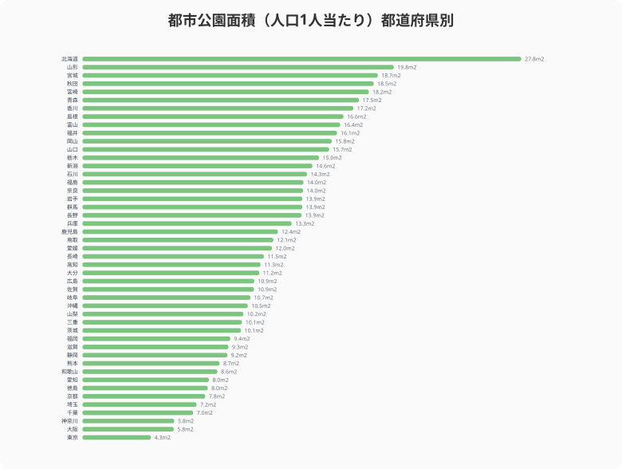
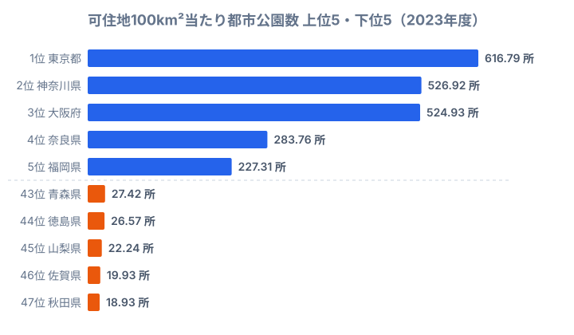

「子どもを遊ばせる公園が近くにない」「ランニングできる広い公園がほしい」。住む場所を選ぶとき、公園環境は意外と大きな要素です。ただ「公園が充実している県」と一口に言っても、その中身は二通りあります。1つは**1人当たりの面積が広い**こと、もう1つは**身近に公園が多くある**ことです。

この2つは一致しません。1人当たりの都市公園面積は[北海道](/areas/01000)が27.84㎡で全国1位、[東京都](/areas/13000)が4.34㎡で最下位と6倍超の開きがあります。ところが「歩いて行ける範囲に公園があるか」を表す可住地100km²当たりの公園数では、順位がそっくり逆転します。広い県ほど近くに公園がなく、狭い県ほど近くに公園が多い——この逆転がなぜ起きるのかが、この記事で読み解くテーマです。

## 1人当たり面積では地方が圧勝する

まず「広さ」の指標、人口1人当たりの都市公園面積を見てみましょう。

上位は北海道（27.84㎡）、[山形県](/areas/06000)（19.75㎡）、宮城県（18.74㎡）、[秋田県](/areas/05000)（18.48㎡）、宮崎県（18.17㎡）と、北海道・東北・南九州が並びます。これらの地域に共通するのは、人口に対して土地に余裕があることです。分子（公園面積）が大きく分母（人口）が小さいため、1人当たりに直すと数字が大きく出ます。広い運動公園や河川敷公園をつくっても、それを使う人口が少ないので「1人当たり」では有利になります。

下位は東京都（4.34㎡）、大阪府（5.79㎡）、神奈川県（5.82㎡）、千葉県（7.02㎡）、埼玉県（7.24㎡）と、首都圏と近畿圏の人口密集地が占めます。理由は上位の裏返しです。都市部は地価が高く公園用地を確保しづらいうえ、分母となる人口が桁違いに多いため、面積を増やしても1人当たりではなかなか伸びません。北海道27.84㎡と東京4.34㎡の差は6倍を超え、「広さ」だけ見れば地方の圧勝です。

> [!NOTE]
> 本記事の「都市公園」は都市公園法に基づき自治体や国が設置・管理する公園・緑地を指します。神社の境内地、民間の遊園地、都市計画区域外の公園などは含まれません。データは国土交通省の集計を社会生活統計指標（e-Stat、2023年度）として整理したものです。

<source-link href="/ranking/urban-park-area-per-person">47都道府県の1人当たり都市公園面積ランキングをもっと見る</source-link>

## 公園の「数」では順位がそっくり逆転する

次に「身近さ」の指標、可住地100km²当たりの都市公園数を見ます。可住地（人が住める平地）あたりで数えることで、生活圏にどれだけ公園が密集しているかが分かります。

驚くのは、面積では最下位だった東京都が616.79所で堂々の1位に立つことです。神奈川県（526.92所）、大阪府（524.93所）が続き、面積の下位常連がそのまま数の上位を独占しています。大都市圏は1つ1つは小さくても、街区のすき間に公園を高密度で配置しているため、歩いて行ける範囲に必ず公園がある状態をつくっています。奈良県（283.76所）、福岡県（227.31所）も上位で、都市化が進んだ地域ほど数の密度が高くなります。

逆に数の下位は、青森県（27.42所）、徳島県（26.57所）、山梨県（22.24所）、佐賀県（19.93所）、そして最下位の秋田県（18.93所）です。秋田県は1人当たり面積では全国4位の18.48㎡と上位に入っていたのに、可住地あたりの公園数では47位まで沈みます。「広い公園は少数あるが、身近な小さい公園は少ない」典型例で、近所の公園まで距離があることを示しています。面積だけで公園の充実度を判断するのが一面的だと分かる対比です。

> [!WARNING]
> 「1人当たり面積が広い＝公園が充実している」と読むのは誤りです。面積が広くても公園数が少なければ、自宅から徒歩圏内に公園がない場合があります。逆に面積が狭くても数が多ければ、日常的に立ち寄れる公園が近くにあります。**面積（広さ）と数（身近さ）は別々の軸**であり、どちらか一方だけで住環境を評価しないことが大切です。

<source-link href="/ranking/urban-park-count-per-100km2">47都道府県の都市公園数ランキングをもっと見る</source-link>

## なぜ面積と数が逆転するのか

面積上位の北海道・秋田と、数上位の東京・神奈川。この逆転は偶然ではなく、公園の「種類の構成」が違うために起きています。

都市公園は規模によって種類が分かれます。**街区公園**は住区内の身近な公園（標準面積0.25ha）、**近隣公園**は近隣住区の中心となる公園（標準2ha）、**運動公園**は競技施設を備えた大規模公園です。大都市圏は街区公園の割合が極端に高く、たとえば東京都は公園数全体の約79%が街区公園です。小さな公園を数で稼ぐため、1つ当たりの面積は小さく、1人当たり面積では下位になります。

一方、地方県は人口に対して大規模な運動公園や総合公園を持ちますが、その数自体は少なくなります。秋田県のように1人当たり面積では4位でも、可住地あたりの公園数では最下位という結果は、「大きい公園が点在し、小さい公園が密集していない」構造をそのまま映しています。つまり同じ「公園」というデータでも、面積で数えるか箇所数で数えるかで、まったく逆の県が上位に来るのです。住みやすさを公園で測るなら、両方の指標を重ねて見る必要があります。

> [!TIP]
> 移住や住み替えで公園を判断材料にするなら、「広い公園で運動したい」なら1人当たり面積の上位県（北海道・東北）、「子どもと毎日歩いて行ける公園がほしい」なら可住地あたり公園数の上位県（首都圏・近畿）と、目的別に指標を使い分けると失敗しません。同じ県でもこの2軸で評価が真逆になります。

<source-link href="/ranking/block-park-count-per-100km2">47都道府県の街区公園数ランキングをもっと見る</source-link>

<ad-slot></ad-slot>

## グリーンインフラとしての公園

都市公園は単なるレクリエーション施設ではありません。近年は「グリーンインフラ」として、多機能的な価値が再評価されています。

- **防災**: 大規模公園は災害時の一時避難場所・救援物資の集積拠点として機能します
- **ヒートアイランド緩和**: 樹木や芝生の蒸散作用が、都市の気温上昇を抑えます
- **健康増進**: 公園でのウォーキングや運動がメンタルヘルスに好影響を与えることが、複数の研究で示されています
- **生物多様性**: 都市内の緑地は野鳥や昆虫の生息地となり、生態系ネットワークを維持します

面積の大小や数の多寡だけでなく、こうした多面的な価値を含めた公園の「質」の評価が、今後の都市計画ではますます重要になっていきます。広さで勝る地方の大規模公園には防災拠点としての強みがあり、数で勝る都市部の街区公園には日常のアクセス性という強みがあります。どちらが優れているという話ではなく、それぞれの地域特性に合った役割を担っているのです。

## まとめ

都市公園のデータからは、次のポイントが見えてきました。

- 1人当たり都市公園面積の1位は北海道（27.84㎡）、最下位は東京都（4.34㎡）で、その差は6倍超です
- 可住地100km²当たりの公園数では順位が逆転し、東京都が616.79所で全国トップに立ちます
- 秋田県は面積では全国4位（18.48㎡）でも、公園数では最下位（18.93所）と、2つの指標で評価が真逆になります
- 逆転の正体は公園の種類構成で、大都市圏は街区公園を数で稼ぎ、地方は大規模公園を面積で稼いでいます
- 住みやすさを公園で測るなら、「広さ」と「身近さ」の両方の指標を重ねて見る必要があります

「住みやすさ」を決める要素は家賃や通勤時間だけではありません。身近に公園があるか、その公園は子どもが遊べる規模か、ランニングやスポーツができる施設があるか。面積と数のバランスが、日常生活の質を左右します。移住や住み替えを検討する際は、公園データも判断材料の一つに加えてみてはいかがでしょうか。

## データ出典

- 社会生活統計指標（e-Stat、政府統計の総合窓口）——都市公園面積（2023年度）、都市公園数（2023年度）、街区公園数（2023年度）
- 国土交通省 都市公園データベース
