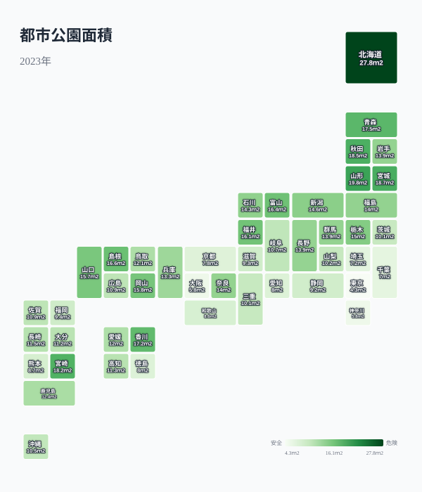
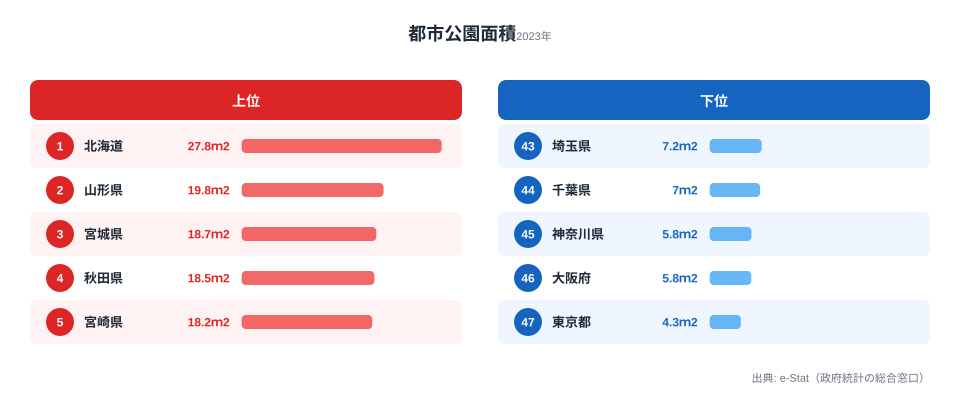
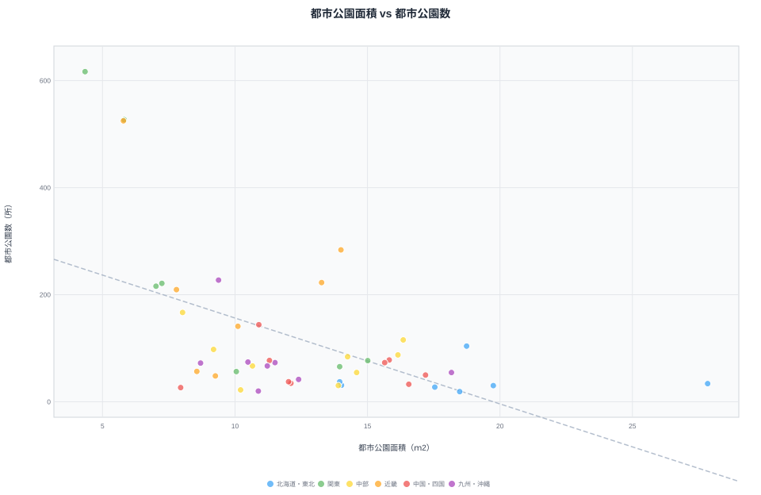
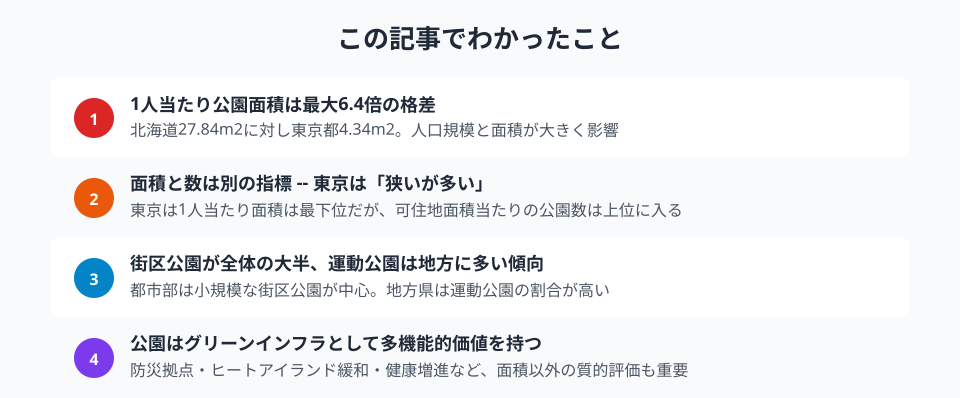

「子どもを遊ばせる公園が近くにない」「ランニングできる広い公園がほしい」。住む場所を選ぶとき、公園環境は意外と大きな要素です。人口1人当たりの都市公園面積は、[北海道](/areas/01000)27.84m2に対し[東京都](/areas/13000)4.34m2。最大で6.4倍の差があります。ただし「面積が広い＝公園が充実している」とは限りません。本記事では面積・数・種類の3つの角度から、緑のインフラの実像をひもときます。

## 1人当たり公園面積マップ

タイルグリッドマップで全国を俯瞰すると、東北・北海道で面積が広く、首都圏・近畿圏で狭い傾向が読み取れます。

上位は北海道（27.84m2）、[山形県](/areas/06000)（19.75m2）、[宮城県](/areas/04000)（18.74m2）、[秋田県](/areas/05000)（18.48m2）、宮崎県（18.17m2）。人口に対して広大な公園用地を確保しやすい地域が並びます。

下位は東京都（4.34m2）、大阪府（5.79m2）、神奈川県（5.82m2）、千葉県（7.02m2）、埼玉県（7.24m2）。人口密集地では限られた土地に公園を設置するため、1人当たり面積はどうしても小さくなります。上位の北海道と下位の東京都を比べると6.4倍の開きがあり、これは分母である人口の密度差をそのまま反映した数字です。

<source-link href="/ranking/urban-park-area-per-person">47都道府県の1人当たり都市公園面積ランキングをもっと見る</source-link>

> [!NOTE]
> 本記事の「都市公園」とは都市公園法に基づく公園・緑地を指します。国営公園や都市計画区域外の公園は集計に含まれない場合があり、自然公園（国立公園・国定公園）とは別の枠組みです。北海道や東北で面積が広いのは、こうした法定都市公園の用地を人口に対して広く確保できているためで、山林や自然のみどりの多さとは区別して読む必要があります。

## 公園の「数」と「大きさ」は別の話

面積と数は必ずしも連動しません。可住地面積100km2当たりの公園数を横軸の面積と並べて、散布図で確認します。

東京都は1人当たり面積こそ最下位ですが、可住地面積100km2当たりの公園数は616.79所でダントツの1位です。神奈川県（526.92所）、大阪府（524.93所）も上位で、大都市圏は「小さい公園が高密度で分布する」パターンだとわかります。

逆に北海道は面積では1位でも、公園数は中位にとどまります。「広い公園が少数ある」タイプで、近所の公園まで距離がある可能性があります。面積だけで公園の充実度を判断するのは一面的で、アクセス性（徒歩圏内に公園があるか）を加味する必要があります。

<source-link href="/ranking/urban-park-count-per-100km2">47都道府県の都市公園数ランキングをもっと見る</source-link>

> [!WARNING]
> 面積（1人当たり）と公園数（面積当たり）は分母が異なる別々の指標です。面積は「人口1人あたり何m2か」、公園数は「土地100km2あたり何所か」を測っており、両者を同じ物差しで足し引きすることはできません。順位が逆転して見えるのはそのためで、「どちらが上か」ではなく「広さ重視かアクセス性重視か」という評価軸の違いとして読むのが正確です。

<ad-slot></ad-slot>

## 街区公園・近隣公園・運動公園 -- 3種の公園構成

都市公園は規模によって種類が分かれます。**街区公園**は住区内の身近な公園（標準面積0.25ha）、**近隣公園**は近隣住区の中心的な公園（標準2ha）、**運動公園**は競技施設を備えた大規模公園です。

公園数が多い大都市圏ほど、街区公園の割合が際立って高くなります。東京都の内訳を実数で見ると、街区公園6962箇所に対し近隣公園324箇所、運動公園45箇所。身近な場所に小さな公園が多数配置されており、子育て世帯にとってのアクセス性は高い構成です。

<source-link href="/ranking/block-park-count-per-100km2">47都道府県の街区公園数ランキングをもっと見る</source-link>

一方、地方県では総公園数が少ないため、大規模公園1箇所あたりの存在感が相対的に大きくなります。広い運動公園が地域のスポーツ拠点として機能する一方、徒歩圏の街区公園は都市部ほど密にはありません。秋田県は可住地面積100km2当たりの公園数が18.93所と47都道府県で最下位クラスで、面積では4位の広さを誇る一方、身近な公園へのアクセス性では課題が残ります。

> [!TIP]
> 1人当たり公園面積の全国平均は約10.8m2（2023年）。北海道の27.84m2は全国平均の約2.6倍、東京の4.34m2は約0.4倍です。「住みやすさ指標」として公園を評価するなら、1人当たり面積（広さ重視）と可住地面積100km2当たり公園数（アクセス性重視）の両方を必ず併せて見てください。広さと近さは別物で、どちらを重視するかは世帯のライフスタイルによって変わります。

## グリーンインフラとしての公園

都市公園は単なるレクリエーション施設ではありません。近年は「グリーンインフラ」として多機能的な価値が再評価されています。

- **防災**: 大規模公園は災害時の一時避難場所・救援物資集積拠点として機能します
- **ヒートアイランド緩和**: 樹木や芝生による蒸散作用が都市の気温上昇を抑制します
- **健康増進**: 公園でのウォーキングや運動がメンタルヘルスに好影響を与えることが複数の研究で示されています
- **生物多様性**: 都市内の緑地は野鳥や昆虫の生息地として生態系ネットワークを維持します

面積の大小だけでなく、こうした多面的な価値を含めた公園の「質」の評価が、今後の都市計画では重要になります。

<ad-slot></ad-slot>

## まとめ

都市公園のデータから、以下のポイントが見えてきました。

「住みやすさ」を決める要素は家賃や通勤時間だけではありません。身近に公園があるか、その公園は子どもが遊べる規模か、ランニングやスポーツができる施設があるか。面積・数・種類のバランスが、日常生活の質を左右します。移住や住み替えを検討する際は、公園データも判断材料の一つに加えてみてはいかがでしょうか。

## データ出典

本記事のデータはe-Stat（政府統計の総合窓口）の[社会生活統計指標](https://www.e-stat.go.jp/dbview?sid=0000010208)を基に作成しています。都市公園面積・都市公園数・街区/近隣/運動公園数はいずれも2023年の値です。
