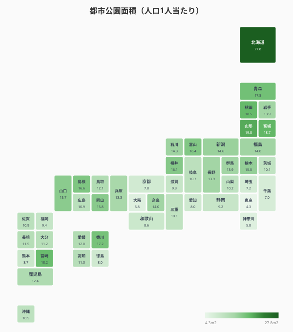
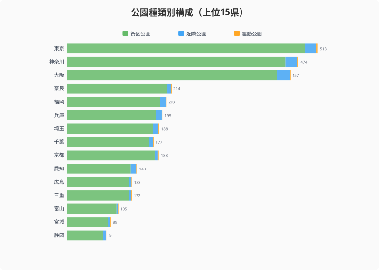

「子どもを遊ばせる公園が近くにない」「ランニングできる広い公園がほしい」。住む場所を選ぶとき、公園環境は意外と大きな要素だ。人口1人当たりの都市公園面積は、[北海道](/areas/01000)27.8m2に対し[東京都](/areas/13000)4.3m2。最大で6倍以上の差がある。

## 1人当たり公園面積マップ

タイルグリッドマップで全国を俯瞰すると、東北・北海道で面積が広く、首都圏・近畿圏で狭い傾向が読み取れる。

上位は北海道（27.8m2）、山形県（19.8m2）、宮城県（18.7m2）、[秋田県](/areas/05000)（18.5m2）、宮崎県（18.2m2）。人口に対して広大な公園用地を確保しやすい地域が並ぶ。

下位は東京都（4.3m2）、大阪府（5.8m2）、神奈川県（5.8m2）、千葉県（7.0m2）、埼玉県（7.2m2）。人口密集地では限られた土地に公園を設置するため、1人当たり面積はどうしても小さくなる。

<source-link href="/ranking/urban-park-area-per-person">47都道府県の1人当たり都市公園面積ランキングをもっと見る</source-link>

> [!NOTE]
> 本記事の都市公園データは国土交通省「都市公園データベース」（2023年）に基づき、e-Stat社会生活統計指標として集計されたもの。「都市公園」とは都市公園法に基づく公園・緑地を指し、国営・都市計画区域外の公園は含まれない場合がある。

## 公園の「数」と「大きさ」は別の話

面積と数は必ずしも連動しない。散布図で確認する。

東京都は1人当たり面積こそ最下位だが、可住地面積100km2当たりの公園数は616.8箇所でダントツの1位。神奈川県（526.9箇所）、大阪府（524.9箇所）も上位で、大都市圏は「小さい公園が高密度で分布する」パターンだ。

逆に北海道は面積では上位でも、公園数は中位にとどまる。「広い公園が少数ある」タイプで、近所の公園まで距離がある可能性がある。面積だけで公園の充実度を判断するのは一面的で、アクセス性（徒歩圏内に公園があるか）を加味する必要がある。

<source-link href="/ranking/urban-park-count-per-100km2">47都道府県の都市公園数ランキングをもっと見る</source-link>
<source-link href="/ranking/block-park-count-per-100km2">47都道府県の街区公園数ランキングをもっと見る</source-link>

<ad-slot></ad-slot>

## 街区公園・近隣公園・運動公園 -- 3種の公園構成

都市公園は規模によって種類が分かれる。**街区公園**は住区内の身近な公園（標準面積0.25ha）、**近隣公園**は近隣住区の中心的な公園（標準2ha）、**運動公園**は競技施設を備えた大規模公園だ。

公園数が多い東京都・神奈川県・大阪府は、街区公園の割合が圧倒的に高い。東京都では公園数の約79%が街区公園だ。身近な場所に小さな公園が多数配置されており、子育て世帯にとってのアクセス性は高い。

一方、地方県では運動公園の割合が相対的に高くなる。総公園数が少ないため、大規模公園1箇所の影響が大きい。秋田県は公園数100km2当たり18.9箇所と最下位クラスで、身近な街区公園が少ない。

> [!TIP]
> 1人当たり公園面積の全国平均は約10.8m2（2023年）。北海道27.84m2は全国平均の約2.6倍、東京4.34m2は約0.4倍。「住みやすさ指標」として公園面積を使う場合、1人当たり面積（広さ重視）と可住地面積100km2当たり公園数（アクセス性重視）の両方で評価することを推奨する。

## グリーンインフラとしての公園

都市公園は単なるレクリエーション施設ではない。近年は「グリーンインフラ」として多機能的な価値が再評価されている。

- **防災**: 大規模公園は災害時の一時避難場所・救援物資集積拠点として機能する
- **ヒートアイランド緩和**: 樹木や芝生による蒸散作用が都市の気温上昇を抑制する
- **健康増進**: 公園でのウォーキングや運動がメンタルヘルスに好影響を与えることが複数の研究で示されている
- **生物多様性**: 都市内の緑地は野鳥や昆虫の生息地として生態系ネットワークを維持する

面積の大小だけでなく、こうした多面的な価値を含めた公園の「質」の評価が、今後の都市計画では重要になる。

<ad-slot></ad-slot>

## まとめ

都市公園のデータから、以下のポイントが見えてきた。

「住みやすさ」を決める要素は家賃や通勤時間だけではない。身近に公園があるか、その公園は子どもが遊べる規模か、ランニングやスポーツができる施設があるか。面積・数・種類のバランスが、日常生活の質を左右する。移住や住み替えを検討する際は、公園データも判断材料の一つに加えてみてはどうだろうか。

**データ出典:**
- [社会生活統計指標（e-Stat）](https://www.e-stat.go.jp/dbview?sid=0000010208) -- 都市公園面積（2023年）、都市公園数（2023年）、街区・近隣・運動公園数（2023年）

## データ出典

本記事のデータはe-Stat（政府統計の総合窓口）を基に作成しています。
