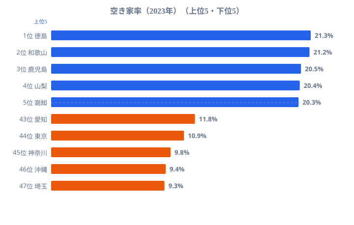
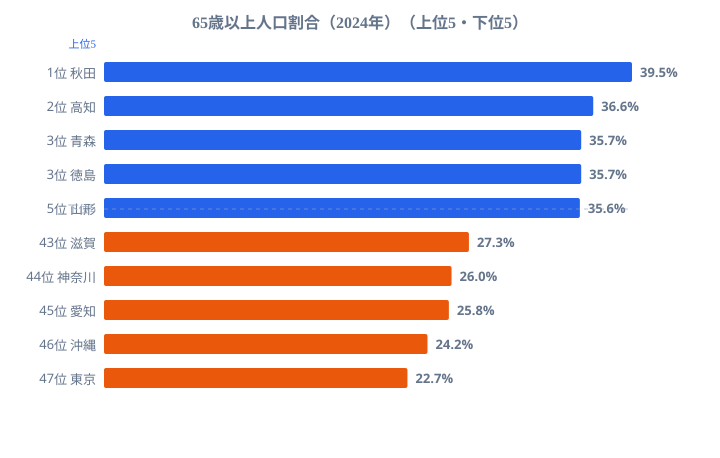
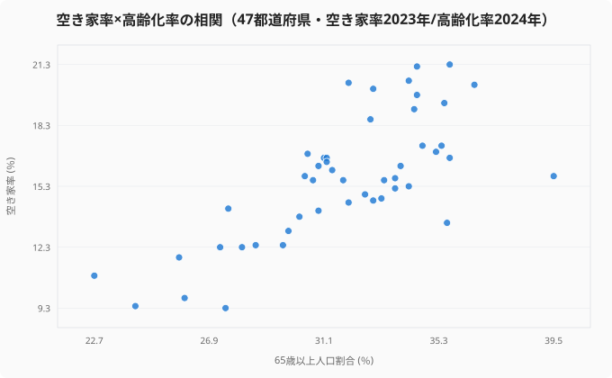

あなたの住んでいる街を歩いていて、「この家、もう誰も住んでいないな」と感じたことはありませんか。

実は、日本の住宅の **13.8%が空き家** です。およそ7軒に1軒は誰も住んでいない計算になります。空き家の放置は景観の悪化だけではありません。倒壊リスク、火災リスク、治安の悪化、そして固定資産税の問題まで、私たちの暮らしに直結する課題です。

そして空き家は、どこでも均等に増えているわけではありません。空き家率が最も高い徳島県と最も低い埼玉県では、2.3倍もの開きがあります。なぜこれほど差がつくのか。本記事では空き家率のランキングに、高齢化率という「もう一つの地図」を重ねることで、その真因に迫ります。あなたの住む都道府県は、どちら側に立っているでしょうか。

## 空き家率が高いのは西日本──地図が示す偏り

まずは最も気になる空き家率の全国ランキングから見ていきましょう。

<source-link href="/ranking/vacant-housing-ratio">空き家率ランキングをもっと見る</source-link>

トップの徳島県（21.3%）と最も低い埼玉県（9.3%）では、[空き家率](/ranking/vacant-housing-ratio)に **2.3倍の開き** があります。上位には徳島県、和歌山県、鹿児島県、山梨県、高知県が並び、四国・九州・中国地方の県が目立ちます。全国平均の13.8%を大きく上回る地域では、すでに「5軒に1軒が空き家」という状況になっています。

一方で空き家率が低いのは、埼玉県（9.3%）、沖縄県（9.4%）、神奈川県（9.8%）、東京都（10.9%）、愛知県（11.8%）です。首都圏・中京圏といった、人口が流入し続けている地域が下位に並びます。ここから見えてくるのは、空き家率の高低が「都会か地方か」というより、「人が増えているか減っているか」という人口動態を映し出しているという構図です。若年人口が流出し、世帯数が頭打ちになった地域ほど、住む人を失った家が積み上がっていきます。

> [!NOTE]
> 空き家率は、住宅・土地統計調査で「居住世帯のない住宅」が住宅総数に占める割合として算定されます。別荘などの「二次的住宅」、賃貸・売却用の募集中物件、そして長期にわたり誰も住んでいない「その他の空き家」をすべて含む点に注意してください。観光地で別荘が多い地域では、危険な放置物件が少なくても率が押し上げられることがあります。

## 「築50年超の住宅」が老朽化リスクを押し上げる

空き家率だけでは見えない問題があります。それは住宅の「老朽化」です。

1970年以前に建てられた住宅、つまり築50年を超える住宅は、現在の建築基準法の耐震基準（1981年の新耐震基準）を満たしていない可能性が高く、大地震が起きた場合の倒壊リスクが極めて高いとされています。

この「築50年超の住宅」が全住宅に占める割合は、日本海側で高くなる傾向があります。島根県（13.2%）が最も高く、鳥取県（10.4%）、富山県（10.3%）と続きます。一方で、戦後に急速に宅地開発が進んだ北海道（3.5%）や埼玉県（3.8%）は低い水準にとどまります。古い街並みが残り、人口の入れ替わりが緩やかな地域ほど、築年数の古い住宅がそのまま残り続けるのです。

ここで注目したいのは、このランキングが空き家率ランキングとは異なる顔ぶれを上位に並べることです。空き家率トップの徳島県が老朽住宅では目立たない一方、空き家率では中位の島根県が老朽住宅では最も高くなります。「空き家が多い県」と「古い家が多い県」は、必ずしも一致しません。

> [!WARNING]
> 築50年超の住宅が密集しているエリアでは、1軒の倒壊が周囲に連鎖するリスクがあります。阪神・淡路大震災でも、密集した老朽木造住宅の連鎖倒壊・火災が被害を拡大させた教訓があります。空き家率が低い都市部でも、古い木造住宅が集中する地区は別途のリスクを抱えている点を見落とさないでください。

<ad-slot></ad-slot>

## 空き家率×高齢化率──「人がいなくなる住宅地」の正体

ここからが本記事の核心です。空き家率の地図と、65歳以上人口比率（高齢化率）の地図を重ねると、両者が驚くほど似ていることが見えてきます。

<source-link href="/ranking/ratio-65-plus">高齢化率ランキングをもっと見る</source-link>

[高齢化率](/ranking/ratio-65-plus)が高いのは秋田県（39.5%）、高知県（36.6%）、青森県（35.7%）、徳島県（35.7%）、山形県（35.6%）です。逆に低いのは東京都（22.7%）、沖縄県（24.2%）、愛知県（25.8%）、神奈川県（26.0%）、滋賀県（27.3%）でした。空き家率で下位に並んだ埼玉県・沖縄県・神奈川県・東京都・愛知県と、高齢化率で下位に並ぶ顔ぶれが、ほぼそのまま重なっている点に気づくはずです。

そして上位側でも、空き家率トップの徳島県は高齢化率でも上位に入り、空き家率5位の高知県は高齢化率では2位です。空き家率と高齢化率は、地図の上で右肩上がりの関係を描いています。高齢化が進んだ県ほど、空き家も多いのです。

47都道府県を「高齢化率（横軸）×空き家率（縦軸）」で1枚にプロットすると、点が右肩上がりに並び、両者の正の相関（相関係数 r=0.73）が一目で確認できます。秋田・高知・徳島など高齢化率が35%を超える県は空き家率も20%前後に達し、グラフの右上に固まります。逆に東京・神奈川・愛知といった高齢化率の低い都市圏は左下に集まり、空き家率も10%前後にとどまります。2つの棒グラフを頭の中で照合しなくても、この1枚で「高齢化が進む県ほど空き家が多い」という関係が読み取れます。

これは直感的にも理解できる関係です。高齢者の一人暮らし世帯で住人が亡くなったり施設に入ったりすると、その住宅は空き家になります。相続人が遠方に住んでいれば、管理も売却もされないまま放置されます。この流れが全国で同時に進行しています。つまり空き家問題の真因は、住宅政策そのものより、その地域の人口がどれだけ高齢化し、若い世代が流出したかにあります。空き家は結果であり、原因は人口構造の側にあるのです。

> [!TIP]
> 高齢化率は「これから空き家がどこで増えるか」の先行指標として読めます。いま高齢化率が高い県は、今後10年で相続を契機とした空き家がさらに発生しやすい地域です。住まい選びや実家の管理を考えるなら、空き家率の現在値だけでなく、その県の高齢化率という「先の地図」も合わせて見ておくと判断を誤りにくくなります。ただし相関は因果そのものではなく、産業や交通の条件も絡む点には留意してください。

## 放置される危険な住宅──耐震改修はどこまで進んだか

老朽化した住宅がすべて危険なわけではありません。適切な耐震改修工事が行われていれば、築50年超でも安全に住み続けることができます。問題は、その耐震改修がどれだけ進んでいるかです。

全国的に見ても、耐震改修工事の実施率は決して高くありません。最も高い高知県でも4.5%、最も低い沖縄県は1.0%にとどまり、大半の持ち家で耐震改修が行われていないのが実情です。空き家率も高齢化率も高い県ほど、改修を担う現役世代が少なく、費用負担も重くなりやすいという構造的な壁があります。

2024年1月の能登半島地震は、この問題の深刻さを改めて突きつけました。被災地では、旧耐震基準で建てられた木造住宅の倒壊が相次ぎ、多くの方が犠牲になりました。過疎地域であったことから、そもそも耐震改修の補助制度が利用しにくかったり、高齢の住民が改修費用を負担できなかったりという問題も明らかになっています。

能登半島地震の教訓は明快です。「空き家率が高い地域」「高齢化率が高い地域」「耐震改修率が低い地域」が重なるエリアこそ、次の大地震で最も脆弱な場所になります。本記事で見てきた3つの地図は、いずれも西日本・日本海側・過疎地域で同じ方向を向いていました。あなたの住む地域は、その重なりの内側にあるでしょうか、それとも外側でしょうか。

<ad-slot></ad-slot>

## まとめ：データが語る「日本の住宅」の現在地

ここまでのデータ分析で見えてきたポイントを整理します。

- 空き家率トップは徳島県（21.3%）、最も低いのは埼玉県（9.3%）で、その差は2.3倍です。
- 上位は四国・九州・中国地方に集中し、下位は人口が流入する首都圏・中京圏が占めます。
- 築50年超の老朽住宅は島根県（13.2%）が最も高く、空き家率の地図とは別の顔ぶれが上位に並びます。
- 空き家率と高齢化率の地図はほぼ重なり、空き家の真因が人口構造にあることを示しています。
- 耐震改修率は高知県でも4.5%と低く、空き家・高齢化・未改修が重なる地域が次の震災に最も脆弱です。

住まいを選ぶときも、実家の将来を考えるときも、家賃や価格だけでなく、その県の空き家率と高齢化率という2つの地図を重ねて見ることをおすすめします。さらに地域の人口動態を知りたい方は、[40道府県が「人口流出」──東京一極集中のリアル](/blog/population-migration-tokyo-concentration)もあわせてご覧ください。

> [!TIP]
> 空き家の整理や引越しで出てくる不用品、捨てるのはもったいないかもしれません。まだ使える家具や家電は[メルカリ](https://jp.mercari.com/)で次の持ち主へ。処分費用を節約しながら、ちょっとした収入にもなります。

## データ出典

- 総務省統計局「住宅・土地統計調査」（2023年）── 空き家率・築年別住宅数・耐震改修
- 総務省統計局「人口推計」／社会・人口統計体系（2024年）── 65歳以上人口割合
- いずれも e-Stat（政府統計の総合窓口）経由で整備しています。
