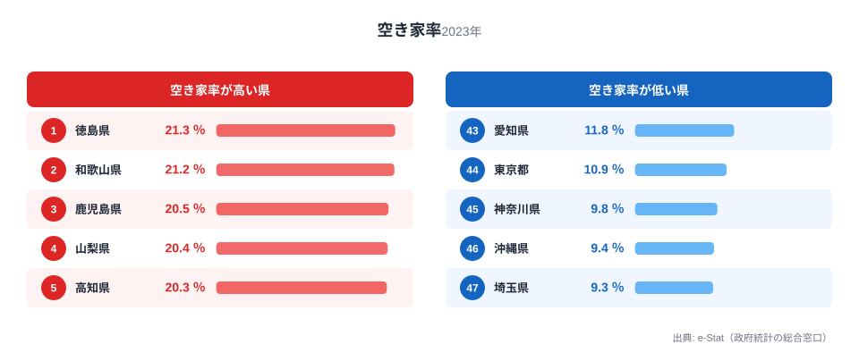
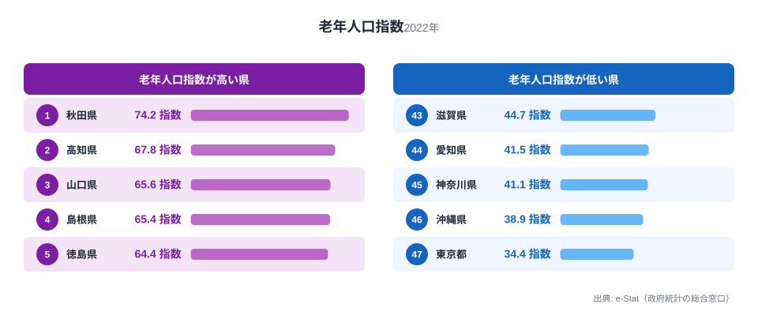

空き家率が高い都道府県は、高齢化も進んでいるのでしょうか。総住宅数に占める空き家の割合を示す「空き家率」と、生産年齢人口(15〜64歳)に対する高齢者人口(65歳以上)の比率を示す「老年人口指数」の47都道府県データを突き合わせると、相関係数は0.74という強い正の関係が見えてきます。

空き家率の1位は徳島県の21.3%、最下位は埼玉県の9.3%で2.3倍の差があります。老年人口指数の1位は秋田県の74.2、最下位は東京都の34.4で2.2倍の差です。倍率の大きさが似ているだけでなく、下位(空き家が少なく高齢化も緩やかな県)の顔ぶれがほぼ同じという事実が、この記事の核心です。ただし相関が強いからといって「高齢化が空き家を直接生む」と単純に言い切れるわけではありません。人口を統制した偏相関係数は0.56まで下がり、別の要因も効いていることを示しています。この記事では、両指標のランキングを比較しながら、どこまでが本当の関係で、どこからが見かけの相関なのかを検証します。

## 空き家率ランキング｜1位徳島、最下位埼玉

2023年の空き家率は、[徳島県](/areas/36000)21.3%を筆頭に、和歌山県21.2%、鹿児島県20.5%、山梨県20.4%、高知県20.3%と続きます。上位5県は四国・近畿・九州・甲信越に散らばっており、単純な「西日本が高い」という地理的な説明では片付けられません。

> [!NOTE]
> 空き家率は総務省「住宅・土地統計調査」の総住宅数に占める空き家の割合です。空き家には賃貸・売却用の住宅や別荘などの「二次的住宅」も含まれるため、必ずしも「放置された廃屋の割合」を直接示す数値ではありません。地域によっては賃貸物件の供給過多や別荘需要も空き家率を押し上げます。

一方、最下位側は埼玉県9.3%、神奈川県9.8%、沖縄県9.4%、東京都10.9%、愛知県11.8%と、南関東を中心とした人口流入が続く都市圏が並びます。沖縄県だけは地方でありながら空き家率が低く、後述する老年人口指数でも同様に最下位グループに入っている点は興味深い例外です。沖縄は出生率の高さから人口の年齢構成が若く、住宅需要が底堅いことが背景にあると考えられます。

<source-link href="/ranking/vacant-housing-rate">空き家率ランキングをもっと見る</source-link>

## 老年人口指数ランキング｜同じ県が上位に並ぶのか

老年人口指数の上位は秋田県74.2、高知県67.8、山口県65.6、島根県65.4、徳島県64.4という顔ぶれです。空き家率ランキングの上位10県(徳島・和歌山・鹿児島・山梨・高知・長野・愛媛・山口・大分・香川)と老年人口指数の上位10県(秋田・高知・山口・島根・徳島・山形・青森・岩手・長崎・大分)を突き合わせると、徳島・高知・山口・大分の4県が両方の上位10入りを果たしています。

より際立つのは下位側です。空き家率の下位10県と老年人口指数の下位10県を比べると、宮城・福岡・千葉・滋賀・愛知・東京・神奈川・沖縄・埼玉の9県が完全に一致します。これは偶然というより、人口流入が続く都市圏では「空き家になる前に次の住民が入る」「高齢者の比率も相対的に低く保たれる」という同じメカニズムが同時に働いていることを示唆しています。

<source-link href="/ranking/old-population-index">老年人口指数ランキングをもっと見る</source-link>

## 空き家率×老年人口指数の相関｜見かけか、実態か

47都道府県の空き家率と老年人口指数を散布図にすると、右肩上がりの傾向がはっきり見えます。相関係数は0.737で、統計的にはかなり強い正の相関です。メカニズムとして最も自然な説明は「高齢の単身・二人世帯が施設入所や死去で家を離れても、地方では次の住み手が見つからず空き家化しやすい」というものです。都市部では同じ現象が起きても賃貸・売買市場が厚いため、空き家が短期間で埋まりやすいという非対称性も考えられます。

ただしこの相関を「高齢化が空き家を作る」と直接読むのは早計です。人口減少や地方からの転出そのものが、老年人口指数の上昇(残った高齢者の比率が相対的に高くなる)と空き家の増加(住宅需要そのものが縮小する)を両方とも引き起こしている可能性があるためです。実際、都道府県の総人口規模を統制した偏相関係数を計算すると0.561まで下がります。単純相関0.74のうち、一部は「人口規模が小さい県ほど両方の値が高くなりやすい」という共通要因で説明でき、残る部分がより直接的な高齢化と空き家の関係だと整理できます。

この見立てを裏付けるように、[秋田県](/areas/05000)は老年人口指数が全国1位(74.2)でありながら、空き家率は23位(15.8%)にとどまっています。高齢化の進み方に対して空き家率が突出していないのは、雪国特有の事情で古い住宅の取り壊しが比較的進んでいることや、同居・近居の慣習が空き家化を抑えている可能性が考えられます[仮説]。逆に和歌山県は空き家率が全国2位(21.2%)である一方、老年人口指数は13位(62.0)と上位ながら突出はしていません。紀伊半島南部の別荘・保養所需要や、過疎地域での住宅供給過多が高齢化とは別の経路で空き家率を押し上げていると考えられます[仮説]。いずれも本記事のデータだけでは検証しきれない仮説であり、世帯構造や住宅ストックの築年数など追加データでの裏付けが必要です。

> [!WARNING]
> 相関係数0.74は「関係がある」ことを示しますが、「高齢化が原因で空き家が結果」という因果関係を証明するものではありません。人口規模・住宅供給量・世帯構成の変化など複数の要因が同時に効いている可能性が高く、偏相関係数0.56まで下がる事実がそれを裏付けています。ランキングの一致だけで因果を断定しないよう注意してください。

> [!TIP]
> 高齢化と住まいの関係をさらに掘り下げるなら、65歳以上の単身世帯比率も合わせて見ると輪郭がはっきりします。関連記事「[高齢単身世帯の実態](/blog/aging-solo-living-crisis)」では、独居高齢者の増加がどの県で進んでいるかを別の角度から扱っています。

## 発見｜都市圏で完全に一致する下位グループ

- 空き家率の下位10県と老年人口指数の下位10県は、9/10という高い一致率を示しました。都市部への人口流入は「空き家を作らない」ことと「高齢化を緩やかにする」ことを同時に実現しています。
- 上位側の一致率は4/10とやや低く、空き家率の高さは高齢化以外の要因(別荘需要、住宅供給過剰、雪国の建て替え事情など)にも左右されることを示しています。
- 秋田県(老年人口指数1位・空き家率23位)と和歌山県(空き家率2位・老年人口指数13位)は、相関から外れる代表例として今後の追加検証に値します[仮説]。
- 相関係数0.74は強い関係ですが、人口規模を統制すると0.56まで低下します。「見かけの相関」と「実態としての関係」の両方が混在していると考えるのが妥当です。

## まとめ

- 空き家率は徳島県21.3%が1位、埼玉県9.3%が最下位で2.3倍差(2023年)
- 老年人口指数は秋田県74.2が1位、東京都34.4が最下位で2.2倍差(2022年度)
- 両指標の相関係数は0.737、人口規模を統制した偏相関係数は0.561
- 下位10県は9/10が一致し、都市部で「空き家が少ない」ことと「高齢化が緩やか」なことが同時に起きている
- 上位側は4/10の一致にとどまり、高齢化以外の地域固有要因(別荘需要・住宅供給・雪国事情など)が空き家率に影響している

## データ出典

空き家率は総務省「住宅・土地統計調査」(2023年)、老年人口指数は総務省統計局「社会・人口統計体系」(2022年度)に基づき、e-Stat(政府統計の総合窓口)経由で取得・整備しました。相関分析は両指標の都道府県別最新値を用いた単純相関・偏相関(人口規模統制)です。
