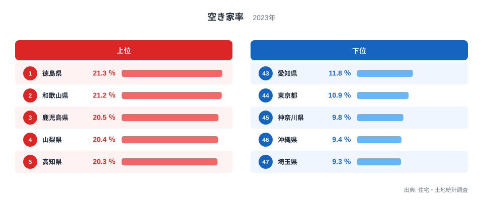
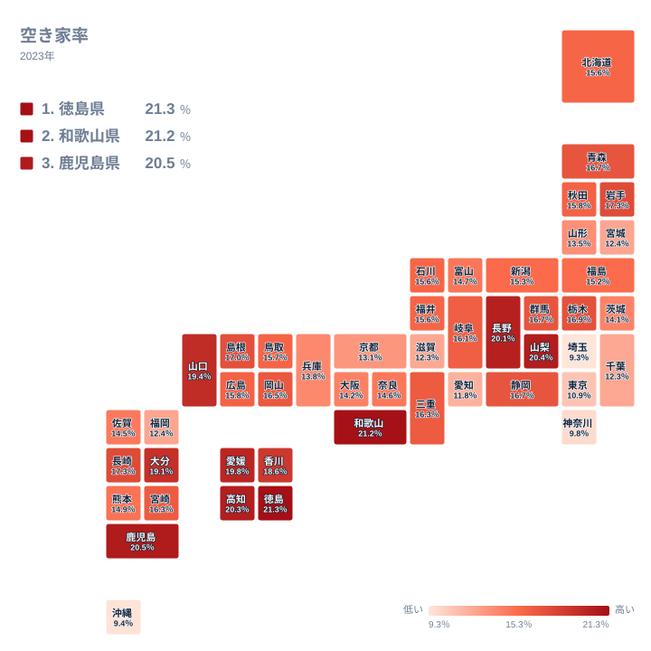

実家に戻る頻度が減った、親が一人で住んでいる、そろそろ将来のことを考えないといけない──そんな気配を感じている方は少なくないはずです。総住宅数に占める空き家の割合を示す空き家率は、2023年の調査で全国1位が徳島県の21.3％でした。約5軒に1軒が空き家という計算になります。最下位の埼玉県は9.3％で、1位との差は2.3倍にのぼります。

この記事では都道府県別の空き家率データを起点に、「自分の実家がある県は、空き家が多い側か少ない側か」を確認したうえで、空き家率が高い地域で実際に何が起きているのか、そして家を継ぐかもしれない個人にとって何がリスクになるのかを見ていきます。統計としての空き家率は地域の指標ですが、その裏側では一軒一軒の家について「住むか、貸すか、売るか、解体するか」という判断が積み重なっています。この記事を読み終えたときには、実家の空き家が単なる将来の心配ごとではなく、いつ・何を決めればよいかという具体的な論点として見えてくるはずです。

## 空き家率の上位と下位

<source-link href="/ranking/vacant-housing-rate">空き家率ランキングをもっと見る</source-link>

空き家率の1位は徳島県で21.3％です。2位は和歌山県で21.2％、3位は鹿児島県で20.5％、4位は山梨県で20.4％、5位は高知県で20.3％と続きます。上位5県はいずれも四国・近畿南部・九州南部・甲信地方に位置し、人口減少や高齢化が先行している地方部です。

最下位は埼玉県で9.3％です。46位は沖縄県で9.4％、45位は神奈川県で9.8％、44位は東京都で10.9％、43位は愛知県で11.8％と続きます。首都圏や中京圏では住宅需要が高く、賃貸・売買の両方で「住み手のつかない家」が生まれにくい構造になっています。

地図で見ると、空き家率の高い県は西日本と甲信地方に偏っています。これは偶然ではなく、進学・就職を機に若い世代が都市部へ移り、地元に残った親世代の住宅が使われなくなっていくという人口移動の結果が、地域ごとの濃淡として現れたものです。実家がこの上位県にある場合、家を継ぐかどうかという判断が、統計的にも他の地域より早く訪れやすいと言えます。

> [!NOTE]
> 空き家率は「総住宅数」に占める割合で、別荘・賃貸空き室・売却用の住宅も含みます。すべてが「相続されたまま放置された実家」ではありませんが、住宅・土地統計調査の内訳では「その他の住宅」(賃貸・売却用でも二次的住宅でもない空き家)が地方部で目立って多く、相続後に手つかずのまま残った家がこの区分に含まれやすいとされています。

## なぜ上位県で空き家が増えやすいのか

空き家率が高い県に共通するのは、人口の流出が先行して起きたことです。子ども世代が都市部で就職・結婚して定住し、実家に戻らないまま親が高齢になると、親が施設に入る、あるいは亡くなるタイミングで住宅だけが取り残されます。同居していた家族がいなくなった住宅は、遠方に住む相続人がすぐに使い道を決められず、そのまま数年放置されるケースが少なくありません。

さらに地方の住宅は、都市部に比べて売却や賃貸の需要が弱く、「相続したくても手放しにくい」という事情も重なります。解体するにも費用がかかり、更地にすると固定資産税の住宅用地特例が外れて税負担が増えることも、空き家のまま放置される一因になっています。空き家率が高い県ほど、こうした「決めきれない」事情が積み重なっている可能性があります。

## 実家を継ぐ側に生じるリスク

> [!WARNING]
> 空き家を放置すると、倒壊の危険や著しい衛生上の問題があると自治体が判断した場合、「特定空家等」に指定されることがあります。指定されると固定資産税の住宅用地特例(更地より税額が軽くなる措置)が解除され、税負担が最大で従来の6倍程度に増える可能性があります。所有者(相続人)への影響が大きいため、実家が空き家になった際は早めに状態を確認しておくことが重要です。

相続で取得した家は、住まない・貸さない・売らないと決めた場合でも、所有者である以上は管理義務からは逃れられません。2023年の民法改正により、相続放棄をした場合でも、他の相続人や国が管理を始めるまでは一定の管理責任が残る扱いに整理されました。「相続を放棄すれば関係がなくなる」という理解は正確ではなく、空き家をどうするかは早い段階で家族内の合意を作っておく必要があります。

[仮説] 空き家率が高い県ほど、相続をきっかけに空き家化する住宅の比率も高いと考えられます。ただし住宅・土地統計調査の空き家率は「発生要因別」の内訳までは示していないため、この記事のデータだけでは相続起因の空き家の割合を特定できません。検証には別途、空き家所有者への意識調査等のデータが必要です。

> [!TIP]
> 実家が空き家になりそうな場合の選択肢は、主に「自分や家族が住む」「賃貸に出す」「売却する」「解体して更地にする」の4つです。市区町村の「空き家バンク」に登録すると、移住希望者などとのマッチングを試すこともできます。判断を先延ばしにするほど、建物の傷みが進み選択肢が狭まっていく点には注意が必要です。

## 最下位グループから見える対照

埼玉県・沖縄県・神奈川県・東京都・愛知県という下位5県は、いずれも人口の流入が続いている地域です。住宅需要が旺盛なため、相続で家が空いてもすぐに賃貸や売却の話がまとまりやすく、空き家として長く残りにくい構造になっています。これは「都市部なら安心」という意味ではなく、地方に比べて空き家化のリスクが相対的に低いというだけで、都市部でも高齢の親が一人で住む家が将来空き家になる可能性そのものはなくなりません。

実際、上位県と下位県の差は2.3倍にとどまり、10倍・20倍という極端な格差ではありません。埼玉県でも9.3％、つまり約11軒に1軒は空き家です。空き家問題は「地方だけの話」ではなく、程度の差はあれ全国共通の課題だと捉えるほうが実態に近いと言えます。

## まとめ

- 空き家率の1位は徳島県21.3％、2位和歌山県21.2％、3位鹿児島県20.5％
- 最下位は埼玉県9.3％で、1位との差は2.3倍
- 上位5県は四国・近畿南部・九州南部・甲信地方に集中し、人口流出が先行した地方部で高い
- 空き家を相続すると、放置しても管理義務は残り、「特定空家等」に指定されると税負担が増える可能性がある
- 空き家率が最下位クラスの都市部でも、高齢の親が住む家が将来空き家になるリスクは残る

空き家率1位の[徳島県のデータ](/areas/36000)、最下位の[埼玉県のデータ](/areas/11000)では、それぞれの県の他の指標もあわせて確認できます。[住宅・土地に関する統計一覧](/category/construction)も参考にしてください。

## データ出典

空き家率は総務省「住宅・土地統計調査」の2023年データを使用しています。特定空家等・固定資産税の住宅用地特例・相続放棄後の管理責任に関する記述は、空家等対策特別措置法および2023年民法改正の一般的な制度説明であり、都道府県別データの検証対象ではありません。個別の税額や管理義務の詳細は、お住まいの自治体または専門家にご確認ください。
