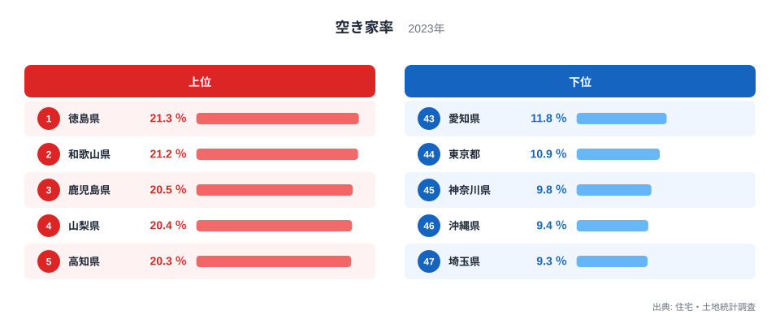
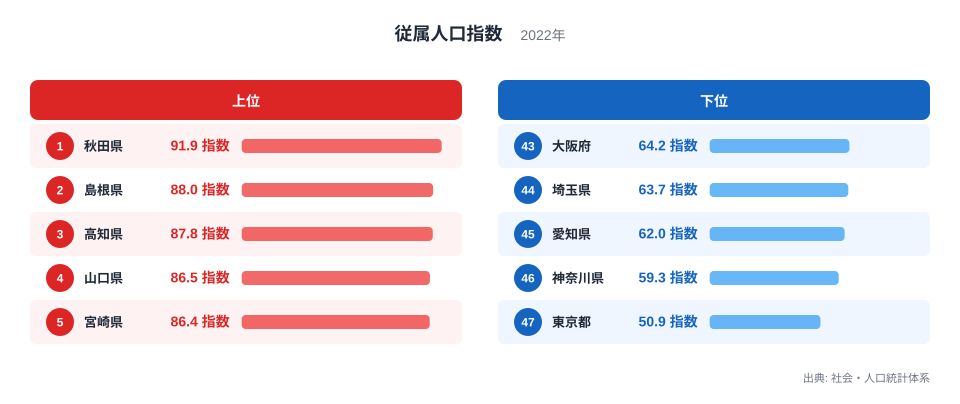
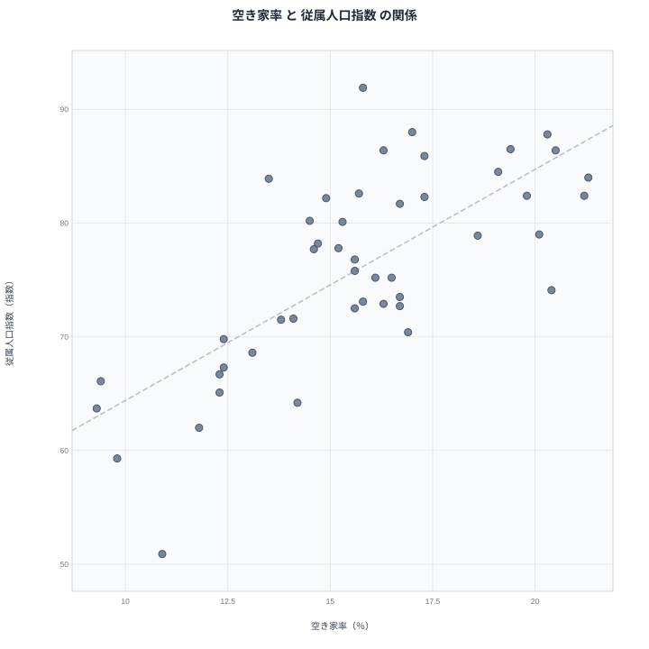

空き家の増加は、地域の人口構造の変化を映す鏡のような現象です。働く世代が減り、高齢者や子どもの割合が増えている地域では、住む人のいなくなった家も増えやすいのではないかと考えられます。この記事では2023年の空き家率と2022年の従属人口指数を都道府県別に並べ、両者の関係を確かめていきます。

先に結論を示すと、両者には明確な重なりが見られます。空き家率が最も高い徳島県は、従属人口指数でも高い水準にあります。この記事では、この重なりの背景にある人口構造の変化を丁寧に見ていきます。

## 空き家率の上位と下位

<source-link href="/ranking/vacant-housing-rate">空き家率ランキングをもっと見る</source-link>

空き家率の1位は徳島県で21.3％です。2位は和歌山県で21.2％、3位は鹿児島県で20.5％と続きます。四国や近畿の一部、九州南部の県が上位に集まっており、人口減少が進む地方部で空き家が目立つ様子がうかがえます。

最下位は埼玉県で9.3％です。46位は沖縄県で9.4％、45位は神奈川県で9.8％と続きます。1位の徳島県と47位の埼玉県のあいだには、12ポイントもの開きがあります。埼玉県や神奈川県は首都圏のベッドタウンとして住宅需要が高く、空き家が発生しにくい地域です。

## 従属人口指数の上位と下位

従属人口指数の1位は秋田県で91.9指数です。2位は島根県で88指数、3位は高知県で87.8指数と続きます。従属人口指数は働く世代に対して高齢者や子どもがどれだけいるかを示す指標で、秋田県や島根県のように高齢化が進んだ県で高くなっています。

最下位は東京都で50.9指数です。46位は神奈川県で59.3指数、45位は愛知県で62指数と続きます。1位の秋田県と47位の東京都のあいだには、41指数という大きな開きがあります。東京都は働く世代の人口が集中しているため、指数が全国で最も低くなっています。

## 見かけの相関と真因

散布図を見ると、空き家率が高い県ほど従属人口指数も高いという右肩上がりの傾向がはっきりと見えます。徳島県は空き家率で1位、従属人口指数で9位です。鹿児島県は空き家率で3位、従属人口指数で6位と、両方の上位に位置する県が重なっています。

> [!WARNING]
> 空き家率と従属人口指数の重なりは相関であって、従属人口指数が高いから空き家が増える、という単純な因果関係だけで説明できるものではありません。両者を結びつけている人口の流れそのものに目を向ける必要があります。

この重なりを生んでいる本当の要因は、若い世代の人口流出だと考えられます。地方の県では、進学や就職を機に若い世代が都市部へ移り住み、地元に残るのは高齢者が中心になりやすい傾向があります。高齢者だけが暮らしていた住宅は、住人が施設に入居したり亡くなったりすると空き家になりやすく、後を継ぐ若い世代が地元にいなければ、そのまま放置される可能性が高まります。つまり、従属人口指数の高さと空き家率の高さは、どちらも若い世代の流出という同じ人口動態の変化から生じている結果であり、片方がもう片方を直接引き起こしているわけではありません。

## 首都圏の低い指標が示す裏返しの構造

空き家率と従属人口指数がどちらも低い埼玉県や東京都、神奈川県は、逆の意味で同じ構造を映しています。これらの県は若い世代の流入が続いているため、従属人口指数が低く抑えられ、住宅需要も高く保たれているため空き家率も低くなっています。地方から都市部へ人が移動することで、送り出す側の県では空き家率と従属人口指数がともに上昇し、受け入れる側の県ではともに低く保たれるという、日本全体の人口移動の構図が浮かび上がります。

> [!TIP]
> 空き家率のような住宅の指標を読むときは、単独で見るのではなく、人口構成を示す指標と組み合わせることで、地域が抱える人口動態の課題がより立体的に見えてきます。

## 47都道府県を俯瞰して見えること

空き家率と従属人口指数を47都道府県で並べてみると、両者が示しているのは住宅の余剰そのものではなく、地域ごとの人口動態の速度差だとわかります。人口が流出し続けている地方部では、高齢者だけの世帯が徐々に空き家へと変わっていく一方、後を継ぐ若い世代が地元にとどまらないため、空き家が新しい住民によって再び使われることも少なくなります。この循環が長く続くことで、従属人口指数と空き家率の両方が高い水準で定着してしまいます。

逆に、都市部への人口流入が続く限り、従属人口指数と空き家率はともに低く抑えられます。ただし、この構図は将来にわたって固定されたものではありません。流入する若い世代もいずれ高齢化していくため、現時点で空き家率が低い都市部でも、将来的には同じ課題に直面する可能性があります。空き家率と従属人口指数を重ねて読むことは、いまの地域差を確認するだけでなく、今後の人口動態の見通しを考えるきっかけにもなります。

## 中位の県から見える緩やかな移行

上位や下位ほど極端ではない中位の県を見ると、空き家率と従属人口指数の関係がより緩やかであることもわかります。長野県は空き家率で6位という上位に位置しますが、従属人口指数では79指数と全国平均に近い水準にとどまっています。地方であっても、観光業や別荘需要など空き家の背景にある事情が県によって異なるため、両者の重なりは一様ではなく、地域ごとの個別の事情も踏まえて読む必要があります。

## データ出典

空き家率は住宅・土地統計調査の2023年データ、従属人口指数は社会・人口統計体系の2022年データを使用しています。

> [!NOTE]
> 従属人口指数は、15歳から64歳までの生産年齢人口に対する、14歳以下と65歳以上の人口の比率を示す指標です。数値が高いほど、働く世代1人あたりが支える高齢者や子どもの人数が多いことを意味します。

[従属人口指数ランキング](/ranking/dependent-population-index)や[同じカテゴリの統計一覧](/category/construction)もあわせてご覧ください。空き家率1位の[徳島県のデータ](/areas/36000)、2位の[和歌山県のデータ](/areas/30000)では、それぞれの県の他の指標も確認できます。
