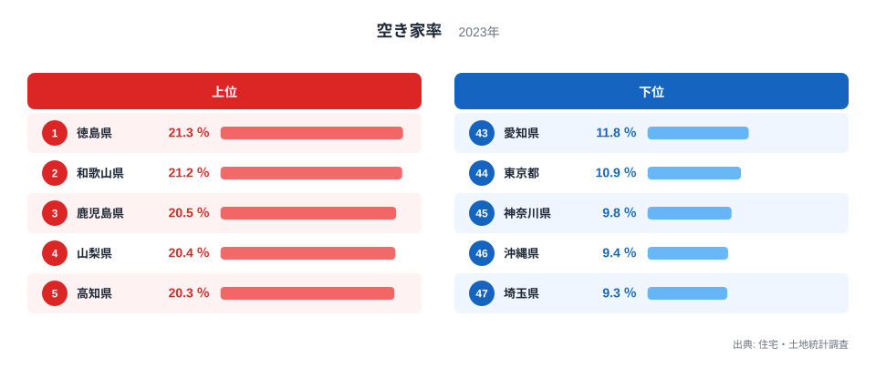
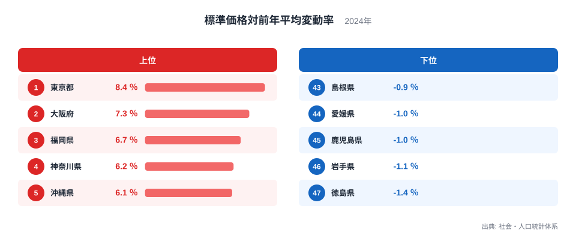
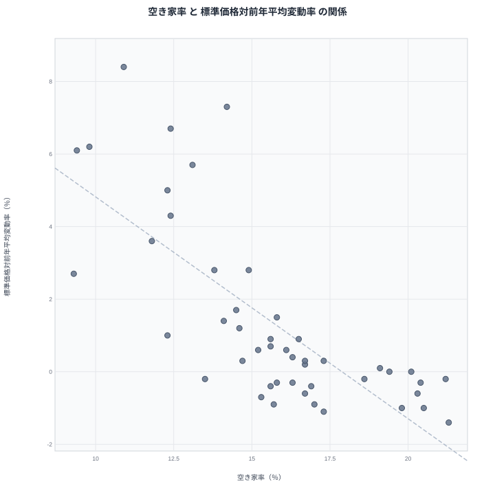

空き家率が最も高いのは徳島県で21.3％です。同じ徳島県は商業地の標準価格対前年平均変動率でマイナス1.4％と、全国で最も下落幅が大きい水準にあります。空き家率が高い県ほど地価の変動率は低くなる、あるいは下落するという逆方向の関係が見えてきます。この記事では、都道府県別データから空き家率と標準価格対前年平均変動率の関係を見ていきます。

## 空き家率の上位と下位

<source-link href="/ranking/vacant-housing-rate">空き家率ランキングをもっと見る</source-link>

空き家率は徳島県が21.3％で全国1位です。2位は和歌山県で21.2％、3位は鹿児島県で20.5％、4位は山梨県で20.4％、5位は高知県で20.3％となっています。上位には四国や九州、甲信地方の県が並んでおり、人口減少が進む地方圏の県が多く含まれています。

一方で下位を見ると、埼玉県が9.3％で最下位です。46位は沖縄県で9.4％、45位は神奈川県で9.8％、44位は東京都で10.9％、43位は愛知県で11.8％となっています。首都圏や中京圏の都県が下位に集まっており、人口が集中する大都市圏では空き家率が低くなる傾向が見られます。

空き家率は住宅ストック全体に占める空き家の割合を示す指標であり、人口減少や高齢化が進む地方圏では、相続された住宅が利用されずに空き家となるケースが増えやすい傾向があります。逆に人口が流入し続ける大都市圏では、住宅需要が旺盛なため空き家率が低く抑えられていると考えられます。

## 標準価格対前年平均変動率の上位と下位

あわせて見る: [標準価格対前年平均変動率ランキング](/ranking/standard-price-change-rate-commercial)

標準価格対前年平均変動率は東京都が8.4％で全国1位です。2位は大阪府で7.3％、3位は福岡県で6.7％、4位は神奈川県で6.2％、5位は沖縄県で6.1％となっています。上位には大都市圏や地価上昇が続くエリアが並んでおり、空き家率で下位だった東京都、神奈川県が、この指標では逆に上位を占めています。

下位に目を向けると、徳島県がマイナス1.4％で最下位です。46位は岩手県でマイナス1.1％、45位は鹿児島県もマイナス1％、44位は愛媛県もマイナス1％、43位は島根県でマイナス0.9％となっています。空き家率で上位だった徳島県、鹿児島県が、この指標では逆に下位に位置しています。

空き家率の上位県だった徳島県、鹿児島県が標準価格対前年平均変動率の下位に、空き家率の下位県だった東京都、神奈川県が標準価格対前年平均変動率の上位に、それぞれ入れ替わって現れていることが分かります。

## 2つの指標の相関を見る

散布図では、空き家率が高い県ほど標準価格対前年平均変動率が低くなる、あるいはマイナスになるという逆方向の傾向がはっきりと見えます。徳島県、和歌山県、鹿児島県のように空き家率が高い県は、標準価格対前年平均変動率がゼロを下回る側に位置しています。一方で東京都、大阪府、神奈川県のように空き家率が低い都府県は、標準価格対前年平均変動率が高い側に位置しています。

> [!WARNING]
> この相関は「空き家が増えると地価が下がる」という単純な因果関係を示すものではありません。標準価格対前年平均変動率は商業地の地価に関する指標であり、空き家率は住宅ストック全体の指標です。両者が逆方向に動いているように見える背景には、人口動態や地域経済の活発さという別の要因が存在すると考えられます。

人口が減少し続ける地方圏では、住宅需要の低下によって空き家が増える一方、商業地の地価も需要の弱まりを反映して伸び悩んだり下落したりする傾向があります。逆に人口が流入し続ける大都市圏では、住宅需要が旺盛で空き家率が低く抑えられると同時に、商業活動の活発さから地価も上昇する傾向にあります。つまり両指標は、人口動態という共通の土台の上で、それぞれ逆方向に動いていると考えられます。

## なぜこの逆相関が生まれるのか

空き家率と標準価格対前年平均変動率が逆方向に動く最大の理由は、どちらも人口動態や地域経済の活発さを映し出しているためです。人口が減少し高齢化が進む地方圏では、住宅を利用する世帯が減る一方で、商業活動も縮小しやすく、地価の上昇圧力が弱まります。徳島県や鹿児島県、和歌山県はこうした地方圏の特徴を色濃く持っており、空き家率が高い一方で地価変動率がマイナスになっています。

一方で東京都や大阪府、神奈川県のような大都市圏は、人口の流入が続き住宅需要も商業需要も強いため、空き家率が低く保たれると同時に地価も上昇を続けています。両指標は同じ人口動態という現象を、住宅の側面と地価の側面からそれぞれ映し出していると言えます。

> [!TIP]
> このような逆相関を読み解くときは、片方の指標だけを見て地域の課題を判断せず、人口動態や経済活動の全体像とあわせて確認することが大切です。空き家率が高い地域は、住宅政策だけでなく地域経済全体の活性化策も必要になる場合があります。

## まとめ

空き家率と標準価格対前年平均変動率は、都道府県別に見ると逆方向に動く2つの指標です。徳島県は空き家率が21.3％で全国1位である一方、標準価格対前年平均変動率はマイナス1.4％で最下位となっています。逆に東京都は標準価格対前年平均変動率が8.4％で全国1位である一方、空き家率は10.9％と低い水準にとどまっています。

> [!NOTE]
> 標準価格対前年平均変動率は「商業地」の地価を対象とした指標であり、空き家率が対象とする「住宅」全体とは調査対象が異なります。両指標を直接比較する際はこの点に留意する必要があります。

人口動態と地域経済の活発さという共通の要因が、この2つの指標を逆方向に連動させていると考えられます。住宅の空き家率と商業地の地価変動率という異なる文脈のデータですが、地域の人口の増減というつながりを通じて逆向きに重なって見えることが分かります。

より詳しいデータを確認したい場合は、[標準価格対前年平均変動率ランキング](/ranking/standard-price-change-rate-commercial)や[同じカテゴリの統計一覧](/category/construction)もあわせてご覧ください。空き家率の上位に入った[徳島県のデータ](/areas/36000)や[和歌山県のデータ](/areas/30000)では、他の統計との関係もさらに詳しく見ることができます。

## データ出典

空き家率は住宅・土地統計調査の2023年データ、標準価格対前年平均変動率は社会・人口統計体系の2024年データを使用しています。
