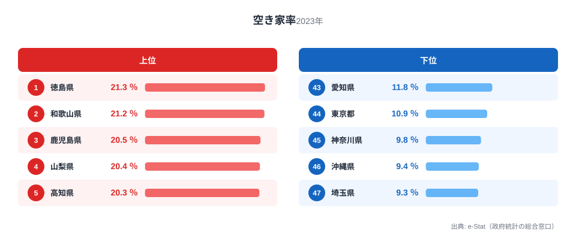
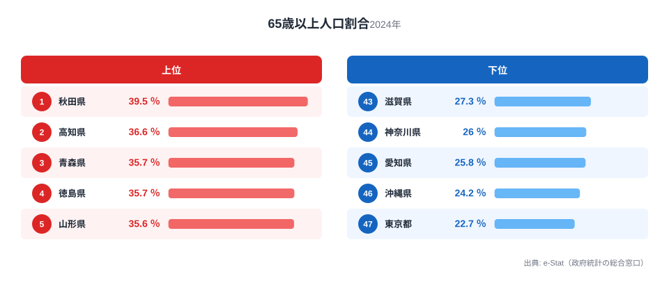

空き家率が高い都道府県は高齢化も進んでいる、という関係は47都道府県データでもおおむね成り立ちます。総住宅数に占める空き家の割合を示す「空き家率」と、総人口に占める65歳以上人口の割合を示す「65歳以上人口割合」の相関係数は0.733です。ところがこの関係が最も大きく崩れる県が山形県です。山形県は65歳以上人口割合が全国5位(35.6%)という高い水準にありながら、空き家率は37位(13.5%)と平均以下にとどまります。47都道府県のうち、2つの指標の順位差が最大(32位分)の県です。この記事では、なぜ高齢化が進んでいるのに空き家が少ない県が生まれるのかを、順位のズレという切り口から検証します。

空き家率の1位は徳島県21.3%、最下位は埼玉県9.3%で2.3倍の差があります。65歳以上人口割合の1位は秋田県39.5%、最下位は東京都22.7%で1.7倍の差です。全体としては強く相関する2つの指標が、なぜ山形県だけ大きくズレるのかを確認していきます。

## 空き家率ランキング｜1位徳島、最下位埼玉

2023年の空き家率は、[徳島県](/areas/36000)21.3%を筆頭に、和歌山県21.2%、鹿児島県20.5%、山梨県20.4%、高知県20.3%と続きます。上位5県は四国・近畿・九州・甲信越に分散しており、単純に「西日本だから高い」とは言い切れません。空き家率が高い背景には、実家を相続したものの活用も処分もされないまま放置される住宅が地方に集中しやすいという事情があります。

> [!NOTE]
> 空き家率は総務省「住宅・土地統計調査」による総住宅数に占める空き家の割合です。空き家には賃貸・売却用の住宅や別荘などの「二次的住宅」も含まれるため、必ずしも「放置された廃屋の割合」を直接示す数値ではありません。別荘需要が強い地域や賃貸供給が過剰な地域では、居住者の高齢化とは関係なく空き家率が押し上げられます。

最下位側は埼玉県9.3%、沖縄県9.4%、神奈川県9.8%、東京都10.9%、愛知県11.8%と、人口流入が続く都市圏が並びます。この中で沖縄県だけは地方でありながら空き家率が最下位グループに入っており、あとで見る65歳以上人口割合でも同様に低い順位です。出生率の高さから人口の年齢構成が若く、住宅需要が底堅いことが背景にあると考えられます。

<source-link href="/ranking/vacant-housing-rate">空き家率ランキングをもっと見る</source-link>

## 65歳以上人口割合ランキング｜秋田が突出する1位

2024年の65歳以上人口割合は、秋田県39.5%が突出した1位です。2位の高知県36.6%との差は2.9ポイントあり、47県の中でも秋田の高齢化は際立っています。3位は青森県・徳島県が35.7%で並び、5位山形県35.6%と東北勢が上位に集中しているのが特徴です。

最下位側は東京都22.7%、沖縄県24.2%、愛知県25.8%、神奈川県26.0%、埼玉県27.5%と、こちらも都市圏がそろいます。空き家率の下位グループ(埼玉・沖縄・神奈川・東京・愛知)と65歳以上人口割合の下位グループを見比べると、5県のうち4県(埼玉・沖縄・神奈川・東京)が完全に一致しています。都市部では人口流入が続くことで、空き家が生まれにくいことと高齢化が緩やかであることが同時に起きているようです。

<source-link href="/ranking/ratio-65-plus">65歳以上人口割合ランキングをもっと見る</source-link>

## 空き家率×65歳以上人口割合の相関｜山形だけが大きく崩れる理由

47都道府県の空き家率と65歳以上人口割合を散布図にすると、右肩上がりの傾向がはっきり見えます。相関係数は0.733で、統計的にはかなり強い正の相関です。ここで注目したいのは、2つのランキングを都道府県ごとに突き合わせ、順位の差(空き家率の順位マイナス65歳以上人口割合の順位)を計算したときに何が見えるかです。47県のうち順位差が最大なのは山形県で、65歳以上人口割合は5位(35.6%)という高さにありながら、空き家率は37位(13.5%)と平均以下で、順位差は32にのぼります。次いで差が大きいのは秋田県(65歳以上1位・空き家23位、差22)です。

> [!NOTE]
> 本記事が「老年人口指数」ではなく「65歳以上人口割合」を使うのには理由があります。老年人口指数は生産年齢人口(15〜64歳)に対する65歳以上人口の比率で、若年層の減少にも引っ張られて上下する相対指標です。一方、65歳以上人口割合は総人口に占める高齢者の単純な構成比で、住宅需要を直接左右する「高齢世帯がどれだけ多いか」をより素直に表します。同じ「高齢化」でも、何に対する割合かで見える景色が変わります。

山形県で高齢化と空き家率が逆転する理由として考えられるのが、持ち家率の高さと世帯構成の違いです。東北地方は全国的に持ち家率・三世代同居率が高い傾向にありますが、山形県はその中でも突出しています。総務省「住宅・土地統計調査」によれば、山形県の持ち家率は全国上位に位置し、親世帯の住宅を子世帯が引き継いで住み続けるケースが多いと考えられます[仮説]。空き家になりやすいのは「住む人がいなくなった住宅」であるのに対し、同居・近居が根付いている地域では高齢化が進んでも住宅が空かずに住み継がれる可能性があります。

> [!WARNING]
> 山形県の「高齢化が進んでいるのに空き家が少ない」という事実は、山形県の空き家対策が特別優れているという意味ではありません。相関係数0.733・偏相関係数0.555という数値が示す通り、両指標には確かに関係がありますが、山形県のような大きな順位差の存在は、高齢化以外の要因(世帯構成・持ち家率・住宅の建て替えサイクルなど)が結果を大きく左右することの証拠です。

都道府県の総人口規模を統制した偏相関係数は0.555で、単純な相関係数0.733よりも下がります。相関の一部は「人口規模が小さい県ほど高齢化率も空き家率も高くなりやすい」という共通要因(人口減少・過疎)によるもので、高齢化そのものが空き家を生む直接的な効果は、この共通要因を除いた分だけということになります。山形県のように、共通要因(人口減少)を抱えながらも空き家率だけが低く抑えられている県があるという事実は、この偏相関の低下を裏付ける具体例といえます。

> [!TIP]
> 都道府県データで「全体は強く相関するが特定の県だけ大きくズレる」現象を見つけたら、その県の住宅事情(持ち家率・世帯構成・住宅の築年数)を個別に調べると、平均的な相関だけでは見えない地域固有の要因が見つかりやすくなります。空き家率は他の指標とも関連しており、[空き家が多い県ほど地価は下がる?](/blog/vacant-housing-vs-land-price)や[空き家率と民生委員数、なぜ連動?](/blog/vacant-housing-vs-welfare-commissioner)でも別の角度から掘り下げています。

## 発見｜山形の逆転と都市圏の一致

- 空き家率と65歳以上人口割合の順位差が最大なのは山形県(65歳以上5位・空き家37位、差32)で、次いで秋田県(65歳以上1位・空き家23位、差22)です。高齢化が進んでいても空き家が少ない県があることを示しています。
- 逆に山梨県・栃木県は空き家率が上位(4位・14位)であるのに対し65歳以上人口割合は中位(24位・34位)にとどまり、山形県とは逆方向に順位がズレています。空き家率の高さは高齢化以外の要因(別荘需要・住宅供給過多など)にも左右されることを示しています。
- 空き家率の下位グループと65歳以上人口割合の下位グループは、埼玉・沖縄・神奈川・東京の4県で一致しました。人口流入が続く都市圏は「空き家が少ない」ことと「高齢化が緩やか」なことを同時に実現しています。
- 相関係数0.733は強い関係ですが、人口規模を統制すると偏相関係数は0.555まで下がります。「見かけの相関」と「実態としての関係」が混在していると考えるのが妥当です。

## まとめ

- 空き家率は徳島県21.3%が1位、埼玉県9.3%が最下位で2.3倍差(2023年)
- 65歳以上人口割合は秋田県39.5%が1位、東京都22.7%が最下位で1.7倍差(2024年)
- 両指標の相関係数は0.733、人口規模を統制した偏相関係数は0.555
- 都市部4県(埼玉・沖縄・神奈川・東京)は空き家率・65歳以上人口割合ともに下位で一致
- 山形県は65歳以上人口割合5位ながら空き家率37位という最大の順位差(32)を持つ県で、高齢化と空き家が単純な因果関係にないことを示す

## データ出典

空き家率は総務省「住宅・土地統計調査」(2023年)、65歳以上人口割合は総務省統計局「社会・人口統計体系」の人口推計・国勢調査報告(2024年度)に基づき、e-Stat(政府統計の総合窓口)経由で取得・整備しました。相関分析は両指標の都道府県別最新値を用いた単純相関・偏相関(人口規模統制)です。
