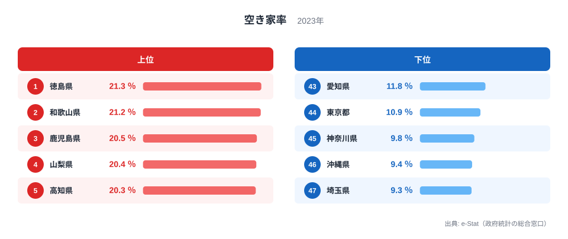
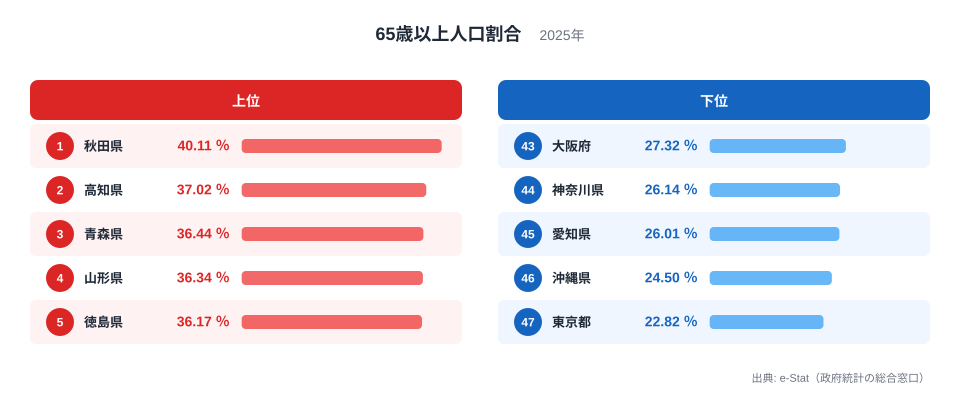
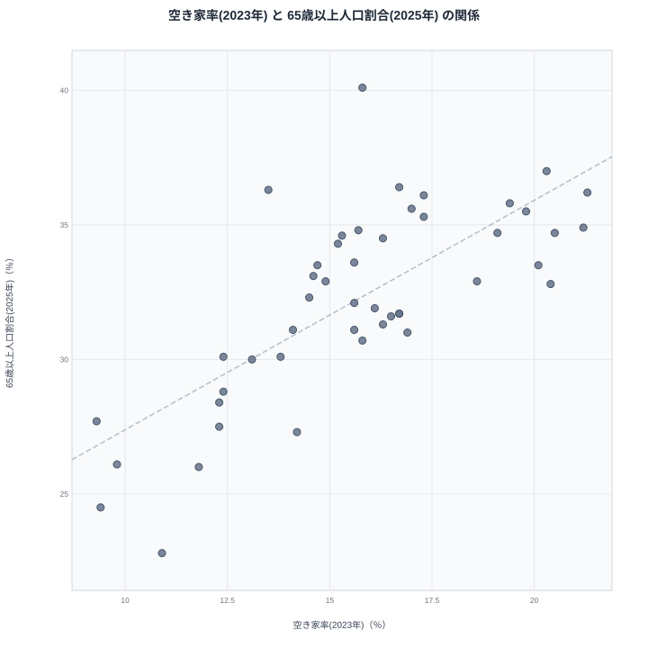

空き家率が高い都道府県は高齢化も進んでいる、という関係は47都道府県データでもおおむね成り立ちます。総住宅数に占める空き家の割合を示す「空き家率」(2023年)と、総人口に占める65歳以上人口の割合を示す「65歳以上人口割合」(2025年)の相関係数は0.735です。ところが2つの順位が最も大きく食い違う県が山形県です。山形県は65歳以上人口割合が全国4位の36.3%という高い水準にありながら、空き家率は37位の13.5%と平均以下にとどまります。47都道府県のうち、2つの指標の順位差が最大の33位分になる県です。この記事では、高齢化が進んでいるのに空き家が少ない県が生まれる理由について、データから言えることと、このデータだけでは確かめられないことを分けて整理します。

空き家率の1位は徳島県21.3%、最下位は埼玉県9.3%で2.3倍の差があります。65歳以上人口割合の1位は秋田県40.1%、最下位は東京都22.8%で1.8倍の差です。全体としては強く相関する2つの指標が、山形県でどれだけズレるのかを順に確認していきます。なお2つの指標は最新の調査年が異なるため、図ごとに年を明記し、空き家率は2023年、65歳以上人口割合は2025年の値を使います。

## 空き家率ランキング｜1位徳島、最下位埼玉

2023年の空き家率は、[徳島県](/areas/36000)21.3%を筆頭に、和歌山県21.2%、鹿児島県20.5%、山梨県20.4%、高知県20.3%と続きます。上位5県は四国・近畿・九州・甲信越に分散しており、単純に「西日本だから高い」とは言い切れません。空き家率が高い背景として、実家を相続したものの活用も処分もされないまま残る住宅が地方に多い可能性があります。ただしこのデータだけでは確かめられません。

> [!NOTE]
> 空き家率は総務省「住宅・土地統計調査」による総住宅数に占める空き家の割合です。空き家には賃貸・売却用の住宅や別荘などの「二次的住宅」も含まれるため、必ずしも「放置された廃屋の割合」を直接示す数値ではありません。別荘需要が強い地域や賃貸供給が過剰な地域では、居住者の高齢化とは関係なく空き家率が押し上げられます。

最下位側は埼玉県9.3%、沖縄県9.4%、神奈川県9.8%、東京都10.9%、愛知県11.8%と、首都圏と中京圏の都県に沖縄県が加わる顔ぶれです。沖縄県は、あとで見る65歳以上人口割合でも全国で2番目に低い46位です。人口の年齢構成が比較的若いことが空き家の少なさと重なっている可能性がありますが、このデータだけでは確かめられません。

<source-link href="/ranking/vacant-housing-rate">空き家率ランキングをもっと見る</source-link>

## 65歳以上人口割合ランキング｜秋田が突出する1位

2025年の65歳以上人口割合は、秋田県40.1%が突出した1位です。2位の高知県37.0%との差は3.1ポイントあり、47県の中でも秋田の高齢化は際立っています。3位は青森県36.4%、4位は山形県36.3%、5位は徳島県36.2%で、東北勢が上位に集中しているのが特徴です。3位から5位までは、36.4%から36.2%の間に並んでいます。

> [!NOTE]
> 65歳以上人口割合は総人口に占める65歳以上の構成比で、生産年齢人口(15〜64歳)に対する比率ではありません。2025年の値は令和7年国勢調査の原数値(年齢「不詳」を除いて算出)で、報道で使われる不詳補完値とは小数点以下が異なります。

最下位側は東京都22.8%、沖縄県24.5%、愛知県26.0%、神奈川県26.1%、大阪府27.3%と、こちらも大都市圏の府県が中心です。空き家率の下位グループ(埼玉・沖縄・神奈川・東京・愛知)と65歳以上人口割合の下位グループを見比べると、5県のうち4県(沖縄・神奈川・東京・愛知)が一致しています。埼玉県は空き家率が最下位でも、65歳以上人口割合は41位で下位5県に入りません。この4県では、空き家が少ないことと高齢化が緩やかなことが同時に見られます。人口の流入や若い世代の多さが背景にある可能性もありますが、人口移動や年齢別の人口は今回使っていないため、このデータだけでは確かめられません。

<source-link href="/ranking/ratio-65-plus">65歳以上人口割合ランキングをもっと見る</source-link>

## 空き家率×65歳以上人口割合の相関｜山形の順位が最も大きくズレる

47都道府県の空き家率(2023年)と65歳以上人口割合(2025年)を散布図にすると、右肩上がりの傾向がはっきり見えます。相関係数は0.735で、統計的にはかなり強い正の相関です。散布図は都道府県コードで2つの値を結合した47点すべてを描いています。ここで注目したいのは、2つのランキングを都道府県ごとに突き合わせ、順位の差(空き家率の順位マイナス65歳以上人口割合の順位)を計算したときに何が見えるかです。47県のうち順位差が最大なのは山形県で、65歳以上人口割合は4位の36.3%という高さにありながら、空き家率は37位の13.5%と平均以下で、順位差は33にのぼります。次いで差が大きいのは秋田県で、65歳以上人口割合は1位、空き家率は23位であり、差は22です。

> [!WARNING]
> 山形県の「高齢化が進んでいるのに空き家が少ない」という事実は、山形県の空き家対策が特別優れているという意味ではありません。相関係数0.735は2つの指標が一緒に動きやすいことを示すだけで、一方が他方の原因だとは示しません。

### データから言えること

まず、高齢化の水準が同じでも空き家率はかなり違います。山形県の65歳以上人口割合は36.3%、徳島県は36.2%とほぼ同じ水準ですが、空き家率は山形県が13.5%、徳島県が21.3%で、7.8ポイントの開きがあります。徳島県は空き家率が1位、山形県は37位です。高齢化の度合いだけでは空き家率が決まらないことが、この2県の比較からも読み取れます。

次に、相関係数0.735を2乗した決定係数は約0.54です。空き家率のばらつきのうち、65歳以上人口割合との直線的な関係で説明できるのはおよそ半分にとどまり、残りの約半分はこの直線では捉えられない部分です。高齢化以外の要因のほか、2023年と2025年という調査年のずれや、直線では表せない関係も含まれる可能性があります。

さらに、散布図の47点に直線を当てはめ、空き家率が直線からどれだけ外れるかを見ると、下に大きく外れるのは秋田県と山形県の2県です。直線から見た空き家率は、秋田県が約4.9ポイント、山形県が約4.8ポイント低く、両県の差はわずかです。順位の差が最大なのは山形県でしたが、直線からの距離では秋田県がわずかに上回ります。逆に、上に最も大きく外れるのは山梨県で、約4.4ポイント高くなっています。

### このデータだけでは確かめられないこと

秋田県と山形県の空き家率が、高齢化から見て低めになる理由は、この記事の2つの指標からは分かりません。考えられる候補として、親世帯の住宅を子世帯が引き継いで住み続けるなど、住宅が空き家にならず住み継がれている可能性があります。同居や近居が根付いている地域では、高齢化が進んでも住宅が空きにくいかもしれません。そのほかにも、持ち家と賃貸の割合の違い、古い住宅が取り壊されたり建て替えられたりする進み方の違いなどが関わっている可能性があります。ただし、今回使った2つの指標には持ち家率、世帯構成、住宅の建て替えや取り壊しの状況が含まれていないため、どれが当てはまるかは確かめられていません。

確かめるには、持ち家率や世帯構成を示す指標を並べて、同じように順位のズレを見る必要があります。空き家率は他の指標とも関連しており、[空き家が多い県ほど地価は下がる?](/blog/vacant-housing-vs-land-price)や[空き家率と民生委員数、なぜ連動?](/blog/vacant-housing-vs-welfare-commissioner)でも別の角度から掘り下げています。

## 発見｜山形の逆転と下位グループの一致

- 直線より空き家率が大きく低い秋田県と山形県は、どちらも東北の隣り合う県です。同じ説明が両県に当てはまるかは、住宅の受け継がれ方などのデータで確かめる必要があります。
- 逆に山梨県・栃木県は空き家率が上位の4位・14位であるのに対し、65歳以上人口割合は中位から下位寄りの24位・34位にとどまり、山形県とは逆方向に順位がズレています。山梨県は直線から最も大きく上に外れる県でもあり、空き家率の高さは高齢化以外の要因にも左右される可能性があります。
- 空き家率の下位グループと65歳以上人口割合の下位グループは、沖縄・神奈川・東京・愛知の4県で一致しました。空き家が少ないことと高齢化が緩やかなことが同じ県に重なっていますが、その背景は今回のデータでは確かめていません。

## まとめ

- 空き家率は徳島県21.3%が1位、埼玉県9.3%が最下位で2.3倍差(2023年)
- 65歳以上人口割合は秋田県40.1%が1位、東京都22.8%が最下位で1.8倍差(2025年)
- 両指標の相関係数は0.735で、決定係数は約0.54
- 沖縄・神奈川・東京・愛知の4県は空き家率・65歳以上人口割合ともに下位5県に入って一致
- 山形県は65歳以上人口割合4位ながら空き家率37位という最大の順位差(33)を持つ県で、高齢化と空き家が単純な因果関係にないことを示す

## データについて

空き家率は総務省「住宅・土地統計調査」(2023年)、65歳以上人口割合は総務省統計局「国勢調査」(2025年、令和7年国勢調査の原数値で、年齢「不詳」を除いて算出)に基づき、e-Stat(政府統計の総合窓口)経由で取得・整備しました。相関分析は、空き家率(2023年)と65歳以上人口割合(2025年)の都道府県別値を都道府県コードで結合した47点の単純相関です。順位差は、空き家率の順位から65歳以上人口割合の順位を引いた値です。直線からの外れは、空き家率を65歳以上人口割合で説明する単回帰を47点で求め、実測値から直線上の値を引いた差(残差)で、65歳以上人口割合は小数第1位に丸めた値で計算しています。
