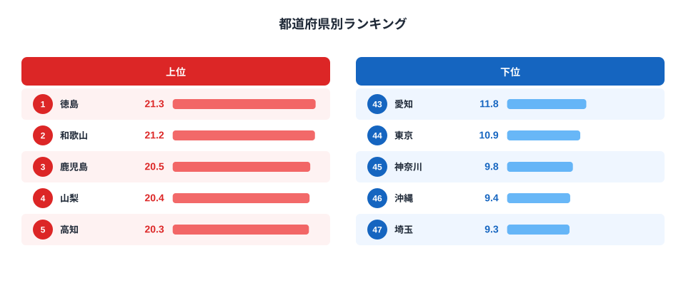
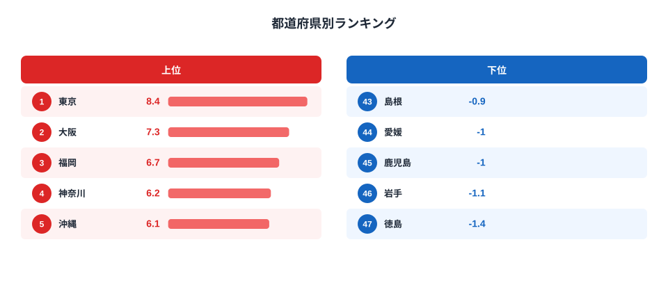
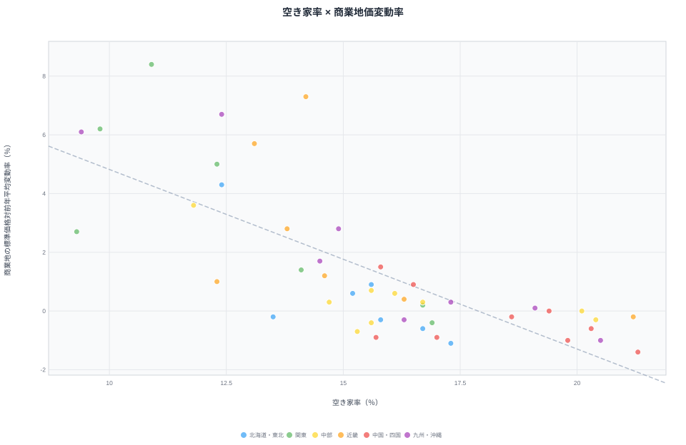

空き家率が全国で最も高い徳島県は21.3%。総住宅数の5戸に1戸以上が空き家という計算です。そしてこの徳島県、商業地の地価変動率も-1.4%と全国最下位クラスの下落を記録しています。

一方、空き家率が全国最下位の埼玉県（9.3%）や、下位グループの東京都（10.9%）・神奈川県（9.8%）は、商業地価がそろって上昇しています。東京都は+8.4%で全国1位の伸び率です。

偶然でしょうか。空き家率と商業地の地価変動率を47都道府県で突き合わせると、相関係数は**-0.744**。統計的にはかなり強い負の相関です。この記事では、この相関がどこまで「人口減少という共通の背景」で説明でき、どこから先が空き家率と地価の直接的な関係なのかを、データで一段掘り下げます。

> [!NOTE]
> 空き家率は総務省「住宅・土地統計調査」（5年に1度、2023年が最新）、商業地の地価変動率は都道府県地価調査（毎年7月公表、2024年度）が出典です。空き家率は抽出調査のため毎年変動する性質の数値ではなく、5年間隔でも県ごとの水準差は年単位の地価変動と比べて安定しています。そのため調査年が1年ずれていても、直近の空き家率と直近の地価変動率を突き合わせる分析は成立します。

## 空き家率ランキング｜西日本と別荘地に集中

[空き家率ランキング](/ranking/vacant-housing-rate)を見ると、全国の空き家率の分布がひと目で分かります。

空き家率のトップは徳島県21.3%、僅差で和歌山県21.2%、鹿児島県20.5%と続きます。上位には四国・九州・中国地方の県が集中し、山梨県20.4%・長野県のように別荘・別宅が多い県も高い水準です。

<source-link href="/ranking/vacant-housing-rate">空き家率ランキングをもっと見る</source-link>

下位は埼玉県9.3%が最も低く、沖縄県9.4%・神奈川県9.8%・東京都10.9%・愛知県11.8%と、首都圏と中京圏の都県が並びます。これらは人口の流入が続き住宅需要が旺盛なエリアで、空き家になった住宅もすぐに次の入居者や買い手がつくため、空き家率が低く保たれていると考えられます。

## 商業地の地価変動率ランキング｜大都市圏だけが上昇

[商業地の地価変動率ランキング](/ranking/standard-price-change-rate-commercial)では、上昇県と下落県がはっきり分かれています。

商業地の標準価格対前年平均変動率は、東京都+8.4%を筆頭に、大阪府+7.3%・福岡県+6.7%・神奈川県+6.2%・沖縄県+6.1%が上位です。いずれもインバウンド需要や再開発が進む大都市圏、あるいは観光需要が強い地域です。

<source-link href="/ranking/standard-price-change-rate-commercial">商業地地価変動率ランキングをもっと見る</source-link>

下位は徳島県-1.4%が最も下落幅が大きく、岩手県-1.1%・鹿児島県-1%・愛媛県-1%・島根県-0.9%と続きます。空き家率ランキングの上位県（徳島・鹿児島）がそのままこちらの下位に現れているのが目を引きます。

## 相関を可視化する｜r=-0.744の散布図

47都道府県を「空き家率（横軸）」「商業地の地価変動率（縦軸）」でプロットすると、右下がりの傾向がはっきり見えます。ピアソンの相関係数は**r=-0.744**で、社会統計としてはかなり強い負の相関です。

散布図の右下（空き家率が高く地価が下落）に徳島・和歌山・鹿児島・高知などの地方県が集まり、左上（空き家率が低く地価が上昇）に東京・大阪・神奈川・埼玉などの大都市圏がまとまっています。中間には宮城・愛知・京都のように、地価は上昇していても空き家率がそこまで低くない県も見られ、単純な二極構造ではないことも読み取れます。これらは大都市圏に隣接し再開発や通勤需要の波及効果を受けやすい県で、空き家率の改善が本格化する前に地価の上昇効果だけが先行して表れていると考えられます。

<source-link href="/ranking/vacant-housing-rate">空き家率ランキングの県別詳細を見る</source-link>

## 見かけの相関か、それとも真因か

> [!TIP]
> 相関係数は「関係の強さ」を表しますが、「なぜその関係があるか」までは教えてくれません。ここでは第三の変数（人口動態）を統制した偏相関で、見かけの相関かどうかを確認します。

空き家率も地価も、根っこには「人口が増えているか減っているか」という共通の要因がありそうです。人口が減る地域では住宅が余って空き家率が上がり、同時に土地の需要も減って地価が下がる——という理屈です。

そこで人口動態（人口増減率）を統制した偏相関係数を計算すると、**partialRPopulation=-0.566**となりました。これは「人口動態という共通要因が作る分散を取り除いた後」に残る相関で、単純な相関（-0.744）よりは弱まっています。それでも-0.566という値は統計的に無視できない強さです。つまり「空き家率が高い県ほど商業地価が下がりやすい」という関係は、人口減少という共通背景だけでは説明しきれず、それとは別の経路が働いていることを示しています。

> [!WARNING]
> 相関係数は因果関係を証明するものではありません。空き家の増加が地価下落を「引き起こしている」のか、逆に地価が低迷している地域で空き家が「処分されずに残りやすい」のか、あるいは両者に共通する別の要因（産業構造の変化、若年層の流出速度など）が働いているのかは、この分析だけでは特定できません。**[仮説]** 空き家の増加は商業地の再開発・建て替え需要を減退させ、地価の下押し圧力になっている可能性がありますが、検証には空き家の用途別内訳（住宅用/商業用）や着工統計との突き合わせが必要です。

空き家率と地価の関係が「人口減少」という単一の説明だけでは片付かない理由の一つに、**[仮説]空き家自体が地域の将来期待を映す先行指標になっている**可能性があります。人口はまだ大きく減っていなくても、空き家が目立ち始めた地域では「この先どうなるか分からない」という空気が商業地の投資判断に影響し、地価の伸び悩みとして先に表れているのかもしれません。この仮説の検証には、空き家増加と地価下落のタイムラグを時系列で追う分析が必要です。

この記事で扱った空き家率・地価変動率のほかにも、[建設・住宅カテゴリ](/category/construction)には住宅ストックに関する指標が並んでいます。あわせて確認すると地域差の理解が深まります。

## まとめ

- 空き家率1位は徳島県21.3%、最下位は埼玉県9.3%で2.3倍の差
- 商業地の地価変動率1位は東京都+8.4%、最下位は徳島県-1.4%
- 空き家率と地価変動率の相関係数は**r=-0.744**（強い負の相関）
- 人口動態を統制した偏相関でも**-0.566**が残り、人口減少だけでは説明しきれない
- 空き家率が高い地方県ほど商業地価が下落する傾向は、地域の将来期待を映す先行指標の可能性がある

## データ出典

空き家率は総務省統計局「住宅・土地統計調査」（2023年）、商業地の地価変動率は国土交通省・都道府県地価調査（2024年度）を基に、e-Stat経由で集計・可視化しています。相関係数はスクリプトによる決定的計算です。
