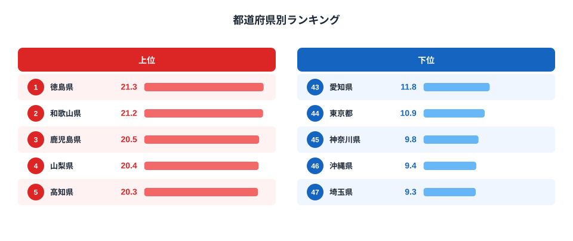
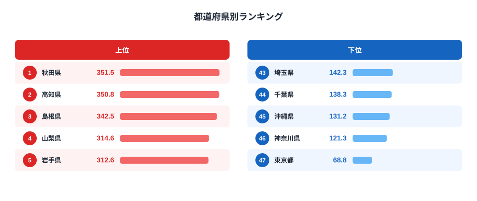
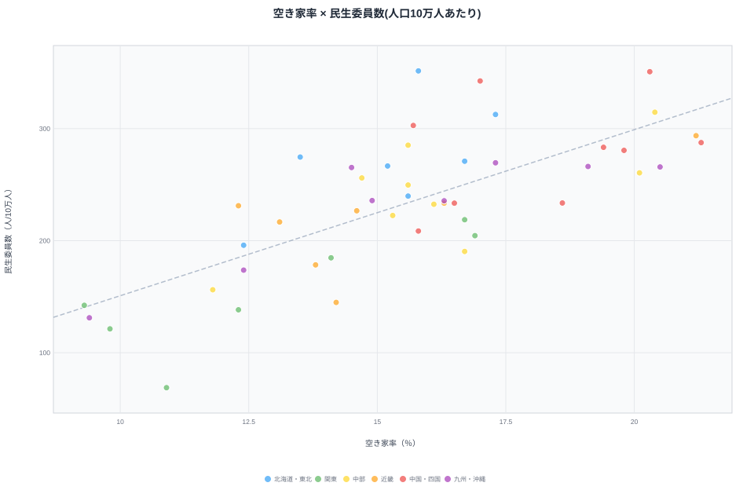

空き家率が高い都道府県ほど、人口10万人あたりの民生委員数も多い——そう言われてもすぐには納得できないかもしれません。空き家は「人がいなくなった住宅」の話で、民生委員は「地域の高齢者や困りごとを見守る人」の話です。扱っている対象がまったく違います。

ところが2023年の47都道府県データを突き合わせると、この2つの指標には統計的に無視できない相関が見えてきます。ピアソンの相関係数は0.73。決して偶然の範囲では説明がつかない強さです。

この記事では、空き家率ランキングと民生委員数ランキングを並べて眺め、なぜこの2つが同じ方向を向くのかを探ります。結論を先に言うと、鍵になるのは「高齢化と人口減少が同時に進んだ地域」という共通の背景です。ただし、これはあくまで相関であって因果ではありません。その注意点も含めて見ていきましょう。

## 空き家率ランキング|徳島・和歌山が突出

空き家率は、総住宅数に占める空き家の割合を示す指標です。2023年の住宅・土地統計調査によると、全国平均は13.8%ですが、都道府県ごとの差は大きく開いています。

<source-link href="/ranking/vacant-housing-rate">空き家率ランキングをもっと見る</source-link>

1位は[徳島県](/areas/36000)の21.3%、2位は和歌山県の21.2%とわずかな差で続きます。3位鹿児島20.5%、4位[山梨県](/areas/19000)20.4%、5位[高知県](/areas/39000)20.3%と、上位5県は西日本・中部の山間部や離島を抱える県が並びました。これらの県に共通するのは、別荘や空き別宅ではなく、人口流出が進んだ地域で相続された家屋がそのまま放置されるケースが多いという点です。

一方で最下位は埼玉県の9.3%、次いで沖縄県9.4%、神奈川県9.8%、東京都10.9%、愛知県11.8%と、首都圏・中京圏の主要都府県が並びます。住宅需要が旺盛でアパート・マンションの回転率が高いエリアほど、空き家として滞留する住宅が少ないという構図です。沖縄県が下位に入っているのは意外に見えますが、出生率の高さによる若年人口の厚みと、住宅需要の強さが背景にあります。

> [!NOTE]
> 空き家率は「別荘・賃貸用の空き家」も含む総住宅数ベースの指標です。放置された「特定空家」だけを指す数値ではない点に注意してください。

## 民生委員数ランキング|東北・中国地方が上位

民生委員は、地域の高齢者や生活困窮世帯を見守り、行政と住民をつなぐ役割を担う非常勤の地方公務員（無給の特別職）です。人口10万人あたりの人数で比較すると、都道府県間で最大5倍を超える開きがあります。

<source-link href="/ranking/welfare-commissioner-count-per-100k">民生委員数ランキングをもっと見る</source-link>

1位は秋田県で人口10万人あたり351.5人、2位高知県350.8人、3位島根県342.5人、4位山梨県314.6人、5位岩手県312.6人と、東北・中国・中部の高齢化が進んだ県が上位を占めています。民生委員は原則「区域内の世帯数」に応じて定数が決まる仕組みのため、高齢者世帯や単身高齢世帯の密度が高い地域ほど、人口あたりの配置数が自然と多くなる傾向があります。

最下位は東京都の68.8人で、1位秋田県の5分の1程度です。次いで神奈川県121.3人、沖縄県131.2人、千葉県138.3人、埼玉県142.3人と、首都圏の県が並びます。人口が集中する都市部では、同じ地域を担当する民生委員1人あたりの世帯数が多くなりがちで、担い手不足も課題として指摘されています。

> [!WARNING]
> 民生委員数は「厚生労働省が定める定数基準」に基づいて配置されるため、実際の活動量や地域ニーズの強さそのものを表す指標ではありません。定数と実際の委嘱数にはズレがある地域もあります。

## 見かけの相関か、共通の真因か

2つのランキングを見比べると、上位・下位に同じ県が繰り返し登場していることに気づきます。空き家率の上位5県のうち高知・山梨の2県は、民生委員数ランキングでもトップ5に入っています。空き家率の下位5県（埼玉・沖縄・神奈川・東京・愛知）のうち東京・神奈川・埼玉・沖縄の4県は、民生委員数ランキングでもワースト5に含まれています。

<source-link href="/ranking/vacant-housing-rate">空き家率ランキングの詳細データ</source-link>
<source-link href="/ranking/welfare-commissioner-count-per-100k">民生委員数ランキングの詳細データ</source-link>

散布図で全47都道府県をプロットすると、右肩上がりの傾向が明確に見えます。ピアソンの相関係数は0.73と、社会統計としてはかなり強い部類に入ります。

[仮説] この相関の背景にあるのは、「高齢化と人口減少が同時進行した地域」という共通要因だと考えられます。高齢化率が高く人口が減っている地域では、(1) 空き家が発生しやすい（子世代が都市部に流出し、実家が空き家化する）と同時に、(2) 民生委員の配置基準となる高齢者世帯・単身高齢世帯の密度が高くなる、という2つの現象が並行して起きます。つまり空き家率が民生委員数を「増やしている」わけでも、その逆でもなく、どちらも高齢化・過疎という同じ土壌から生まれた結果である可能性が高いということです。

> [!TIP]
> 相関が強い2指標を見つけたら、まず「両方に効いている第三の変数はないか」を疑うのが読み解きのコツです。今回のケースでは高齢化率や人口減少率が候補になります。

> [!WARNING]
> 相関係数が高いことは、片方がもう片方の「原因」であることを意味しません。空き家率と民生委員数の関係も、高齢化・人口減少という共通背景を介した見かけの相関である可能性が高く、因果関係を断定するには追加の検証が必要です。

## まとめ

- 空き家率1位は徳島県21.3%、最下位は埼玉県9.3%で約2.3倍の開き
- 民生委員数（人口10万人あたり）1位は秋田県351.5人、最下位は東京都68.8人で約5.1倍の開き
- 2指標のピアソン相関係数は0.73と強い正の相関
- 高知・山梨は両指標でトップ5、東京・神奈川・埼玉・沖縄は両指標でワースト5と、上位・下位の重なりが目立つ
- [仮説] 相関の背景には「高齢化・人口減少が同時進行した地域」という共通要因がある可能性が高く、因果関係の断定には追加検証が必要

住宅・建設まわりの他の指標は[建設・住宅カテゴリ](/category/construction)からまとめて見られます。

## データ出典

空き家率は総務省統計局「住宅・土地統計調査」（2023年）、民生委員数は総務省統計局「社会・人口統計体系」（福祉行政報告例・人口推計・国勢調査報告を基に集計、2023年度）を基に、e-Stat経由で整備したデータを使用しています。
