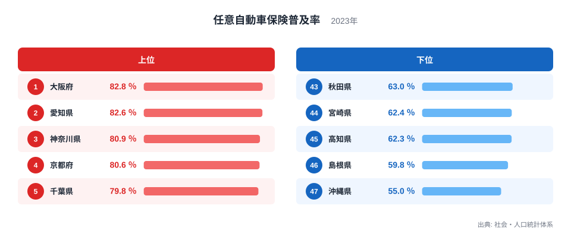
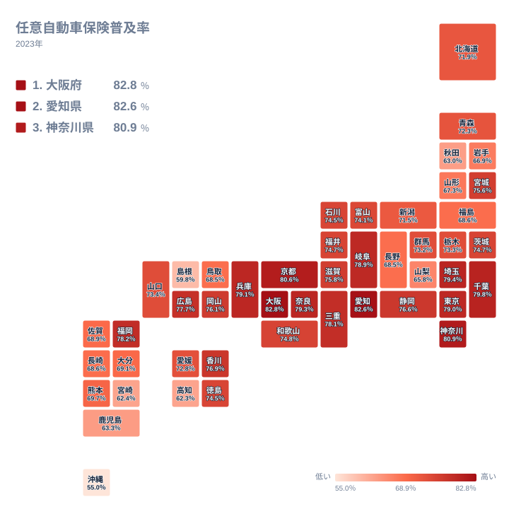

自動車を運転する人は、法律で加入が義務づけられている自賠責保険に加えて、任意で加入する自動車保険を選ぶことができます。任意保険は対人賠償の上限額を引き上げたり、対物や車両の損害まで補償を広げたりできるため、事故の際の備えとして重要な役割を果たします。ところが、この任意保険にどれだけの人が加入しているかを都道府県別に見ると、地域によって差があることがわかります。

この記事では2023年の任意自動車保険普及率の実データをもとに、普及率が高い都道府県と低い都道府県を比較し、その差がどこから生まれるのかを整理します。

## 任意自動車保険普及率の上位と下位

<source-link href="/ranking/voluntary-car-insurance-rate-bodily-injury">任意自動車保険普及率ランキングをもっと見る</source-link>

もっとも普及率が高いのは大阪府で、82.8％の人が任意自動車保険に加入しています。愛知県、神奈川県、京都府、千葉県が続き、いずれも大都市圏に位置する都道府県です。都市部では交通量が多く、事故が発生した際の損害額も大きくなりやすいため、任意保険への加入意識が高くなっていると考えられます。

一方で下位を見ると、秋田県、宮崎県、高知県、島根県、沖縄県が並びます。もっとも普及率が低い沖縄県は55％で、上位の大阪府とは27.8ポイントの差があります。これらの県は地方に位置し、都市部に比べて交通量や地価が異なる環境にあることが、普及率の差につながっている可能性があります。

京都府、埼玉県、奈良県、兵庫県、東京都も、これらの上位県に次いで高い普及率を示しています。京都府と奈良県は近畿圏の一角を占め、大阪府への通勤・通学圏に含まれる地域です。埼玉県と東京都は関東の中心的な都市圏であり、これらの地域が軒並み高い普及率を示している点からも、都市圏としてのまとまりが加入率に影響していることがうかがえます。

## なぜ都市部で普及率が高くなるのか

都市部で任意保険の普及率が高い背景には、交通量の多さがあります。大阪府や愛知県、神奈川県のような大都市圏は道路の交通量が多く、事故に遭遇する確率も相対的に高くなります。任意保険は事故の際の損害賠償額を広くカバーできるため、交通量の多い地域ほど加入の必要性が意識されやすいと考えられます。

また、都市部は自動車の保有台数あたりの高額車両の割合も高い傾向にあります。車両の価値が高いほど、事故で車両が損傷した際の修理費用も大きくなるため、車両保険を含む任意保険への加入意欲が高まりやすいという側面もあります。愛知県は自動車関連の産業が盛んな地域でもあり、自動車そのものへの関心の高さが加入率に反映されている可能性も考えられます。

## 任意自動車保険普及率の地理分布

地図で全国の分布を見ると、普及率が高い都道府県は近畿圏から東海、関東にかけての太平洋側に連なっていることがわかります。これらの地域は人口密度が高く、通勤や通学、業務での自動車利用が盛んな地域でもあります。

反対に普及率が低い都道府県は、東北の一部や九州、四国、そして沖縄に見られます。沖縄県は本土から離れた島しょ地域であり、公共交通機関が限られる一方で、独自の自動車文化を持つことが知られています。地方では自動車が生活必需品として広く使われている一方で、任意保険への加入率は必ずしも高くならない点は興味深い対比だと言えます。

四国地方に目を移すと、高知県が下位に位置する一方、同じ四国の他の県は中位に散らばっています。九州地方でも、福岡県のように上位に入る県がある一方で、宮崎県のように下位に位置する県もあり、同じブロックの中でも差が大きいことがわかります。地図全体を俯瞰すると、普及率の低さは特定の広域ブロック全体に一様に現れるわけではなく、県ごとの交通事情や産業構造の違いが個別に反映されていることがうかがえます。

## 地方で普及率が上がりにくい理由

地方で任意保険の普及率が低い背景には、複数の要因が考えられます。まず、地方は都市部に比べて交通量が少なく、事故のリスクが相対的に低いと感じられやすいことが挙げられます。加えて、地方では自動車が一家に複数台あることも珍しくなく、保険料の負担が家計に与える影響を考慮して、任意保険への加入を見送るケースもあると考えられます。

沖縄県の普及率の低さについては、島しょ地域特有の事情も関係していると考えられます。沖縄県は鉄道網が限られており、自動車が生活の中心的な移動手段になっている一方で、中古車や軽自動車の比率が高いという特徴も指摘されています。車両の価値が比較的低い場合、車両保険を含む任意保険への加入を見送る判断につながりやすいと考えられます。

秋田県や島根県のような人口減少が進む地域では、高齢の運転者の割合が高いことも一因として考えられます。長年無事故で運転してきた経験から、追加の保険料負担を必要ないと判断する運転者が一定数いる可能性もあります。地方における普及率の低さは、単一の理由ではなく、交通環境や車両構成、運転者の年齢構成といった複数の要因が重なった結果だと捉えるのが妥当です。

## まとめ

任意自動車保険普及率は、大阪府、愛知県、神奈川県、京都府、千葉県の上位5都道府県でいずれも80％前後の高い水準にあります。下位5県のうち秋田県、宮崎県、高知県、島根県は60％台にとどまり、もっとも普及率が低い沖縄県は55％です。この差の背景には、都市部の交通量の多さや車両価値の高さ、地方における交通環境や車両構成の違いが関係していると考えられます。単に加入率の高低だけを見るのではなく、その地域の交通事情や自動車の使われ方まで踏まえて読み解くことで、より深い理解につながります。

> [!NOTE]
> この統計は対人賠償に関する任意自動車保険の普及率を示しています。法律で加入が義務づけられている自賠責保険とは別の制度であり、任意保険は加入するかどうかを運転者自身が選択できる点に注意してください。

> [!WARNING]
> この普及率は対人賠償部分の任意保険加入率であり、車両保険や対物賠償など任意保険の他の補償内容への加入状況は反映していません。損害保険会社ごとに商品設計や集計の取り方が異なるため、都道府県間の差は大まかな傾向として捉えることをおすすめします。

> [!TIP]
> 普及率の地域差を読み解く際は、交通量や自動車の保有形態、地域の公共交通機関の整備状況もあわせて確認すると、単純な加入率の高低だけでは見えない背景が理解しやすくなります。

任意自動車保険に関連する統計をさらに詳しく知りたい方は、[同じカテゴリの統計一覧](/category/safetyenvironment)から安全・環境分野の他の指標も確認できます。上位県の詳細は[大阪府のデータ](/areas/27000)や[愛知県のデータ](/areas/23000)からご覧いただけます。

## データ出典

社会・人口統計体系（2023年）
