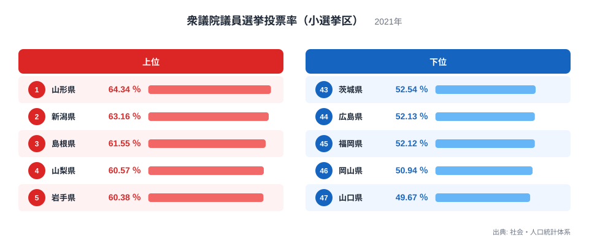
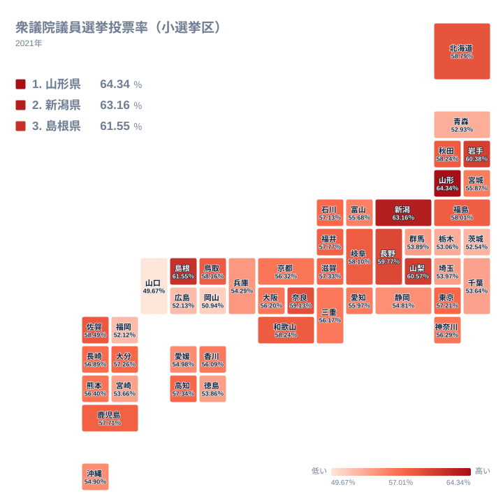

国政選挙は全国で同じ日に、同じ制度のもとで行われます。それにもかかわらず、実際に投票所へ足を運ぶ人の割合は都道府県によって大きく違います。2021年の衆議院議員選挙で小選挙区の投票率が最も高かったのは山形県の64.34％、最も低かったのは山口県の49.67％でした。その差は14.67ポイントに達します。

この記事では、社会・人口統計体系が公表している2021年の衆議院議員選挙投票率（小選挙区）を都道府県別に見て、どの地域で投票率が高く、どの地域で低いのか、そしてその背景にどのような地域の条件があるのかを整理します。

> [!NOTE]
> ここで扱う投票率は、小選挙区の選挙人名簿登録者数に対して実際に投票した人の割合です。同じ衆議院議員選挙でも比例代表の投票率とは別に集計されます。また、期日前投票や不在者投票も投票数に含まれています。

## 投票率が高い県と低い県

まず上位と下位を見てみます。

<source-link href="/ranking/voter-turnout-house-single">衆議院議員選挙投票率（小選挙区）ランキングをもっと見る</source-link>

上位に並ぶのは山形県が64.34％、新潟県が63.16％、島根県が61.55％、山梨県が60.57％、岩手県が60.38％です。東北・北陸・山陰の県が目立ちます。これらの県はいずれも人口規模が大きくなく、大都市圏から距離のある地域です。

一方、下位は山口県が49.67％、岡山県が50.94％、福岡県が52.12％、広島県が52.13％、茨城県が52.54％と続きます。中国地方と九州北部の県が下位に集まっているのが特徴です。全国で唯一、山口県だけが50％を割り込みました。

ここで注目したいのは、下位の顔ぶれが「大都市だから低い」という単純な説明では片づかないことです。東京都は57.21％で20位、大阪府は56.2％で26位と、いずれも中位に位置しています。人口が集中する都市部が一律に低いわけではありません。

## 地図で見ると東日本と西日本で色が分かれる

47都道府県の分布を地図にすると、傾向がはっきりします。

東北から北陸、そして長野・山梨にかけての地域が濃く、中国地方と九州北部が薄くなっています。日本列島を東西に分けたとき、東日本の日本海側から内陸部にかけてが高く、西日本の瀬戸内海沿岸が低いという構図が浮かびます。

この東西の差は、地形や気候の違いから直接生まれるものではありません。投票行動を左右するのは、そこに住む人々の年齢構成と、地域社会のつながりの強さです。

一般に、投票率は年齢が上がるほど高くなる傾向が知られています。上位に並ぶ東北・北陸の県は高齢化が進んでいる地域が多く、有権者に占める高齢層の割合が相対的に高くなります。2位の新潟県は県土が広く、平野部の農村と都市部を抱えながら全県で63.16％という高い水準を保っています。有権者に占める年齢層の構成が違えば、県全体の投票率もその分だけ動きます。

もう一つの要因は、地域の組織的なつながりです。農業や自営業が地域経済の中で一定の位置を占める県では、集落や同業者の組織が選挙の際に投票を呼びかける役割を果たしてきました。都市部への通勤者が多い地域では、こうした地縁のつながりが薄くなり、選挙が個人の判断に委ねられる度合いが高まります。

> [!TIP]
> 投票率は選挙ごとに動きます。有権者の年齢構成、選挙区での候補者の顔ぶれ、その回の選挙で争点が明確だったかどうかによって水準が変わるため、1回の選挙の順位をその県の性格として固定的に読むことはできません。複数回を並べて初めて傾向が見えてきます。

## 選挙区の事情が投票率を動かす

都道府県単位の投票率は、その県に含まれる複数の小選挙区の結果を合わせたものです。したがって、県内の選挙区でどのような競争が行われたかが、県全体の数字に反映されます。

有力な候補者が複数立ち、結果が読めない選挙区では、有権者が「自分の一票で結果が変わる」と感じやすくなり、投票率が上がります。逆に、特定の候補の優位が動かないと見られている選挙区では、投票に行く動機が弱まります。無投票や実質的に競争のない選挙区が県内に多いほど、県全体の投票率は下がる方向に働きます。

下位に並ぶ県の中には、長く同じ勢力が議席を維持してきた選挙区を抱える県が含まれます。競争の緊張感が低い状態が続くと、有権者の側にも投票行動の習慣が薄れていきます。これは特定の県の住民の意識の問題ではなく、選挙区という制度の単位で起きる現象です。

国政選挙と地方選挙で、県ごとの順位が一致するとは限りません。国政選挙は全国的な争点が報道されて関心が高まりやすいのに対し、知事選挙や県議会議員選挙は候補者の顔ぶれ次第で関心の度合いが大きく変わります。同じ県でも、どの選挙かによって投票率の水準は違います。

> [!WARNING]
> この数字は2021年の1回の選挙の結果です。衆議院議員選挙は解散の時期によって投票日が変わり、その時々の政治状況で全国的な投票率の水準そのものが上下します。県ごとの順位を長期的に固定したものとして扱うことはできません。複数回の選挙を通して見たときに、順位が入れ替わる県もあります。

## 数字から読み取れること

47都道府県の投票率を並べると、最も高い県と最も低い県で15ポイント近い差があります。この差は、有権者の年齢構成、地域社会のつながりの強さ、そして選挙区ごとの競争の度合いという、いくつもの条件が重なって生まれています。

投票率の地域差を考えるうえで大切なのは、高い県を「意識が高い」、低い県を「関心が薄い」と評価しないことです。投票所までの距離、平日の勤務形態、選挙公報が届く経路といった、投票のしやすさに関わる条件も県によって違います。

同じ制度のもとで15ポイントの差が生まれるという事実は、制度の外側にある地域の条件が投票行動を左右していることを示しています。行政基盤や財政に関わる[同じカテゴリの統計一覧](/category/administrativefinancial)を合わせて見ると、県ごとの行政のかたちと有権者の関わり方の関係が見えてきます。上位の[山形県のデータ](/areas/06000)と[新潟県のデータ](/areas/15000)では、人口構成や産業の特徴も確認できます。

## データ出典

- 社会・人口統計体系（2021年）衆議院議員選挙投票率（小選挙区）
