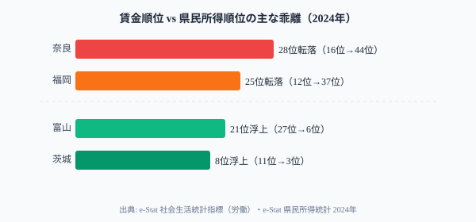

「賃金が高い県＝豊かな県」という図式は、データで掘り下げるほど崩れていきます。

最も鮮明な例が**奈良県**です。所定内給与額（男性）は全国16位（339.4千円）と上位圏ですが、1人当たり県民所得は**44位（254.9万円）**。この28位の乖離は何を意味するのか──大阪・京都に通勤するサラリーマンが多く、「稼いだ給与の大部分が域外の会社に帰属する」ベッドタウン構造が原因です。

4つの切り口──物価調整後給与、家賃控除後給与、男女格差、県民所得との乖離──で「本当に豊かな県」を探ります。

> [!NOTE]
> 本記事の所定内給与額は基本給＋諸手当で残業代・賞与を含みません。データはe-Stat 社会生活統計指標（労働）（2024年度）です。消費者物価地域差指数はe-Stat（0000010212）の2024年値で、全国平均を100とした総合指数です。

## 「稼いだ金が地域外に流れる」県の構造

<!-- 賃金順位 vs 県民所得順位の乖離バーチャート -->

**大幅転落の「ベッドタウン型」2県：**

**奈良県（28位転落）** は大阪・京都への通勤者が多く、給与は奈良の企業ではなく大阪・京都の企業から支払われます。その給与のほとんどは大阪・京都の法人税収となり、奈良の県民所得は薄くなります。地域内の産業・自営業所得の乏しさがこの乖離を生んでいます。

**福岡県（25位転落）** は九州の中枢都市ですが、県内の富の蓄積は給与額ほど厚くありません。博多が九州の経済拠点として機能していますが、「県外企業の出先機関」としての性格が強く、法人税収が本社（東京など）に流れる構造があります。

<data-source url="https://www.e-stat.go.jp/dbview?sid=0000010106" label="e-Stat 社会生活統計指標（労働）"></data-source>

## 物価補正で浮上する「隠れた豊かさ」──茨城・栃木の実力

所定内給与額が高くても、物価も高ければ実質的な購買力は変わりません。消費者物価地域差指数で補正すると順位が大きく変動します。

**大幅浮上の県（低物価が購買力を押し上げ）：**
- **茨城県**: 給与額11位（342.9千円、CPI97.5）→ 実質**6位**（351.7千円）。5位浮上。北関東の「隠れた実力」。工場就業者が多く給与が高く、物価は安め
- **栃木県**: 給与額9位（346.8千円、CPI97.6）→ 実質**5位**（355.3千円）。4位浮上。製造業中心の就業構造が高賃金を支え、物価は全国平均を下回る
- **宮崎県**: 給与額46位（288.4千円、CPI97.0）→ 実質**40位**（297.3千円）。6位浮上。低物価の効果が最も大きい県

**大幅転落の県（高物価が購買力を圧縮）：**
- **北海道**: 給与額31位（316.8千円、CPI101.9）→ 実質**36位**（310.9千円）。5位転落。「低賃金・高物価の罠」が最も顕著
- **宮城県**: 給与額19位（331.5千円、CPI100.6）→ 実質**26位**（329.5千円）。7位転落。東北の中心都市だが物価が全国平均を超える
- **[京都府](/areas/26000)**: 給与額6位（351.4千円、CPI101.1）→ 実質**12位**（347.6千円）。6位転落

> [!WARNING]
> 東京は給与額・実質ともに1位を維持しますが、実質（423.8千円）は給与額（440.8千円）より約4%低下しています。「東京が一番豊か」は成立しますが、「4%の物価コスト」は確実に存在します。

<source-link href="/ranking/scheduled-salary-male">所定内給与額ランキングをもっと見る</source-link>

## 男女賃金格差──大都市ほど絶対額の差が大きい

男性の所定内給与額から女性を引いた差額は、都道府県によって大きく異なります。

**差額最大は[東京都](/areas/13000)の102.4千円**（男440.8千円、女338.4千円）。女性は男性の76.8%にとどまります。**最小は[沖縄県](/areas/47000)の47.6千円**（男286.9千円、女239.3千円）で女性は83.4%水準。

男性の所定内給与額上位は東京都（440.8千円）・神奈川県（387.9千円）・大阪府（382.2千円）・愛知県（363.0千円）・千葉県（352.4千円）。下位は沖縄県（286.9千円）・宮崎県（288.4千円）・青森県（290.2千円）・秋田県（291.1千円）・岩手県（291.6千円）。高賃金の上位県ほど男性側が引き上げており、男女格差の絶対額も大きい傾向がある。

重要な観察は「女性の賃金水準が高い県ほど男女格差も大きい」という傾向です。大都市圏の高賃金は主に男性側が押し上げており、管理職比率の低さや産業構造の偏りが男女差を広げています。

沖縄の格差が小さいのは「女性の賃金が高い」のではなく「男性の賃金も低い」ためであり、単純に「格差が小さい = 平等」とは言えません。

<source-link href="/ranking/scheduled-salary-male">所定内給与額（男性）の都道府県ランキングをもっと見る</source-link>

<data-source url="https://www.e-stat.go.jp/dbview?sid=0000010106" label="e-Stat 社会生活統計指標（労働）"></data-source>

## まとめ──3つの切り口で見えた「豊かさ」の多面性

「所定内給与額が高い県＝豊かな県」は単純すぎます。本記事の3つの切り口で見えた「豊かさ」の再評価をまとめると：

- **物価補正**：茨城・栃木が浮上し、北海道・宮城が転落する
- **県民所得比較**：奈良28位・福岡25位の乖離がベッドタウン構造を示す
- **男女格差**：大都市ほど絶対額の差が大きい（東京は102千円）

地域の実質的な豊かさは、物価・家賃・産業構造・男女格差・地域内への所得還流──複数の角度から初めて見えてきます。

## データ出典

- e-Stat 社会生活統計指標（労働）statsDataId: 0000010106
- e-Stat 社会生活統計指標（家計・物価）statsDataId: 0000010212
