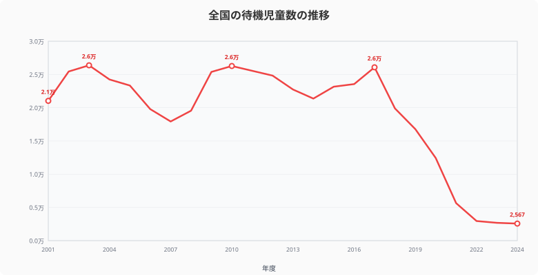
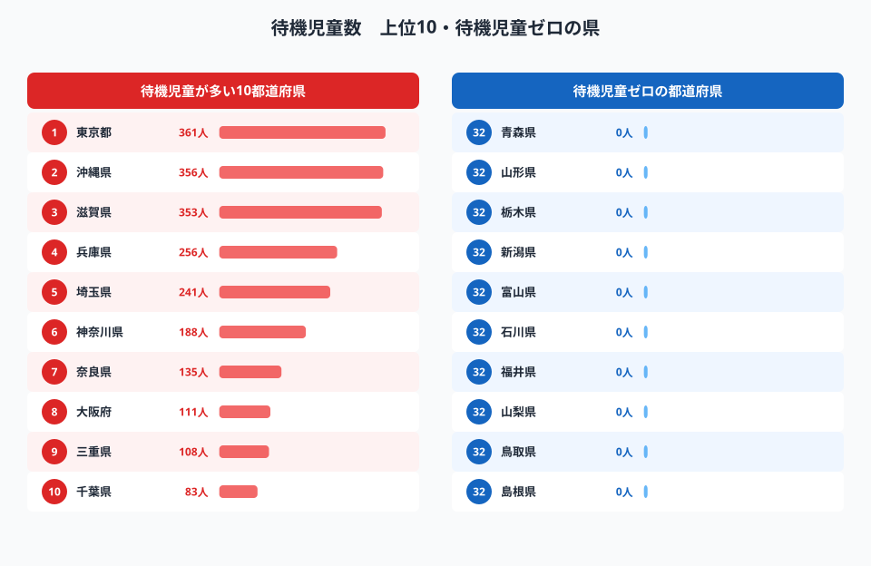
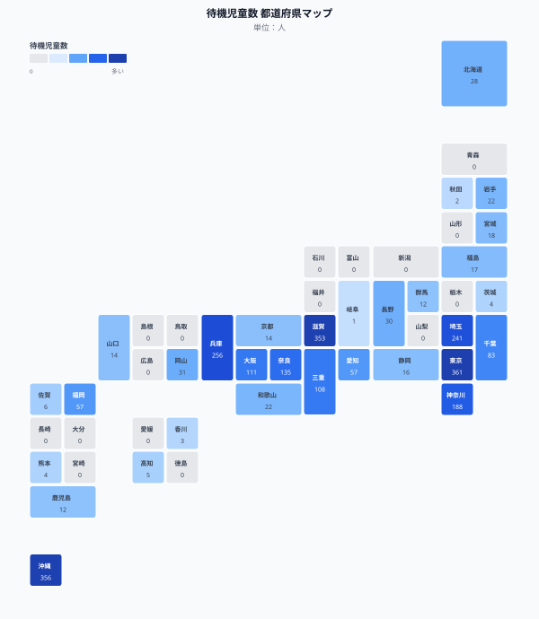
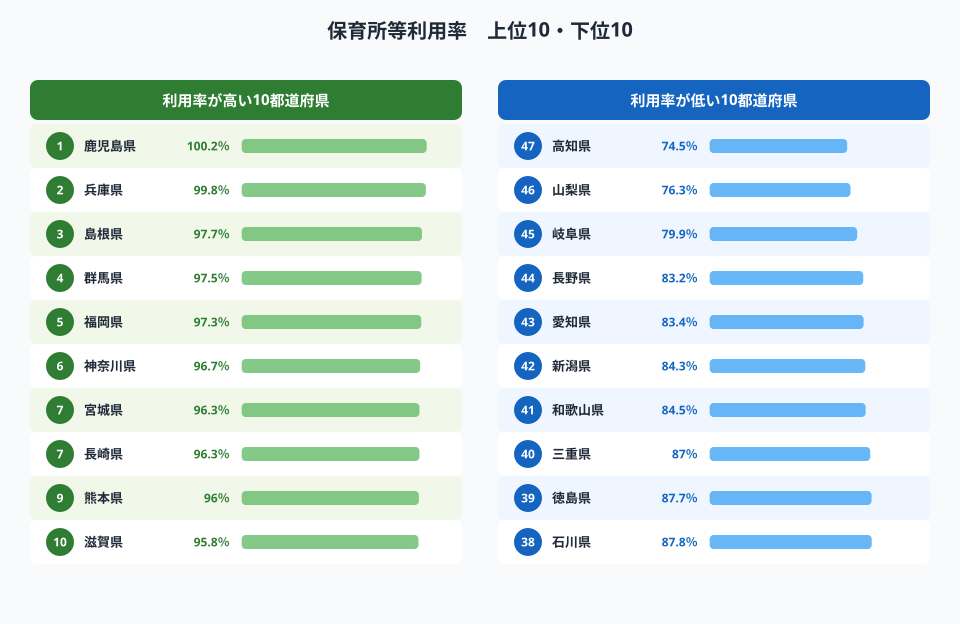
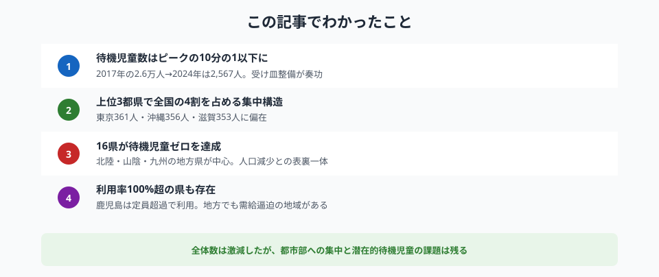

全国の待機児童数は**2,567人**（2024年4月時点）。ピーク時の2万6千人超から10分の1以下に減少し、「待機児童ゼロ」を達成した都道府県は**16**にのぼります。

しかし、数字だけを見て「問題は解決した」と言い切れるでしょうか。東京都361人、沖縄県356人、滋賀県353人——上位3都県だけで全国の4割を占める集中構造は、保育をめぐる地域格差が依然として根深いことを示しています。

> [!NOTE]
> 待機児童＝保育所等への入所を申し込んでいるが利用できていない児童の数。ただし「特定の園のみ希望」「育児休業中」など一定の条件に当てはまる場合はカウントされず、"潜在的待機児童"の存在も指摘されています。

## 待機児童数の推移──ピークから10分の1以下へ

<data-source url="https://www.e-stat.go.jp/dbview?sid=0000010110" label="e-Stat 社会・人口統計体系（保育所等利用待機児童数）"></data-source>

全国の待機児童数は2003年に**2.6万人**に達した後、一時減少したものの2009年から再び増加に転じました。2017年に**2.6万人**と再びピークを迎えましたが、「子育て安心プラン」による受け皿整備が進み、2021年以降は急減しています。

2024年は**2,567人**と、統計開始以降の最少を更新。ただし、この「公式の待機児童数」に含まれない潜在的待機児童がなお数万人規模で存在するとの指摘もあります。

## 待機児童数ランキング──東京・沖縄・滋賀がトップ3

<data-source url="https://www.e-stat.go.jp/dbview?sid=0000010110" label="e-Stat 社会・人口統計体系（保育所等利用待機児童数）"></data-source>

**1位は東京都**（361人）。人口が圧倒的に多く、都心部での保育需要が供給を上回り続けています。**2位の沖縄県**（356人）は出生率が全国1位で、保育ニーズの高さが背景にあります。**3位の滋賀県**（353人）は、子育て世代の流入が多い一方で保育所整備が追いつかないケースです。

一方、**16都道府県が待機児童ゼロ**を達成。青森・山形・栃木・新潟・富山・石川・福井・山梨・鳥取・島根・広島・徳島・愛媛・長崎・大分・宮崎の16県です。北陸・山陰・九州の地方県が多く、人口減少により保育所の需給バランスが保たれている面もあります。

> [!WARNING]
> 「待機児童ゼロ」の県でも、「育児休業中のため保留」「希望する施設のみ指定」などの理由で集計から外れた潜在的待機児童は別途存在します。公式統計の「ゼロ」は保育ニーズが完全に満たされたことを意味しません。

### 全国マップ

<data-source url="https://www.e-stat.go.jp/dbview?sid=0000010110" label="e-Stat 社会・人口統計体系（保育所等利用待機児童数）"></data-source>

マップで見ると、首都圏（東京・埼玉・神奈川・千葉）と近畿（兵庫・大阪・奈良・滋賀）に待機児童が集中していることがわかります。また沖縄・三重も比較的多い地域です。逆に、北陸から山陰にかけての日本海側は軒並みゼロまたは少数です。

<source-link href="/ranking/waiting-children">47都道府県の待機児童数ランキングをもっと見る</source-link>

<ad-slot></ad-slot>

## 保育所等利用率──定員に対する「埋まり具合」の地域差

<data-source url="https://www.e-stat.go.jp/dbview?sid=0000010205" label="e-Stat 社会・人口統計体系（保育所等利用率）"></data-source>

保育所等利用率は「利用児童数 ÷ 定員数 × 100」で算出される指標で、定員に対してどれだけ利用されているかを示します。

**1位の鹿児島県は100.2%**と定員を上回って利用されています。兵庫県（99.8%）、島根県（97.7%）が続きます。これらの県では定員がほぼ満杯で、新たな受け入れ余地が限られている状態です。

一方、**最も低いのは高知県**（74.5%）。山梨県（76.3%）、岐阜県（79.9%）と続きます。定員に余裕があるものの、施設が利用者のニーズ（立地・時間）と合致していないケースや、人口減少で利用者そのものが減少しているケースが考えられます。

> [!TIP]
> 待機児童数と保育所利用率は別の指標です。[鹿児島県](/areas/46000)のように利用率100%超でも待機ゼロの場合と、[東京都](/areas/13000)のように待機が多い場合では対策の方向性が異なります。自分の県の状況は[待機児童ランキング](/ranking/waiting-children)で確認できます。

## 待機児童ゼロ達成の条件と今後の課題

待機児童ゼロを達成した16県の多くは、人口減少が進む地方圏です。保育ニーズが落ち着いている一方、施設の老朽化や保育士不足という別の問題に直面しています。都市部では待機児童解消のために大幅な定員拡充が行われましたが、[沖縄県](/areas/47000)（出生率全国1位）や[滋賀県](/areas/25000)（子育て世代流入が続く）のように人口動態が異なる地域では、整備が追いつかない構造的課題が残ります。

今後は「量の確保」から「質の維持」へのシフトが全国的な課題となっています。定員割れが続く地方では、施設の統廃合と保育の質確保のバランスをどう取るかが問われます。

## まとめ──4つの発見

## データ出典

本記事のデータはe-Stat（政府統計の総合窓口）を基に作成しています。

本記事の対象データ: [関連カテゴリ](/category/economy)
