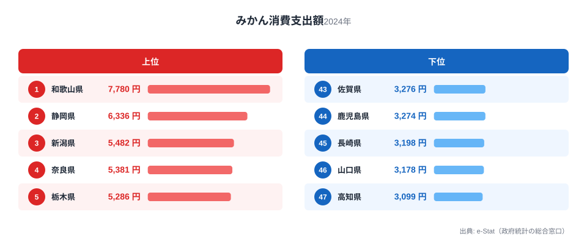
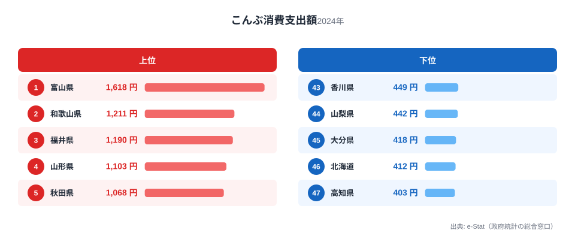
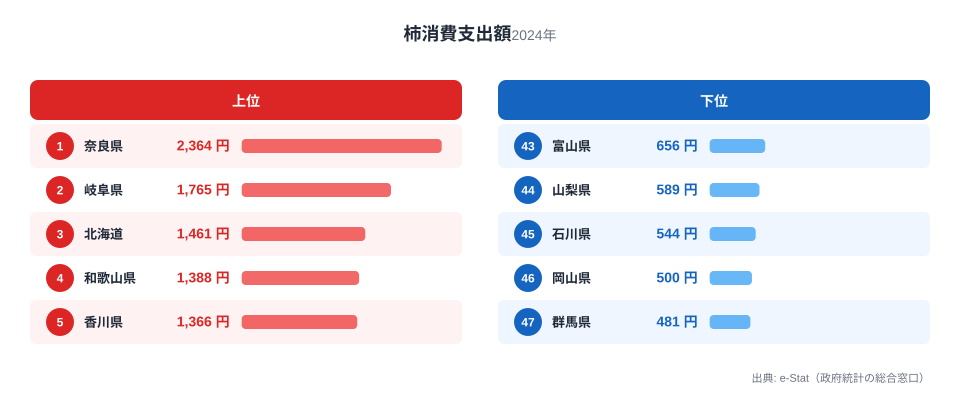
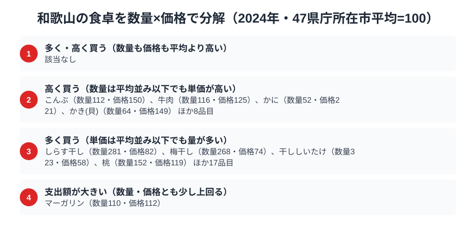

「みかんの国」和歌山。その看板に偽りはなく、総務省の家計調査（品目別）で和歌山市の二人以上世帯を見ると、みかんの消費支出額は7,780円で全国1位。有田みかんに代表される紀州の果樹文化が、家計の数字にはっきり表れています。

ところが和歌山の食卓の個性は、みかんだけではありません。海の食材である昆布も全国2位、そして柿も全国4位と、果樹と海の両方で全国トップクラスに並びます。この記事では、みかん・昆布・柿という3つの品目を横断しながら、紀州・和歌山の豊かな食卓を読み解きます。

> [!NOTE]
> 家計調査の都道府県データは、県庁所在市（和歌山県は和歌山市）の二人以上世帯を対象にした年間支出額です。県全体ではなく和歌山市在住世帯の家計簿から見た傾向であり、支出「金額」であって消費「量」そのものではない点にご注意ください。

## みかん — 全国1位7,780円、有田みかんの本場

<source-link href="/ranking/mandarin-consumption-expenditure">みかん消費支出額ランキングをもっと見る</source-link>

和歌山県のみかん消費支出額は7,780円で全国1位です。2位の静岡県6,336円を上回り、みかん生産量日本一の産地としての実力を消費でも見せています。和歌山は有田みかんをはじめ、温暖な気候と水はけのよい斜面を活かしたみかん栽培が盛んで、地域全体がみかんとともにある土地です。

産地であると同時に消費地でもある点が、和歌山のみかん1位を支えています。地元でとれた新鮮なみかんが手頃に手に入り、贈答や親戚づきあいでみかんをやり取りする文化も根づいています。[みかん消費支出の記事](/blog/mandarin-expenditure-ranking)で扱ったように、産地と消費地が一致する典型例が和歌山であり、「作る県が最もよく食べる」構図がここでは成り立っています。

## 昆布 — 全国2位1,211円、紀州の海の食文化

<source-link href="/ranking/konbu-consumption-expenditure">昆布消費支出額ランキングをもっと見る</source-link>

意外に思われるかもしれませんが、和歌山は昆布の消費支出額でも全国2位（1,211円）です。首位は富山県で1,618円ですが、和歌山はそれに次ぐ位置につけています。昆布は北海道が主産地で、和歌山は産地から遠いにもかかわらず、昆布を使った食文化が根づいています。

紀州には、昆布を使った常備菜やだし文化が息づいています。北前船の交易路が紀伊半島にも及び、北海道の昆布が運ばれた歴史が、昆布消費支出額で全国1位の[富山県の食卓](/blog/toyama-food-culture)と同じく和歌山の昆布食文化を育てたと考えられます。果樹の県が海の食材でも上位に立つという二面性が、和歌山の食卓の奥行きです。

## 柿 — 全国4位1,388円、紀の川の果樹地帯

<source-link href="/ranking/persimmon-consumption-expenditure">柿消費支出額ランキングをもっと見る</source-link>

果物では柿でも和歌山は上位です。柿の消費支出額は1,388円で全国4位。首位は奈良県で2,364円ですが、和歌山も紀の川流域を中心に柿の一大産地であり、みかんと並ぶ紀州の果樹として消費されています。

和歌山はみかん・柿・梅と、多彩な果樹が育つ「果樹王国」です。温暖な気候と変化に富んだ地形が、一年を通じて多様な果物を食卓にもたらします。みかんが全国1位、柿も全国4位という数字は、和歌山が果物への支出が全般に高い県であることを示しています。

> [!WARNING]
> 家計調査は支出金額の調査であり、消費量そのものではありません。物価や単価の違いも金額に影響するため、順位だけでは和歌山の食文化の全体像は測れない点にご注意ください。

## 和歌山の食卓を貫くもの

和歌山県民の食卓を貫くのは、「紀州の果樹文化」と「交易が運んだ海の食文化」です。みかん・柿という果樹で全国トップクラスに立ち、昆布という産地から遠い海の食材も全国2位。温暖な気候が育む豊かな果樹と、北前船が運んだ昆布文化が重なって、和歌山ならではの食卓が形づくられています。

緑茶やまぐろでも知られる静岡と並べると、同じみかん上位県でも、和歌山は「果樹王国＋昆布」、静岡は「茶とまぐろと果樹」と、食卓の骨格が異なります。隣り合う近畿・東海でも県ごとに個性がはっきり分かれるのが、県民の食卓比較の面白さです。

> [!TIP]
> 和歌山の昆布のように「産地から遠いのに消費が上位」の品目は、北前船など交易の歴史が背景にあります。家計調査の順位はその県の食文化の一面と捉え、名産・郷土料理と合わせて読むと全体像が見えてきます。

## 数量×価格で分解する和歌山市の食卓

<source-link href="/ranking/whitebait-consumption-quantity">しらす干し消費量ランキングをもっと見る</source-link>

みかんの支出額1位、昆布の支出額2位という数字だけでは、和歌山の食卓が「たくさん食べている」のか「高いものを買っている」のかまでは分かりません。家計調査の品目別データを、支出額＝数量×価格に分解し、47都道府県庁所在市の単純平均を100とした数量指数・価格指数で見ると、和歌山市の食卓には量で支出額を押し上げる品目と、単価の高さで支出額を押し上げる品目がはっきり分かれています。

最もはっきりと量で稼ぐ型を示すのがしらす干しです。和歌山市のしらす干し消費量は1,073gで全国1位、2位の京都府998gを上回ります。数量指数は平均の2.8倍近くに達する一方、価格指数は平均をやや下回り、地元の紀州灘で水揚げされたしらすを日常的に食べる習慣が支出額を押し上げていると読み取れます。記事前半で見たみかんも同じ型です。みかんの数量指数も平均を大きく上回るのに対し、価格指数はほぼ平均並みで、支出額の全国1位は単価の高さではなく、地元でとれた実を惜しみなく食べる購入量の多さに支えられています。

一方、同じ支出額上位でも昆布はまったく逆の型です。こんぶの数量指数は平均をやや上回る程度にとどまるのに対し、価格指数は平均の1.5倍前後と際立って高い水準です。北海道が主産地で、和歌山は産地から遠いにもかかわらず支出額が全国2位となっているのは、日常的に大量消費しているからではなく、良質な昆布を選んで単価の高い買い方をしている結果と読み解けます。

果樹・海産物に加えて、和歌山を代表する名産である梅干しもこの数量×価格分解に現れます。和歌山市の梅干し消費支出額は2,753円、消費量は1,814gで、いずれも全国1位です。数量指数は平均の2.7倍近くに達する一方、価格指数は平均を下回っており、しらす干しやみかんと同じ「量で稼ぐ」型です。紀州の梅干し文化は、支出額だけでなく購入量の面でも全国トップに立っていることが数字から裏付けられます。

> [!TIP]
> 支出額の順位だけでは「たくさん食べている」のか「高いものを買っている」のかは分かりません。しらす干し・みかん・梅干しのように数量指数が高く価格指数が平均並みの品目は「量で稼ぐ」タイプ、昆布のように数量指数が平均並みで価格指数が高い品目は「単価で稼ぐ」タイプです。支出額ランキングを見るときは、この2つの軸に分けて読むと、産地や食文化との結びつきが見えやすくなります。

> [!NOTE]
> ここでの数量指数・価格指数は、47都道府県庁所在市の単純平均を100とした相対値であり、家計調査の全国平均そのものではありません。価格指数は支出額を数量で割った金額の相対比なので、購入する品種やブランドの違いも影響します。対象は和歌山市の二人以上世帯の年間支出額・購入量です。

## まとめ

- みかん消費支出額は和歌山県が全国1位（7,780円）、有田みかんの本場
- 昆布も全国2位（1,211円）、北前船が運んだ紀州の海の食文化
- 柿も全国4位（1,388円）、紀の川流域の果樹地帯
- 紀州の果樹文化と交易が運んだ昆布文化が重なる、果樹王国・和歌山の食卓

和歌山県の他の統計は[和歌山県の地域プロフィール](/areas/30000)、食品・家計消費の地域差は[経済カテゴリ一覧](/category/economy)からご覧いただけます。

## データ出典

総務省統計局「家計調査（品目別）」（2024年、都道府県庁所在市 二人以上世帯）をもとに、e-Stat（政府統計の総合窓口）経由で整備したデータを使用しています。
