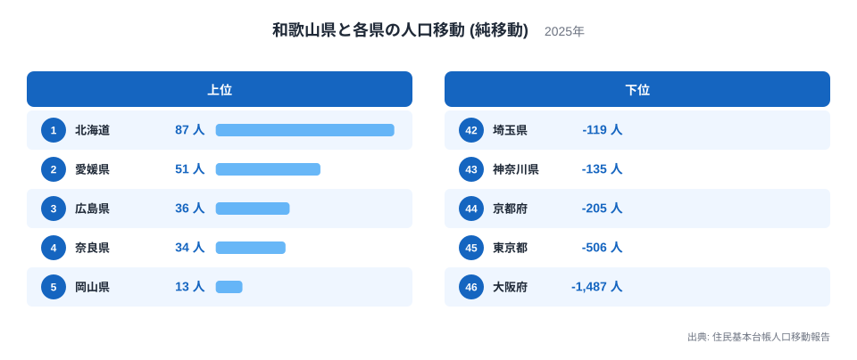
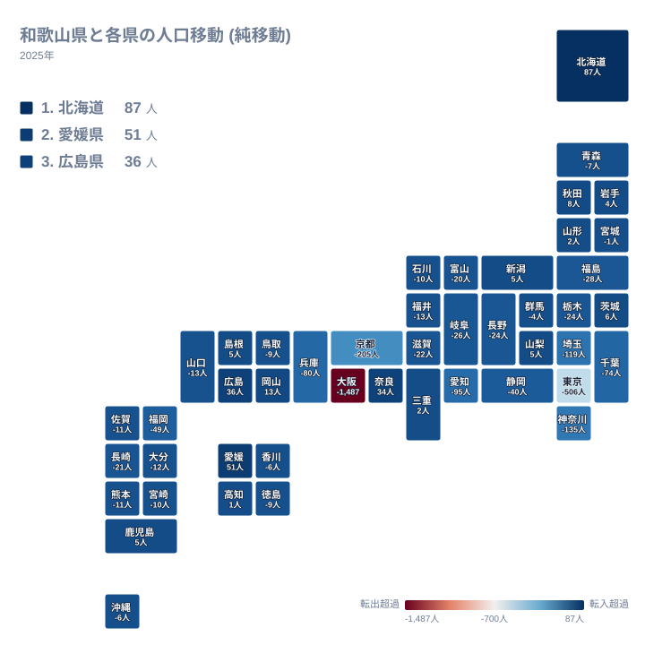
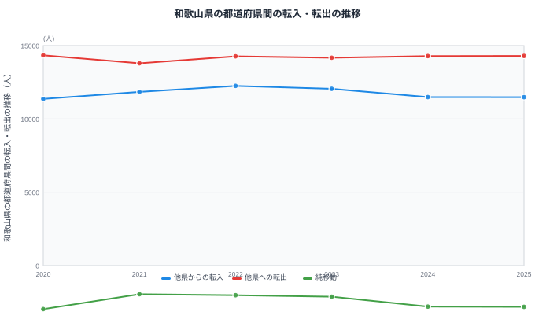

和歌山県は紀伊半島の南西部に位置し、大阪府、奈良県、三重県という3つの県と陸で接しています。住民基本台帳人口移動報告の都道府県間の純移動データを見ると、和歌山県が最も多くの人を失っている相手は東京都ではなく、隣接する大阪府です。全国的には東京都への一極集中が語られがちですが、和歌山県の場合は近畿地方の中心である大阪府との関係が突出しています。

純移動とは、ある県から見て別の県との間で転入した人数から転出した人数を引いた差のことです。移動した人の総数そのものではなく、あくまで差し引きの値である点に注意が必要です。この記事では和歌山県と各県の純移動データをもとに、和歌山県がどの相手との間で人を得て、どの相手に人を明け渡しているのかを見ていきます。

## 相手県別にみる純移動

<source-link href="/ranking/moving-in-excess-rate">転入超過率ランキング</source-link>

和歌山県が最も多くの人を得ている相手は北海道で、純移動は87人です。2位は愛媛県で51人、3位は広島県で36人、4位は奈良県で34人、5位は岡山県で13人と続きます。1位が距離的に遠い北海道である点は意外に映るかもしれませんが、この記事のデータで比べられるのはあくまで純移動の大きさであり、進学や転勤といった個々の事情の積み重ねが結果として現れたものです。全国の転入超過率ランキングと合わせて見ると、和歌山県の全国的な位置づけも確認できます。

6位以下を見ると、6位は秋田県で8人、7位は茨城県で6人、8位は新潟県で5人、9位は山梨県で5人、10位は島根県で5人と、プラスの値そのものは小さくなっていきます。それでも15位の高知県までがプラスを保っており、和歌山県はごく少数の人数ながら、全国のさまざまな地域から人を得ていることがわかります。

一方で最も多くの人を失っている相手は大阪府で、純移動はマイナス1,487人です。46位という順位は46県の中で最も大きなマイナス幅であることを示しています。45位は東京都でマイナス506人、44位は京都府でマイナス205人、43位は神奈川県でマイナス135人と続きます。大阪府へのマイナス幅は東京都へのマイナス幅を大きく上回っており、和歌山県の人口移動が首都圏よりも近畿の中心に強く引き寄せられていることがわかります。

> [!NOTE]
> この図の各県別の値は、和歌山県とその1県だけの間で成立した純移動です。後段で紹介する転入・転出の推移グラフは、和歌山県が全国のすべての県との間でやり取りした合計であり、規模がまったく異なります。1県あたりの値と全国合計の値を混同しないよう注意してください。

## 地図でみる純移動の広がり

地図の中で和歌山県自体のマスに色が付いていないのは、和歌山県から和歌山県への移動というデータがそもそも存在しないためです。この地図は和歌山県と、それ以外の46都道府県との関係だけを表しています。

地図全体を見渡すと、赤みがかった色で示される純移動マイナスの県が近畿地方に集中しており、中でも大阪府の赤みが際立っていることがわかります。和歌山県が接する3県のうち、奈良県は34人のプラスで4位、三重県は2人のプラスで14位となっている一方、大阪府だけがマイナス1,487人で46位という突出した結果になっています。同じ近畿地方の隣接県でも、大阪府とそれ以外とでは関係の向きも大きさもまったく異なります。

> [!WARNING]
> このデータは都道府県間の移動だけを対象としており、和歌山県内の市町村間の移動や、海外との出入国は含まれていません。和歌山県内での引っ越しがどれだけ多くても、この統計には一切反映されない点に注意してください。

## 大阪府との関係

[和歌山県のデータ](/areas/30000)と[大阪府のデータ](/areas/27000)を見比べると、和歌山県から大阪府へのマイナス1,487人という値の大きさがより実感できます。和歌山県は大阪府と陸続きで接しており、通勤・通学圏として長年結びついてきました。同じ近畿地方の中心でも、京都府へのマイナス幅は205人と、大阪府への値の一部にとどまっています。

東京都への純移動はマイナス506人で45位です。全国の多くの県で東京都が最大のマイナス幅を記録する中、和歌山県では隣接する大阪府がそれを大きく上回っています。大阪府というより近い中心地の存在が、和歌山県の人口移動の向きを強く規定していることが、この順位からもうかがえます。

> [!TIP]
> 純移動の大きさを都道府県ごとに比べるときは、必ずしも東京都が最大のマイナス幅を持つ相手とは限りません。和歌山県のように、地理的に近い別の中心地への純移動の方が大きい場合もあるため、東京都だけに注目せず全体の順位を確認することが読み解きのコツです。

## 転入・転出の推移

この図は和歌山県と全国すべての県との間でやり取りされた転入・転出・純移動の推移を示しています。他県からの転入は2020年が11,370人、2021年が11,844人、2022年が12,254人、2023年が12,051人、2024年が11,493人、2025年が11,485人と推移しています。他県への転出は2020年が14,340人、2021年が13,796人、2022年が14,274人、2023年が14,174人、2024年が14,290人、2025年が14,298人です。

純移動は2020年がマイナス2,970人、2021年がマイナス1,952人、2022年がマイナス2,020人、2023年がマイナス2,123人、2024年がマイナス2,797人、2025年がマイナス2,813人となっています。6年間すべてでマイナスが続いていますが、2021年に転出が13,796人まで減ったことでマイナス幅が最も小さくなり、そこから2024年、2025年にかけて再びマイナス幅が広がっています。純移動のマイナス幅が縮んだ年があっても、それは転出が完全に止まったことを意味しません。2021年も転出は13,796人と、他の年と大きく変わらない規模で続いており、マイナス幅の増減は転入と転出のどちらがどれだけ動いたかをあわせて見て初めて理解できます。

## まとめ

- 和歌山県が最も人を得ている相手は北海道で、純移動は87人です。
- 和歌山県が最も人を失っている相手は大阪府で、純移動はマイナス1,487人です。
- 大阪府へのマイナス幅は、45位の東京都へのマイナス幅を大きく上回っています。
- 和歌山県が接する3県のうち、奈良県と三重県はプラス、大阪府だけがマイナスです。
- 全国合計の純移動は2020年から2025年まで6年連続でマイナスです。
- 15位までの県がプラスを保っており、和歌山県は全国の幅広い地域から少しずつ人を得ています。

和歌山県の人口移動の全体像は、[人口動態のテーマ](/themes/population-dynamics)や[人口・世帯の統計一覧](/category/population)からも確認できます。

## データ出典

- 出典: 住民基本台帳人口移動報告
- 年: 2025年(相手県別の純移動)、2020年から2025年(転入・転出・純移動の推移)
