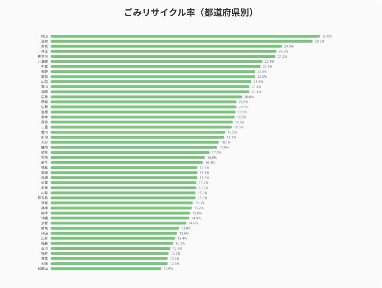

分別回収に力を入れている自治体と、ほぼ焼却一択の自治体。ごみのリサイクル率は都道府県によって最大2.4倍の開きがある。岡山県29.0%に対し、和歌山県11.9%。この差はどこから来るのか。リサイクル率・埋立率・最終処分場残余容量の3つの指標から、循環型社会の地域差を検証する。

## リサイクル率マップ

> [!NOTE]
> リサイクル率 = 資源化量 ÷ ごみの総排出量（%）。紙・金属・ガラス・プラスチックなどの資源回収量が分子になる。焼却によるエネルギー回収（サーマルリサイクル）は統計上リサイクルに含まれないため、焼却主体の自治体は数値が低く出る傾向がある。

全国を俯瞰すると、特定の地域ブロックで高い・低いというパターンは見えにくい。リサイクル率は自治体ごとの施策や住民の分別協力度に左右されるため、地理的な法則性よりも個別事情が大きいことがうかがえる。

上位は岡山県（29.0%）、鳥取県（28.2%）、[東京都](/areas/13000)（24.9%）、埼玉県（24.3%）、神奈川県（24.2%）。東京都・埼玉県・神奈川県は大都市圏だがリサイクル率は比較的高い。

下位は和歌山県（11.9%）、大阪府（12.6%）、青森県（12.6%）、福井県（12.7%）、石川県（12.9%）。大阪府は人口が多いにもかかわらず下位に位置する。

<source-link href="/ranking/waste-recycling-rate">47都道府県のごみリサイクル率ランキングをもっと見る</source-link>

## 埋立 vs 焼却 vs リサイクル

リサイクル率が低い県は、すべてのごみを埋め立てているのだろうか。実はそうではない。

散布図を見ると、リサイクル率と埋立率は必ずしもきれいな逆相関にならない。右下象限（リサイクル率が高く埋立率が低い）に位置する県が多いが、リサイクル率も埋立率も相対的に低い「焼却主体」の大都市圏がある。大阪府（リサイクル率12.6%・埋立率11.3%）や愛知県などがこれにあたる。

これは「焼却主体」型だ。大都市圏では高性能の焼却施設（ごみ焼却発電）が整備されており、ごみを焼却して熱エネルギーを回収する。統計上はリサイクルにカウントされないが、エネルギー回収としての合理性はある。リサイクル率だけで「環境意識が低い」と断じるのは早計だ。

一方、[北海道](/areas/01000)（埋立率16.1%）は全国で突出して高い。広大な土地に最終処分場を確保しやすい反面、焼却施設の集約が難しいことが背景にある。

<source-link href="/ranking/garbage-landfill-rate">47都道府県のごみ埋立率ランキングをもっと見る</source-link>

<ad-slot></ad-slot>

## 最終処分場の残り寿命

リサイクルも焼却もできないごみは最終処分場に埋め立てられる。その残余容量には大きな地域差がある。

残余容量が少ない県は[徳島県](/areas/36000)（57千m3）、鳥取県（166千m3）、佐賀県（207千m3）、山梨県（232千m3）、福井県（241千m3）。県土面積が小さい県や、新規処分場の建設が困難な県が並ぶ。

一方、東京都（21,771千m3）は突出して多い。これは広域的な処分場（東京湾の埋立地など）を活用しているためで、都内だけで完結しているわけではない。

処分場の残余容量が逼迫している県では、リサイクルの推進や広域処理の検討が急務となる。

> [!WARNING]
> 残余容量が57千m³の徳島県は最も逼迫した状況にある。残余容量が少ない県では、新規処分場の建設が困難な場合も多く、広域処理協定や搬出先確保が急務となっている。リサイクル率を上げることが処分場の延命に直結する。

<source-link href="/ranking/final-disposal-site-remaining-capacity">47都道府県の最終処分場残余容量ランキングをもっと見る</source-link>

## リサイクル率が高い県の共通点

リサイクル率が上位の県に共通する要因を整理すると、以下が挙げられる。

**分別区分の多さ**: 分別区分が多い自治体ほど資源として回収できるごみの割合が増える。上位の鳥取県は資源ごみの細分化に積極的だ。

**資源回収の仕組み**: 集団回収（町内会・PTA等による古紙・金属の回収）が活発な地域はリサイクル率が高い傾向がある。

**住民の分別協力**: 分別ルールが厳格でも、住民が協力しなければ機能しない。リサイクル率が高い県は、啓発活動やごみカレンダーの配布が徹底されている。

**コンポスト・バイオマス処理**: 生ごみの堆肥化に取り組む自治体では、焼却ごみの減量とリサイクル率の向上を同時に実現している。

<ad-slot></ad-slot>

## まとめ

ごみ処理のデータから、以下のポイントが浮かび上がった。

ごみ処理インフラは、自治体の方針と住民の協力で大きく変わる「政策インフラ」だ。道路や水道のように物理的な整備だけでは解決せず、分別ルールの設計・住民啓発・処理施設の投資が三位一体で必要になる。SDGsの目標12「つくる責任 つかう責任」の達成度を測る上でも、リサイクル率は重要な指標といえる。

## データ出典

本記事のデータはe-Stat（政府統計の総合窓口）を基に作成しています。[社会生活統計指標（e-Stat）](https://www.e-stat.go.jp/dbview?sid=0000010208)のごみリサイクル率・ごみ埋立率・最終処分場残余容量（いずれも2023年）を利用しています。
