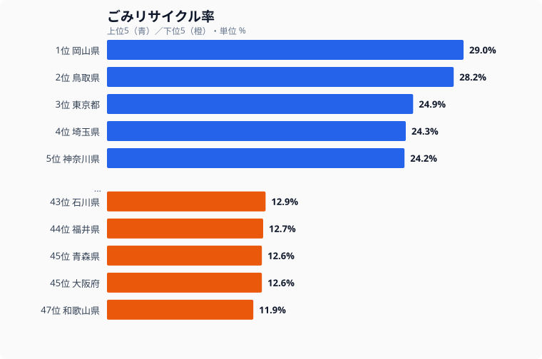
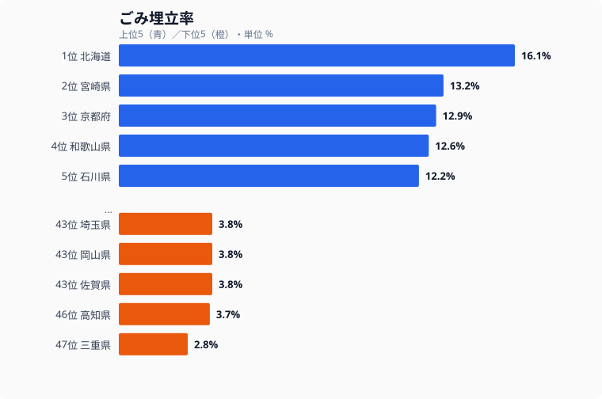

分別回収に力を入れている自治体と、ほぼ焼却一択の自治体。同じ日本でも、ごみのリサイクル率は住む県によって大きく変わります。最も高い岡山県は29.0%、最も低い和歌山県は11.9%で、その開きはおよそ2.4倍にのぼります。この差はどこから来るのでしょうか。リサイクル率・埋立率・最終処分場残余容量という3つの指標から、循環型社会の地域差を読み解いていきます。

## リサイクル率が高い県・低い県

まず、ごみの総排出量に対してどれだけ資源化できているかを示すリサイクル率から見ていきます。

上位は岡山県（29.0%）、鳥取県（28.2%）、[東京都](/areas/13000)（24.9%）、埼玉県（24.3%）、神奈川県（24.2%）と並びます。注目したいのは、東京都・埼玉県・神奈川県という首都圏の3都県がそろって上位に入っている点です。人口が密集し、ごみの絶対量が多い大都市圏はリサイクルに不利だと思われがちですが、実際には逆で、回収インフラと住民への分別啓発が行き届いていることがうかがえます。岡山県・鳥取県の山陰勢が首都圏を上回っているのも、資源ごみの細分化に積極的に取り組んできた成果と考えられます。

一方、下位は和歌山県（11.9%）、大阪府（12.6%）、青森県（12.6%）、福井県（12.7%）、石川県（12.9%）です。ここで意外なのは、人口の多い大阪府が下位に並んでいることです。リサイクル率は地理的なブロックで高い・低いが決まるというより、自治体ごとの施策や住民の分別協力度に左右されるため、地域の法則性よりも個別事情が大きく効いてきます。下位の県でも、後述するように「リサイクルしていない＝環境意識が低い」とは限りません。

> [!NOTE]
> リサイクル率は「資源化量 ÷ ごみの総排出量（%）」で計算され、紙・金属・ガラス・プラスチックなどの資源回収量が分子になります。焼却によってエネルギーを取り出すサーマルリサイクルは、この統計上のリサイクルには含まれません。そのため、高性能な焼却施設でごみ発電を行う自治体は、実際には熱を回収していても数値上は低く出る傾向があります。

<source-link href="/ranking/waste-recycling-rate">47都道府県のごみリサイクル率ランキングをもっと見る</source-link>

## 埋立率で見ると順位が入れ替わる

リサイクル率が低い県は、残りをすべて埋め立てているのでしょうか。実はそうとは限りません。埋立率（ごみの総排出量に対して埋め立てに回した割合）を見ると、リサイクル率とは違う顔ぶれが上位に並びます。

埋立率が最も高いのは[北海道](/areas/01000)（16.1%）で、全国で突出しています。広大な土地に最終処分場を確保しやすい反面、焼却施設を集約しにくく、結果として埋め立てに頼る割合が高くなっていると考えられます。続く宮崎県（13.2%）、京都府（12.9%）、和歌山県（12.6%）、石川県（12.2%）も比較的埋立率が高い県です。リサイクル率では下位だった和歌山県や石川県が、埋立率では上位に来ている点に注目してください。

逆に埋立率が最も低いのは三重県（2.8%）で、高知県（3.7%）、埼玉県（3.8%）、岡山県（3.8%）、佐賀県（3.8%）が続きます。ここで効いてくるのが「焼却主体」という選択です。たとえば大阪府は埋立率11.3%で、リサイクル率（12.6%）と合わせても残りの大半を焼却に回しています。大都市圏では高性能の焼却施設（ごみ焼却発電）が整備されており、ごみを燃やして熱エネルギーを回収しています。統計上はリサイクルにも埋立にもカウントされませんが、エネルギー回収としての合理性はあるため、リサイクル率や埋立率の数字だけを取り出して「環境意識が低い」と断じるのは早計です。

> [!WARNING]
> リサイクル率と埋立率は、片方が高ければもう片方が低い、という単純な逆相関にはなりません。残りの大部分は焼却で処理されており、3つの数字（リサイクル・埋立・焼却）の合計で初めて全体像が見えます。和歌山県のようにリサイクル率が最下位でも埋立率は上位、という県があるのはこのためです。数字を1つだけ取り出して優劣を語らないよう注意が必要です。

<source-link href="/ranking/garbage-landfill-rate">47都道府県のごみ埋立率ランキングをもっと見る</source-link>

<ad-slot></ad-slot>

## 最終処分場の残り寿命に大きな差

リサイクルも焼却もできずに最後に残るごみは、最終処分場に埋め立てられます。その埋め立てに使える残余容量には、県によって桁違いの差があります。

残余容量が最も多いのは東京都（21,771千m³）で、兵庫県（10,895千m³）、北海道（6,463千m³）、神奈川県（5,252千m³）、宮城県（4,785千m³）が続きます。東京都が突出しているのは、東京湾の埋立地など広域的な処分場を活用しているためで、都内のごみがすべて都内だけで完結しているわけではない点には留意が必要です。

問題は下位です。残余容量が最も少ないのは[徳島県](/areas/36000)（57千m³）で、鳥取県（166千m³）、佐賀県（207千m³）、山梨県（232千m³）、福井県（241千m³）が続きます。県土面積が小さい県や、新たな処分場の建設が地理的・住民合意的に難しい県が並んでいます。残余容量が逼迫している県では、いまあるごみをいかに減らすかが直接「処分場の延命」につながります。つまり、リサイクル率を上げることや広域処理の検討が、こうした県にとっては単なる環境目標ではなく、近い将来に迫る切実なインフラ課題になっているのです。

> [!TIP]
> 残余容量は「いまの埋立ペースであと何年もつか」を考える出発点になります。容量が大きく見える県でも年間の埋立量が多ければ余裕は短く、逆に容量が小さくても排出を絞り込めば寿命は延びます。リサイクル率と残余容量はセットで読むと、その県が直面している切迫度がより立体的に見えてきます。

<source-link href="/ranking/final-disposal-site-remaining-capacity">47都道府県の最終処分場残余容量ランキングをもっと見る</source-link>

## リサイクル率が高い県の共通点

ここまで見てきた3つの指標を踏まえ、リサイクル率が上位の県に共通する要因を整理します。

**分別区分の多さ**: 分別区分が細かい自治体ほど、資源として回収できるごみの割合が増えます。上位の鳥取県は資源ごみの細分化に積極的に取り組んできました。

**資源回収の仕組み**: 町内会やPTAなどによる古紙・金属の集団回収が活発な地域は、リサイクル率が高くなる傾向があります。

**住民の分別協力**: どれだけ分別ルールを厳格にしても、住民が協力しなければ機能しません。リサイクル率が高い県は、啓発活動やごみカレンダーの配布が徹底されています。

**生ごみの資源化**: 生ごみの堆肥化（コンポスト）やバイオマス処理に取り組む自治体では、焼却ごみの減量とリサイクル率の向上を同時に進めています。

これらはいずれも、設備投資だけでは完結しない「人の動き」を伴う取り組みです。首都圏が上位に入っているのも、設備とあわせて住民への働きかけが積み重なってきた結果だと読み取れます。

<ad-slot></ad-slot>

## まとめ

ごみ処理のデータを3つの指標で見渡すと、次のことが浮かび上がります。リサイクル率は岡山県の29.0%から和歌山県の11.9%まで約2.4倍の開きがあり、首都圏が意外に上位に立つ一方、大阪府のような大都市は焼却主体で下位に位置します。埋立率では北海道が16.1%で突出し、リサイクル率の順位とは大きく入れ替わります。そして最終処分場の残余容量は、東京都の21,771千m³から徳島県の57千m³まで桁違いの差があり、逼迫した県ほどリサイクル推進が切実な課題になっています。

ごみ処理インフラは、自治体の方針と住民の協力で大きく変わる「政策インフラ」です。道路や水道のように物理的な整備だけでは解決せず、分別ルールの設計・住民啓発・処理施設への投資が三位一体で必要になります。SDGsの目標12「つくる責任 つかう責任」の達成度を測るうえでも、リサイクル率は地域の姿勢を映す重要な指標といえるでしょう。

## データ出典

本記事のデータはe-Stat（政府統計の総合窓口）を基に作成しています。[社会生活統計指標（e-Stat）](https://www.e-stat.go.jp/dbview?sid=0000010208)のごみリサイクル率・ごみ埋立率・最終処分場残余容量（いずれも2023年度）を利用しています。
