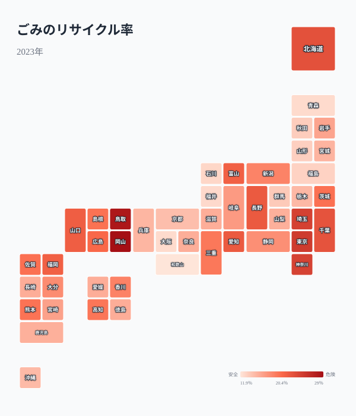
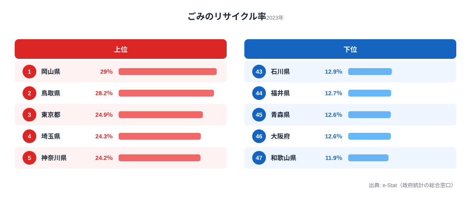
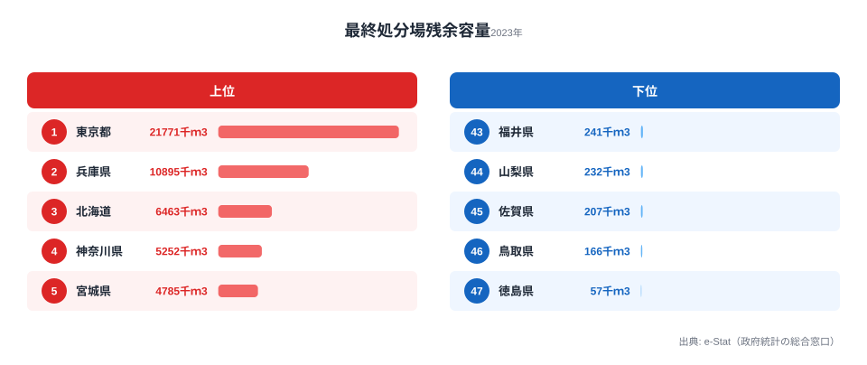

分別回収に力を入れている自治体と、ほぼ焼却一択の自治体。ごみのリサイクル率は都道府県によって最大2.4倍の開きがあります。岡山県の29.0%に対し、和歌山県は11.9%。この差はどこから来るのでしょうか。そして意外なことに、リサイクル率が低い県が「最も環境意識が低い県」とは限りません。リサイクル率・埋立率・最終処分場残余容量の3つの指標から、循環型社会の地域差とその裏にある処理方式の違いを読み解いていきます。

## リサイクル率マップ

> [!NOTE]
> リサイクル率 = 資源化量 ÷ ごみの総排出量（%）です。紙・金属・ガラス・プラスチックなどの資源回収量が分子になります。焼却で熱や電気を取り出すサーマルリサイクル（エネルギー回収）は統計上のリサイクルには含まれません。そのため、ごみを燃やしてエネルギーを得る焼却主体の自治体は、実際の資源活用に取り組んでいても数値が低く出やすい点に注意が必要です。

全国を俯瞰すると、東日本が高く西日本が低いといった明確な地域ブロックのパターンは見えにくいことがわかります。リサイクル率は自治体ごとの分別施策や住民の協力度に大きく左右されるため、地理的な法則性よりも個別事情が前面に出るのです。同じ近畿圏でも、大阪府と隣接県でかなり数値が異なります。

上位は岡山県（29.0%）、鳥取県（28.2%）、[東京都](/areas/13000)（24.9%）、埼玉県（24.3%）、神奈川県（24.2%）でした。注目したいのは、東京都・埼玉県・神奈川県という大都市圏が比較的高い位置にあることです。人口が多い都市部はごみの量も多く一見不利に思えますが、分別回収体制や中間処理施設への投資が進んでいる自治体ほど資源化が進む傾向が読み取れます。

下位は和歌山県（11.9%）、大阪府（12.6%）、青森県（12.6%）、福井県（12.7%）、石川県（12.9%）です。人口規模の大きい大阪府が下位に位置するのが目を引きます。ここから「人口が多いほどリサイクル率が低い」と単純化はできず、同じ大都市圏でも処理方式の選び方で大きく差がつくことがうかがえます。

<source-link href="/ranking/waste-recycling-rate">47都道府県のごみリサイクル率ランキングをもっと見る</source-link>

## 埋立 vs 焼却 vs リサイクル

リサイクル率が低い県は、残りのごみをすべて埋め立てているのでしょうか。実はそうではありません。ごみの行き先には「資源化（リサイクル）」「焼却」「埋立」の3つがあり、リサイクル率が低くても埋立率まで高いとは限らないのです。

散布図を見ると、リサイクル率と埋立率はきれいな逆相関にはなっていません。多くの県は右下の象限（リサイクル率が高く埋立率が低い）に集まりますが、リサイクル率も埋立率もともに低い県が左下に存在します。大阪府（リサイクル率12.6%・埋立率11.3%）がその代表例です。リサイクルにも埋立にも多くを回していないということは、残りの大部分を焼却で処理していることを意味します。

これが「焼却主体」型です。大都市圏では高性能の焼却施設（ごみ焼却発電）が整備されており、ごみを燃やして発生する熱で発電したり地域に熱を供給したりします。統計上はリサイクルにカウントされませんが、限られた土地で大量のごみを処理しながらエネルギーを回収する方式には一定の合理性があります。したがって、リサイクル率の低さだけを取り出して「環境意識が低い」と断じるのは早計です。処理方式の違いまで踏み込んで評価する必要があります。

一方、[北海道](/areas/01000)（埋立率16.1%）は全国で突出して高い水準です。広大な土地に最終処分場を確保しやすい反面、人口が分散しているため大規模な焼却施設を集約しにくいことが背景にあると考えられます。土地の事情が処理方式を方向づける典型例といえます。

> [!TIP]
> リサイクル率だけで自治体を評価せず、「リサイクル率」「埋立率」「焼却（残差）」の3点をセットで見るのがコツです。リサイクル率も埋立率も低い県は焼却発電を選んでいる可能性が高く、埋立率だけが高い県は土地に余裕がある一方で処分場をごみで消費し続けています。同じ「リサイクル率12%台」でも、置かれた条件と狙いは県ごとに違うのです。

<source-link href="/ranking/garbage-landfill-rate">47都道府県のごみ埋立率ランキングをもっと見る</source-link>

<ad-slot></ad-slot>

## 最終処分場の残り寿命

リサイクルも焼却もできずに残ったごみは、最終処分場に埋め立てられます。その埋立先がどれだけ残っているか（残余容量）には、都道府県で最大381.9倍という大きな差があります。

残余容量が少ない県は、徳島県（57千m³）、[鳥取県](/areas/31000)（166千m³）、佐賀県（207千m³）、山梨県（232千m³）、福井県（241千m³）と並びます。県土面積が小さい県や、住民の合意形成が難しく新規処分場の建設が進みにくい県が下位に集まっています。これらの県では、いま埋め立てているペースが続けば処分場の寿命が早く尽きてしまうため、リサイクルによるごみの減量が処分場の延命に直結します。

一方、東京都（21,771千m³）は突出して多い水準です。これは東京湾の海面埋立処分場など広域的な処分場を活用しているためで、都内の各区市が個別に処分場を抱えているわけではありません。残余容量の絶対値が大きいからといって、すべての県が同じ余裕を持っているとは限らない点に注意が必要です。

処分場の残余容量が逼迫している県では、リサイクルの推進に加えて、近隣自治体との広域処理協定や搬出先の確保が急務となっています。

> [!WARNING]
> 残余容量が57千m³と最も逼迫しているのが徳島県です。残余容量が少ない県では、新たな処分場の用地確保や住民合意が難しく、いったん満杯になると行き場を失うリスクがあります。容量の絶対値はその県の「猶予年数」を直接示すものではなく、年間の埋立量との比で初めて寿命が見えてくる点も読み違えないようにしたいところです。

<source-link href="/ranking/final-disposal-site-remaining-capacity">47都道府県の最終処分場残余容量ランキングをもっと見る</source-link>

## リサイクル率が高い県の共通点

リサイクル率が上位の県に共通する要因を整理すると、以下が挙げられます。

**分別区分の多さ**: 分別区分が多い自治体ほど、資源として回収できるごみの割合が増えます。上位の鳥取県は資源ごみの細分化に積極的で、住民に求める手間は増える代わりに資源化量を押し上げています。

**資源回収の仕組み**: 集団回収（町内会・PTAなどによる古紙・金属の回収）が活発な地域は、行政回収では拾いきれない資源を取り込めるため、リサイクル率が高くなる傾向があります。

**住民の分別協力**: 分別ルールがどれだけ細かくても、住民が協力しなければ機能しません。リサイクル率が高い県は、啓発活動やごみカレンダーの配布が徹底され、分別が生活習慣として定着しています。

**コンポスト・バイオマス処理**: 生ごみの堆肥化に取り組む自治体では、焼却ごみの減量とリサイクル率の向上を同時に実現しています。

これらはいずれも、施設という「ハード」だけでなく、ルール設計と住民協力という「ソフト」の積み重ねで成り立っています。リサイクル率の地域差が地理よりも個別事情に左右される理由が、ここにあります。

<ad-slot></ad-slot>

## まとめ

ごみ処理のデータから、以下のポイントが浮かび上がりました。

ごみ処理インフラは、自治体の方針と住民の協力で大きく変わる「政策インフラ」です。道路や水道のように物理的な整備だけでは解決せず、分別ルールの設計・住民啓発・処理施設への投資が三位一体で必要になります。リサイクル率の低さがそのまま環境意識の低さを意味するわけではなく、焼却発電という選択や土地の事情まで含めて読み解くことが欠かせません。SDGsの目標12「つくる責任 つかう責任」の達成度を測るうえでも、リサイクル率は重要な手がかりになる指標といえます。あわせて[インフラ・くらしのランキング一覧](/category/infrastructure)もご覧ください。

## データ出典

本記事のデータはe-Stat（政府統計の総合窓口）を基に作成しています。[社会生活統計指標（e-Stat）](https://www.e-stat.go.jp/dbview?sid=0000010208)のごみリサイクル率・ごみ埋立率・最終処分場残余容量（いずれも2023年）を利用しています。
