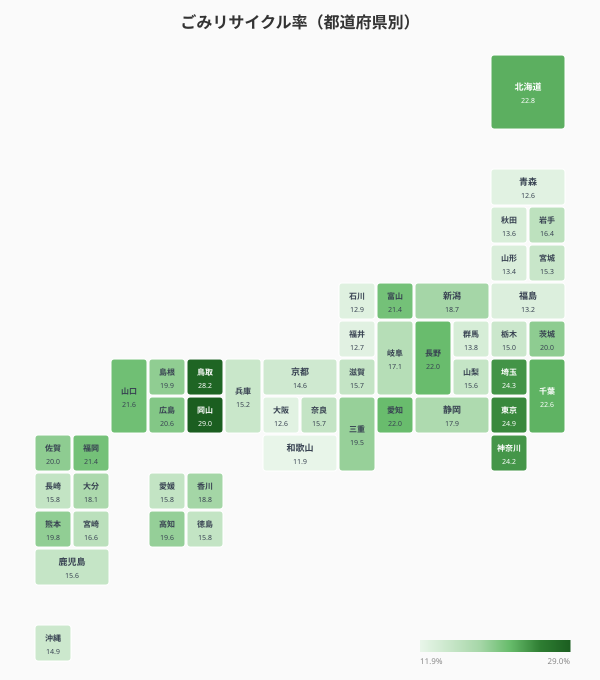
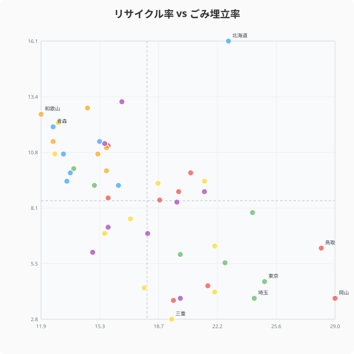
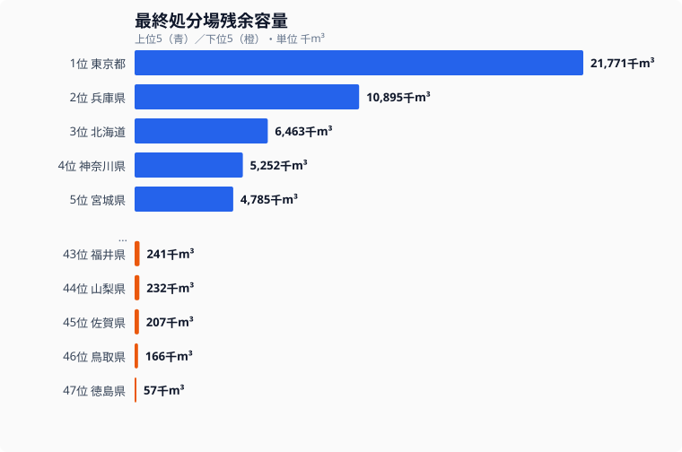
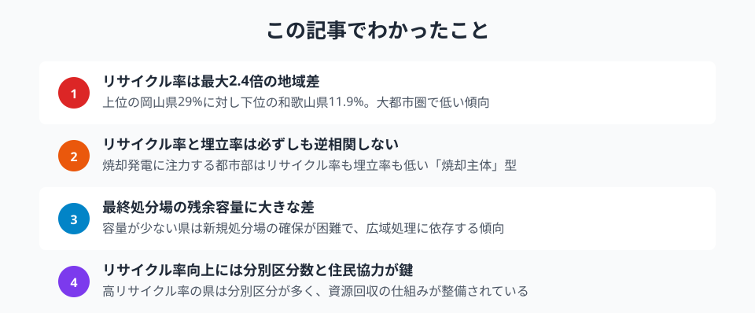

ごみのリサイクル率には、都道府県間で最大2.4倍の開きがあります。岡山県は29.0%ですが、和歌山県は11.9%です。この差を、リサイクル率・埋立率・最終処分場残余容量の3つの指標から確かめます。ただし、これらの集計値だけで施策や住民行動との因果関係までは特定できません。統計から分かることと分からないことを分けて読み解きます。

## リサイクル率マップ

> [!NOTE]
> リサイクル率 = 資源化量 ÷ ごみの総排出量（%）です。紙・金属・ガラス・プラスチックなどの資源回収量が分子になります。焼却によるエネルギー回収（サーマルリサイクル）は統計上リサイクルに含まれないため、焼却主体の自治体は数値が低く出る傾向があります。

全国を俯瞰すると、特定の地域ブロックで一様に高い・低いというパターンは見えにくくなっています。この分布からは、地域ブロックだけでリサイクル率を説明することはできません。

上位は岡山県が29.0%、鳥取県が28.2%、[東京都](/areas/13000)が24.9%、埼玉県が24.3%、神奈川県が24.2%です。東京都・埼玉県・神奈川県は大都市圏ですが、リサイクル率は比較的高くなっています。

下位は和歌山県が11.9%、大阪府と青森県が12.6%、福井県が12.7%、石川県が12.9%です。大阪府は人口が多いにもかかわらず下位に位置します。

<source-link href="/ranking/waste-recycling-rate">47都道府県のごみリサイクル率ランキングをもっと見る</source-link>

## 埋立 vs 焼却 vs リサイクル

リサイクル率が低い県は、すべてのごみを埋め立てているのでしょうか。実はそうではありません。

散布図を見ると、リサイクル率と埋立率は必ずしもきれいな逆相関にはなっていません。右下象限（リサイクル率が高く埋立率が低い）に位置する県が多い一方で、両方の率が相対的に低い県もあります。大阪府はリサイクル率12.6%・埋立率11.3%です。

両方の率が低いからといって、残りがすべて焼却されたとはこのデータだけでは判断できません。処理方法を特定するには、焼却量や直接搬入量など別の統計が必要です。同様に、リサイクル率だけで地域の環境意識を評価することもできません。

一方、[北海道](/areas/01000)は埋立率16.1%で、全国でも突出して高くなっています。この数値から北海道の処理方法の違いは確認できますが、その背景を土地条件や施設配置に求めるには別の資料が必要です。

<source-link href="/ranking/garbage-landfill-rate">47都道府県のごみ埋立率ランキングをもっと見る</source-link>

<ad-slot></ad-slot>

## 最終処分場の残余容量

焼却灰や中間処理後に資源化できない残さなどは、最終処分場に埋め立てられます。その残余容量には大きな地域差があります。

残余容量が少ない県は[徳島県](/areas/36000)が57千m³、鳥取県が166千m³、佐賀県が207千m³、山梨県が232千m³、福井県が241千m³です。この値だけでは、容量が少ない理由までは特定できません。

一方、東京都は21,771千m³で、突出して多くなっています。どの施設や搬入範囲がこの値に寄与したかを確認するには、施設別の資料が必要です。

> [!WARNING]
> 残余容量は処分場に残っている容積であり、「あと何年使えるか」を直接示す残余年数ではありません。処分場の逼迫度を比較するには、年間の最終処分量や搬出入量、施設ごとの供用条件も必要です。

<source-link href="/ranking/final-disposal-site-remaining-capacity">47都道府県の最終処分場残余容量ランキングをもっと見る</source-link>

## この3指標だけでは要因を特定できない

今回の3指標から確認できるのは、率と容量の地域差です。なぜ差が生じたかを検証するには、次の情報を都道府県別・自治体別にそろえる必要があります。

**分別・回収制度**: 分別区分数、集団回収量、収集方式を比較すれば、制度とリサイクル率の関係を検証できます。

**処理方法の内訳**: 焼却量、直接埋立量、資源化量を並べれば、二つの率だけでは見えないごみの行き先を確認できます。

**処分場の利用ペース**: 年間の最終処分量と残余容量を組み合わせれば、容量の大小を残余年数に近い形で評価できます。

したがって、分別制度や住民協力を原因とみなすのではなく、今回の結果を追加調査の出発点として扱うのが適切です。

<ad-slot></ad-slot>

## まとめ

ごみ処理のデータから、以下のポイントが浮かび上がりました。

3つの指標を並べると、リサイクル率だけではごみ処理の全体像を評価できないことが分かります。率の高低、埋立との関係、残余容量はそれぞれ別の側面を示します。ごみ処理に関するほかのランキングは[インフラカテゴリ](/category/infrastructure)から確認できます。

## データ出典

本記事のデータはe-Stat（政府統計の総合窓口）を基に作成しています。[社会生活統計指標（e-Stat）](https://www.e-stat.go.jp/dbview?sid=0000010208)のごみリサイクル率・ごみ埋立率・最終処分場残余容量（いずれも2023年）を利用しています。
