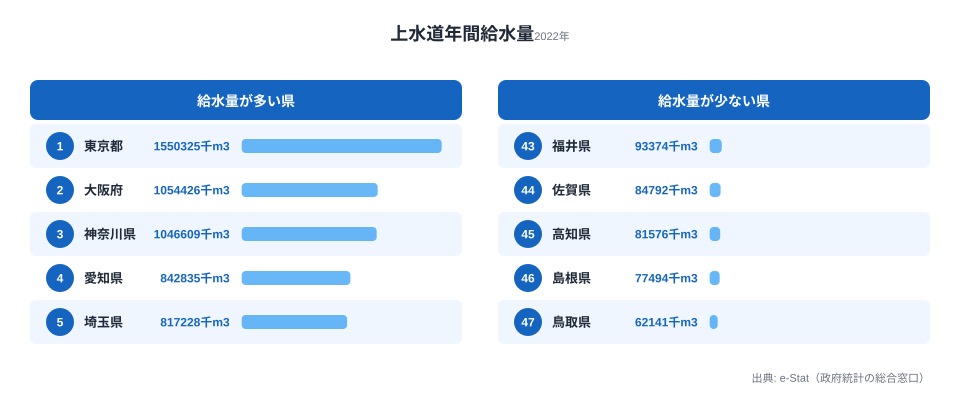
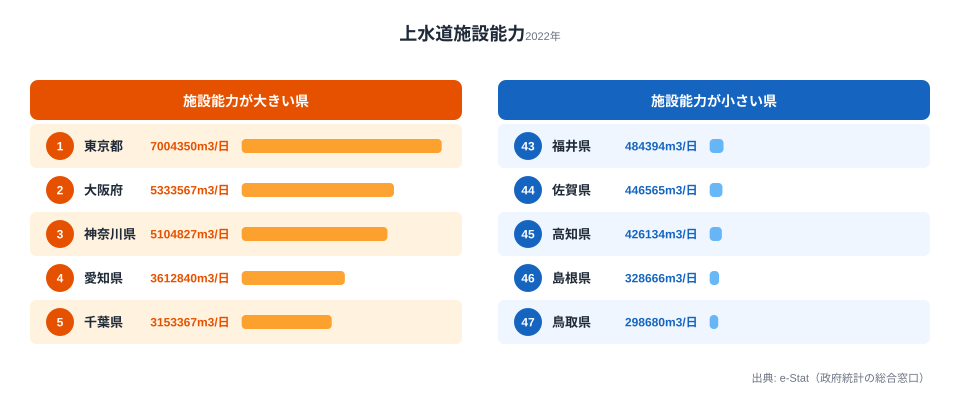
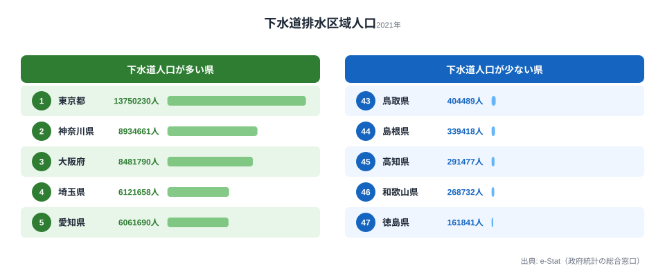

2025年以降、全国で水道料金の値上げが相次いでいます。42事業者が値上げを実施し、96%の水道事業者が2046年までに値上げが必要とされています。その背景にあるのは、人口減少とインフラ老朽化という構造的な問題です。蛇口をひねれば水が出るのは当たり前に見えますが、その当たり前を支える基盤の体力は、住む県によって大きく違います。本記事では都道府県別データで「水の安全保障」の現在地を確認していきます。

> [!NOTE]
> 本記事の「給水人口」は上水道（給水人口5,001人以上の計画給水区域）の人口を指します。日本の上水道普及率は98%を超えており、水道インフラの課題は「普及」ではなく「維持」の段階に入っています。給水人口・給水量の絶対量が大きい県ほど普及が進んでいるという意味ではなく、人口規模を反映している点に注意してください。

## 上水道給水人口マップ — 水道の全国カバー状況

上水道給水人口は東京都の1,410万人が圧倒的1位です。2位は神奈川県（919万人）、3位は大阪府（876万人）と三大都市圏が続きます。上位3都府県だけで全国の上水道給水人口の約3割を占めます。

下位は鳥取県（49万人）、高知県（57万人）、島根県（61万人）です。人口規模がそのまま給水人口に直結しています。上位を三大都市圏が占め、下位を山陰・四国の県が占めるという並びは、人口の集積度をほぼそのまま写し取ったものだといえます。ただし注目すべきは、これらの下位県でも上水道のカバー率自体は高い点です。給水人口の少なさは普及の遅れではなく、母数となる人口の少なさを映しています。つまり、水を「届ける相手」が減っていく地域ほど、後述する給水量の減少と収入減の連鎖に巻き込まれやすくなります。給水人口が多い県は1人あたりの維持負担を分散できますが、給水人口が縮んでいく県では、同じ管路を少ない人数で支え続けることになる点が後の章の伏線になります。

<source-link href="/ranking/water-supply-population">47都道府県の上水道給水人口ランキングをもっと見る</source-link>

## 上水道年間給水量 — 東京は全国の約1割

年間給水量は東京都が1,550,325千m3で1位です。2位の大阪府（1,054,426千m3）、3位の神奈川県（1,046,609千m3）を大きく引き離します。東京都1都で全国の年間給水量の約1割を消費している計算になります。

下位は鳥取県（62,141千m3）、島根県（77,494千m3）、高知県（81,576千m3）です。1位と47位の差は約25倍に達します。なぜここまで開くかといえば、給水量は人口と産業活動の規模をほぼそのまま反映するためです。問題はこの先で、人口減少が進む地方では給水量の減少がそのまま料金収入の減少に直結します。一方で次に見る施設能力や管路の維持費はすぐには下がらないため、収入は減るのに費用は残るという経営構造が水道事業を圧迫していきます。

<source-link href="/ranking/water-supply-annual-volume">47都道府県の上水道年間給水量ランキングをもっと見る</source-link>

<ad-slot></ad-slot>

## 施設能力 — 簡単には縮められない「最大供給力」

上水道施設能力は、1日あたりに供給可能な最大水量を示します。[東京都](/areas/13000)は7,004,350m3/日で1位です。大阪府（5,333,567m3/日）、[神奈川県](/areas/14000)（5,104,827m3/日）が続きます。下位は鳥取県（298,680m3/日）、島根県（328,666m3/日）です。

施設能力は「最大供給力」、年間給水量は「実消費量」に相当します。両者を並べると、人口減少地域の苦しさが見えてきます。人口減少によって実消費量である給水量は減っていく一方で、いったん建設した浄水場や送配水管といった施設能力は、需要が減ったからといって簡単に縮小できません。この「使われない余力」を抱えたまま維持コストだけがかかり続けることが、いわゆる「規模の不経済」を生みます。給水量の少ない県ほど、人口あたりで割れば割高な施設を維持し続けることになり、料金値上げの圧力が強まります。

> [!WARNING]
> 「96%が2046年までに値上げ必要」「平均48%の値上げ率」という数値は厚生労働省等の推計に基づく全国的な見通しであり、実際の値上げ率は各事業体の老朽管更新計画・人口見通し・統廃合方針によって大きく変わります。移住先選びや不動産の判断で参照する際は、本記事の都道府県データだけでなく、各自治体の水道ビジョンや料金改定計画も必ず併せて確認してください。

<source-link href="/ranking/water-supply-capacity">47都道府県の上水道施設能力ランキングをもっと見る</source-link>

## 下水道排水区域人口 — 整備の進度差が85倍

水を「届ける」上水道に対し、使った水を「処理する」のが下水道です。下水道排水区域人口は東京都の13,750,230人が1位で、2位神奈川県（8,934,661人）、3位大阪府（8,481,790人）と続きます。下位は和歌山県（268,732人）、徳島県（161,841人）です。1位と47位の差は約85倍で、給水量の25倍差をさらに上回ります。

この差が給水量より大きく開くのは、下水道整備が人口規模だけでなく地形と費用負担に強く左右されるためです。山間部や集落が分散する県では、管路を張り巡らせる建設コストが人口あたりで跳ね上がり、下水道よりも浄化槽への依存度が高くなります。[下水道整備の遅れは水質や維持費の観点で別の課題を生んでおり、下水道普及率の地域差を扱った記事](/blog/water-sewage-crisis)も併せて読むと、上水道と下水道の両面から「水インフラの体力」を立体的に把握できます。

> [!TIP]
> 給水人口・給水量・施設能力・下水道のいずれも、絶対量で見ると大都市が上位を独占します。地域の負担感を比べたいときは「人口あたり」に直して見るのが有効です。人口が少ない県ほど、1人で支える施設や管路が大きくなり、料金に跳ね返りやすい構造が浮かび上がります。

<source-link href="/ranking/sewerage-drainage-population">47都道府県の下水道排水区域人口ランキングをもっと見る</source-link>

<ad-slot></ad-slot>

## まとめ

水道インフラのデータから、都道府県ごとの「水の安全保障」の現在地を整理します。

水道は「蛇口をひねれば出る」のが当たり前の存在ですが、その裏では老朽化した管路の更新、人口減少に伴う収入減、小規模事業者の経営悪化という三重の課題が同時に進行しています。給水量で約25倍、下水道排水区域人口で約85倍という地域差は、単なる人口規模の違いではなく、これから維持コストの重さが県ごとに大きく分かれていくことを示唆しています。上水道の給水量が小さい県ほど、施設能力の余力を割高に維持しなければならず、下水道の整備が遅れた県では地形に由来する建設費の重さが残り続けます。これらは別々の課題のように見えて、いずれも「少ない人数で大きな基盤を支える」という同じ構造から生まれています。移住先や不動産投資の判断においても、水道インフラの持続力は無視できない要素になっていきます。[水道とあわせて見たいエネルギー・公共インフラ系のランキング一覧](/category/energy)から、地域の暮らしを支える基盤の体力をさらに掘り下げてみてください。

## データ出典

[社会・人口統計体系（e-Stat）](https://www.e-stat.go.jp/dbview?sid=0000010108)を基に作成。上水道給水人口（2023年）、上水道年間給水量（2022年）、上水道施設能力（2022年）、下水道排水区域人口（2021年）。
