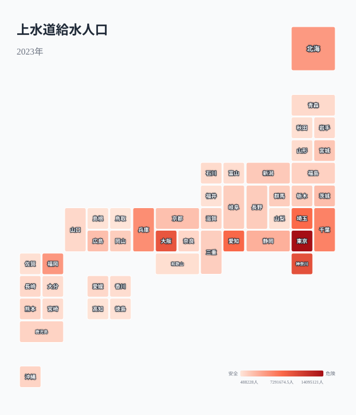
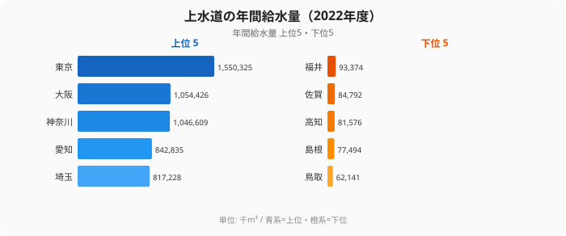
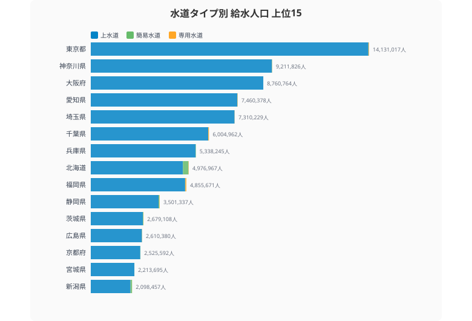
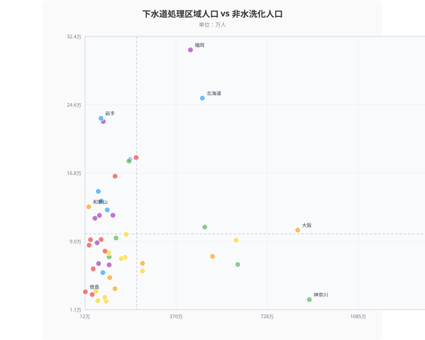
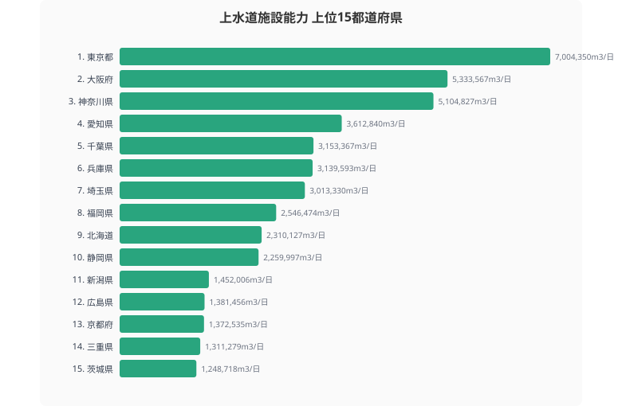
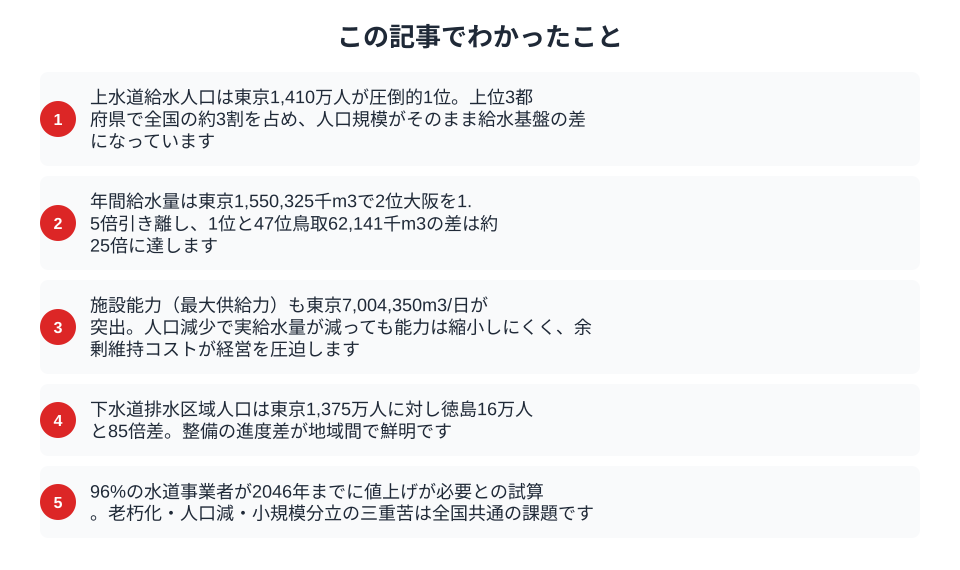

2025年以降、全国で水道料金の値上げが相次いでいる。42事業者が値上げを実施し、96%の水道事業者が2046年までに値上げが必要とされる。その背景にあるのは人口減少と老朽化だ。都道府県別データで「水の安全保障」の現在地を確認する。

## 上水道給水人口マップ -- 水道の全国カバー状況

上水道給水人口は東京都の1,410万人が圧倒的1位。2位は神奈川県（919万人）、3位は大阪府（876万人）と三大都市圏が続く。上位3都府県だけで全国の上水道給水人口の約3割を占める。

下位は鳥取県（49万人）、高知県（57万人）、島根県（61万人）。人口規模がそのまま給水人口に直結している。ただし注目すべきは、これらの県でも上水道のカバー率自体は高い点だ。日本の上水道普及率は98%を超えており、水道インフラの問題は「普及」ではなく「維持」にある。

<source-link href="/ranking/water-supply-population-municipal">47都道府県の上水道給水人口ランキングをもっと見る</source-link>

## 上水道年間給水量 -- 東京は全国の約1割

年間給水量は東京都が1,550,325千m3で1位。2位の大阪府（1,054,426千m3）、3位の神奈川県（1,046,609千m3）を大きく引き離す。東京都1都で全国の年間給水量の約1割を消費している計算だ。

下位は鳥取県（62,141千m3）、島根県（77,494千m3）、高知県（81,576千m3）。1位と47位の差は約25倍。人口減少が進む地方では、給水量の減少が収入減に直結し、水道事業の経営を圧迫する構造が見える。

<source-link href="/ranking/annual-water-supply-volume-municipal">47都道府県の上水道年間給水量ランキングをもっと見る</source-link>

<ad-slot></ad-slot>

## 簡易水道に頼る県 -- 水道タイプ別の構成比で見える地方の実態

水道には上水道（給水人口5,001人以上の事業）、簡易水道（101〜5,000人）、専用水道（自家用）の3種類がある。大都市圏では上水道がほぼ100%をカバーするが、地方では事情が異なる。

簡易水道の給水人口が最も多いのは北海道で282,821人。2位の長野県（84,290人）の3.4倍に達する。北海道は広大な面積に小規模な集落が分散しており、1つの大規模上水道でカバーすることが難しい。

大阪府は簡易水道給水人口がゼロ。都市部では上水道の集約化が進んでいるが、地方では多数の小規模水道事業が分立しており、統合・広域化が進んでいない。これが維持管理コストの上昇と料金値上げの一因になっている。

<source-link href="/ranking/simple-water-supply-population">47都道府県の簡易水道給水人口ランキングをもっと見る</source-link>

## 下水道 vs 非水洗化 -- 処理区域人口と非水洗化人口の散布図

> [!NOTE]
> 下水道処理区域人口は2021年、非水洗化人口は2023年のデータです。年次が異なる点にご留意ください。

横軸に下水道処理区域人口、縦軸に非水洗化人口をとった散布図では、右下に位置する県ほど下水道整備が進み非水洗化が少ない「理想的」な状態だ。

東京都は下水道処理区域人口1,374万人に対し非水洗化人口わずか12,603人と、ほぼ完全に水洗化が達成されている。一方、福岡県は下水道処理区域人口401万人に対し非水洗化人口が308,555人と多い。

徳島県は下水道処理区域人口が135,583人と47都道府県中最下位。[下水道普及率でも徳島は22%と全国最低水準](/blog/water-sewage-crisis)で、浄化槽への依存度が高く下水道整備率の低さが際立つ。和歌山県も268,732人と低い水準にあり、山間部を多く抱える県で下水道整備のコストが課題になっている。

<source-link href="/ranking/sewerage-treatment-area-population">47都道府県の下水道処理区域人口ランキングをもっと見る</source-link>

<ad-slot></ad-slot>

## 施設能力と給水量のギャップ -- 「余力」がある県・ない県

> [!WARNING]
> 水道事業の経営試算は自治体・事業体ごとに条件が異なる。「96%が2046年までに値上げ必要」という数値は厚生労働省等の推計に基づくが、実際の値上げ率は各事業体の老朽管更新計画・人口見通し・統廃合方針によって大きく変わる。移住先選びなどで参照する際は、各自治体の水道ビジョンや料金改定計画も併せて確認されたい。

上水道施設能力は、1日あたりに供給可能な最大水量を示す。[東京都](/areas/13000)は7,004,350m3/日で1位。大阪府（5,333,567m3/日）、[神奈川県](/areas/14000)（5,104,827m3/日）が続く。

施設能力は「最大供給力」、年間給水量は「実消費量」に相当する。人口減少により給水量が減少する一方、施設能力は簡単に縮小できない。この「余力」が大きいほど、使われていない施設の維持コストが事業経営を圧迫する。いわゆる「規模の不経済」が、人口減少地域の水道事業をますます苦しくしている。

## まとめ

水道インフラのデータから、都道府県ごとの「水の安全保障」の現在地を整理する。

水道は「蛇口をひねれば出る」のが当たり前の存在だが、その裏では老朽化した管路の更新、人口減少に伴う収入減、小規模事業者の経営悪化という三重の課題が進行している。平均48%の値上げ率が見込まれるという試算は、水道インフラの維持が想像以上に深刻な問題であることを示している。移住先や不動産投資の判断においても、水道インフラの持続力は無視できない要素だ。

## データ出典

[社会生活統計指標（e-Stat）](https://www.e-stat.go.jp/dbview?sid=0000010108)を基に作成。上水道年間給水量（2022年）、上水道施設能力（2022年）、上水道給水人口（2023年）、簡易水道給水人口（2023年）、専用水道給水人口（2023年）、下水道処理区域人口（2021年）、下水道トイレ水洗化人口（2021年）、非水洗化人口（2023年）。
