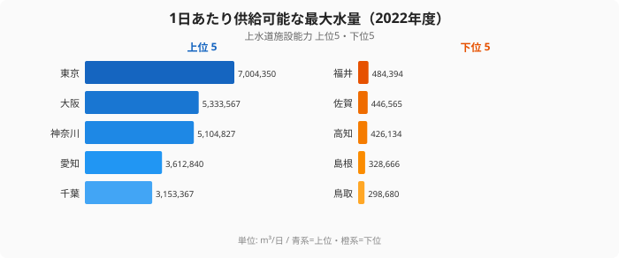
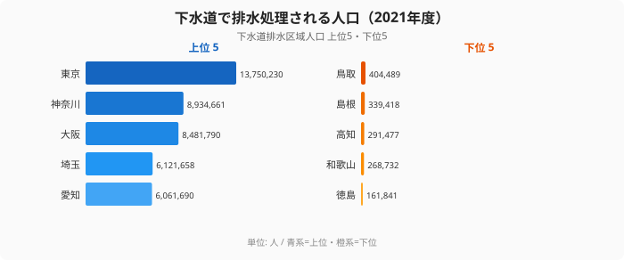

「蛇口をひねれば水が出る」のは当たり前のように感じますが、その当たり前を支える水道事業の足元は揺らいでいます。2025年以降、全国で水道料金の値上げが相次ぎ、42事業者が値上げを実施しました。さらに水道事業者の96%が2046年までに値上げを迫られ、平均48%の値上げ率が見込まれるという試算もあります。

背景にあるのは人口減少と施設の老朽化です。水道の問題はもはや「全国に水道を行き渡らせる」ことではなく、「いまある水道をどう維持するか」に移っています。では、その持続力は都道府県でどれだけ違うのでしょうか。給水人口・年間給水量・施設能力・下水道という4つの切り口で、「水の安全保障」の現在地を確認していきます。

## 給水人口は東京と鳥取で約29倍ひらく

上水道給水人口は、その事業者が水道で水を届けている人の数です。2023年度では[東京都](/areas/13000)が約1,410万人で群を抜いて多く、神奈川県（約919万人）、大阪府（約876万人）、愛知県（約744万人）、埼玉県（約730万人）と三大都市圏が上位を占めます。上位3都府県だけで全国の給水人口の約3割（26.7%）に達し、人がどこに集まっているかがそのまま給水人口の地図になっています。

一方で下位は[鳥取県](/areas/31000)（約49万人）、高知県（約57万人）、島根県（約61万人）、徳島県（約64万人）、福井県（約68万人）と続きます。1位の東京都と最下位の鳥取県では給水人口がおよそ29倍も開きます。ただし、この差は「水道が普及していないから」ではありません。日本の上水道普及率は98%を超えており、下位の県でもカバー率そのものは高い水準にあります。差を生んでいるのは普及の差ではなく、そもそも住んでいる人の数の差なのです。この「人口の差がそのまま事業規模の差になる」という構造が、後の章で見る経営の苦しさにつながっていきます。

> [!NOTE]
> 上水道給水人口は「給水人口5,001人以上」の水道事業がカバーする人口です。給水人口5,000人以下の小規模な簡易水道や、自家用の専用水道は別集計のため、この数字には含まれません。山間部や離島では簡易水道が地域の水を支えているケースがあり、上水道の数字だけでカバー状況の全体を判断しないよう注意が必要です。

<source-link href="/ranking/water-supply-population">47都道府県の上水道給水人口ランキングをもっと見る</source-link>

## 東京1都で全国の約1割を使う年間給水量

年間給水量は、その地域で実際に1年間に供給された水の量、いわば「実消費量」です。2022年度は東京都が1,550,325千m³で1位。2位の大阪府（1,054,426千m³）、3位の神奈川県（1,046,609千m³）を大きく引き離し、東京都1都だけで全国の年間給水量の約1割（10.8%）を消費している計算になります。これに愛知県（842,835千m³）、埼玉県（817,228千m³）が続きます。

下位は鳥取県（62,141千m³）、島根県（77,494千m³）、高知県（81,576千m³）、佐賀県（84,792千m³）、福井県（93,374千m³）です。1位の東京都と最下位の鳥取県では、給水量がおよそ25倍も開いています。ここで重要なのは、給水量が水道事業の「収入」に直結するという点です。人口減少が進む地方では水の使用量そのものが減り、料金収入が細っていきます。収入が減っても水道管や浄水場は維持しなければならないため、給水量の少ない県ほど1人あたりの維持負担が重くなる、という収益構造の弱さがここに表れています。

> [!TIP]
> 給水人口の順位と給水量の順位はほぼ重なりますが、完全には一致しません。給水人口で下位だった福井県が給水量では下から数えて5番目（93,374千m³）に位置するなど、産業用水の比率や1人あたりの使用量の違いで微妙に順位が入れ替わります。給水「人口」と給水「量」を分けて見ると、その地域が人で水を使うのか産業で使うのかの違いが浮かび上がります。

<source-link href="/ranking/water-supply-annual-volume">47都道府県の上水道年間給水量ランキングをもっと見る</source-link>

<ad-slot></ad-slot>

## 縮められない「余力」が地方を苦しめる施設能力

上水道施設能力は、浄水場などが1日あたりに供給できる最大水量を示します。2022年度は東京都が7,004,350m³/日で1位、大阪府（5,333,567m³/日）、神奈川県（5,104,827m³/日）、愛知県（3,612,840m³/日）、千葉県（3,153,367m³/日）が続きます。下位は鳥取県（298,680m³/日）、島根県（328,666m³/日）、高知県（426,134m³/日）、佐賀県（446,565m³/日）、福井県（484,394m³/日）です。

施設能力が「最大供給力」、前章の年間給水量が「実消費量」だと考えると、この2つのギャップが水道経営を読み解く鍵になります。人口減少で給水量（実消費）は年々減っていきますが、施設能力は浄水場や配水池の規模で決まるため、簡単には縮小できません。使われない設備を抱えたまま維持費だけがかかり続ける――この「規模の不経済」こそ、人口減少地域の水道事業を内側から圧迫している真因です。給水量の落ち込みが大きいほど施設の「余力」が遊んでしまい、それが料金値上げの圧力になって跳ね返ってきます。

> [!WARNING]
> 「96%が2046年までに値上げ必要」「平均48%の値上げ率」という数値は厚生労働省等の推計に基づくものですが、実際の値上げ率は各事業体の老朽管更新計画・人口見通し・統廃合の方針によって大きく変わります。施設能力の数字も「余力が大きい＝無駄が多い」と単純には言えず、災害時のバックアップや将来需要を見込んだ設計の場合もあります。移住先選びなどで参照するときは、各自治体の水道ビジョンや料金改定計画も併せて確認してください。

<source-link href="/ranking/water-supply-capacity">47都道府県の上水道施設能力ランキングをもっと見る</source-link>

<ad-slot></ad-slot>

## 下水道で水洗化される人口が最も少ないのは徳島

最後に「使った水を処理する」側、下水道排水区域人口を見ます。これは公共下水道で排水・処理されている区域の人口です。2021年度は東京都が約1,375万人で1位、神奈川県（約893万人）、大阪府（約848万人）、埼玉県（約612万人）、愛知県（約606万人）が続き、給水人口と同じく都市圏が上位を固めます。

下位は[徳島県](/areas/36000)（161,841人）、和歌山県（268,732人）、高知県（291,477人）、島根県（339,418人）、鳥取県（404,489人）です。最下位の徳島県は和歌山県の6割ほどの水準にとどまります。徳島県や和歌山県のように山間部を多く抱える地域は、家々が点在しているため下水道管を張り巡らせる費用対効果が低く、浄化槽など個別処理への依存度が高くなります。下水道整備の遅れは「上水道が来ているのに排水処理が追いつかない」状態を生み、給水と排水の両面で地方インフラの課題が重なっていることを示しています。

> [!NOTE]
> 下水道排水区域人口は2021年度のデータで、本記事の給水関連データ（2022〜2023年度）とは集計年が異なります。年次が違う指標を直接比べる際は、その差を念頭に置いてください。なお下水道がない地域でも浄化槽や農業集落排水で水洗化が進んでいる場合があり、下水道の数字だけで「水洗化が遅れている」とは断定できません。

<source-link href="/ranking/sewerage-drainage-population">47都道府県の下水道排水区域人口ランキングをもっと見る</source-link>

## まとめ

水道インフラの4つのデータから見えてきた「水の安全保障」の現在地を整理します。

- 上水道給水人口は東京都の約1,410万人が1位で、上位3都府県が全国の約3割を占めます。最下位の鳥取県とはおよそ29倍の開きがあります。
- 年間給水量は東京都が全国の約1割を消費し、最下位の鳥取県とはおよそ25倍の差。給水量の少なさは料金収入の細さに直結します。
- 施設能力は人口が減っても縮小しにくく、使われない「余力」の維持費が地方の水道経営を圧迫する「規模の不経済」を生みます。
- 下水道排水区域人口は徳島県が最も少なく、山間部を抱える県ほど排水処理の整備コストが課題になります。

水道は「蛇口をひねれば出る」のが当たり前の存在ですが、その裏では老朽管の更新、人口減少による収入減、小規模事業者の経営悪化という三重の課題が同時に進行しています。96%の事業者が2046年までに値上げを迫られ、平均48%の値上げ率が見込まれるという試算は、水道インフラの維持が想像以上に深刻な局面にあることを物語っています。移住先や不動産投資を判断するうえでも、その地域の水道がどれだけ持続力を持っているかは見過ごせない要素になっています。

## データ出典

- 社会生活統計指標（e-Stat、政府統計）を基に作成
- 上水道給水人口（2023年度）・上水道年間給水量（2022年度）・上水道施設能力（2022年度）・下水道排水区域人口（2021年度）
- 値上げ率・値上げ事業者数の試算は厚生労働省等の公表資料に基づく
